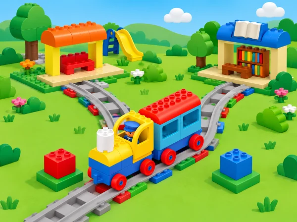

_El tren Coding Express arriba a una bifurcació entre l’estació del parc i una biblioteca de maqueta._

## ❓ Repte i intenció

Una línia imaginària de barri connecta l’estació amb el parc i la biblioteca. La via en Y ofereix dues branques i la classe dissenya una manera clara d’encaminar una passatgera a una d’elles. El joc comença amb bitllets de colors i, després, combina targetes, pictogrames, vies, agulla roja i passatgers de Coding Express.

La condició «si el bitllet té el símbol del parc, aleshores triem la branca del parc» és primer una regla compartida entre persones. La persona conductora interpreta el bitllet i mou manualment la palanca roja; ni el bitllet ni el color activen l’agulla de manera automàtica. Així separem el concepte d’una decisió condicional de l’acció mecànica real del tren.

## 🎯 Objectius i paraules clau

- Reconéixer que la via en Y ofereix més d’un camí possible.

- Relacionar una informació —bitllet/color/símbol— amb una opció de ruta.

- Expressar una regla condicional simple en forma «si… aleshores…».

- Accionar l’agulla roja de manera segura i comprovar l’estació on arriba el tren.

- Comparar maneres de comunicar una destinació i dissenyar una solució més clara.

Vocabulari: *bitllet*, *conductora*, *senyal*, *indicar*, *canvi d’agulla*, *opció*, *si… aleshores…*. Acompanyeu cada paraula amb un objecte o pictograma; no cal que l’alumnat domine la terminologia formal per mostrar la idea.

## 🧰 Preparació

Comproveu que el kit inclou la via en Y, l’agulla roja, maons d’acció i passatgers. Prepareu almenys tres llocs de parada coneguts pel grup (estació, parc i biblioteca), un maó de color per a cada parada i bitllets que coincidisquen amb eixos colors. Afegiu una icona a cada color per no dependre només de la percepció cromàtica. L’agulla ha de moure’s amb suavitat; no la forceu si el tren està en marxa.

Un set està pensat per a grups de fins a sis. Repartiu rols i canvieu-los entre intents: conductora, passatgera, observadora de l’agulla, observadora de la parada, narradora i encarregada de les targetes. Si no hi ha una via Y compatible, feu la primera ronda amb un mapa de dues branques i una fitxa mòbil; marqueu-la com a simulació i conserveu el repte condicional.

## 📅 Seqüència didàctica · 3 sessions de 40 minuts

### **Sessió 1 · Joc de bitllets de colors i símbols.**

Trieu tres punts de l’aula com a estacions i poseu a cada lloc un maó de color amb un pictograma: parc, biblioteca o jardí. Una persona fa de conductora i reparteix un bitllet a cada passatgera. La regla es diu en veu alta o s’assenyala amb una targeta: «si tens el bitllet amb l’arbre, aleshores vas cap al jardí». La persona camina o mou una fitxa fins al punt corresponent; en arribar, compara la icona del bitllet amb la de l’estació.

Canvieu colors, símbols o destinacions i comproveu que la regla continua sent clara. Si un bitllet pot correspondre a més d’una estació, pregunteu què cal modificar: la llegenda, el símbol o la instrucció. Acabeu posant dos bitllets al costat de dues branques dibuixades i fent una predicció de camí. **Evidència:** parelles bitllet–destinació, regla condicional i una observació sobre com s’ha comprovat la resposta. **Suport:** treballeu amb dues estacions i un sol pictograma; **ampliació:** afegiu un bitllet que indique una destinació i una parada intermèdia.

### **Sessió 2 · Construïm la Y i fem la tria manual.**

Munteu la via en Y, col·loqueu una destinació en cada branca i situeu maons d’acció perquè el tren puga aturar-se, d’acord amb les funcions que el grup ja ha comprovat. La conductora rep un bitllet, verbalitza o assenyala la regla i mou l’agulla roja abans d’engegar el tren. Una altra persona posa una figura passatgera al tren; la resta observa per separat el moviment de l’agulla i el punt on el tren s’atura.

Feu un intent per a cada bitllet i canvieu els rols. Registreu: símbol del bitllet, branca triada, posició de l’agulla, estació observada i si coincideix amb la predicció. Si no coincideix, reviseu primer l’agulla, la connexió de la via i la posició del maó d’acció; no atribuïu el resultat al bitllet perquè el tren no el llig. **Evidència:** dues rutes executades i una discrepància descrita amb allò que s’ha vist. El control i l’accionament es fan aturats o amb la via buida, segons les instruccions del set; ningú posa la mà davant del tren.

### **Sessió 3 · Triem senyals i ampliem les opcions.**

Compareu si la destinació s’entén millor amb color, pictograma, paraula, llum o so. LEGO proposa parlar dels senyals que els trens poden donar; en aquesta maqueta, el grup decideix quin senyal ajuda a les persones a saber quina ruta s’ha triat. No pressuposeu que el tren reconeix bitllets, paraules o sons: són codis per a qui controla el model.

Com a repte, connecteu dues vies Y si la dotació ho permet per crear tres branques o una forma de Q. Dibuixeu quina regla caldria per triar una tercera destinació i com s’hi tornaria en una visita posterior. Proveu un maó verd de retorn només si és a la caixa i la seua funció està verificada en el tren real; altrament, traceu el retorn amb una fitxa sobre el mapa. Tanqueu explicant quina senyalització heu optimitzat i quina part continua depenent d’una persona. **Evidència:** llegenda revisada, tercera condició o simulació, i una explicació dels límits de la ruta.

## 📋 Avaluació i evidències

Guardeu les targetes i la llegenda, l’esquema de la via, les prediccions, el registre de proves i la versió millorada dels senyals. Observeu si l’infant:

- descriu més d’una opció que ofereix la bifurcació;

- relaciona un bitllet amb una destinació i explica o mostra la regla;

- anticipa quina posició cal donar a l’agulla i comprova el resultat;

- distingeix l’acció manual de la persona del que fa el tren;

- detecta un senyal ambigu i proposa com aclarir-lo;

- pot narrar els esdeveniments de la ruta amb preguntes de suport.

Registre docent: anoteu una frase, gest o elecció observada i el suport oferit («ho ha fet sense ajuda», «amb una pregunta» o «amb la llegenda a la vista»). No cal puntuar l’expressió oral: una selecció de targeta, mirada o comunicació augmentativa també mostra el raonament.

## ♿ Més d’una manera de participar i jugar amb seguretat

Useu símbols d’alt contrast junt amb colors, bitllets tàctils, recorregut curt i anticipació visual. L’alumnat pot fer de narrador/a, observador/a, responsable de llegenda o conductora. Si el so del tren és incòmode, manteniu el joc en silenci i mostreu la targeta del senyal; si la via Y no funciona, useu el mapa pla i una fitxa, identificant-ho com a representació.

Estabilitzeu les vies sobre una superfície baixa i plana, atureu el tren abans de moure l’agulla si així ho requereix el model, i eviteu pressionar o torçar les peces. Les persones no són passatgeres que caminen ràpid: les figuretes viatgen al tren i el grup observa des d’una distància segura.

## 🔗 Referent oficial i adaptació

Adapta [Y-Shaped Track – Conditional Statements](https://education.lego.com/en-us/lessons/preschool-coding-express/y-shaped-track/), lliçó 4 de 8 de Coding Express, de 30–45 minuts per a PreK–K. El pla oficial proposa el joc de bitllets de colors i almenys tres parades, la regla «si… aleshores…», la construcció d’una via Y amb dues destinacions, l’ús de la palanca roja per a dirigir el tren, l’ús dels maons d’acció per a fer-lo parar, la conversa sobre senyals i una ampliació de dues vies Y en forma de tres branques o Q. També suggereix el maó verd per a tornar a visitar parades. La ciutat/parc/biblioteca, les targetes amb pictogrames, el registre, els criteris d’accés i les bastides són propis; el bitllet no controla automàticament la via.
