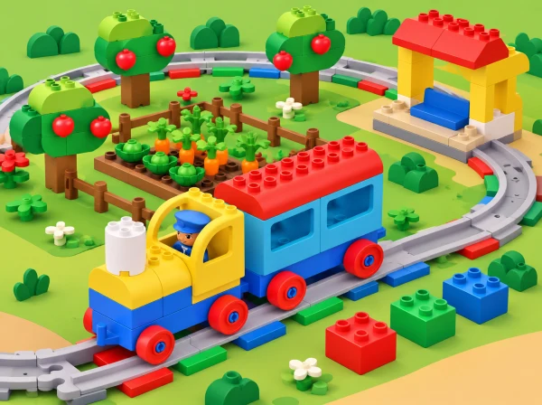

_El tren Coding Express recorre un bucle al voltant d’un hort de joguina amb bancals i arbres._

## ❓ Repte i intenció

La classe prepara una ruta circular pel jardí escolar: el tren passa pel bancal i la zona d’ombra, i pot tornar a fer el mateix recorregut. La via en O ajuda a veure una idea de programació abans d’utilitzar blocs: una seqüència d’accions pot repetir-se quan arriba de nou al punt d’inici. En comparar-la amb una via de doble extrem, el grup observa que una forma pot facilitar tornar a començar sense reconstruir el recorregut.

La situació adapta la lliçó oficial *O-Shaped Track – Looping*, de 30–45 minuts per a PreK–K. Ací distribuïm la mateixa investigació en tres sessions curtes perquè hi haja temps per anticipar, construir, repetir i descriure. No s’ensenya una sintaxi de bucle: s’explora la repetició amb una rutina, una via i un relat que l’alumnat pot seguir.

## 🎯 Objectius i paraules clau

- Reconéixer una rutina o seqüència que torna a aparéixer en el dia o la setmana.

- Construir una via en O amb trams corbs i rectes i dir que forma un circuit.

- Descriure una volta amb dues o tres parades en un ordre comprensible.

- Predir com es pot repetir el mateix viatge i comprovar la predicció amb el tren.

- Comparar el circuit amb una via de doble extrem i comunicar una diferència observada.

Paraules de suport: *durant*, *cada dia*, *una altra vegada*, *volta*, *inici*, *parada* i *final*. Les podem representar amb pictogrames de calendari, fletxes i marques d’inici/final.

## 🧰 Preparació

Comproveu quantes vies corbes i rectes hi ha. LEGO recomana sis trams corbs i quatre rectes per a la forma en O; useu només les peces presents a la caixa i verifiqueu que el circuit tanca i es manté estable. Prepareu dues o tres destinacions baixes i fàcils de distingir: bancal de paper, zona d’ombra i punt de trobada de l’hort. Afegiu passatgers de la dotació, mapa de la ruta, marcador de començament i targetes amb l’ordre de visites.

Els maons d’acció són opcionals per a l’objectiu principal. Si n’incorporeu, proveu-ne la funció amb el tren del centre i utilitzeu-los només si ajuden a marcar una parada. El maó blau pot representar una pausa per beure, si el comportament del model ho confirma. Amb un únic set, organitzeu equips de fins a sis persones o una estació de treball per torn; altres equips poden treballar amb una via dibuixada i vinyetes mentre esperen.

## 📅 Seqüència didàctica · 3 sessions de 40 minuts

### **Sessió 1 · Descobrim què es repeteix.**

#### Fase 1 · Activem i prediem

Pregunteu quines accions o rutines es fan sovint a l’escola o a casa. Recolliu exemples diversos —preparar la motxilla, obrir l’hort, mirar un llibre— sense demanar experiències personals que l’infant no vulga compartir. El grup tria una rutina que es puga representar amb moviments senzills.

#### Fase 2 · Explorem i construïm

Trieu una seqüència breu de dos moviments representables amb pictogrames o fitxes i col·loqueu-la en cercle. Qui no vulga fer els gestos pot ordenar les targetes, fer girar un marcador sobre el cercle o dir o assenyalar «una altra vegada».

#### Fase 3 · Expliquem i registrem

El docent mostra l’ordre una vegada; el grup l’anticipa i la repeteix dues vegades. Després, assenyaleu quin fragment ha tornat i com sabem on comença una nova volta. Registreu l’ordre amb una tira de pictogrames.

#### Fase 4 · Apliquem i millorem

Relacioneu la repetició amb el trajecte: el tren arribarà de nou al mateix punt si la via es tanca. Useu només una acció i una fletxa circular com a suport; si el grup ho domina, introduïu dues parades en una seqüència de tres passos.

#### Fase 5 · Comprovem i reflexionem

**Evidència:** seqüència ordenada i una explicació oral, gestual o visual de què es repeteix. Pregunteu quina pista ens permet saber que comença una altra volta i com ho representaríem sense fer els gestos.

### **Sessió 2 · Construïm la ruta circular de l’horta.**

#### Fase 1 · Activem i prediem

Abans de construir, pregunteu què passarà quan el tren arribe al marcador una altra vegada. Marqueu l’inici amb una targeta i feu una predicció sobre quin lloc visitarà després.

#### Fase 2 · Explorem i construïm

Combineu vies rectes i corbes per tancar l’O. Abans de col·locar les destinacions, recórreu la via amb el dit o amb una figura. En parelles, decidiu l’ordre de les persones passatgeres: estació → bancal → ombra → estació. Construïu cada lloc amb peces grans o dibuixos en paper i deixeu-los fora de la via perquè no frenen el tren.

#### Fase 3 · Expliquem i registrem

Representeu l’ordre en un mapa senzill i expliqueu per on passarà el tren. Col·loqueu passatgers i maons d’acció només en llocs provats; els maons són opcionals i se n’ha de confirmar la funció amb el tren disponible.

#### Fase 4 · Apliquem i millorem

Executeu una volta a baixa velocitat: una persona assenyala les targetes i una altra observa les parades. Si el tren no fa una aturada prevista, atureu-lo amb el control i reviseu la posició del maó o la interpretació de la seua funció abans de tornar-ho a provar.

#### Fase 5 · Comprovem i reflexionem

**Evidència:** mapa amb l’ordre, predicció i registre pictòric del que ha passat. Si el grup ja domina el recorregut, afegiu una tercera destinació i compteu quantes parades hi ha en una volta. Quina observació confirma o corregix la predicció inicial?

### **Sessió 3 · Repetim i comparem dues vies.**

#### Fase 1 · Activem i prediem

Expliqueu que les persones passatgeres volen fer el mateix viatge una altra vegada. Pregunteu si cal canviar la via o si el tren pot continuar pel circuit i anoteu una predicció abans de provar-ho.

#### Fase 2 · Explorem i construïm

Feu una segona volta i marqueu amb un adhesiu el moment en què la seqüència torna a començar. Descriviu l’ordre amb una tira d’imatges. Després, munteu una via de doble extrem curta al costat de l’O amb dues destinacions comunes.

#### Fase 3 · Expliquem i registrem

Compareu els recorreguts amb un dibuix: la via en O tanca el trajecte, mentre que la de doble extrem té un inici i un final oberts. Registreu què ha fet el tren en cada muntatge, sense generalitzar més enllà de la prova observada.

#### Fase 4 · Apliquem i millorem

Feu una prova curta en la via oberta i comproveu si el tren ha de canviar de sentit o si cal preparar de nou la ruta. Ajusteu la tira d’imatges perquè represente amb claredat el moment de reinici.

#### Fase 5 · Comprovem i reflexionem

**Evidència:** dues voltes registrades, comparació visual de les vies i una explicació amb suport de preguntes. Tanqueu amb «quina forma facilita repetir exactament la mateixa volta? Per què?» i demaneu quina observació sosté la resposta.

## 📋 Avaluació i evidències

Recolliu la seqüència de pictogrames, el mapa de l’horta, la predicció, el marcador de dues voltes i la comparació entre les dues formes de via. Observeu si l’infant:

- identifica una acció que es repeteix en la rutina o en el recorregut;

- construeix, amb ajuda adequada, una via tancada que el tren pot recórrer;

- descriu l’ordre de les destinacions amb paraules, gestos o imatges;

- anticipa què passarà en una segona volta i revisa la idea després de veure-ho;

- assenyala una diferència entre circuit i via de doble extrem.

Registre docent suggerit: «ho fa amb autonomia», «ho fa amb una pista» o «necessita una altra demostració». Acompanyeu-ho amb una evidència concreta, com ara l’ordre que ha assenyalat o el moment en què ha identificat la repetició.

## ♿ Més d’una manera de participar

Oferiu un circuit de paper si la via gran ocupa massa espai, un marcador de color i de forma alhora per indicar l’inici, i comptatge compartit de les parades. Es pot seguir el tren amb una fitxa sobre el mapa, des de la seua cadira, o contribuir com a narrador/a, constructor/a, observador/a o responsable de les targetes. Doneu temps per anticipar el soroll i oferiu una opció silenciosa equivalent.

Assegureu la via sobre una superfície plana, manteniu les mans fora del tren en marxa i pareu-lo des del control abans de canviar peces. No bloquegeu rodes ni aixequeu el tren mentre funciona.

## 🔗 Referent oficial i adaptació

Adapta [O-Shaped Track – Looping](https://education.lego.com/en-us/lessons/preschool-coding-express/o-shaped-track-looping/), lliçó 3 de 8 de Coding Express per a PreK–K. El pla original proposa una rutina circular que es repeteix, una via en O amb trams corbs i rectes, dues o tres destinacions, passatgers, maons d’acció, el mateix viatge repetit i una comparació amb una via de doble extrem. LEGO recomana sis trams corbs i quatre rectes i planteja que l’alumnat puga descriure amb suport l’ordre de la seqüència. L’horta, les parades, les targetes, els registres i les adaptacions de participació són propis.
