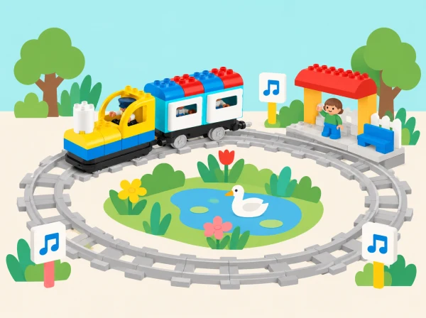

_El recorregut tancat fa visible una repetició; l’equip decideix quan començar i acabar._

## ❓ Repte i intenció

Quatre sessions exploren la diferència entre repetir una acció i fer-la una sola vegada. L’alumnat compara recorreguts, observa patrons i crea relats amb tornades. Els bucles es representen amb les possibilitats reals de les vies i peces del kit; si el robot no disposa d’una ordre programable de repetició, el patró s’explicita en targetes i s’executa manualment.

## 🎯 Aprenentatges i vocabulari

- Identificar accions i trams que es repeteixen en un recorregut o relat.
- Representar un patró repetit amb una seqüència d’ordres, targetes o moviments.
- Comparar una repetició finita amb una que no té una condició de parada explícita.
- Provar el patró i explicar quina regla permet saber quan acaba.

## Abans de començar

Prepareu Coding Express, vies rectes i corbes, figures de paper, targetes d’acció i instruments senzills o percussió corporal. Comproveu quines vies i blocs hi ha al vostre lot. Les rondes es fan en una maqueta sense obstacles al voltant de les rodes, i qualsevol repetició es limita a un nombre acordat de torns.

## 📅 Seqüència didàctica · 4 lliçons adaptades

### **Puja, baixa i torna · Up, Down, Around Again.**

#### Fase 1 · Activem i prediem

Trieu quatre maons de colors i assigneu a cada un una acció fàcil d’identificar: per exemple, tocar cap, muscles, genolls i peus, o fer els mateixos gestos amb una titella o fitxa sobre la taula. Predigueu què passarà si es repeteix la seqüència sencera.

#### Fase 2 · Explorem i construïm

Practiqueu l’ordre de les quatre accions i creeu un cinqué senyal visual que signifique «repeteix». Ordeneu els quatre maons i poseu el senyal de bucle al davant.

#### Fase 3 · Expliquem i registrem

Torneu a posar els quatre moviments per executar la seqüència una segona vegada. Registreu l’ordre i el lloc on apareix el marcador de bucle.

#### Fase 4 · Apliquem i millorem

Poseu el marcador davant de cada acció per repetir-la individualment i compareu les dues formes de repetir. Si una seqüència es confon, canvieu una sola targeta o acció i torneu a provar-la.

#### Fase 5 · Comprovem i reflexionem

**Evidència:** llegenda de colors, ordre de quatre accions, posició del marcador de bucle i explicació de quins passos es tornen a fer. Quina part s’ha repetit en cada cas?

### **Una via redona · O-Shaped Track.**

#### Fase 1 · Activem i prediem

Abans de construir, predigueu quina forma de via permetrà tornar a passar pels mateixos llocs i quina necessitarà preparar un altre recorregut.

#### Fase 2 · Explorem i construïm

Combineu vies corbes i rectes per tancar un circuit —el model de referència suggereix sis corbes i quatre rectes, segons les peces del lot— i construïu dos o tres llocs que el tren puga visitar. Poseu figures o fitxes com a passatgers i trieu una seqüència de parades.

#### Fase 3 · Expliquem i registrem

Col·loqueu maons d’acció perquè el tren puga detindre’s; el maó blau pot representar una parada de descans o abastiment en la història. Dibuixeu el mapa de la via i anoteu l’ordre de les parades.

#### Fase 4 · Apliquem i millorem

Feu el viatge una vegada i, en la volta següent, observeu com el circuit permet tornar a passar pels mateixos llocs. Després munteu al costat una via de doble extrem i proveu el mateix recorregut.

#### Fase 5 · Comprovem i reflexionem

**Evidència:** dos mapes de via, seqüència de parades i comparació oral entre circuit tancat i via oberta. Per què la via oberta no repeteix automàticament la mateixa ruta?

### **Concert d’animals · Animal Concert.**

#### Fase 1 · Activem i prediem

Trieu figures de paper i imagineu quin so o ritme breu podria representar cadascuna. Predigueu com sonaria el conjunt abans d’ordenar-lo.

#### Fase 2 · Explorem i construïm

Assigneu un so o ritme curt a cada figura i ordeneu-los en una seqüència. Representeu l’ordre amb icones o targetes.

#### Fase 3 · Expliquem i registrem

Interpreteu la seqüència com un concert i marqueu en la partitura visual quin fragment es repeteix. No cal enregistrar àudio ni atribuir capacitats musicals al tren.

#### Fase 4 · Apliquem i millorem

Canvieu només un so i torneu a interpretar la seqüència. Compareu què ha canviat i què s’ha mantingut igual.

#### Fase 5 · Comprovem i reflexionem

**Evidència:** partitura d’icones i comparació entre dues versions. Quin canvi hem fet i com l’hem identificat?

### **El conte que torna al començament · The Never-Ending Story.**

#### Fase 1 · Activem i prediem

Escolteu o llegiu un relat breu propi en què l’últim esdeveniment pot portar de nou al primer. Predigueu quina escena farà de connexió amb l’inici.

#### Fase 2 · Explorem i construïm

Identifiqueu les parts de la història i construïu entre totes les persones una via circular amb escenes al voltant. Useu el tren, maons d’acció i figures o materials corrents per representar l’ordre del relat.

#### Fase 3 · Expliquem i registrem

Col·loqueu un maó de bucle on comença la tornada i proveu de contar el relat mentre el tren fa el recorregut. Representeu l’ordre amb un esquema escena–ordre–maó.

#### Fase 4 · Apliquem i millorem

Si la història es trenca —falta una escena, una parada queda fora d’ordre o no s’entén on torna a començar— localitzeu el problema, canvieu la posició d’un maó o una instrucció i torneu a contar-la. En grup menut, inventeu un conte circular propi amb escenari original i decidiu quantes voltes fareu abans de tancar-lo.

#### Fase 5 · Comprovem i reflexionem

**Evidència:** esquema escena–ordre–maó, una errada corregida i explicació de com es repeteix el relat. Quina pista indica clarament que la història torna al començament?

## Organització i bastides

Les quatre lliçons oficials de bucles estan pensades per a Educació Infantil i duren aproximadament 30–45 minuts cadascuna; aquestes sessions locals es poden ajustar a 30–40 minuts amb una pausa de moviment entre propostes. Per a la primera, si l'alumnat és nou, comenceu amb una sola acció que es repetisca dues vegades abans d'afegir la seqüència de quatre. En el circuit O, el docent fa de control de seguretat i para el tren després del nombre de voltes acordat: la via tancada representa el patró, però no es presenta com una instrucció programable de «repetix N vegades» si el lot no té eixa funció.

En el concert, comproveu al kit si els maons sonors necessiten l'app per configurar-se. Si no hi ha dispositiu o no és adequat usar àudio, l'equip associa cada color a una targeta visual i interpreta el patró amb instruments o en silenci. En el relat, useu una història curta de domini de l'aula o un conte original; no necessiteu copiar un llibre comercial ni les escenes LEGO. Marqueu amb una fletxa gran quin esdeveniment retorna a l'inici i una altra que indique quan el grup dona per acabada la narració.

Roteu els rols de constructor/a de via, col·locador/a de maons, narrador/a i observador/a. Si hi ha pocs kits, la resta d'equips anticipa el recorregut amb fitxes sobre un mapa de paper i compara la seua predicció amb la volta del tren. Es pot participar sense caminar, tocar el tren o escoltar sons: assenyalar una targeta, ordenar les escenes o registrar el patró són alternatives equivalents.

## 📋 Avaluació i evidències

Observeu si l’alumnat detecta què es repeteix, anticipa el pas següent, diferencia una volta d’un final i pot modificar una part sense perdre el patró. Recolliu els mapes, les seqüències de ritme i el relat creat per avaluar comprensió i comunicació, no la velocitat de construcció.

## ♿ Més d’una manera de participar

Useu una icona clara per a cada acció i marqueu l’inici amb forma i color. Oferiu alternatives sense so, seqüències més curtes i rols de disseny, narració, moviment o registre. Les voltes es poden seguir amb una fitxa si el soroll o el moviment del tren dificulta la participació.

## 🔗 Unitat oficial i adaptació

Adaptació de les quatre lliçons de [Introduction to Looping](https://education.lego.com/en-us/product-resources/coding-express/additional-lesson-plans/computer-science-lessons/): Up, Down, Around Again (quatre moviments assignats a colors i un senyal separat per repetir-los); O-Shaped Track (recorregut amb parades, passatgers i comparació amb la via de doble extrem); Animal Concert (seqüència musical amb app i maons); i The Never-Ending Story (relat repetit amb escenes, maons i depuració). La lliçó de concert també es relaciona amb la situació bàsica de música, però ací s’hi treballa específicament el bucle. La narració, la seqüència i la il·lustració són originals.
