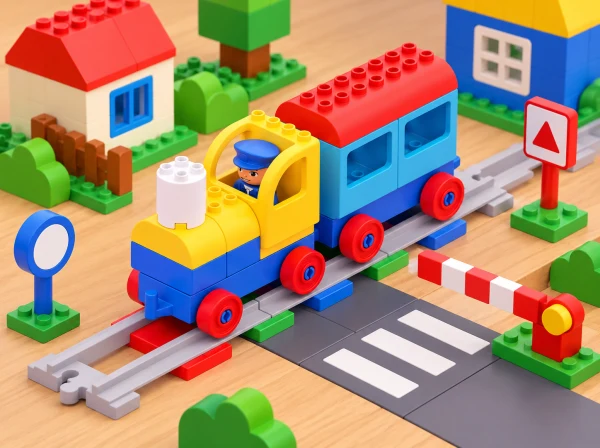

_El tren Coding Express travessa un pas de vianants i una barrera de maqueta en una ciutat de joguina._

## ❓ Repte i intenció

El grup investiga els quatre senyals de la dotació, construeix un recorregut en Y i resol incidències fictícies d’una ciutat de joguina. La maqueta permet parlar de com els senyals ens recorden acords i ajuden a descriure una ruta, però no representa un carrer complet ni ensenya totes les normes de circulació. Cada maó d’acció es prova amb l’app per distingir la seua resposta programada del significat que el grup imagina per al senyal.

**Aprenentatges:** observar i interpretar símbols, descriure trajectes i bifurcacions, anticipar què passarà després d’un maó, comprovar una hipòtesi, afegir informació visual a una explicació i acordar una solució segura per a una situació fictícia.

## Abans de començar

La lliçó oficial està pensada per a fins a quatre participants i usa el set Coding Express amb l’app. Prepareu el tren, vies suficients per a una bifurcació en Y, els quatre senyals de trànsit de la caixa i altres maons d’acció, figures o models de barri, targetes de construcció si en disposeu, paper i retoladors. Comproveu abans de la classe la connexió amb l’app i les funcions disponibles en cada botó; la versió concreta pot canviar quines incidències es poden representar. Situeu la maqueta en una taula estable i manteniu cables i dispositius fora de la via.

Useu senyals reals només per mirar-los i identificar-los amb fonts educatives fiables. Les targetes inventades en aquesta activitat han de tindre una aparença diferenciada i dur l’etiqueta «senyal del nostre joc», per no confondre-les amb senyalització viària. No presenteu una interpretació infantil com a norma oficial. L’activitat es resol íntegrament dins de l’aula: no hi ha eixides al carrer, carreres, encreuaments simulats a escala humana ni situacions de perill.

**Vocabulari:** senyal, recordar, trajecte, bifurcació, parada, possible, evitar, predir i comprovar. Introduïu «bifurcació» amb dues vies visibles i deixeu que cada participant assenyale o descriga cap a on continua el tren.

## 📅 Seqüència didàctica · tres sessions de 40 minuts

### **Observem senyals i acordem el joc segur (40 min).**

Inicieu una conversa curta sobre els senyals que l’alumnat recorda haver vist des d’un vehicle o acompanyat per una persona adulta. No demaneu que descriguen com creuar un carrer; centreu-vos en la funció general de recordar o comunicar informació. Mostreu els quatre senyals de la dotació Coding Express, un per un, i demaneu que n’observen forma i color abans de proposar una interpretació. El docent contrasta les idees amb informació fiable i explicita qualsevol diferència entre la peça de joguina i un senyal real.

Després, feu un joc tranquil de conducció dins d’una zona marcada de taula: les persones mouen una figura o el tren lentament i s’aturen davant d’algunes targetes. Una persona pot fer de coordinadora del trànsit i donar senyals visuals de «continua», «redueix» o «atura’t», sempre com a regles inventades per al joc. Alterneu conducció i observació perquè totes les persones puguen veure què comunica cada targeta.

*Evidència:* una targeta amb el senyal observat, interpretació inicial i explicació contrastada o revisada. *Preguntes docents:* «Què ens ajuda a recordar aquest símbol? Quina part és una norma contrastada i quina forma part del nostre joc?»

### **Construïm la bifurcació i investiguem els maons (40 min).**

En grup menut, construïu una via en Y i col·loqueu dos o tres models de barri al costat de cada ramal: plaça, biblioteca o jardí, per exemple. Situeu alguns maons d’acció en llocs variats, registrant-ne la ubicació amb un dibuix senzill. Abans d’engegar el tren, cada equip descriu una ruta completa: origen, bifurcació, ramal triat i destinació. La bifurcació i les vies del set són elements de la maqueta; no les presenteu com una representació exacta d’una carretera.

Exploreu els controls de l’app en torns, d’un botó cada vegada. En passar cada maó, observeu l’efecte real: s’atura, canvia de comportament o no s’aprecia cap canvi? Anoteu «predicció / observació / què pensem ara». Si l’app mostra una incidència o si el docent la proposa amb una targeta, descriviu-la sense dramatitzar-la: una destinació queda fora de servei en el joc, cal visitar una altra parada o el tren s’ha desviat. Cada grup tria una solució i la prova.

*Evidència:* mapa de la Y amb destinacions, seqüència de la ruta i registre d’una predicció contrastada amb l’app. *Preguntes docents:* «Quin ramal heu triat i per què? Què ha fet realment el tren després del maó?»

### **Dissenyem un senyal de joc i expliquem la ruta (40 min).**

Useu els quatre senyals de la dotació en més d’un punt del trajecte i observeu si la història continua sent comprensible. Després, inventeu una targeta pròpia amb una forma i un pictograma fàcils de reconéixer; escriviu-hi «senyal del nostre joc» i expliqueu què demana en aquesta maqueta. Col·loqueu-la al punt on creieu que serà útil, executeu la ruta i demaneu a un altre equip que descriga què ha entés abans de veure l’explicació dels autors.

Si el senyal no comunica la idea, canvieu un sol element —posició, contrast o símbol— i torneu a preguntar a un altre observador. Tanqueu amb una narració visual del trajecte: inici, bifurcació, una incidència, decisió i destinació. Cada participant tria si la presenta oralment, amb targetes o amb gestos. Recordeu en conjunt que les peces i les regles creades valen per a la maqueta i no substitueixen l’acompanyament adult ni les normes reals de seguretat viària.

*Evidència:* senyal de joc revisat, relat visual i justificació del lloc on s’ha col·locat. *Preguntes docents:* «Què entén l’altre equip sense que li ho expliquem? Com hem comprovat que el senyal del joc no es confon amb un de real?»

## 📋 Avaluació i evidències

Observeu el procés amb quatre indicadors: interpreta o formula una pregunta sobre un senyal; descriu una ruta amb origen, bifurcació i destinació; anticipa i comprova la funció d’un maó; i explica com el seu senyal inventat ajuda a entendre l’escena de joc. El quadern conserva la targeta inicial, el mapa de la Y, el registre predicció/observació i el senyal propi revisat.

Valoreu la qualitat de l’observació i la claredat de la representació, no la precisió de les primeres interpretacions ni la rapidesa en conduir. Si l’app no està disponible, representeu els efectes observats prèviament pel docent amb targetes i figuretes i manteniu el repte de descriure, predir i revisar.

## ♿ Més d’una manera de participar

Feu tota la proposta amb maqueta, fotografies i pictogrames tàctils; no cal eixir al carrer. Useu instruccions anticipades, contrast alt i una sola bifurcació visible cada vegada. Eviteu efectes sonors inesperats i permeteu observar sense tocar el tren. Repartiu rols de constructor/a, lector/a de símbols, operador/a de l’app i relator/a, amb rotació opcional; qualsevol persona pot assenyalar, usar comunicació augmentativa o dictar a una companya. Deixeu espai entre participants i manteniu el tren a velocitat baixa.

## 🔗 Referent oficial i adaptació

Adapta [Journey – Trouble on the Road](https://education.lego.com/en-us/lessons/preschool-coding-express/journey-troubles-on-the-road/): conversa sobre normes i quatre senyals del set, joc de conducció a zones marcades, construcció de la via en Y, exploració dels botons de l’app i els maons d’acció, resolució de problemes de trànsit i creació/col·locació de senyals o models propis. La situació del barri, les incidències, els mapes i les targetes són propis. La via només és una maqueta educativa; no ensenya normes completes ni substitueix formació viària.
