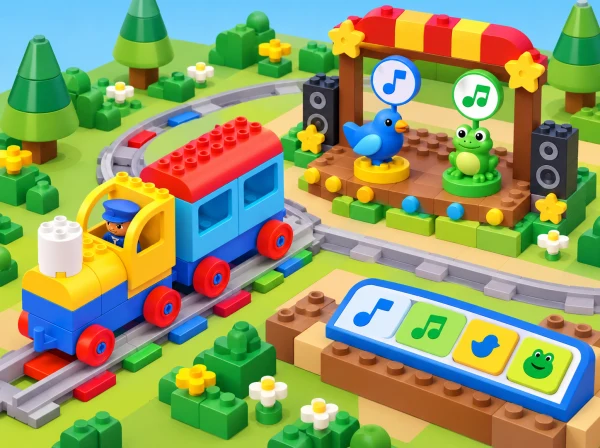

_El tren Coding Express connecta una via de joguina amb un escenari de concert d’un ocell i una granota._

## ❓ Repte i intenció

El grup investiga què fa cada maó d’acció amb la configuració disponible de l’app, relaciona sons amb models d’animals i crea una composició pròpia. El focus és pensar en seqüències: anticipar un ordre, provar-lo, escoltar o observar el resultat i revisar-lo. Un so suggeridor no és una identificació científica de l’animal: les associacions es presenten com a joc de representació.

**Aprenentatges:** escolta i discriminació de sons; ordenació d’esdeveniments; anticipació i comprovació; repetició com a patró; expressió d’una intenció artística; conversa sobre decisions pròpies i respecte pels torns.

## Abans de començar

La proposta adapta una lliçó prevista per a fins a quatre participants. Prepareu un tren/vagó Coding Express, les peces necessàries per a una via tancada, els maons d’acció de diversos colors, l’app oficial en un dispositiu compatible, figures o targetes d’animals i una superfície on es puga ordenar la composició. Comproveu abans de la sessió si l’app s’instal·la, si es connecta al tren i quines respostes sonores produeix cada maó; les funcions poden dependre de la versió i de la configuració.

No cal que cada maó tinga un animal assignat ni que els sons siguen gravacions reals. Registreu el comportament observat, sense prometre una correspondència fixa entre color i so. Prepareu una alternativa sense pantalla: targetes amb símbols, instruments suaus, veu, palmades o sons triats pel grup. Demaneu permís abans de reproduir sons intensos, manteniu el volum moderat i no enregistreu veus de l’alumnat.

**Vocabulari útil:** so, ritme, melodia, seqüència, repetir, maó d’acció, composició i concert. Introduïu les paraules amb gestos o pictogrames i deixeu que els xiquets expliquen les seues idees oralment, assenyalant o ordenant targetes.

## 📅 Seqüència didàctica · tres sessions de 40 minuts

### **Escoltem i imaginem el concert (40 min).**

Obriu amb una conversa breu: quins sons escoltem al pati, al jardí o prop d’una séquia? Diferencieu el que s’ha sentit realment («he sentit un ocell») del que s’imagina («potser era una merla»). Trieu tres animals coneguts de l’entorn de l’Albufera —per exemple, granota, ocell o insecte— i observeu-ne imatges. Useu un recurs sonor educatiu revisat pel docent o representeu les veus amb instruments suaus; expliqueu que la imitació no substitueix l’escolta de la fauna real.

Escolteu o marqueu el ritme d’una cançó d’animals que el grup ja conega. El docent proposa que un autobús imaginari visita un concert a la marjal; el grup decideix quins animals hi participaran i com pot mostrar-los sense capturar-los ni molestar-los. Feu un mapa de tres entrades: animal, so real o inventat, i com el representarem. Deixeu la imitació vocal com una opció, no com una obligació.

*Evidència:* mapa de so amb tres animals i una representació acordada. *Pregunta docent:* «Quina part sabem perquè l’hem observada i quina hem inventat per al concert?»

### **Investiguem les respostes de la via (40 min).**

En equip de fins a quatre, construïu una via circular i situeu al voltant les figures o targetes. Si cal, afegiu un autobús de paper o una figura com a passatger: no cal construir un vehicle diferent del tren del kit. Col·loqueu un maó d’acció de cada color disponible, d’un en un, en punts fàcils de veure. Abans de conduir, cada participant tria com fer avançar el tren amb l’app i prediu què podria passar quan travesse un maó.

Feu una volta de prova i registreu en una taula simple: «maó provat / què hem sentit o observat / animal que ens recorda / ho hem comprovat?». Torneu a passar quan una resposta no s’haja pogut escoltar bé. Després, useu l’app per explorar o canviar el comportament dels maons i comproveu què canvia. Expliqueu clarament que el color, per si sol, no identifica cap espècie, i que l’app pot produir sons representatius o musicals, no enregistraments de la fauna local. Si els sons no corresponen als animals esperats, convertiu-ho en una pregunta d’investigació, no en un error de l’alumnat.

*Evidència:* registre de dues o més proves, amb una predicció i una observació diferenciades. *Pregunta docent:* «Què ha canviat quan hem canviat la configuració? Com ho podem saber?»

### **Composem, repetim i compartim (40 min).**

Cada equip tria una idea que vol comunicar: matí tranquil, pluja que arriba, festa de l’horta o passeig per la marjal. Ordena els maons d’acció a la via i dibuixa o dicta la seqüència abans d’iniciar el tren. Proveu-la i convideu el grup a identificar un fragment que es repetisca. Si la volta tancada repeteix la seqüència sencera, distingiu aquesta repetició del patró més curt que l’equip ha decidit compondre.

Canvieu només l’ordre d’un maó i compareu les dues versions: quin so apareix abans?, què es repeteix?, quina transmet millor la idea escollida? Per finalitzar, presenteu la composició amb el tren, amb pictogrames o amb instruments de taula. Qui no vulga actuar pot ordenar la seqüència, donar l’entrada o mostrar el cartell. Recolliu una frase o marca visual sobre una decisió que l’equip ha canviat després d’escoltar el resultat.

*Evidència:* partitura visual, una seqüència provada, un patró repetit identificat i una revisió justificada. *Pregunta docent:* «Què volíeu expressar? Quina decisió us ha ajudat a aconseguir-ho?»

## 📋 Avaluació i evidències

Observeu el procés i no la qualitat musical ni la capacitat d’imitar sons. Feu una anotació breu per equip o participant en aquests indicadors:

- Anticipa o descriu l’ordre de dos o més esdeveniments abans de provar-lo.

- Registra què ha passat distingint observació, predicció i interpretació.

- Canvia una variable cada vegada per comparar dues seqüències.

- Reconeix una repetició i pot assenyalar-la amb peces, gestos o pictogrames.

- Comunica una intenció i explica una decisió de composició amb el suport que necessite.

La carpeta d’evidències pot incloure el mapa sonor inicial, la taula d’exploració, les dues partitures visuals i una nota docent sobre la conversa final. Una resposta inesperada de l’app també és una evidència vàlida si l’equip la descriu i la comprova.

## ♿ Més d’una manera de participar

Permeteu observar sense escoltar sons, useu volum baix i oferiu una representació visual equivalent. Per a alumnat amb sensibilitat auditiva, es pot desactivar l’àudio i treballar amb llums/maons com a marcadors, o fer servir auriculars només si són còmodes i acceptats. Per a alumnat amb dificultats motrius, un company pot conduir el tren seguint instruccions dictades, o es pot fer tota la seqüència amb targetes de taula. Oferiu rols rotatius —ordenar, predir, conduir, registrar o presentar— i no exigiu cantar, ballar, parlar en públic ni compartir vivències personals.

## 🔗 Referent oficial i adaptació

Adapta [Music – Animal Concert](https://education.lego.com/en-us/lessons/preschool-coding-express/music-animal-concert/): reconéixer sons d’animals, explorar amb l’app els controls i l’efecte de cada maó, relacionar els sons amb models d’animals, ordenar els maons per a compondre una melodia, identificar-hi un patró repetit i expressar què comunica la música. El concert de la marjal, els animals i les targetes són propis; la disponibilitat de l’app i dels sons es comprova al centre, amb una alternativa desconnectada prevista.
