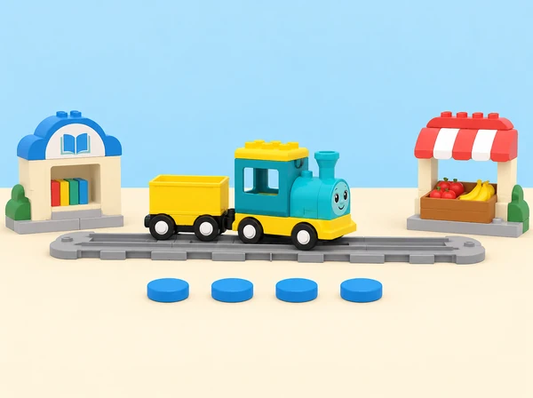

_Comptem, comparem i comprovem distàncies de joguina amb Coding Express._

## ❓ Repte i intenció

La classe prepara una ruta entre espais familiars —per exemple, la biblioteca, el mercat i la plaça— representats en una maqueta de taula. Primer compara distàncies amb una mateixa unitat; després investiga què passa quan tria diferents nombres de moviment en l’app Coding Express. Les comparacions es refereixen al tren i al circuit concret de prova: els nombres de l’app no són metres, no indiquen quant hi ha entre llocs reals i poden variar segons el circuit i la configuració.

## 🎯 Aprenentatges i vocabulari

- Mesurar recorreguts amb unitats no convencionals repetibles i comparar-ne la longitud.
- Ordenar nombres de moviment i relacionar-los amb el desplaçament observat en una via concreta.
- Predir una parada, provar-la més d’una vegada i registrar diferències entre intents.
- Explicar per què els nombres de l’app no són metres ni distàncies reals entre llocs.

## 🧰 Materials i preparació

Prepareu un set Coding Express, l’app oficial en una tauleta compatible i el tren connectat abans de provar els nombres; una via de doble extrem; targetes de construcció del set si estan disponibles; models menuts propis de paper o peces; targetes amb noms o pictogrames de tres parades; fitxes d’unitat totes iguals; cinta de paper i un full de registre. La lliçó oficial treballa amb fins a quatre participants, tres models de parada i una ruta de doble extrem. Comproveu quins nombres d’avanç apareixen en la versió d’app del centre i si el tren respon de manera consistent en aquesta via.

Marqueu distàncies sobre la maqueta amb peces iguals o segments de paper de la mateixa llargària. No mesureu el cos de l’alumnat ni exigiu que camine entre punts; qui ho preferisca pot avançar una fitxa sobre un plànol. Si la connexió o la funció numèrica no està disponible, feu la comparació amb unitats de paper i anoteu que es tracta d’un model desconnectat, sense atribuir al tren una lectura que no s’ha produït.

**Vocabulari:** mesurar, distància, pas, unitat, comparar, vehicle, avançar, retrocedir, més curt i més llarg. Comproveu que «pas» puga significar un moviment del tren o una unitat repetida sobre el paper segons el context; no els tracteu com la mateixa mesura.

## 📅 Seqüència didàctica · 3 sessions

### **Quina parada queda més lluny? (40 min)**

#### Fase 1 · Activem i prediem

Trieu dos o tres punts com a estacions i poseu-los noms propis. Abans de muntar la via, mostreu-los en un plànol o sobre la taula. Cada parella prediu quin tram sembla més curt i com ho podria comprovar.

#### Fase 2 · Explorem i construïm

Recompteu unitats iguals entre cada parella de punts: col·loqueu-les una darrere l’altra, sense espais ni superposicions. Per a qui preferisca no caminar, una fitxa representa el trajecte en el mapa i es mou una casella cada vegada.

#### Fase 3 · Expliquem i registrem

Compareu els resultats i registreu la unitat utilitzada. Si les distàncies no cauen en nombres sencers d’unitats, marqueu-ho i parleu de la diferència sense forçar l’arrodoniment.

#### Fase 4 · Apliquem i millorem

Comproveu que totes les parelles usen la mateixa unitat i el mateix procediment. No compareu longituds de pas entre persones ni presenteu el recompte d’una caminada individual com una mesura exacta.

#### Fase 5 · Comprovem i reflexionem

**Evidència:** predicció, recompte amb unitat acordada i comparació «més curt/més llarg». Pregunteu: «Què hem mantingut igual? Quina distància ha resultat més llarga i com ho sabem?»

### **Construïm i investiguem els nombres de l’app (40 min).**

#### Fase 1 · Activem i prediem

Abans de moure el tren, connecteu-lo a l’app i mireu quins nombres es poden seleccionar. Predieu quin valor farà avançar més el model; no suposeu que els nombres representen centímetres.

#### Fase 2 · Explorem i construïm

En grup menut, construïu dos o tres models senzills de parada i una via de doble extrem. Poseu les destinacions al costat de la via, des de prop de l’origen fins a més lluny. Ordeneu els nombres amb targetes només si coincideix amb la interfície observada.

#### Fase 3 · Expliquem i registrem

Proveu cada valor amb un tram lliure i segur, un cada vegada. Registreu on s’ha aturat el tren; no suposeu que el nombre produeix la mateixa distància en qualsevol muntatge.

#### Fase 4 · Apliquem i millorem

Cada equip selecciona un nombre per arribar a una parada, marca la predicció al plànol, executa el trajecte i compara l’arribada amb el resultat esperat. Si cal corregir, canvieu una sola selecció i torneu a provar.

#### Fase 5 · Comprovem i reflexionem

**Evidència:** taula «parada / nombre triat / predicció / on s’ha aturat / què revisaríem». Pregunteu: «Quin valor creieu que farà avançar més el tren? Què heu observat quan l’heu provat?»

### **Afegim parades i contem el trajecte (40 min).**

#### Fase 1 · Activem i prediem

Afegiu una o dues destinacions i acordeu distàncies de maqueta diferents. Predieu quin tram serà més curt i quin nombre de l’app podria acostar el tren a cada parada.

#### Fase 2 · Explorem i construïm

Ordeneu les parades i representeu el trajecte amb targetes: inici, avanç, visita, nova parada i final. Una altra parella reconstrueix el recorregut a partir del mapa.

#### Fase 3 · Expliquem i registrem

Compareu quin tram és el més curt i el més llarg; expliqueu quin nombre de l’app heu triat i què ha passat. Comproveu una distància amb la mateixa unitat de la primera sessió.

#### Fase 4 · Apliquem i millorem

Per ampliar el repte, compareu dos nombres consecutius de l’app o dissenyeu una ruta amb el valor més gran disponible. Useu «més/menys» només per descriure el moviment observat en aquesta prova, no com a mesura mètrica. Expliqueu quina evidència ha ajudat a decidir el nombre i quina limitació té el model.

#### Fase 5 · Comprovem i reflexionem

**Evidència:** mapa final, seqüència oral o visual i justificació de la comparació. Pregunteu: «Quines parades hem fet i en quin ordre? Què hauríem de mesurar d’una altra manera si volguérem descriure un lloc real?»

## 📋 Avaluació i evidències

Recolliu el mapa de parades, les unitats emprades, les prediccions dels nombres, les observacions del moviment i la descripció final del trajecte. Observeu si l’alumnat:

- compara distàncies amb «més curt/més llarg» i manté una unitat comuna;

- descriu quina part de la mesura és de la maqueta i quina és l’observació del tren;

- ordena les destinacions i anticipa una seqüència d’esdeveniments;

- revisa una tria a partir del resultat observat i pot explicar el canvi.

No cal encertar el primer nombre: importa explicar què ha passat i com s’ha pres la decisió. La carpeta pot contindre un full de comparació, una captura o dibuix dels nombres disponibles i la ruta final marcada per una altra parella. Si l’app no funciona, documenteu la versió de paper i no la presenteu com si el tren haguera executat les ordres.

## ♿ Més d’una manera de participar

Oferiu nombres i estacions amb pictogrames grans, relleu o una paraula llegida en veu alta. La ruta es pot representar amb una fitxa sobre la taula; ningú ha de caminar una distància ni arribar físicament a un lloc. Separeu les targetes perquè siguen fàcils d’agafar, doneu temps addicional per anticipar la ruta i reduïu el nombre de parades quan hi haja massa estímuls. Permeteu que una persona trie l’ordre, una altra prepare targetes i una tercera observe el moviment o dicte el registre. Es pot respondre assenyalant, amb comunicació augmentativa o mitjançant una demostració compartida.

## 🔗 Referent oficial i adaptació

Adapta [Math – Distance](https://education.lego.com/en-us/lessons/preschool-coding-express/math-distance/): conversa sobre distàncies, elecció de dos o tres parades, recompte de passos, comparació entre trajectes, construcció de models amb targetes, via de doble extrem, exploració a l’app dels nombres que controlen l’avanç del tren i ampliació amb més parades. La biblioteca, el mercat, les targetes, la maqueta i els instruments de registre són propis. L’app no es tracta com un mesurador de distàncies reals; l’alumnat comprova el moviment del tren i descriu el resultat del model.
