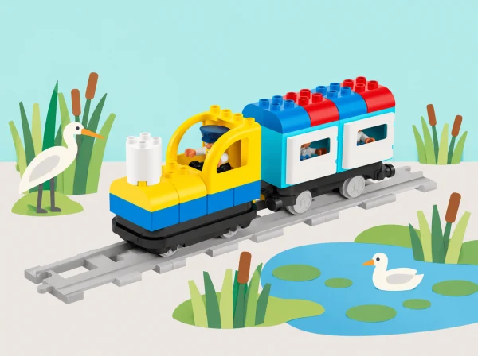

_La maqueta mostra un hàbitat de paper i el tren real de Coding Express; no es fa cap prova amb fauna._

## ❓ Repte i intenció

Una aula vol muntar una exposició de maquetes d’aiguamoll. Sis sessions connecten les necessitats bàsiques, les relacions entre éssers vius i medi, els hàbitats diferents i les decisions humanes. El tren Coding Express es mou per vies pròpies; les peces de paper representen situacions i no substitueixen observacions científiques o mesures ambientals.

## Abans de començar

Prepareu el tren i les vies Coding Express, blocs d’acció presents al set, figures de paper d’éssers vius, icones d’aigua, aire, refugi i aliment i cartolina per fer paisatges. LEGO presenta la unitat original per a Coding Express i STEAM Park: les nostres activitats funcionen amb el tren i materials corrents, sense necessitar el segon set. No captureu ni alimenteu animals, no arranqueu plantes i no feu visites de camp sense autorització i supervisió.

## 📅 Seqüència didàctica · 5 lliçons adaptades / 6 sessions

La lliçó de necessitats es repeteix en una sessió de plantes i una altra d’animals, com proposa el pla oficial. La darrera lliçó pot repartir-se en dos blocs per donar lloc a la recerca i al missatge públic.

### **S1 · Necessitats i desitjos de Trollie · *Trollie: My Basic Needs* (45–60 min).**

Activeu els conceptes necessitat, desig, ésser viu i sobreviure amb un conte curt i un personatge original, Trollie, fet de cartó o peces corrents i col·locat damunt del tren. Cada parella construeix una cosa que cobrisca una necessitat humana —aigua, aliment, roba o refugi— i la classe agrupa les creacions per categories, les compta i compara quina n’ha generat més i menys. Afegiu les dades a un mural visual que continuarà en les sessions següents. Ordeneu els models en inici, nus i final d’una història; munteu una via recta comptant les peces i feu una primera passada sense maons d’acció. Després proveu els maons roig, verd i blau del set: observeu i anoteu com respon el vostre tren a cada color i trieu el senyal que millor marca la parada narrativa, sense atribuir al maó funcions que no hàgeu comprovat. Torneu a contar la història incorporant un desig, com veure una pel·lícula, i expliqueu per què no és una necessitat per a viure. *Evidència: models classificats, recompte, relat ordenat i registre dels comportaments dels maons.*

### **S2 · Observem una planta i el seu entorn · *Plant and Animal Needs* (30–45 min).**

Trieu una zona segura i accessible del pati o entorn pròxim; si no és possible eixir, useu una fotografia o un vídeo adequat. Dibuixeu una planta concreta i les característiques observables del lloc, sense tocar-la ni arrancar-la. En parelles, construïu la planta i els trets del medi que una observació o font seleccionada relaciona amb la seua supervivència. Expliqueu amb paraules espacials —al costat, davant, darrere— on viu, què necessita i què canviaria si la planta es traslladara a l’interior. Compareu dos models amb una semblança i una diferència; incorporeu les necessitats de plantes al mural i compteu cada categoria amb imatges i paraules. Distingiu el que s’ha observat d’allò que només es proposa com a hipòtesi. *Evidència: dibuix d’observació, model, conversa entre parelles i recompte de necessitats.*

### **S3 · Repetim la investigació amb un animal · *Plant and Animal Needs* (30–45 min).**

Repetiu la seqüència amb un animal observat a distància des d’una zona autoritzada o amb un vídeo/fotografia d’un entorn natural quan no siga visible al centre. No perseguiu, captureu, toqueu ni alimenteu fauna. Registreu amb dibuix les característiques del lloc i modeleu l’animal i un o dos elements del seu hàbitat que una font adequada identifica com a rellevants. Expliqueu què necessita i quina observació ho sosté. Afegiu les necessitats animals al mateix mural que les de plantes i persones, compteu-les i busqueu patrons sense afirmar que totes les espècies necessiten exactament el mateix. *Evidència: registre o font consultada, model, explicació oral/pictogràfica i comparació planta-animal.*

### **S4 · Un ésser viu modifica el seu entorn · *Plants and Animals Change the Environment* (30–45 min).**

Reviseu el mural i parleu de necessitats que poden relacionar plantes i animals. Observeu un canvi documentat o visible des d’una zona segura —per exemple, arrels que alcen un paviment o un niu observat de lluny—; dibuixeu la prova abans de proposar-ne la causa. En parelles, construïu què hi havia, quin canvi s’hi aprecia i quina necessitat podria satisfer l’ésser viu. Una altra parella pregunta què representa el model que no es pot veure directament. Després, inventeu una criatura només com a exercici de modelatge i expliqueu com podria modificar l’entorn per cobrir una necessitat. Tanqueu pensant com una transformació humana, com pavimentar o construir, pot afectar les condicions de plantes i animals. *Evidència: seqüència abans-canvi-després, dibuix/font d’observació i afirmació recolzada en proves.*

### **S5 · Investiguem i visitem hàbitats diferents · *Journey to Different Habitats* (45–60 min).**

Useu llibres, imatges i materials seleccionats sobre espais pròxims —com l’Albufera, els arrossars o la Devesa— i assigneu a cada grup una planta, un animal i un hàbitat per investigar. Anoteu amb dibuixos i paraules què necessita cada ésser viu, quins trets del medi l’ajuden i si una planta contribueix a alguna necessitat de l’animal; distingiu informació de la font i inferència pròpia. Construïu models que expliquen aquestes relacions i una via amb diverses parades-hàbitat; col·loqueu els models al llarg del recorregut i programeu el tren perquè s’ature a cada lloc. Els passatgers visitants fan de naturalistes i cada grup presenta l’hàbitat i respon com s’ajuden la planta i l’animal. La ruta és una exposició, no una afirmació que les espècies conviuen o es desplacen entre llocs contigus. *Evidència: notes de recerca, mapa de parades, seqüència dels maons i explicació de naturalista amb font i pregunta pendent.*

### **S6 · Investiguem un problema i comuniquem una solució · *People Helping the Environment* (90 min).**

Amb textos, fotografies i observacions adequades, investigueu accions humanes que afecten l’entorn: residus que poden arribar a un desguàs, consum de materials o canvis en una zona verda. Acordeu un problema acotat que el grup puga explicar; si només disposeu d’un cas documental o d’una maqueta, indiqueu-ho i no el presenteu com un problema mesurat al centre. Feu recerca compartida, registreu la font, descriviu qui o què es veu afectat i formuleu el problema amb paraules pròpies. En parelles, construïu amb Coding Express i materials escolars un model de solució que reduïsca l’impacte; establiu un criteri observable per a valorar-lo i una limitació. Presenteu les idees entre grups i feu un cartell, missatge públic o fitxa il·lustrada amb el problema, l’evidència, la solució i una acció viable. *Evidència: registre de recerca, problema definit, model, retorn rebut i missatge final revisat.*

## 📋 Avaluació i evidències

Useu retorn formatiu durant tota la seqüència: S1 identifica necessitats, diferencia necessitat/desig i descriu funcions dels maons; S2–S3 identifica necessitats de plantes i animals, trets ambientals i comunica un model; S4 relaciona un canvi amb una necessitat i sosté l’explicació en una observació/font; S5 representa relacions entre plantes, animals i lloc, i planifica una ruta amb parada a cada hàbitat; S6 participa en recerca compartida, defineix un problema i comunica una solució. Recolliu dibuixos, recompte, models, guions de naturalista i missatge final. Valoreu l’argument i l’evidència, no que el model «funcione» o tinga acabat estètic.

## ♿ Més d’una manera de participar

Useu figures grans amb textures diferents, estacions de via ben separades i pictogrames per anticipar cada parada. Es pot participar triant les peces, relatant, movent una fitxa per la via o registrant l’explicació de l’equip. Les fotografies o exemples es poden donar al grup si l’eixida a l’entorn no és accessible.

## 🔗 Unitat oficial i adaptació

Adaptació de les cinc lliçons del [pla docent LEGO Education Needs of Plants and Animals](https://assets.education.lego.com/v3/assets/blt293eea581807678a/blt43debd07f27d1dd2/634fbd76b3f39b38fccfe34b/Needs_of_Plants_and_Animals_Unit_Grade_K.pdf?locale=en-us): Trollie: My Basic Needs; Plant and Animal Needs (repetida per a plantes i animals); Plants and Animals Change the Environment; Journey to Different Habitats; i People Helping the Environment. Es preserven observació, recerca compartida, models, recompte, narració, prova de maons d’acció, via amb parades i comunicació pública. El material de STEAM Park se substitueix per materials de classe, i aquesta adaptació queda identificada. El context, els exemples, les preguntes i la il·lustració són propis. Els materials del [Parc Natural de l’Albufera](https://parquesnaturales.gva.es/documents/80302883/166264158/MAPA%2BPARC%2BNATURAL%2BDE%2BL%27ALBUFERA.pdf/6a77c39a-573c-4c1b-8c0d-573bac53a093) poden orientar la selecció de fonts locals; cada observació i relació d’espècies s’ha de verificar amb la font triada per l’aula.
