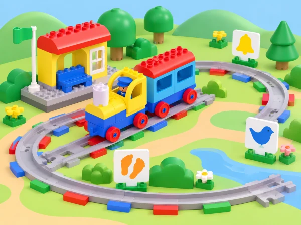

_El tren Coding Express arriba a una estació amb pictogrames de campana, ocell i petjades._

## ❓ Repte i intenció

El tren de la biblioteca escolar visitarà dos espais pròxims: el jardí i el punt de lectura. El grup ha de preparar una seqüència amb avisos i parades, observar què fan els maons d’acció groc, blau i blanc, i explicar el recorregut amb un codi visual compartit. La història és inventada; no presentem la ruta com un servei de transport real.

La situació treballa seqüenciació, categorització, vocabulari d’arribada/pausa/continuació i comunicació amb diversos canals. Els sons poden enriquir el joc, però cada so té una targeta visual equivalent i ningú necessita escoltar-lo per seguir el trajecte.

## 🎯 Què aprendrem?

- Descriure un viatge com una seqüència d’instruccions amb inici, parada i final.

- Observar i comprovar la funció dels maons d’acció disponibles, sense deduir-la només pel color.

- Triar on col·locar un avís i una parada perquè tinguen sentit en la ruta.

- Relacionar una acció del tren amb una paraula, so o pictograma entés pel grup.

- Revisar una predicció quan el que fa el tren no coincideix amb el que esperàvem.

Per a l’observació docent, busquem tres indicis: l’infant participa en la seqüència o el relat; associa almenys un maó amb un efecte que ha vist; i usa eixa observació per a explicar o canviar la ruta.

## 🧰 Abans de començar

Comproveu el Coding Express físic i l’app disponible: nombre de vies, figuretes, maons d’acció i capacitat sonora del model. Prepareu una via de doble extrem (LEGO recomana huit trams), una estació inicial, el jardí i la biblioteca com a destinacions, i targetes amb eixida, avís, pausa i arribada. Reserveu els maons roig i verd per a l’extensió només si el grup ja n’ha investigat la funció en una lliçó anterior.

Si només hi ha un set, feu torns curts de muntatge i observació amb la resta del grup treballant la seqüència sobre un mapa de paper. No afegiu un maó absent de la caixa ni expliqueu una funció que encara no s’ha comprovat.

## 📅 Seqüència didàctica · 3 sessions de 40 minuts

### **Sessió 1 · Preparem un codi d’avís i pausa.**

Inicieu una conversa sobre estacions que el grup conega: què ens avisa que alguna cosa s’acosta?, com podem saber que és moment d’esperar? No cal imitar moviments físics; feu el joc amb targetes, figures o gestos voluntaris. Acordeu tres senyals: el groc significa «avís» i acompanya el so que el model reprodueix; el blau indica la pausa per a la parada de servei del relat; una targeta de fletxa assenyala que el tren continua. Cada parella posa les targetes en l’ordre del viatge jardí → biblioteca i explica què passarà després de cada senyal.

Abans d’encendre el tren, feu que una altra parella intente llegir la seqüència només amb les targetes. Si hi ha més d’una interpretació possible, simplifiqueu el codi. **Evidència:** seqüència de tres/quatre pictogrames i explicació oral, assenyalada o representada amb peces. **Suport:** oferiu només dues destinacions i dues targetes; **ampliació:** afegiu una tercera parada sense canviar el significat dels símbols.

### **Sessió 2 · Provem maons d’acció i construïm la ruta.**

Munteu l’estació i les dues destinacions amb figures de passatgers i una via de doble extrem. Abans de fer una ruta completa, poseu un maó groc en un tram curt i observeu què passa; retireu-lo, registreu el resultat i després repetiu la prova amb el maó blau. En la versió descrita per LEGO, el groc fa sonar l’avís i el blau representa la parada de servei/refill. Compareu allò que s’ha observat amb les targetes de la primera sessió. Si el model del centre respon d’una altra manera, anoteu la diferència i useu el comportament real del set.

Col·loqueu els maons en els llocs que millor expliquen el relat. Abans de cada passada, un infant assenyala la seqüència prevista; un altre observa el tren; un tercer pot descriure què ha passat. Eviteu bloquejar el tren amb les mans o posar-les davant de la via en moviment. **Evidència:** taula visual amb «maó / predicció / què hem vist / on el col·loquem» i una passada del jardí a la biblioteca.

### **Sessió 3 · Fem un túnel, afegim llum i contem el viatge.**

Construïu un túnel de cartó o useu una targeta de túnel que deixe espai suficient sobre la via. Col·loqueu un maó blanc abans i un després del túnel, si el set els inclou. Predieu què farà la llum del tren en entrar i eixir; feu una sola passada i compareu el resultat amb la predicció. La peça blanca controla la llum del tren en aquest sistema. Si no hi ha túnel o maons blancs, representeu el canvi amb una targeta «llum encesa/apagada» i marqueu-ho com a model de paper.

Completeu una ruta amb avís groc, pausa blava i canvi de llum, afegint la destinació en l’ordre que heu acordat. Un equip narra amb pictogrames o paraules; un altre comprova si cada senyal coincideix amb el moviment observat. Feu una millora final: canviar un maó de lloc, canviar la targeta o aclarir l’ordre. **Evidència:** mapa de ruta, predicció del túnel, registre de resultat i relat final sincronitzat amb la seqüència.

## 📋 Avaluació i evidències

Recolliu les targetes ordenades, la construcció de les destinacions, la seqüència física de la via, la taula de maons i la predicció de llum. Observeu si l’infant:

- classifica peces o destinacions i explica amb què s’ha basat;

- descompon el trajecte en passos que es poden representar;

- fa una predicció abans de l’execució i compara el que esperava amb el que ha vist;

- descriu el so/llum amb paraules, símbols, gestos o comunicació augmentativa;

- participa en una decisió de millora o ajuda a una altra parella a seguir el codi.

Documenteu frases o accions concretes («ha posat el groc abans del pont perquè vol avisar») en lloc d’una nota general de participació. Per a tancar, completeu en grup «pensàvem que…», «hem vist que…» i «la pròxima ruta…».

## ♿ Més d’una manera de participar i jugar amb seguretat

Oferiu equivalent visual per a cada so, volum baix o silenci, vies i pictogrames amb bon contrast, targetes tàctils i torns previsibles. Una persona pot narrar, ordenar targetes, observar o construir sense haver d’operar el tren. No és necessari que l’alumnat forme una fila tocant-se; es poden representar passatgers amb figures, com fa l’activitat amb les figuretes.

Comproveu que la via és estable, manteniu els dits fora del tren en moviment i pareu-lo amb el control de l’app quan calga. No bloquegeu rodes ni forceu peces. Si una funció no està present o el so no es percep, completeu la mateixa seqüència amb targetes, deixant clar què s’ha observat físicament i què s’ha representat.

## 🔗 Referent oficial i adaptació

Adapta [Train Sound](https://education.lego.com/en-us/lessons/preschool-coding-express/train-sound/), lliçó 2 de 8 de Coding Express, destinada a PreK–K i pensada per a 30–45 minuts. La proposta oficial treballa seqüenciació, joc d’avís groc i pausa blava, estació/destinació amb via de doble extrem, ús dels maons d’acció groc/blau i, a l’ampliació, recorregut més llarg i maons blancs que encenen/apaguen la llum en passar pel túnel. També suggereix categoritzar elements del kit per destinacions i descompondre trajectes amb diverses parades. La ruta jardí–biblioteca, els pictogrames, la taula d’observació i les alternatives sensorials són propis; la funció concreta es contrasta amb el tren físic del centre.
