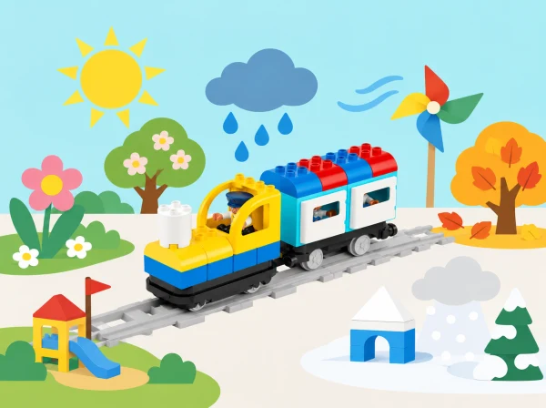

_Els símbols i les maquetes ajuden a parlar de l’oratge sense presentar una predicció fictícia com si fora real._

## ❓ Repte i intenció

L’alumnat crea un mapa de pati que pot canviar al llarg de l’any. Amb el tren Coding Express representa seqüències, opcions i parades; amb dades de calendari preparades pel docent, compara observacions i pren decisions de joc o disseny. Les targetes de sol, núvol, pluja i vent són models per conversar, no sensors ni prediccions meteorològiques.

## 🎯 Aprenentatges i vocabulari

- Interpretar targetes i registres d’oratge indicant-ne la data, la font i si són dades reals o simulades.
- Ordenar instruccions perquè una maqueta represente una decisió de disseny per al pati.
- Comparar una predicció amb les dades proporcionades i revisar l’explicació quan no coincideix.
- Distingir un model escolar d’una predicció meteorològica útil per a prendre decisions de seguretat.

## Abans de començar

Prepareu el tren, les vies i els blocs d’acció Coding Express, cartolina, peces de construcció, pictogrames d’oratge i targetes amb dades. La unitat oficial vincula algunes propostes a STEAM Park; aquesta adaptació permet substituir eixos materials per cartó, paper i elements escolars. Per a les activitats amb dades, useu observacions reals del centre amb data i font, o un conjunt fictici clarament etiquetat com a simulació. No feu una predicció per a decisions de seguretat: consulteu els avisos oficials amb les persones adultes responsables.

## 📅 Seqüència didàctica · 5 lliçons adaptades

### **Quatre estacions · Four Seasons (30–45 min).**

Després de llegir un àlbum il·lustrat propi o de lliure ús sobre les estacions, compartiu observacions locals del sol, la temperatura percebuda, la pluja, les plantes i les activitats del pati al llarg de l’any. Classifiqueu complements de joguet o targetes (abric, capell, impermeable, cantimplora) per estació i compteu quants n’hi ha de cada categoria. Repartiu les quatre estacions entre grups i construïu al costat de cada parada del tren un model d’una activitat possible al nostre entorn —plantar a la primavera, buscar ombra en estiu o fer una activitat coberta en dies plujosos. Expliqueu quina observació justifica cada model i com podria canviar en una zona del món amb un clima diferent.

*Evidència:*

classificació i recompte, quatre escenes i justificació basada en observacions locals.

### **La roda de possibilitats · Probability (30 min).**

Comenceu amb una endevinalla de color i compareu què passa quan hi ha pistes amb una tria sense pistes. Creeu una ruleta de paper segura amb espais acolorits (per exemple, tres blaus i un de cada un dels altres tres colors) o una bossa transparent amb la mateixa distribució. Abans de cada tirada, cada grup prediu quin color eixirà i marca la seua resposta; després fa girar/traure una vegada i registra el resultat en una taula pictogràfica. Després de diverses proves, compteu les marques, compareu freqüències i parleu de quin color és més probable en aquest model perquè té més espais, sense assegurar quin serà el resultat següent. En cinc torns, arreplegueu peces de cada color que haja eixit i useu-les per construir una composició comuna. El tren pot visitar una parada per resultat, però no és un pronosticador.

*Evidència:*

prediccions, registre de cada prova, recompte final i explicació «té més possibilitats perquè…».

### **Preparem un personatge davant d’un avís · Mr. Bear’s Forecast (60–90 min).**

Converseu sobre per què ajuda una previsió i per què de vegades no coincideix exactament amb el que observem. L’adult mostra una notícia o avís meteorològic oficial, datat i triat per al context local; el grup identifica quin perill general s’hi descriu i quina informació voldria preguntar a una persona experta. Amb una titella o figura de paper, trieu un escenari fictici d’oratge advers i representeu dues parts: què podria preparar el personatge abans i com seguiria les instruccions oficials de les persones adultes si l’episodi arriba. Construïu una escena amb peces, cartó o dibuixos i presenteu-la a un altre equip, que pot fer preguntes. Inventeu també una eina o objecte que ajudaria el personatge dins del model. Aquesta activitat no crea consells d’emergència nous: per a la vida real s’apliquen les instruccions del centre i de les autoritats competents.

*Evidència:*

font i data de la informació, preguntes, model de preparació/resposta i explicació del que el model no pot decidir.

### **Què canvia quan arriba el sol? · Playground (30–45 min).**

Llegiu un relat breu sobre un pati amb zona d’arena, gespa i ombra. Amb observació supervisada, compareu una superfície del pati quan rep el sol i una zona semblant quan està a l’ombra; si no és possible eixir o el temps no ho permet, useu fotografies datades o un conjunt d’observacions preparat i identifiqueu-lo com a tal. Registreu què observeu, no toqueu superfícies calentes i no compareu sensacions corporals individuals. En una maqueta, representeu amb colors quines zones reben llum directa i quines queden protegides; expliqueu què us fa pensar que una zona s’escalfa més. Després prediu com canviaria l’ombra en un altre moment del dia i construïu un segon model. El tren serveix per visitar i descriure les zones, no per mesurar-ne la temperatura.

*Evidència:*

mapa observacional «sol/ombra», model amb llegenda i una predicció diferenciada de l’observació.

### **Ombra per a una figureta · Animal Shelter (30–45 min).**

Plantegeu el repte de protegir del sol una figureta d’animal; no s’usen animals reals. Abans de construir, pregunteu com sabrem si hi ha ombra suficient i acordeu un criteri observable: que la figura quede fora del feix de llum directa. En grups de dos o tres, esbosseu i munteu un refugi amb peces i materials corrents. Poseu-lo en una zona il·luminada de l’aula o a l’exterior supervisat, observeu l’ombra i feu un canvi per millorar la protecció. Si el centre disposa d’un termòmetre escolar segur, una persona adulta pot prendre mesures comparables dins/fora del refugi; no és un requisit ni s’infereix la temperatura només mirant el model. Finalment, afegiu una nova condició representada amb targetes —vent o pluja— i adapteu el disseny explicant quin compromís apareix.

*Evidència:*

esbós, criteri de prova, primera/segona observació i millora explicada.

## 📋 Avaluació i evidències

Recolliu la classificació/recompte de complements i escenes de les estacions; les prediccions i marques de cada prova probabilística; la font, data, preguntes i narració de preparació/resposta d’oratge advers; el mapa sol/ombra del pati; i el prototip de refugi abans/després de provar-lo. Observeu si l’alumnat diferencia dada observada, resultat aleatori, previsió i simulació; comunica què ha aprés amb un model; i introdueix una millora recolzada en un criteri visible.

## ♿ Més d’una manera de participar

Marqueu cada parada amb un pictograma gran i un color d’alt contrast; oferiu una via curta de demostració i peces fàcils d’agafar. Cada infant pot triar targetes, ordenar estacions, moure el tren, dictar una explicació o documentar la prova. Totes les activitats es poden fer amb observacions de calendari i escenaris de paper, sense eixir a l’exterior.

## 🔗 Unitat oficial i adaptació

Adaptació de les cinc lliçons de [Weather](https://education.lego.com/en-us/product-resources/coding-express/additional-lesson-plans/science-lessons/): Four Seasons, Probability, Mr. Bear’s Forecast, Playground i Animal Shelter. La pàgina resum anuncia quatre lliçons, però el PDF oficial n’enumera cinc; aquesta fitxa cobreix les cinc. S’han creat contextos, targetes, proves i il·lustració originals, i s’han substituït els materials addicionals de STEAM Park per recursos d’aula.
