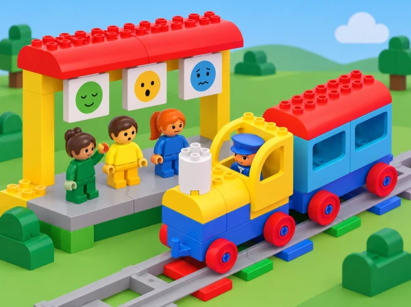

_El personatge és fictici; les targetes no associen una emoció a un color determinat._

## ❓ Repte i intenció

La classe crea una història local breu sobre una erugueta de ficció que visita l’hort escolar, juga, espera, es cansa i demana companyia. El tren Coding Express fa de suport narratiu; en l’app, el grup observa com es pot canviar el comportament associat als maons d’acció. Després representa moments del relat amb escenaris i targetes pròpies.

La història no és una prova per descobrir emocions reals: una expressió dibuixada no permet saber amb certesa com se sent una persona. El grup pot proposar lectures diferents, basar-les en pistes del relat i decidir quines formes de suport tindrien sentit per al personatge.

## 🎯 Objectius i criteris

- Ordenar esdeveniments d’un conte i diferenciar allò que passa d’allò que interpretem.

- Explorar amb l’app com es configuren els comportaments vinculats als maons d’acció.

- Observar el tren en passar per maons de cada color i registrar el comportament configurat.

- Reconéixer emocions possibles en una figura de ficció sense assignar-ne una a cada color.

- Crear models i una història col·lectiva sobre amistat, descans i cura quotidiana.

- Explicar una decisió de configuració amb una pista narrativa i una observació del tren.

La lliçó oficial recomana paraules com *trist*, *enfadat*, *esternudar*, *saludable* i *jugar a fet i amagar*. Introduïu-les només si són útils per al conte i permeteu alternatives com «necessita una pausa» o «vol que l’acompanyen».

## 🧰 Preparació i materials

El pla LEGO està dissenyat per a l’app Coding Express i grups de fins a quatre infants. Prepareu un set Coding Express, dispositiu amb l’app compatible, una via curta, figura/personatge de la dotació si n’hi ha, targetes de cada maó d’acció i materials de construcció lleugers per als models. Comproveu abans de la sessió que l’app permet canviar els comportaments i que el tren i els maons responen com espereu. Si una versió de l’app no inclou la personalització, feu la part de configuració amb targetes i identifiqueu-la com a simulació en paper.

Prepareu una tira de quatre vinyetes per al conte, targetes amb la mateixa paleta neutra i expressions diferents, i una taula: «color/maó», «configuració triada», «què ha fet el tren», «moment del relat». Roteu els torns de qui configura, col·loca el maó, observa, narra i construeix. Amb una sola caixa, mentre un equip experimenta, la resta ordena el conte amb figures o pictogrames.

## 📅 Seqüència didàctica · 3 sessions de 40 minuts

### **Sessió 1 · Inventem la història de l’erugueta.**

Presenteu un personatge que recorre l’hort del centre. Al principi juga a buscar ombres i fulles; després d’una estona, s’atura, seu i busca companyia. El grup ordena quatre vinyetes i separa un fet observat («s’ha assegut») d’una interpretació possible («potser està cansada», «potser espera algú»). Afegiu diverses hipòtesis i pregunteu quina altra pista ajudaria a entendre la història, sense demanar que ningú parle d’una experiència pròpia.

Trieu dos moments que el tren puga representar i assigneu-los a un comportament que es puga observar en el model. El conte pot acabar amb una pausa, una invitació a jugar o un espai tranquil; no hi ha una resposta emocional correcta. **Evidència:** vinyetes ordenades, un fet i dues interpretacions possibles. **Suport:** proporcioneu vinyetes amb pictogrames ja preparats; **ampliació:** creeu una interpretació diferent a partir de la mateixa escena i justifiqueu-la amb una pista nova.

### **Sessió 2 · Configurem i observem el tren.**

Construïu un tram de via i col·loqueu-hi un maó d’acció de cada color que estiga present. Exploreu primer els botons de l’app i observeu com controlen el personatge. A continuació, canvieu el comportament configurat d’un maó, feu una predicció i passeu el tren per la via. Anoteu quin canvi heu fet i què ha fet el tren; repetiu amb un altre maó i canvieu el rol d’operació perquè més d’una persona puga provar-ho.

Compareu la configuració de l’app, el senyal físic i el resultat observat. La taula pot mostrar que un mateix color ha rebut comportaments diferents en dos equips; no representeu un color com si sempre significara «trist» o «content». La configuració és una regla del sistema i el sentiment és una lectura narrativa del personatge, no un diagnòstic. **Evidència:** dues files de registre amb predicció/configuració/resultat i una decisió de quin moment del conte pot representar cada comportament.

Si l’app no ofereix la funció en els dispositius del centre, mostreu amb targetes com s’hauria configurat i feu la passada del tren com una prova diferent; anoteu que el comportament no s’ha canviat dins de l’app. No digueu que el tren ha guardat dades de la configuració si no ho heu verificat amb aquesta versió.

### **Sessió 3 · Construïm models i conten entre totes.**

En equips, construïu dos o tres escenaris amb peces, cartó o pictogrames per representar moments diferents de la història. Ajunteu-los en una seqüència amb inici, canvi i final; decidiu en quin punt apareix cada comportament programat. Un equip narra i un altre comprova si el tren passa pel maó indicat i si el model construït ajuda a entendre el relat.

Tanqueu parlant de què podria fer una amistat quan un personatge de ficció està cansat o vol companyia: oferir repòs, preguntar què vol o compartir el joc. Accepteu més d’una resposta i no convertiu les estratègies en obligacions per a l’alumnat. Cada participant pot contar amb veu, targetes, pictogrames, gestos, dispositiu de comunicació o mostrant els models. **Evidència:** història completa, escenaris i una explicació sobre la relació entre configuració de l’app, maó i acció observada.

## 📋 Avaluació i evidències

Recolliu les vinyetes, les interpretacions, la taula de configuració, models i relat final. Observeu si l’infant:

- ordena esdeveniments i diferencia observació d’interpretació;

- segueix un torn de configuració i identifica què canvia a l’app;

- associa una observació concreta del tren amb un maó d’acció;

- representa més d’un moment narratiu sense fixar una emoció a un color;

- escolta una interpretació alternativa o crea un canal propi per a expressar la seua idea;

- proposa una forma de companyia o cura adequada al personatge del relat.

Feu anotacions descriptives i breus («ha canviat la configuració blava i ha vist que el tren…») en lloc de qualificar l’expressió emocional de l’infant. L’app pot emmagatzemar configuracions per representar el comportament dels maons: tracteu-ho com a dades del programa, no com a dades personals o afectives.

## ♿ Més d’una manera de participar

Oferiu un conte completament fictici, un final neutre o l’opció d’observar en silenci. Useu pictogrames, targetes de text, peces tàctils i expressions en el mateix color de paper per a evitar codis cromàtics rígids. Anticipeu sons, reduïu el volum o feu l’activitat sense so. Un infant pot participar com a narrador/a, constructor/a, operador/a, observador/a o responsable de les targetes.

Feu les proves amb via curta i tren a baixa velocitat. Manteniu els dits fora del tren i dels maons mentre es mou i pareu el model abans de reconfigurar-lo. No recolliu emocions, històries familiars ni informació personal de l’alumnat.

## 🔗 Referent oficial i adaptació

Adapta [Character – Caterpillar](https://education.lego.com/en-us/lessons/preschool-coding-express/character-caterpillar/), lliçó 5 de 8 de Coding Express, de 30–45 minuts per a PreK–K i dissenyada per a grups de fins a quatre infants. El pla oficial presenta una erugueta de colors amb moments de joc, cansament, descans i malaltia; construeix el personatge i la via; explora els botons de l’app i un maó de cada color; canvia els comportaments dels maons en l’app; conversa sobre emocions, crea models per a representar-les i combina’ls en una història sobre amistat i cura. També avalua si l’alumnat reconeix el canvi de comportament i comprén que l’app guarda dades per representar-lo. El conte de l’hort, les targetes, les bastides, les alternatives d’accés i la cautela sobre interpretacions emocionals són propis; la personalització real es verifica amb l’app del centre.
