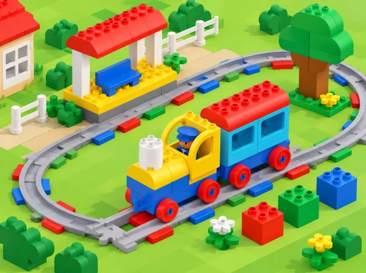

_El tren Coding Express de la dotació recorre una via amb una estació i maons d’acció de colors._

## ❓ Repte i intenció

La primera exploració de Coding Express introdueix les peces de construcció i els maons d’acció. En aquesta adaptació, el grup construeix una destinació pròpia de l’entorn pròxim —com el jardí de l’escola, una parada de mercat o el port—, planifica una seqüència perquè una passatgera hi arribe i compara les formes disponibles d’aturar el tren. Cada idea es prova amb el material real: el color no s’utilitza com a explicació fins que s’ha observat què fa la peça.

## 🎯 Aprenentatges i vocabulari

- Identificar les peces del set que s’han comprovat i construir una via estable en equip.
- Descompondre una ruta en ordres i anticipar l’arribada a una destinació de la maqueta.
- Provar les opcions d’aturada disponibles i registrar què fa realment cada maó.
- Explicar com l’evidència d’una prova confirma o modifica la seqüència prevista.

## Abans de començar

La lliçó LEGO està dissenyada per a grups de fins a sis. Prepareu vies suficients per a una línia de doble extrem que puga incloure l’estació i la destinació; la font suggereix huit trams, però adapteu el muntatge a la caixa real. Afegiu la figura de passatger, peces de construcció i els maons rojos i verds que efectivament estiguen disponibles. Feu una prova del tren i comproveu que la superfície siga plana, estable i fora del pas.

No cal disposar de targetes oficials de construcció: cada equip pot crear una destinació nova. Verifiqueu al manual la diferència entre els maons rojos disponibles, que poden no ser iguals, i no deduïu funcions només a partir del color. Si una de les tres modalitats d’aturada de la lliçó no forma part de la dotació, marqueu-la com a no disponible i investigueu les altres. No poseu mans, roba ni objectes davant d’un tren en moviment, ni bloquegeu rodes o motor per forçar-ne l’aturada.

**Vocabulari:** estació, destinació, passatger/a, trajecte, via de doble extrem, maó d’acció, aturar-se, predir i comprovar. Introduïu les paraules amb peces i moviments curts: «eixim», «avancem», «arribem» i «tornem».

## 📅 Seqüència didàctica · tres sessions de 40 minuts

### **Construïm la destinació i el trajecte (40 min).**

Activeu idees prèvies preguntant quan han vist un tren, tramvia o autobús i com saben on cal baixar. Qui no vulga compartir experiències pot triar una fotografia o un pictograma. Presenteu el joc del tren amb moviment en fila només si resulta còmode i segur per al grup; l’alternativa és moure una figura sobre una línia de caselles i usar senyals visuals de «avança» i «para».

En parelles, trieu un lloc pròxim o inventat i construïu-lo amb peces. Munteu l’estació, col·loqueu-hi la figura passatgera i prepareu una via de doble extrem entre estació i destí. Abans d’encendre el tren, representeu el trajecte amb el dit, peces o pictogrames i feu una predicció: on quedarà el tren?, què necessitarem per arribar-hi? Intercanvieu destinacions entre equips perquè cada grup prove també un model diferent.

*Evidència:* model construït, ruta representada i predicció del punt d’arribada. *Preguntes docents:* «Què és el principi de la ruta? Com sabrem que la passatgera ja ha arribat?»

### **Compareu maneres d’aturar el tren (40 min).**

En una via curta i a velocitat adequada, comenceu amb la modalitat d’aturada manual que s’ha aprés en la preparació bàsica; després proveu, d’una en una, el maó d’acció roig i el maó roig d’aturada si tots dos són a la dotació. Abans de cada intent, el grup col·loca una fitxa al punt on pensa que s’aturarà. La persona conductora executa la prova, la persona observadora assenyala el lloc real i la persona registradora marca el resultat amb una icona o una paraula.

Compareu observacions: s’ha aturat al mateix lloc de la predicció?, ha calgut una acció de la persona o l’ha provocada el maó?, quina diferència es veu entre les peces? Repetiu només quan necessiteu confirmar una observació. Si una peça no existeix en el kit, poseu una targeta «no disponible» al registre; no inventeu el seu comportament ni substituïu-la per una peça que no tinga la mateixa funció.

*Evidència:* taula visual «opció provada / predicció / què hem vist / punt d’aturada». *Preguntes docents:* «Què s’ha mantingut igual en cada prova? Quina prova dona suport a la vostra explicació?»

### **Allarguem el viatge i investiguem altres maons (40 min).**

Afegiu trams i una o dues parades pròpies, dibuixeu la nova ruta i ordeneu-ne les accions abans de circular. Situeu un maó verd, d’un en un, en un punt visible i segur. Observeu què fa al tren concret del centre i compareu-ho amb la resposta del maó roig. La pregunta no és endevinar el significat del color: és descriure el canvi que s’ha vist i pensar com ajuda a completar el viatge.

Proposeu el repte de tornar a l’estació. Els equips representen el camí de retorn, decideixen en quin sentit hauria d’anar el tren i proven una modificació cada vegada. Si la ruta no es completa, torneu al dibuix, localitzeu el darrer punt correcte i planifiqueu només el pas següent. Acabeu amb una ronda curta perquè cada equip explique una diferència observada entre peces i una decisió que ha canviat gràcies a la prova.

*Evidència:* ruta allargada, seqüència revisada i explicació basada en una observació real del maó verd. *Preguntes docents:* «Què ha passat després del maó? Quina part del nostre pla caldria canviar per tornar a l’estació?»

## 📋 Avaluació i evidències

Recolliu el model, la representació seqüenciada, la taula comparativa i una explicació final. Observeu si l’alumnat:

- coopera en la construcció de la destinació i la via;

- descriu una ruta amb principi i final en un ordre comprensible;

- anticipa on pararà el tren i compara la predicció amb el resultat;

- distingeix el comportament observat dels maons disponibles;

- fa servir una prova per confirmar, matisar o canviar una idea.

És suficient mostrar-ho amb gestos, fotografies de la seqüència, peces, pictogrames o paraules pròpies. Valoreu l’explicació i l’ús curós del material, no la complexitat del model ni la rapidesa de la construcció.

## ♿ Més d’una manera de participar

Useu trams de via grans i contrastats, demostreu l’acció peça per peça i oferiu fotos ampliades o una maqueta tàctil. Els rols de construcció, planificació, conducció i registre roten en cada prova; una persona pot dictar instruccions perquè una altra programe el tren. Permeteu resposta amb mirada, elecció entre pictogrames, gest o comunicació augmentativa. Manteniu l’alumnat a distància segura durant la marxa i oferiu l’opció d’observar en lloc d’acostar-se al moviment.

## 🔗 Referent oficial i adaptació

Adapta [First Trip](https://education.lego.com/en-us/lessons/preschool-coding-express/first-trip/), la lliçó inicial de Coding Express: construir estació i destinació, crear una via de doble extrem, guiar una passatgera fins al destí, comparar tres maneres d’aturar el tren i explorar després els maons verds i una ruta amb més parades. El jardí o la biblioteca, els pictogrames, el full de registre i les preguntes d’aula són propis; les accions dels maons s’han de verificar amb el model que té el centre.
