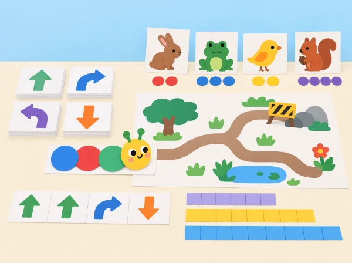
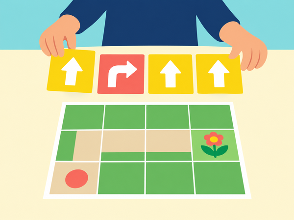

_Els reptes es resolen amb instruccions físiques, paper i cooperació, sense aplicació ni tren._

## 🌱 Situació, repte i intenció

Aquesta situació adapta les quatre lliçons desconnectades de Coding Express perquè es puguen fer amb paper, targetes i cooperació. El grup comprova si una altra persona pot seguir instruccions explícites, resoldre una desviació, interpretar un patró i comparar distàncies sense electricitat, pantalla, aplicació ni robot.

## 🎯 Aprenentatges i vocabulari

- Descompondre una història o un trajecte en instruccions ordenades i verificables.
- Detectar una instrucció ambigua, revisar-la i comprovar que una altra parella la pot executar.
- Representar una alternativa a una ruta i justificar-la amb un criteri acordat.
- Crear, repetir i modificar un patró sonor o visual, i mesurar recorreguts amb unitats iguals.

**Vocabulari:** instrucció, seqüència, patró, repetició, desviament, casella, unitat i depuració.

## 🧰 Materials i preparació

Prepareu targetes de fletxes i símbols, paper gran, retoladors, tires de paper de longitud igual, fitxes de colors, una figura plana i cinta adhesiva reposicionable. Deixeu un corredor lliure per als recorreguts corporals; ningú corre ni tanca el pas. Oferiu també una ruta de taula perquè es puga participar sense desplaçar-se.

## 📅 Seqüència didàctica · quatre sessions desconnectades

### Sessió 1 · L’eruga ordenada · Character—Caterpillar (30–35 min)

#### Fase 1 · Activem i prediem

Doneu a cada equip una figura d’eruga i quatre targetes d’acció. Inventeu una història curta amb inici, canvi i final; abans d’ordenar les targetes, cada equip prediu quines instruccions faran falta perquè una altra persona la puga representar.

#### Fase 2 · Explorem i construïm

Convertiu les accions en ordres visibles, com ara avançar una casella, girar o parar. Eviteu consignes vagues com «ves fins a l’arbre»: afegiu un símbol o un nombre de passos. Una persona que no ha creat la seqüència la segueix literalment.

#### Fase 3 · Expliquem i registrem

Compareu el final previst amb el que ha representat l’intèrpret. Marqueu l’ordre concreta on s’ha perdut i expliqueu què li faltava perquè fora reproduïble.

#### Fase 4 · Apliquem i millorem

Reescriviu només la instrucció ambigua i intercanvieu la seqüència amb una altra parella. Proveu si la nova versió condueix al mateix final sense ajuda oral de les persones autores.

#### Fase 5 · Comprovem i reflexionem

Guardeu la tira d’ordres i una anotació del canvi. **Evidència:** seqüència amb inici i final, seguida per una altra parella. **Pregunta docent:** quina informació ha fet que la instrucció es puga executar sense endevinar?

### Sessió 2 · Obres en la ruta · Journey—Trouble on the Road (30–35 min)

#### Fase 1 · Activem i prediem

Dibuixeu una quadrícula de 5×5 amb inici, destinació i una casella marcada com a obra. Predigueu quins moviments permeten arribar-hi sense passar per la zona tancada.

#### Fase 2 · Explorem i construïm

Escriviu una ruta inicial amb fletxes i, després, una alternativa. Una fitxa representa el tren i es mou una casella per instrucció; la persona observadora marca cada pas. La incidència és una targeta, no un obstacle físic a l’aula.

_Les targetes fan visible el programa abans que una persona execute la ruta i comprove si evita la zona tancada._

#### Fase 3 · Expliquem i registrem

Compteu els moviments de cada ruta i compareu si totes dues arriben a la destinació. Digueu quin criteri heu prioritzat: evitar l’obra, arribar-hi o reduir passos.

#### Fase 4 · Apliquem i millorem

Intercanvieu el mapa amb una altra parella perquè prove la ruta sense explicacions addicionals. Si la fitxa entra a la casella tancada o es perd, reviseu el tram exacte i canvieu una instrucció.

#### Fase 5 · Comprovem i reflexionem

Guardeu el mapa amb les dues rutes i els recomptes. **Evidència:** desviament executat pas a pas i justificat amb el criteri triat. **Pregunta docent:** una ruta amb més passos pot ser millor si evita la casella tancada?

### Sessió 3 · Concert d’animals · Music—Animal Concert (30–35 min)

#### Fase 1 · Activem i prediem

Trieu tres figures de paper i proposeu un símbol per al so o ritme de cadascuna. Predigueu què entendrà un altre equip en veure la llegenda, abans de fer cap interpretació.

#### Fase 2 · Explorem i construïm

Assigneu patrons gràfics —per exemple, dues marques curtes i una llarga— i ordeneu les targetes per crear una partitura. Es pot representar amb palmades suaus, instruments, veu o només símbols visuals.

#### Fase 3 · Expliquem i registrem

Un altre equip interpreta la partitura. Compareu què s’ha repetit, quin símbol ha canviat i si la llegenda permetia entendre l’ordre sense conéixer la història original.

#### Fase 4 · Apliquem i millorem

Canvieu una sola targeta i repetiu la interpretació. Qui prefereix silenci pot dirigir les icones o marcar visualment l’inici i el final del patró.

#### Fase 5 · Comprovem i reflexionem

Guardeu la partitura, la llegenda i el canvi identificat. **Evidència:** patró interpretat per una altra parella amb o sense so. **Pregunta docent:** què ha de mantindre’s perquè encara reconeguem el patró?

### Sessió 4 · Quina ruta és més llarga? · Math—Distance (30–35 min)

#### Fase 1 · Activem i prediem

Traceu dues rutes en la mateixa quadrícula entre els mateixos punts. Abans de mesurar, ordeneu-les de més curta a més llarga i acordeu si els girs compten com a trams.

#### Fase 2 · Explorem i construïm

Mesureu les dues rutes amb segments de paper de longitud igual. Marqueu on comença i acaba cada segment i escriviu el recompte amb la unitat emprada.

#### Fase 3 · Expliquem i registrem

Un segon equip verifica una ruta sense veure el recompte inicial. Si els resultats difereixen, localitzeu on s’ha començat o acabat un segment i comproveu que s’ha mantingut la mateixa convenció.

#### Fase 4 · Apliquem i millorem

Redacteu una instrucció de mesura que elimine l’ambigüitat i torneu a mesurar. Si el grup ja coneix la regla, compareu la unitat de paper amb una unitat convencional sense barrejar els dos recomptes.

#### Fase 5 · Comprovem i reflexionem

Guardeu les dues rutes, els recomptes i la unitat indicada. **Evidència:** comparació verificada per un segon equip. **Pregunta docent:** per què cal usar unitats iguals quan comparem dos recorreguts?

## 🧪 Evidències i avaluació

Prepareu una carpeta amb quatre artefactes: la història i la tira d’ordres; les dues rutes amb el registre de passos; la partitura i la llegenda; i la comparació de distàncies amb la unitat indicada. Valoreu si les instruccions són reproduïbles, si l’equip revisa una decisió concreta, si identifica què es manté en un patró i si mesura amb unitats consistents. La retroacció d’una altra parella ha d’assenyalar el punt exacte on s’ha perdut, sense substituir la solució de l’equip autor.

## ♿ Participació, accessibilitat i seguretat

Useu targetes grans amb formes i textures, instruccions d’un pas cada vegada i recorreguts asseguts sobre una quadrícula de taula. Permeteu participar amb gestos, selecció d’icones, dictat o demostració. En la sessió musical no cal produir sons: la partitura visual representa el patró completament en silenci. Manteniu lliure el corredor i no feu córrer l’alumnat.

## 🔗 Referents i adaptació

Adaptació original de [Unplugged Lessons de Coding Express](https://education.lego.com/en-us/product-resources/coding-express/additional-lesson-plans/unplugged-lessons/): *Character—Caterpillar*, *Journey—Trouble on the Road*, *Music—Animal Concert* i *Math—Distance*. Les quatre sessions es poden executar sense tren ni aplicació; les instruccions, històries, mapes, evidències i il·lustració són propis. La comparació opcional amb Coding Express es fa en un altre moment i no és requisit per completar aquesta situació.
