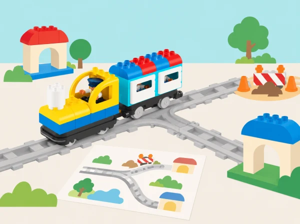

_Una bifurcació ofereix opcions: cal conéixer el mapa, justificar una tria i provar-la._

## ❓ Repte i intenció

Les quatre sessions amplien la seqüenciació amb observació del sistema, bifurcacions, planificació de desviaments i representació de rutes en un mapa. L’alumnat documenta què ha fet i què ha passat abans d’atribuir una causa. Les vies i blocs disponibles varien segons el set; es poden simular les alternatives amb targetes si el tren no permet controlar una bifurcació de manera directa.

## 🎯 Aprenentatges i vocabulari

- Llegir una ruta en un mapa i descompondre-la en trams i decisions verificables.
- Comparar dues alternatives davant d’una bifurcació o incidència representada.
- Provar una solució amb les vies i els blocs disponibles, o simular-la amb targetes si el set no la permet.
- Justificar una revisió del pla amb el resultat observat i distingir-la d’una funció que el robot no té.

## Abans de començar

Prepareu el tren Coding Express, vies i peces del vostre lot, targetes de direcció, cinta de paper per al mapa i obstacles tous separats de la via. Reviseu les instruccions del fabricant abans del muntatge. No forceu les unions ni poseu peces que bloquegen rodes o sensors. Si una funció no és present al kit, convertiu-la en una decisió humana amb targetes.

## 📅 Seqüència didàctica · 4 lliçons adaptades

### **Com funciona el sistema? · How Does It Work?**

#### Fase 1 · Activem i prediem

Mostreu el tren i pregunteu com creuen que interacciona amb la via i els maons. Dibuixeu una predicció sobre què passarà sense maó, fora de la via i quan passe per damunt d’un maó de color.

#### Fase 2 · Explorem i construïm

Observeu el tren en cadascuna d’aquestes condicions. Identifiqueu el sensor de color de la part inferior i diferencieu les parts físiques —tren, sensor, via i tauleta— del programa de l’app.

#### Fase 3 · Expliquem i registrem

Proveu l’app amb els maons disponibles i registreu què fa el tren. Expliqueu que el maquinari llig el color i que el programari n’indica la resposta.

#### Fase 4 · Apliquem i millorem

Amb el tren aturat, tapeu temporalment el sensor amb una cartolina fosca i feu una prova supervisada: prediu si podrà llegir els maons, comproveu-ho a baixa velocitat i retireu la cartolina quan el tren estiga parat.

#### Fase 5 · Comprovem i reflexionem

**Evidència:** dibuix abans/després, vocabulari maquinari–programari–sensor–app i explicació de la prova. Què ha canviat respecte de la predicció?

### **La bifurcació del barri · Y-Shaped Track.**

#### Fase 1 · Activem i prediem

Comenceu amb un joc de bitllets: anomeneu almenys tres parades de l’aula o la maqueta, poseu una fitxa de color a cada destinació i doneu un bitllet del mateix color a cada passatger. Predigueu quin ramal correspondrà a cada bitllet.

#### Fase 2 · Explorem i construïm

Construïu una via Y amb dues o més parades i col·loqueu maons d’acció perquè el tren es puga aturar. Verbalitzeu la condició «si el bitllet és de ___, aleshores anem a ___».

#### Fase 3 · Expliquem i registrem

Per torns, feu de conductor movent la palanca roja de la via per seleccionar la branca. Una persona comprova si el bitllet, la palanca i la destinació coincideixen; la resta descriuen el trajecte i el representen en un mapa.

#### Fase 4 · Apliquem i millorem

Com a ampliació, proveu els dos desviaments per crear una tercera branca o una Q i useu el maó verd disponible per representar el retorn a altres parades. Compareu la via Y amb una de bucle i una de doble extrem.

#### Fase 5 · Comprovem i reflexionem

**Evidència:** parelles bitllet–destinació, instrucció condicional i mapa dels camins provats. Quines parts de la decisió depenen de la persona que mou l’agulla?

### **Obres en el camí · Journey—Trouble on the Road.**

#### Fase 1 · Activem i prediem

Converseu sobre què recorden els senyals i interpreteu els quatre senyals de trànsit inclosos en el set. Representeu decisions a escala de maqueta, sense córrer ni simular perills reals.

#### Fase 2 · Explorem i construïm

Al costat d’una via Y i de models propis, col·loqueu a l’atzar els maons d’acció. Connecteu el tren a l’app i exploreu-ne els botons abans de començar el recorregut.

#### Fase 3 · Expliquem i registrem

Feu circular el tren per torns. Quan aparega un problema fictici en l’app o una targeta d’incidència, identifiqueu què ha passat i registreu la predicció, el senyal triat i la resposta observada.

#### Fase 4 · Apliquem i millorem

Proveu la resposta, empreu tots els senyals en una nova ronda i inventeu-ne un de propi amb un model o pictograma. Poseu-lo al mapa i justifiqueu-ne la ubicació.

#### Fase 5 · Comprovem i reflexionem

**Evidència:** incidència, senyal triat, predicció, resposta observada i explicació de per què la ubicació ajuda. La maqueta no és una guia viària real.

### **Un mapa per compartir · Story Maps.**

#### Fase 1 · Activem i prediem

Llegiu un relat breu propi o de lliure ús i identifiqueu-ne personatges, escenari, inici, nus i desenllaç. Predigueu quines accions del tren poden representar els esdeveniments.

#### Fase 2 · Explorem i construïm

Ompliu un mapa de conte amb una fila per esdeveniment: què passa, quina acció ha de fer el tren i quin maó o tram de via la provoca. Trieu la forma de la via i col·loqueu els maons necessaris; per exemple, el maó blanc activa o desactiva els llums si així ho confirma el kit.

#### Fase 3 · Expliquem i registrem

Proveu de contar la història seguint el pla. Registreu si l’acció observada coincideix amb el que volíeu i on es produeix qualsevol diferència.

#### Fase 4 · Apliquem i millorem

Si la resposta no coincideix, depureu una decisió cada vegada —ordre d’escenes, ubicació del maó o instrucció— i torneu a executar-la. Després, creeu en grups un relat nou; qui necessite suport pot partir d’un mapa parcial amb personatge, lloc i colors d’accions suggerits.

#### Fase 5 · Comprovem i reflexionem

Intercanvieu els mapes perquè un altre equip conte la història sense explicacions addicionals. **Evidència:** mapa d’esdeveniments, seqüència tren–acció–maó, una errada corregida i retorn del grup lector.

## 📋 Avaluació i evidències

Recolliu els esquemes del sistema, mapes de bifurcació, desviaments i relats cartografiats. Valoreu si l’equip identifica parts i relacions, considera més d’una ruta, prova una decisió amb seguretat i comunica instruccions reproduïbles. Registreu també quina limitació del model encara no s’ha resolt.

## ♿ Més d’una manera de participar

Reduïu el mapa a dos camins ben diferenciats i useu símbols tàctils o amb alt contrast. Es pot dirigir el tren, col·locar targetes, contar el relat o comprovar el mapa amb un itinerari de fitxa. Doneu temps de planificació i permeteu assajar sense moviment quan aquest siga una barrera.

## 🔗 Unitat oficial i adaptació

Adaptació de les quatre lliçons de [Advancing with Coding Express](https://education.lego.com/en-us/product-resources/coding-express/additional-lesson-plans/computer-science-lessons/): How Does It Work?, Y-Shaped Track, Journey—Trouble on the Road i Story Maps. Els reptes mantenen investigació, bifurcació, desviament i mapatge amb exemples i recursos propis, ajustats al kit real del centre.
