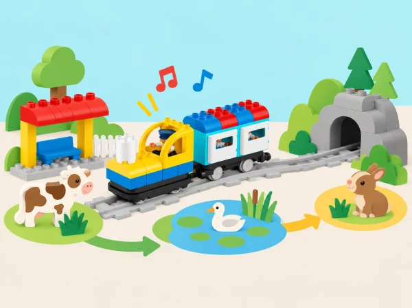

_Una mateixa ruta pot explicar històries diferents si canviem l’ordre, les parades o els sons._

## ❓ Repte i intenció

El grup és l’equip de guionistes d’una estació: planifica recorreguts, reconstrueix una seqüència recordada, associa sons a esdeveniments i crea relats repetibles. Cada equip fa una predicció abans de provar el tren i revisa l’ordre si el resultat no correspon al relat previst.

## Abans de començar

Prepareu Coding Express amb via, locomotora, vagons i blocs d’acció disponibles; targetes amb imatges, objectes menuts i un espai tranquil per escoltar sons. Comproveu quines funcions de so ofereix el vostre set i no pressuposeu una funció que no hi siga: quan calga, una persona pot fer el so o es pot usar una targeta. Els relats són inventats i no necessiten pantalles ni enregistraments.

## 📅 Seqüència didàctica · cinc sessions de 40 minuts

Cada sessió adapta una lliçó de la unitat oficial d’introducció a la seqüenciació. L’ordre manté la progressió de recordar, planificar, associar sons, reconéixer repeticions i comunicar un relat complet. Ajusteu el temps de presentació segons el grup; no cal acabar totes les proves en una mateixa sessió.

### **Memòria de les parades · Memory Game (40 min).**

Prepareu una seqüència de tres imatges conegudes —estació, jardí i font, per exemple— i mostreu-la durant uns segons. Amagueu-la i convideu el grup a reconstruir l’ordre amb targetes. Pregunteu quina estratègia ha ajudat a recordar: repetir en veu baixa, agrupar dues imatges o associar-ne una amb una acció. Feu una segona ronda amb quatre targetes només si el grup està preparat.

Traslladeu una seqüència a la via com a parades d’una història i feu que una altra parella la reconstruïsca abans de posar el tren en marxa. Compareu la seqüència recordada amb l’original; si hi ha una diferència, descriviu-la sense qualificar-la com a fallada personal. *Evidència:* seqüència inicial i reconstruïda, més una estratègia de memòria explicada o assenyalada. *Pregunta docent:* «Quina pista t’ha ajudat a recordar què venia després?»

### **El primer viatge · First Trip (40 min).**

Dibuixeu una estació d’eixida i una destinació del barri o del paisatge local, com l’horta, una biblioteca o una parada del mercat. Construïu un trajecte curt amb els materials reals del kit i una figura passatgera. Abans d’usar el tren, l’equip representa les accions necessàries amb targetes, fletxes o gestos: eixir, avançar, arribar. Cada persona prediu on quedarà el tren i quina acció indicarà la parada, basant-se en peces que el grup haja comprovat.

Executeu el viatge i compareu-lo amb el pla. Si la destinació no s’assoleix, localitzeu l’últim punt correcte i canvieu una sola instrucció o una sola peça. Repetiu i demaneu a una altra parella que descriga el procediment. *Evidència:* mapa, pla inicial, predicció i correcció d’una instrucció amb justificació. *Pregunta docent:* «Què ha passat primer? En quin punt hem vist que calia revisar el pla?»

### **Un tren amb veu · Train Sound (40 min).**

Trieu tres esdeveniments d’una història pròpia i associeu a cada un una targeta i un so breu: activitat del mercat, pluja sobre una teulada imaginària, un ocell del conte o un avís d’arribada. Feu primer una llegenda visual so-esdeveniment i practiqueu la seqüència amb la veu, un instrument suau o un gest. No imiteu sons d’animals com si foren identificacions científiques i no cal enregistrar cap participant.

Si el set i l’app disponibles tenen una funció de so adequada, proveu-la i compareu-la amb la representació humana; anoteu què és propi del tren i què és una decisió artística del grup. Si no, una persona pot fer els sons en directe mentre una altra condueix, o substituir-los per pictogrames. *Evidència:* llegenda, seqüència de tres esdeveniments i registre breu d’una semblança o diferència. *Pregunta docent:* «Com podem saber a quin moment de la història correspon aquest so?»

### **Una cançó que es repeteix · Are You Sleeping? (40 min).**

Escolteu o reciteu una cançó coneguda pel grup amb una frase que torne. Marqueu-ne les parts amb símbols: A per al fragment repetit i B per a la part que canvia. Si cap cançó compartida és adequada, creeu una tornada original amb paraules o pictogrames. Ordeneu les targetes i expliqueu què vol dir que un fragment «torna».

Representeu la forma amb una ruta curta, figures o una seqüència de maons d’acció compatibles amb la dotació; no pressuposeu que Coding Express té una ordre de bucle programable. Compareu dues versions on només canvia una estrofa i identifiqueu què es manté igual. *Evidència:* partitura visual A/B, fragment repetit assenyalat i explicació de la variació. *Pregunta docent:* «Quina part es repeteix i quina part conta una cosa nova?»

### **Viatge per veure animals · Trip to See Animals (40 min).**

Trieu tres animals mitjançant imatges o figures i imagineu una visita respectuosa a una exposició de natura feta de paper. Parleu de mirar sense molestar ni capturar animals i de distingir un animal real d’un personatge inventat. L’equip crea una narració amb inici, dues parades i final; per a cada parada decideix què descobreix el personatge i quina imatge, frase, gest o so la representa.

Ordeneu el recorregut en un mapa, feu una predicció de la seqüència i presenteu-lo a un altre grup sense explicar-li abans l’ordre. Els oients reconstrueixen la història amb targetes i indiquen quin indici els ha ajudat. Reviseu el mapa o el relat si una parada no s’entén i torneu a provar-lo. *Evidència:* història seqüenciada, mapa llegible, comentari d’un altre equip i una millora adoptada o descartada amb raó. *Pregunta docent:* «Què ha ajudat el públic a seguir la història? Què canviaríeu perquè les parades s’entenguen millor?»

## 📋 Avaluació i evidències

Guardeu una evidència de cada lliçó: seqüència de memòria, primer pla de ruta, llegenda sonora, patró repetit i mapa narratiu final. Observeu si l’alumnat:

- ordena tres o més esdeveniments i pot explicar o mostrar una pista que l’ha ajudat;

- anticipa el resultat d’una seqüència i localitza on cal revisar-la després d’una prova;

- associa un so, gest o símbol a un esdeveniment del relat;

- identifica un fragment que es repeteix sense confondre’l amb una ordre de bucle del robot;

- comunica un procediment perquè una altra persona el puga reconstruir.

Una ruta diferent és vàlida si el relat es manté comprensible i l’equip pot justificar les decisions. Registreu observacions breus durant les converses, no sols el producte final.

## ♿ Més d’una manera de participar

Feu servir pictogrames grans, recorreguts amb poques parades i anticipació visual dels canvis de so. Oferiu rols de narració, ordenació, moviment del tren, observació i registre del mapa. Es pot respondre parlant, assenyalant, triant imatges, amb comunicació augmentativa o dictant a una companya. Si els sons són una barrera, substituïu-los per símbols o gestos acordats; si el moviment del tren distreu, primer representeu tota la seqüència a taula amb fitxes. Deixeu que cada participant trie si vol presentar en grup gran o fer una demostració a una sola parella.

## 🔗 Unitat oficial i adaptació

Adaptació de les cinc lliçons de [Introduction to Sequencing](https://education.lego.com/en-us/product-resources/coding-express/additional-lesson-plans/computer-science-lessons/): Memory Game, First Trip, Train Sound, Are You Sleeping? i Trip to See Animals. Es conserven els objectius d’ordenació, anticipació, so i narrativa; els escenaris, instruccions, proves i il·lustració són originals i s’ajusten als materials reals del kit.
