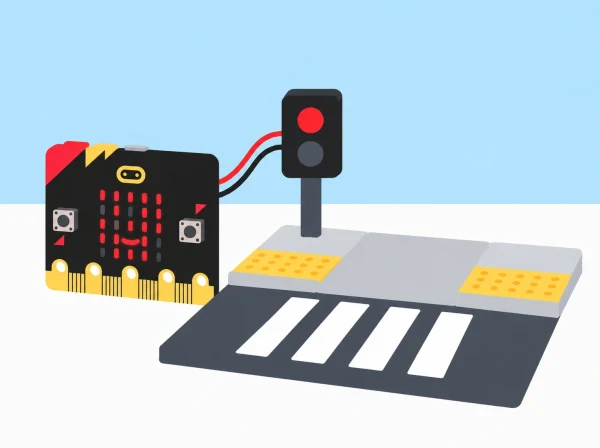

_És una maqueta per estudiar comunicació i accessibilitat; no controla ni valida un pas real._

## 🏙️ Repte, context i aprenentatges

Els equips estudien un recorregut pròxim al centre a partir de fotografies autoritzades, mapes o observació des d’un lloc segur amb permís escolar. Identifiquen elements que ajuden a orientar-se i possibles barreres físiques o d’informació, sense atribuir necessitats a persones que no han participat. Després creen una maqueta de pas urbà i programen una micro:bit perquè represente dos estats acordats amb icones de la matriu LED. Si la placa i els accessoris ho permeten, afegeixen so com a canal complementari.

El projecte no instal·la un semàfor, no guia persones al carrer i no afirma resoldre necessitats de mobilitat o visió. Una micro:bit sola no és un senyal homologat, no detecta si el pas està lliure i no pot garantir que siga segur travessar. La finalitat és practicar disseny inclusiu, programació d’entrades i eixides, i avaluació de prototips a escala.

## 🎯 Aprenentatges i vocabulari

observar sense inferir experiències alienes, definir un repte, programar estats amb esdeveniments, comparar formes d’informació, construir una maqueta llegible, provar-la amb observadors voluntaris i comunicar límits d’un prototip.

## 🧰 Materials i compatibilitat

Prepareu micro:bit de la dotació, portapiles o USB, MakeCode, cartró i paper per a la maqueta, pictogrames, material tàctil de manualitats, targetes de prova i full de registre. Identifiqueu si cada placa és V1 o V2 abans de programar so. La matriu 5×5 i els botons funcionen com a sortida i entrada bàsiques; la placa V2 incorpora altaveu. La V1 necessita una eixida d’àudio compatible, com un altaveu o auriculars connectats correctament als pins, i qualsevol cablejat s’ha de preparar i supervisar per una persona adulta.

Si no sabeu quina versió teniu, dissenyeu primer una resposta visual i useu targetes o un senyal oral separat per comparar canals; no carregueu blocs exclusius de V2 en una placa V1. La guia de MakeCode indica que aquests blocs poden mostrar un error 927 en hardware V1. No cal afegir accessoris per completar el nucli de l’activitat.

**Vocabulari:** entrada, estat, esdeveniment, pictograma, contrast, canal visual, canal sonor, prototip, accessibilitat, observació i validació. «Més d’un canal» no significa que tots els canals siguen adequats per a totes les persones; es tracta d’oferir alternatives i demanar retorn amb respecte.

## 📅 Seqüència didàctica · sis sessions de 45 minuts

### **Observem el recorregut i fem preguntes (45 min).**

#### Fase 1 · Activem i prediem

Useu un mapa de l’entorn escolar o fotografies que no mostren cares, matrícules, rutes de casa ni informació identificable. Predigueu quina informació es pot observar directament i quina exigiria consultar persones usuàries i el context.

#### Fase 2 · Explorem i construïm

Si l’escola autoritza l’observació exterior, feu-la des d’un recorregut segur, amb supervisió i sense interrompre cap vianant. Registreu només elements visibles: pas, vorera, desnivell, senyal, semàfor existent o informació llegible. També podeu treballar amb el mapa o fotografies autoritzades.

#### Fase 3 · Expliquem i registrem

Separeu fets de preguntes: «hi ha una vorada» és una observació; «impedeix passar a qualsevol persona amb cadira de rodes» requeriria consultar persones usuàries i context. Formuleu preguntes abordables a escala, com «com indiquem en una maqueta que l’estat ha canviat?». Registreu dues preguntes amb llenguatge prudent.

#### Fase 4 · Apliquem i millorem

Reviseu les preguntes per evitar atribuir experiències a persones que no han participat. No simuleu ceguesa, no demaneu a ningú fingir una discapacitat i no assumiu que una persona represente un grup sencer.

#### Fase 5 · Comprovem i reflexionem

Compartiu què heu vist directament i quina informació necessitaríeu d’una persona usuària que vulga participar. **Evidència:** mapa d’observacions i dues preguntes de disseny. **Pregunta docent:** què hem vist directament i què necessitaríem saber abans de fer una afirmació més àmplia?

### **Definim els dos estats del model (45 min).**

#### Fase 1 · Activem i prediem

Descriviu què hauria de comunicar una maqueta quan canvia d’estat. Trieu dos estats ficticis, per exemple «espera» i «simulació de canvi», i predigueu quina entrada —botó A o B— activarà cadascun.

#### Fase 2 · Explorem i construïm

Construïu una maqueta de taula amb carrer, voreres i pas dibuixat. Les textures tàctils són recursos per representar materials, no una guia de dimensions normatives. Afegiu l’etiqueta visible «PROTOTIP ESCOLAR — NO S’UTILITZA AL CARRER». Esbosseu senyals amb més d’una representació: icona LED, targeta física i, només si el model ho admet, un to breu.

#### Fase 3 · Expliquem i registrem

Especifiqueu els dos estats, les entrades i els canals triats i justifiqueu-los. Anoteu com sabrà l’observador que és una simulació; eviteu símbols confusos amb un semàfor real o instruccions com «creua ara».

#### Fase 4 · Apliquem i millorem

Compareu els esbossos i reviseu qualsevol canal que no siga necessari o que puga resultar inadequat. El so no és necessàriament accessible en tots els entorns; el silenci o la targeta també són opcions.

#### Fase 5 · Comprovem i reflexionem

Expliqueu quina acció canvia l’estat i com es comunica el caràcter simulat del prototip. **Evidència:** maqueta inicial i especificació d’estats, esdeveniments i canals amb justificació. **Pregunta docent:** com pot saber una persona observadora que la mostra és una simulació?

### **Programem i provem la micro:bit (45 min).**

#### Fase 1 · Activem i prediem

Abans de programar, una persona llig els esdeveniments previstos i una altra anticipa quina resposta hauria d’aparéixer en cada estat. Comproveu la versió de la placa abans d’incloure so.

#### Fase 2 · Explorem i construïm

En MakeCode, associeu el botó A a una icona pròpia per a «espera» i el botó B a una altra per a l’estat simulat. Proveu la matriu LED amb la llum real de la sala i reviseu que les icones siguen diferents i simples. Si useu so, comproveu l’eixida: altaveu integrat en V2 o accessori compatible en V1. Manteniu un volum moderat i una opció de silenci; el so no ha de ser l’única diferència entre estats.

#### Fase 3 · Expliquem i registrem

Una parella llig el codi, una altra prem els botons en l’ordre de prova i una tercera anota resposta esperada i observada. Incloeu almenys quatre proves i registreu també què ocorre després d’un reinici.

#### Fase 4 · Apliquem i millorem

Reviseu les icones o els esdeveniments si la resposta no és clara. Torneu a provar les entrades i comproveu si la pantalla conserva o esborra el senyal després del reinici.

#### Fase 5 · Comprovem i reflexionem

Expliqueu quina entrada ha activat cada resposta i què veuria o sentiria algú que encara no coneix el codi. **Evidència:** programa amb dos esdeveniments, taula de quatre o més proves i una revisió. **Pregunta docent:** quina entrada ha activat la resposta i com ho sabem?

### **Construïm el prototip a escala (45 min).**

#### Fase 1 · Activem i prediem

Reviseu l’especificació dels estats i predigueu si es podrà entendre el model sense que un membre de l’equip l’explique. Identifiqueu quina part és el dispositiu i quina representa el carrer.

#### Fase 2 · Explorem i construïm

Useu cartró reutilitzat per fer el carrer i suports independents per a la placa. Manteniu micro:bit i piles fora de qualsevol zona que puga mullar-se o quedar comprimida. Col·loqueu el prototip a una altura visible per a observadors asseguts i dempeus, si és viable. El paviment tàctil es pot representar amb paper rugós o peces, identificat com a símbol.

#### Fase 3 · Expliquem i registrem

Afegiu una llegenda dels símbols i documenteu l’etiquetatge del prototip, el suport de la placa i les alternatives de representació. No feu afirmacions de compliment normatiu a partir d’una maqueta escolar.

#### Fase 4 · Apliquem i millorem

Comproveu que targetes, icones i estats no es contradiguen. Si useu color, afegiu també una forma o paraula llegible perquè la interpretació no depenga només de distingir colors.

#### Fase 5 · Comprovem i reflexionem

Demaneu a una altra parella que interprete la maqueta sense explicació prèvia i anoteu què ha entés. **Evidència:** maqueta amb etiqueta de prototip, placa fixa, llegenda i retorn inicial. **Pregunta docent:** es pot entendre el model sense que l’equip l’explique?

### **Fem proves d’ús sense simular discapacitats (45 min).**

#### Fase 1 · Activem i prediem

Convidem companys o personal del centre a observar voluntàriament el prototip i descriure què entenen. Expliqueu que no se’ls assignarà cap diagnòstic ni se’ls demanarà parlar en nom d’una comunitat.

#### Fase 2 · Explorem i construïm

Registreu interpretació dels pictogrames, visibilitat des de dos punts i si el so resulta molest. Si participa una persona amb experiència d’accessibilitat, acordeu abans què vol revisar i respecteu el dret a no donar consell. Registreu comentaris d’eixes persones concretes, no com a prova universal.

#### Fase 3 · Expliquem i registrem

Descriviu literalment què ha dit cada observador i separeu-ho de les conclusions de l’equip. Identifiqueu què no es pot generalitzar a partir d’aquesta prova.

#### Fase 4 · Apliquem i millorem

Reviseu un element a partir del retorn: mida de la icona, contrast, seqüència, etiqueta o canal opcional. Si apareix una preocupació de seguretat real, comuniqueu-la al personal responsable del centre perquè use els canals establits; no intenteu resoldre-la amb el prototip.

#### Fase 5 · Comprovem i reflexionem

Compareu el prototip inicial i el revisat i indiqueu quina limitació continua oberta. **Evidència:** comentaris anònims, canvi documentat i limitació identificada. **Pregunta docent:** què ha dit cada observador i què no podem generalitzar?

### **Presentem el disseny i la seua frontera d’ús (45 min).**

#### Fase 1 · Activem i prediem

Prepareu una exposició amb maqueta, diagrama de blocs, prova d’entrades i canvis fets després del retorn. Predigueu quines preguntes podria fer el públic sobre l’ús real del prototip.

#### Fase 2 · Explorem i construïm

Demostreu els estats només sobre la maqueta i amb l’etiqueta de prototip a la vista. Incloeu les condicions d’ús: escala escolar, no connectat a infraestructures, no instal·lable al carrer, no certifica accessibilitat i no determina que siga segur travessar.

#### Fase 3 · Expliquem i registrem

Expliqueu quin problema de programació s’ha resolt i què queda fora de l’abast. Registreu en un cartell quines validacions requeriria una solució real: disseny professional, consulta de les persones afectades, revisió normativa i autorització de l’administració responsable.

#### Fase 4 · Apliquem i millorem

Useu les preguntes del públic per aclarir el diagrama o la descripció dels límits. No cal que l’alumnat proveïsca les validacions professionals per acabar la situació.

#### Fase 5 · Comprovem i reflexionem

Presenteu la versió final i expliqueu quines decisions reals no es poden prendre amb aquesta placa. **Evidència:** presentació, codi, registre de proves i llista de validacions fora de l’abast escolar. **Pregunta docent:** quin problema de programació hem resolt i quines decisions reals continuen fora del model?

## 📋 Avaluació i evidències

Recolliu mapa d’observació, definició d’estats, programa, registre de proves i presentació de límits. Observeu si l’alumnat:

- separa observacions pròpies d’inferències sobre les necessitats d’altres persones;

- programa entrades i sortides identificables per als dos estats del prototip;

- ofereix representacions complementàries i considera la versió concreta de la placa;

- usa comentaris voluntaris per revisar el disseny sense generalitzar-los;

- explica clarament per què la maqueta no és un dispositiu de seguretat real.

No s’avalua si el prototip resol necessitats d’una persona amb discapacitat ni si seria apte per a l’espai públic. S’avaluen el procés de disseny, la programació i la qualitat de la reflexió crítica.

## ♿ Participació, privacitat i seguretat

La participació de persones usuàries és voluntària i no es grava ni se n’arrepleguen dades personals. No feu jocs de rol de discapacitat. Oferiu instruccions anticipades, icones amb bon contrast, formats tàctils de maqueta i alternatives a l’àudio. Es pot contribuir amb cartografia, programació, construcció, observació o presentació. Qualsevol recorregut exterior necessita permís del centre i supervisió; la maqueta no s’instal·la ni es prova en un pas real. La placa i els cables es mantenen fora de l’aigua i de les zones de pas.

## 🔗 Referències tècniques i adaptació pròpia

La pantalla 5×5 i els esdeveniments dels botons són funcions programables de micro:bit. La [referència MakeCode sobre micro:bit V2](https://makecode.microbit.org/device/v2) especifica quins blocs són exclusius d’aquesta versió i l’error 927 en hardware V1. La [guia oficial micro:bit sobre accessibilitat visual](https://www.microbit.org/accessibility/visual-impairment/) descriu opcions d’eixida de so segons versió i accessori. El repte, la maqueta, els estats, les proves i els materials són propis; abans d’usar àudio, comproveu sempre la placa disponible.
