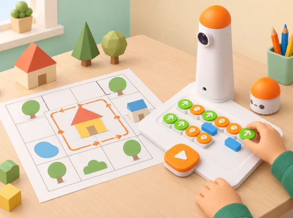

_El Coding Set i MatataBot acompanyen un mapa de caselles amb una casa geomètrica i una ruta tancada._

## ❓ Repte i intenció

En quatre sessions, l’alumnat investiga com els moviments i els girs creen figures, escriu programes repetits i transforma cartró net de rebuig en una maqueta col·lectiva. La casa combina un contorn quadrat, un sostre triangular i una porta quadrada més menuda. Cada equip construeix i prova almenys quatre contorns; el treball manual amb tisores i cinta és una part de disseny i reutilització, no un requisit perquè MatataBot dibuixe directament.

## 🎯 Aprenentatges i vocabulari

- Construir un recorregut que represente els costats d’un quadrat i distingir moviment recte i gir.
- Compondre una casa amb formes geomètriques i explicar com s’ha obtingut cada contorn.
- Usar cartró recuperat per crear una maqueta i relacionar-la amb el dibuix programat.
- Canviar una forma, tornar a provar el programa i defensar el disseny amb una evidència.

## 🧰 Materials i preparació

Prepareu Coding Set complet, quadrícula pròpia, paper quadriculat o cartó pla gran, retalls nets de capses, llapis i llapis de colors, cinta o cola, tisores d’aula, regle, plantilla d’angles de 60°, 90° i 120°, targetes amb moviments i bucles i una graella de registre. Si el centre disposa de l’Artist Add-On, podeu fer el traçat amb l’accessori després de comprovar la fixació i el lliscament; si no, MatataBot recorre les línies de caselles i l’alumnat trasllada el disseny al paper. Les dues opcions treballen el mateix raonament geomètric. Trieu cartró net, sec, sense grapes ni vores esmolades, i talleu-lo amb supervisió.

Feu una prova de calibratge curta per comprovar quant avança MatataBot amb una ordre i com l’angle programat afecta la direcció. No pressuposeu que cada costat dibuixat coincideix amb una casella exacta. Marqueu el punt inicial i l’orientació del robot en cada intent.

## 📅 Seqüència didàctica · quatre sessions de 45 minuts

### **Sessió 1 · El gir també dibuixa.**

#### Fase 1 · Activem i prediem

Observeu una casa feta amb figures geomètriques i distingiu costat, vèrtex, angle interior i trajectòria. Predigueu quin gir necessitarà el robot per passar d’un costat al següent.

#### Fase 2 · Explorem i construïm

Amb una fitxa que representa MatataBot, recorreu un quadrat i un triangle equilàter. Mesureu els angles interiors amb una plantilla i anoteu quant gira el robot quan passa d’un costat al següent.

#### Fase 3 · Expliquem i registrem

Programeu un costat recte i un gir; compareu un gir de 90° amb un de 120°. Dibuixeu i etiqueteu l’angle interior i el gir exterior.

#### Fase 4 · Apliquem i millorem

Expliqueu que en un triangle equilàter cada angle interior és 60° i que el gir exterior per continuar el contorn és 120°. En parelles, una persona prediu i l’altra col·loca els blocs; executeu i canvieu de rol.

#### Fase 5 · Comprovem i reflexionem

Completeu «el gir programat és … perquè l’angle interior és …». **Evidència:** dos croquis amb gir interior/exterior etiquetat i predicció comprovada.

### **Sessió 2 · Una casa és una composició de formes.**

#### Fase 1 · Activem i prediem

Dibuixeu una casa amb parets quadrades, sostre triangular i porta quadrada més menuda. Predigueu quants segments i girs caldran i decidiu on comença i acaba cada tram.

#### Fase 2 · Explorem i construïm

Prepareu la seqüència del quadrat, la del triangle i el trajecte que les combina. Representeu les ordres amb els blocs disponibles i, si cal, amb una notació pròpia de fletxes.

#### Fase 3 · Expliquem i registrem

Proveu com el bloc de bucle repeteix el patró costat–gir d’una forma regular. Compareu el programa amb i sense bucle i anoteu què es repeteix i què queda fora de la repetició.

#### Fase 4 · Apliquem i millorem

Si el robot no tanca el contorn, comproveu primer l’orientació i el nombre de repeticions; després reviseu la distància. Dibuixeu la seqüència final de la casa i la porta.

#### Fase 5 · Comprovem i reflexionem

**Evidència:** diagrama que relaciona forma, moviment, gir i repetició. Quina part del programa s’ha pogut simplificar amb el bucle?

### **Sessió 3 · Quatre cases amb cartró recuperat.**

#### Fase 1 · Activem i prediem

Classifiqueu retalls nets per mida i decidiu què es pot reutilitzar sense comprar material nou. Cada equip prediu quins elements de la casa podrà construir amb els retalls disponibles.

#### Fase 2 · Explorem i construïm

Dibuixeu quatre cases: conserveu les tres formes bàsiques però canvieu una variable —mida de la porta, orientació del sostre, proporció o decoració— i etiqueteu-les A–D.

#### Fase 3 · Expliquem i registrem

Proveu els quatre recorreguts sobre la graella o amb l’Artist Add-On disponible. Traslladeu els contorns al cartó i retalleu parets, sostres i portes d’acord amb les normes del centre.

#### Fase 4 · Apliquem i millorem

Reaprofiteu les portes retallades com a finestres, camins o peces de pati. Uniu les cases en un barri sense cobrir els recorreguts necessaris per a la prova.

#### Fase 5 · Comprovem i reflexionem

**Evidència:** quatre dissenys identificables, un programa provat i una nota sobre l’ús dels materials. Expliqueu quin retall heu pogut reutilitzar i com.

### **Sessió 4 · Canviem una forma i defensem el disseny.**

#### Fase 1 · Activem i prediem

Trieu un triangle rectangle o obtusangle i predigueu els girs necessaris per recórrer-ne el contorn. Identifiqueu quins angles es poden representar amb els blocs disponibles.

#### Fase 2 · Explorem i construïm

Construïu el traçat amb blocs quan siga possible. Si un valor no es pot programar exactament, completeu-lo amb una maqueta manual i identifiqueu clarament les dues representacions.

#### Fase 3 · Expliquem i registrem

Canvieu una variable cada vegada —llargària, gir, repeticions o punt d’inici— i registreu si el contorn es tanca i quantes ordres calen.

#### Fase 4 · Apliquem i millorem

Una altra parella llig el diagrama i intenta repetir el programa. A partir del resultat, reviseu una instrucció o expliqueu per què la versió actual és reproduïble.

#### Fase 5 · Comprovem i reflexionem

Mostreu el barri i expliqueu una decisió geomètrica, una reparació del codi i una manera de reduir residus. **Evidència:** programa final anotat, comentari d’un altre equip i justificació dels límits del dibuix o del kit.

## 📊 Registre i criteris d’avaluació

Per a cada figura, anoteu nom, costats, gir programat, angle interior previst, nombre d’ordres, si el contorn es tanca i canvi entre versions. Valoreu si l’equip descompon la casa en figures, diferencia gir exterior i angle interior, usa una repetició amb sentit, manté un punt d’inici i comprova una errada amb una prova, i explica què s’ha pogut reutilitzar. La precisió artística no és el criteri central: importa justificar l’estratègia i distingir el resultat del robot del dibuix manual que s’hi inspira.

## ♿ Accés i seguretat

Oferiu quadrícules ampliades, punt d’inici en relleu, peces de gir impreses en gran i plantilles de casa amb alguns trams preparats. L’alumnat pot participar com a planificador/a, operador/a de blocs, observador/a de trajectòria, registrador/a, constructor/a de cartró o relator/a; no cal manipular tisores ni blocs per contribuir. Per a una primera prova, useu un únic quadrat; com a ampliació, compareu un triangle equilàter amb un rectangle, paral·lelogram o figura de més costats. Tallar i enganxar es fa amb materials nets i tisores adequades, sense agulles, grapes ni plàstics tallants.

## 🌱 Sostenibilitat i connexió local

La maqueta representa un barri de la Comunitat Valenciana amb habitatges, ombra, pati i espais compartits; eviteu afirmar que una sola forma de casa és més sostenible sense dades. Les peces recuperades s’identifiquen i es reutilitzen abans de reciclar-les, i els equips poden registrar quant material nou han necessitat. Aquesta comparació descriu només la maqueta de classe, no l’impacte ambiental complet d’un edifici.

## 🔗 Referents oficials i adaptació

Adapta [MatataBot’s Cozy House](https://matatalab.com/en/node/85): el pla oficial combina moviment, blocs d’angle, nombre i bucle per dibuixar quadrat i triangle, crea almenys quatre cases amb portes quadrades més menudes, les retalla en cartró, les munta i decora; després reflexiona sobre reutilització i amplia a formes complexes. Aquesta proposta conserva les formes, la seqüència amb bucles, les quatre cases, les portes, el muntatge, la decoració i la reutilització de cartró. També incorpora [Draw triangles](https://matatalab.com/en/node/84): el gir de 120° traça un angle interior de 60° en el triangle equilàter, i l’alumnat contrasta després triangles aguts, rectangles i obtusangles. Sense Artist Add-On, el robot recorre una graella i l’alumnat completa el traçat en paper; la figura no s’atribueix al robot com si dibuixara directament. Els mapes, esbossos, criteris i imatge són propis.
