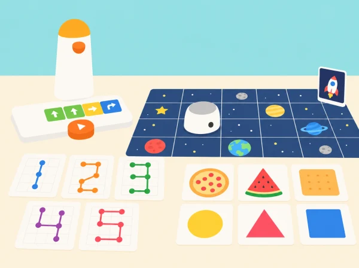

_Una fira creada per l’aula connecta programació tangible, matemàtiques i imaginació._

## ❓ Repte i intenció

La classe organitza tres espais de descoberta. En cada un, els equips fan una predicció, preparen una seqüència amb els blocs tangibles i comproven què ha fet MatataBot. La fira posa el focus en explicar les decisions i comparar procediments, no en acabar primer.

## 🎯 Aprenentatges i vocabulari

- Interpretar ordres tangibles i convertir-les en instruccions que una altra persona puga seguir.
- Classificar formes i representar nombres amb les peces, la graella i les convencions de la fira.
- Aplicar girs i repeticions per construir una figura geomètrica i una constel·lació pròpia.
- Explicar les estratègies matemàtiques als visitants i revisar una estació a partir del retorn rebut.

## Abans de començar

Comproveu que el Coding Set inclou el robot, la torre de control i la taula de programació. Prepareu una graella pròpia, targetes grans amb aliments ficticis i formes, paper quadriculat, retoladors solubles i cartolines. Per a les activitats de traçat, useu l’Artist Add-On només si forma part de la dotació; si no, el robot recorre la figura sobre una quadrícula i l’alumnat dibuixa el resultat en paper.

Marqueu una distància de casella constant d’acord amb el desplaçament real del robot. Feu una prova curta amb el grup abans de fixar el nombre de caselles de les graelles.

## 📅 Seqüència didàctica

### **Obrim la fira i llegim ordres.**

Identifiqueu MatataBot, la torre i la taula; seguiu una seqüència curta d’esquerra a dreta. En una quadrícula original, cerqueu més d’un camí fins a una bandera i distingiu girar de desplaçar-se lateralment.

*Evidència: programa ordenat, predicció i explicació d’un gir.*

### **El rebost de les formes.**

Classifiqueu targetes d’aliments dibuixats segons la forma geomètrica prominent (triangle, quadrat, cercle o rectangle). Trieu-ne una amb una targeta aleatòria i programeu una ruta fins a la casella corresponent. Si una ruta no funciona, registreu l’orientació i corregiu una sola ordre.

*Evidència: classificació argumentada i seqüència provada.*

### **Una data que es pot llegir.**

Compareu una xifra escrita a mà amb el traçat que produeix un programa de moviments. En paper quadriculat, descomposeu 0, 1 i 7 en trams; després creeu xifres pròpies de l’aula i proveu on convé repetir moviments amb un bucle. El robot no necessita dibuixar amb retolador: pot recórrer la línia de caselles mentre una persona comprova la forma.

*Evidència: tres xifres amb instruccions i una repetició justificada.*

### **Triangles que giren.**

Construïu primer un triangle equilàter amb una fitxa i una corda. Predigueu quina peça d’angle cal per fer que el robot gire cap al costat següent: compareu el gir de 120° amb l’angle interior de 60° i expliqueu que el gir del robot és l’angle exterior suplementari. Exploreu després un triangle rectangle o obtusangle en la quadrícula; l’Artist Add-On és opcional i, sense aquest accessori, les longituds es representen en paper.

*Evidència: dibuix anotat que diferencia gir i angle interior.*

### **El cel de la fira.**

En un mural comú, cada equip dissenya una constel·lació amb formes geomètriques i decideix una ruta que connecte les seues estrelles. Amb Artist Add-On poden dibuixar directament sobre paper gran; amb el kit base, marquen la ruta en una graella i completen el mural a mà. Cada grup presenta les ordres, els canvis fets durant les proves i una dada matemàtica del disseny.

*Evidència: constel·lació col·laborativa i demostració comentada.*

## 📋 Avaluació i evidències

Recolliu la predicció inicial, el programa tangible, el registre de proves i l’explicació final. Observeu si l’alumnat: classifica formes amb un criteri explícit; ordena moviments i girs; relaciona l’angle exterior de gir amb l’angle interior del triangle; identifica una repetició útil; i revisa el programa a partir del resultat observat. Valoreu també que l’explicació siga comprensible per a un altre equip.

## Desenvolupament dels espais de la fira

**Arribada i orientació:** mostreu les tres parts del Coding Set —MatataBot, torre i taula de control— i feu una ruta de demostració fins a una bandera de paper. Llegiu les ordres d'esquerra a dreta i distingiu «gira a l'esquerra» de «mou-te cap a l'esquerra». Cada equip marca inici i destinació, assaja una ruta amb el dit i compara una segona seqüència que arriba al mateix punt sense creuar una bandera aliena. Així recuperem el sentit introductori de *Hello, Matatalab Robots!* i deixem clares les regles abans de les estacions.

**Rebost geomètric:** useu targetes d'aliments dibuixats i classifiqueu-les per forma prominent, no per categoria nutricional. Presenteu amb cura les formes amb més d'una interpretació: l'alumnat pot explicar quina part observa i triar un altre exemple. En una adaptació del joc oficial *Big Eater*, un dau amb quatre formes i dues cares de pausa/torna a tirar podia regular els torns i les targetes retirades; ací la tria és cooperativa i cap infant perd el torn si no programa a la primera. Si voleu mantindre el dau, feu que indique el repte de la ronda, no qui té dret a participar.

**Taller de xifres:** comenceu comparant una xifra manuscrita i una traçada per moviments sobre quadrícula. La lliçó oficial proposa començar per 1 i que l'alumnat resolga 0 i 7, després usar programes de suport per a altres xifres i buscar repeticions amb blocs de bucle. En aquesta versió, trieu tres xifres segons el temps i el nivell; mesureu el recorregut en caselles i expliqueu quins trams s'han repetit. El repte de data d'aniversari es fa només amb una data fictícia o combinació inventada per no demanar informació personal.

**Geometria i mural:** abans de programar el triangle equilàter, useu cordill per marcar els costats i una plantilla per veure que cada angle interior és de 60°. Després representeu l'angle de gir de la seqüència: el robot necessita un gir exterior de 120° perquè la seua orientació canvie mentre avança. Proveu un angle recte o obtús i compareu el traçat amb la predicció. En la constel·lació, els equips negocien un espai comú i uneixen les figures; qui no disposa d'Artist Add-On traça la ruta amb el robot i completa el dibuix a mà, sense perdre l'objectiu de seqüència i composició.

## Rotació de grups i retorn

Organitzeu equips de tres: planificador/a, operador/a i observador/a. Amb un sol kit, els grups passen per les estacions en rotació; mentre esperen, poden provar el programa amb una fitxa sobre la quadrícula o resoldre la classificació i la predicció en paper. En cada canvi de rol, la persona observadora registra si el robot es va desviar, quin indici van usar i quina instrucció van canviar. En la mostra final, cada equip explica una decisió matemàtica i una limitació del dibuix automatitzat. La coavaluació se centra en claredat de la llegenda, coherència entre predicció i resultat i respecte dels torns, no en la bellesa ni la velocitat.

## ♿ Més d’una manera de participar

Oferiu targetes amb contrast alt i relleu, quadrícules grans amb punt de partida marcat i programes amb menys ordres. Qui no manipule les peces pot fer de persona que prediu, de registradora de proves, de narradora o de responsable de comprovar les formes. L’Artist Add-On és opcional: totes les missions es poden completar amb el Coding Set i materials de paper.

## 🔗 Referents oficials i adaptació

La primera sessió reinterpreta la presentació del robot, la torre, la taula de control i les ordres de [Hello, Matatalab Robots!](https://matatalab.com/en/node/88). Les sessions següents adapten, en un context propi, [Big Eater](https://matatalab.com/en/node/80) (classificació de targetes per forma i planificació de ruta), [Draw Arabic numbers with Matatalab!](https://matatalab.com/en/node/87) (traçat de xifres amb moviments i bucles), [Draw triangles](https://matatalab.com/en/node/84) (girs exteriors i angles interiors) i [Travel in universe](https://matatalab.com/en/node/83) (composició d’una obra geomètrica col·laborativa). Les targetes, graelles, preguntes i imatge són originals; les activitats de dibuix directe requereixen Artist Add-On, per això s’ofereix una alternativa completa amb paper.
