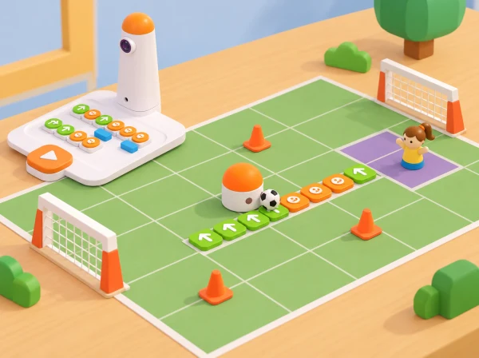

_El Coding Set i MatataBot en una pista de futbol de taula amb una pilota i zones de passada._

## ❓ Repte i intenció

Practicar seqüenciació, orientació espacial i presa de decisions en un joc cooperatiu amb criteris de participació i seguretat.

## Abans de començar

Dibuixeu una pista de taula amb caselles amples i dues zones de destinació. Useu una pilota lleugera que no bloquege sensors ni pose en risc el robot; si el kit no la pot empényer amb seguretat, feu que el robot la visite i que una persona la moga després.

## 📅 Seqüència didàctica · quatre sessions de 45 minuts

La proposta amplia el repte oficial de 45 minuts en una investigació de quatre sessions: primer s’aprén a llegir el camp i programar una ruta; després s’alternen els rols de defensa i atac; finalment, cada equip dissenya i comunica una variant pròpia. Si només disposeu d’una sessió, feu la sessió 1 i una ronda curta de la sessió 2.

### **Sessió 1 · Del mapa a la seqüència.**

*Activació (5 min):*

en una graella de 4 × 4 caselles de 10 cm, indiqueu inici, porteria i tres obstacles de cartó.

*Modelatge (10 min):*

l’adult pensa en veu alta com orientar MatataBot i traduir cada tram en ordres; l’alumnat anticipa els girs i compara avançar, retrocedir i girar 90°.

*Planificació en parelles (15 min):*

dibuixeu dues rutes possibles amb fletxes, escriviu el programa amb targetes de comanda i compteu ordres i caselles.

*Prova i depuració (10 min):*

executeu una ruta, marqueu on queda el robot i localitzeu la primera diferència entre predicció i moviment; corregiu només l’ordre necessària i torneu a provar.

*Tancament (5 min):*

expliqueu què heu canviat. Evidència: mapa anotat, seqüència inicial/corregida i una explicació del primer error.

### **Sessió 2 · Defensa i atac amb rols intercanviables (45 min).**

*Preparació (5 min):*

prepareu la mateixa graella i una pilota de paper lleugera amb porteria ampla. Un equip defensor situa tres obstacles sense tapar el robot ni crear passos massa estrets; l’equip atacant observa el camp i planifica una ruta fins a una casella des d’on una pala ampla de paper puga empényer la pilota suaument cap a la porteria. Dediqueu 10 minuts a modelar la regla i planificar la primera ronda, 10 a jugar-la i registrar si s’ha arribat a la zona de colp, si la pilota ha entrat, quantes ordres s’han usat i quin obstacle ha condicionat la ruta; feu una pausa de 5 minuts per intercanviar rols, jugueu una segona ronda de 10 minuts i tanqueu amb 5 minuts de comparació de resultats. El punt és col·lectiu: atac i defensa guanyen quan poden justificar una decisió amb el mapa i les dades, no per rapidesa.

### **Sessió 3 · Dissenyar un repte equilibrat (45 min).**

*Disseny (10 min):*

cada parella crea un mapa nou amb quatre obstacles i una condició clara per a l’equip contrari. Abans de jugar, una altra parella comprova si la porteria és accessible, si hi ha almenys una ruta vàlida i si totes les instruccions caben en el mapa. Si no hi ha solució, reduïu un obstacle o canvieu-ne la posició. Intercanvieu mapes (5 min), proveu la ruta amb el robot i compteu ordres (15 min), reviseu obstacles i ajusteu el mapa (10 min), i expliqueu per què la solució és verificable (5 min). Extensió: demaneu dues rutes diferents i compareu nombre d’ordres, girs i marge d’error; no declareu una ruta “òptima” si només n’heu provat dues.

### **Sessió 4 · Galeria, explicació i transferència (45 min).**

*Preparació (10 min):*

mostreu el mapa, la predicció, el programa i el registre de proves.

*Galeria (20 min):*

una parella visitant intenta repetir les ordres seguint només les fletxes i la convenció de gir acordada.

*Revisió (10 min):*

recolliu una pregunta i una proposta concreta de millora, i decidiu si l’accepteu amb una prova.

*Transferència (5 min):*

trieu una situació pròxima —repartir llibres en una biblioteca fictícia, arribar a una parada o portar una fitxa a un punt de recollida— i expliqueu quines parts del mètode es podrien reutilitzar.

## 🧰 Preparació, materials i llenguatge de programació

**Materials:** Coding Set complet (MatataBot, torre de comandaments i tauler), quadrícula de 16 caselles, cinta de paper, targetes amb obstacles, porteria de cartó, pilota de paper lleugera, llapis i full de registre. El mapa oficial té 16 caselles de 10 × 10 cm; marqueu una quadrícula equivalent si no teniu el tapet específic. El braç/pala és una peça auxiliar de paper lleuger i només s’usa després de provar que no bloqueja el robot ni danya el material. Si no es pot fixar amb seguretat, el robot acaba la ruta al costat de la pilota i una persona la col·loca en la porteria, registrant l’adaptació.

Useu un vocabulari compartit: *inici*, *orientació*, *casella*, *ordre*, *obstacle*, *destinació* i *depuració*. Per a girar, l’alumnat indica primer cap a on mira el robot i després el costat del gir. La seqüència es llig d’esquerra a dreta; cada avanç o retrocés correspon a un pas del robot. No confongueu “girar” amb “avançar una casella”.

## 📊 Registre de prova i criteris d’èxit

Per cada intent, anoteu: equip i rol, mapa/versió, ruta prevista, ordres totals, caselles recorregudes, obstacles evitats, arribada a la zona de colp, resultat de la pilota i canvi fet després de la prova. Valoreu quatre aspectes amb una escala descriptiva —encara amb ajuda / quasi autònom / autònom i explicat—: orientació espacial, correspondència entre fletxes i ordres, depuració a partir del primer punt de desviació i cooperació amb rols rotatius. L’èxit no depén de marcar gol: una ruta que identifica l’error i es corregeix amb evidència també és una solució satisfactòria.

## ♿ Participació, ajustos i seguretat

Oferiu instruccions en fletxes grans, pictogrames o paraules; es pot anticipar la seqüència amb una fitxa que recórrega la quadrícula abans de programar. Les persones poden triar entre planificar, col·locar obstacles, programar, observar, registrar o narrar, amb rotació voluntària dels rols. Reduïu el nombre d’obstacles, amplieu la porteria, lleveu el límit d’ordres i jugueu sense cronòmetre quan ajude a comprendre el repte. Manteniu el camp sobre una taula estable, useu només una pilota de paper, deixeu les mans fora del recorregut mentre el robot es mou i atureu-lo abans de reposicionar obstacles.

## 🔗 Referent oficial i adaptació

Adapta [Soccer Match](https://matatalab.com/en/node/81), activitat oficial de Coding Set per a 5–7 anys: el pla proposa una introducció guiada de 10 minuts, 30 minuts de joc en què defensa col·loca obstacles i atac programa una ruta amb ordres d’avanç/retrocés/gir, i 5 minuts de reflexió i extensió. La proposta pròpia conserva la planificació de rutes, els obstacles, els rols alterns i la prova del robot, però amplia la pràctica en quatre sessions, crea mapes i criteris locals i substitueix el rànquing per evidències de cooperació i depuració. No reutilitza el mapa ni les imatges oficials.
