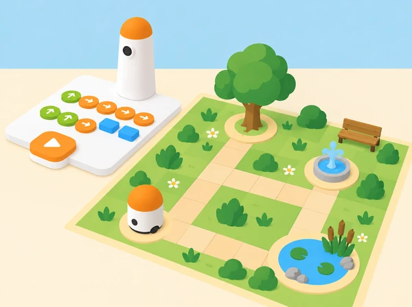

_El mapa és una maqueta didàctica: cada parada convida a observar, representar i cuidar l’entorn._

## 🌿 Repte, context i aprenentatges

Els equips dissenyen un mapa de parc inspirat en els espais verds i aiguamolls de la Comunitat Valenciana. MatataBot ix d’un punt d’inici, visita llocs triats pel grup —una zona d’ombra, una bassa de paper, un arbre o una font— i en cada parada deixa una targeta amb una pregunta observable. Es pot treballar amb un plànol de l’Albufera o amb un parc completament fictici; si s’observa un espai real, l’alumnat mira i registra sense arrancar plantes, tocar animals ni eixir dels recorreguts autoritzats.

**Aprenentatges:** llegir una graella, transformar un itinerari en ordres tangibles, anticipar la posició final, depurar una seqüència, comparar rutes i distingir observació directa d’inferència. El robot recorre el mapa; no és un sensor ambiental i no identifica plantes, espècies, qualitat d’aigua ni presència d’animals.

## 🧰 Materials i preparació

Prepareu el MatataBot i la torre de programació del Coding Set, un mapa original en quadrícula, blocs físics de moviment, targetes amb símbols per a les parades, fitxes d’observació i una figura lleugera per representar el «quadern de camp». Reviseu la càrrega i les instruccions del kit. Mesureu la quadrícula segons el moviment real del vostre robot: la informació del fabricant descriu moviments d’avanç de 10 cm i girs de 90°, però la distància efectiva s’ha de verificar amb el model, el terra i les peces disponibles al centre.

Fixeu el mapa sobre una superfície plana, poseu cada destí al centre d’una casella i manteniu les caselles i ordres visibles per a tot el grup. Comenceu amb un recorregut curt, sense obstacles estrets. Si la torre o el robot no està disponible, una fitxa sobre la mateixa graella i targetes de fletxa permeten fer el mateix treball de seqüenciació, però la prova física del robot quedarà pendent.

**Vocabulari:** mapa, casella, origen, destinació, avançar, retrocedir, girar, ordre, seqüència, observar, inferir i cuidar. Modeleu la diferència entre «veig ombra al costat de l’arbre» i «ací segurament fa més fresc» com a observació i hipòtesi.

## 📅 Seqüència didàctica · quatre sessions de 45 minuts

### **Preparem el quadern d’observació (45 min).**

Mostreu fotografies pròpies o autoritzades de l’Albufera, d’un parc de l’entorn o d’un mapa fictici. Cada equip tria tres espais que es puguen representar sense manipular éssers vius: ombra i sol, superfície pavimentada, aigua representada en paper, plantes dibuixades o un banc. Formuleu una pregunta que es puga respondre mirant, com «on arriba l’ombra?» o «quines formes de fulla veiem en la fotografia?» Eviteu preguntes que requerisquen tocar, capturar o identificar amb certesa una espècie.

Assigneu a cada parada un símbol i prepareu una fitxa amb camps «què veig», «què pense que podria significar» i «què no puc saber encara». Ordeneu les tres destinacions en un mapa i acordeu una norma de cura. *Evidència:* mapa inicial, tres símbols i una pregunta observable per parada. *Preguntes docents:* «Què podem saber només mirant? Quina part és una idea que encara hauríem de comprovar?»

### **Dissenyem i simulem l’itinerari (45 min).**

Situeu MatataBot al punt d’inici de la quadrícula i identifiqueu la direcció cap on mira. Abans d’usar la torre, cada parella mou una fitxa casella a casella i registra les ordres físiques necessàries per arribar a la primera parada. Continueu fins a les altres dues, anotant els girs i les visites en l’ordre triat. Comproveu les distàncies en el mapa del centre i no pressuposeu que cada quadrícula ha de coincidir amb la longitud del moviment del robot.

Compareu dues rutes: una que visita totes les parades i una que n’omet una. Comenteu nombre d’ordres, claredat i si el trajecte passa per llocs estrets. Després, ordeneu els blocs de moviment corresponents i una targeta de parada entre trams perquè el relat siga llegible. *Evidència:* dues rutes representades, una seqüència de blocs i predicció de la casella final. *Preguntes docents:* «Quina ordre farà girar el robot? Si comença mirant cap a una altra banda, què haurem de canviar?»

### **Programem, provem i depurem amb MatataBot (45 min).**

Col·loqueu els blocs físics a la torre seguint la seqüència acordada. Una persona llig les ordres, una altra comprova que cada bloc està ben orientat i una tercera prediu la ruta. Executeu primer un trajecte fins a una sola parada. Si MatataBot acaba en una casella diferent, compareu pas a pas la seqüència esperada i la real: orientació inicial, recompte de moviments, gir i alineació amb la graella. Canvieu una sola instrucció abans de repetir.

Quan la primera part funciona, afegiu les altres destinacions i les targetes d’observació. Col·loqueu-les fora del camí perquè el robot no les desplace. En cada parada, l’equip tria la pregunta que investigaria i anota el símbol corresponent al quadern. *Evidència:* seqüència depurada, casella d’arribada real i registre d’un ajust justificat. *Preguntes docents:* «Quin és l’últim punt on el robot seguia el pla? Quina orde concreta revisarem?»

### **Fem la ronda i compartim una proposta de cura (45 min).**

Executeu la ruta completa. En cada parada, un membre de l’equip llig la pregunta d’observació i un altre registra una dada del mapa, una fotografia o una observació real autoritzada. Si es treballa només amb maqueta, marqueu les dades com a simulades; no les presenteu com a observacions de camp. Cada equip tria una proposta de cura del parc que no requerisca instruccions de seguretat inventades, com mantindre’s en el camí autoritzat o no deixar residus.

Intercanvieu mapes entre equips: l’altre grup reconstrueix la ruta i identifica quines observacions són dades i quines són interpretacions. Reviseu el mapa si alguna parada no s’entén o si la seqüència queda confusa. *Evidència:* ruta final, tres fitxes d’observació i una proposta de cura sustentada en una observació. *Preguntes docents:* «Quina dada heu vist o consultat? Quina proposta necessita una font o una persona experta?»

## 📋 Avaluació i evidències

Recolliu el mapa, la seqüència inicial i revisada, la predicció de la casella final i les fitxes d’observació. Observeu si l’alumnat:

- situa origen, orientació i destinacions amb referència a la quadrícula;

- ordena blocs per a descriure una ruta i anticipa on acabarà el robot;

- compara el recorregut real amb el previst i troba una instrucció revisable;

- separa observació, inferència i dada simulada;

- explica una pràctica de cura sense atribuir al robot coneixements ambientals.

Una seqüència més llarga no és necessàriament millor: es valora que siga provable, llegible i adequada al mapa. Si el robot falla per alineació, registreu la condició en lloc d’atribuir-ho automàticament a un error de raonament.

## ♿ Participació i respecte per l’entorn

Useu fotografies o pictogrames per preparar l’observació, simplifiqueu el mapa i oferiu rols de cartografia, programació, lectura d’ordres, registre o relat. No és necessari eixir del centre si l’espai no és accessible; la ruta es pot fer completament sobre una maqueta. Feu caselles grans i d’alt contrast, i permeteu dictar o assenyalar les ordres. En qualsevol observació real, seguiu les indicacions del centre i de l’espai natural, manteniu-vos en recorreguts autoritzats i no toqueu animals ni plantes.

## 🔗 Referent oficial i adaptació pròpia

El treball amb destinacions, blocs de moviment, obstacles, memòria de les parades i relat propi s’inspira en l’activitat oficial [Delivery Animals](https://matatalab.com/en/node/86) del Coding Set, que proposa transportar figures entre llocs comunitaris i explicar per què hi van. Aquesta adaptació canvia completament el mapa i la història: les parades són espais de natura pròxima i cada arribada activa una observació responsable, sense imitar ni reutilitzar les targetes oficials.
