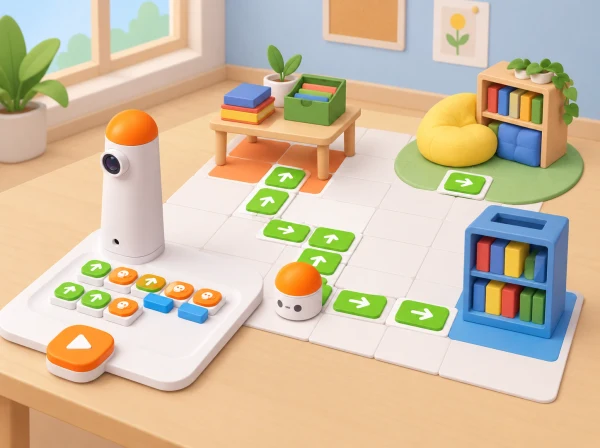

_MatataBot i el Coding Set recorren caselles entre un punt de préstec, un racó de lectura i una prestatgeria._

## ❓ Repte i intenció

MatataBot és el visitant nou. Cada equip investiga quatre espais públics del centre, representa’n la distribució en un plànol simplificat, crea maquetes lleugeres de paper i codifica una ruta per a guiar la classe. El grup prepara un discurs breu amb informació contrastada i divideix la guia en parades; un llibre fictici pot fer de fil narratiu, però el robot no transporta càrrega. La seqüència localitza i reinterpreta els objectius de *MatataBot’s Guide* en un itinerari de benvinguda propi.

## 🎯 Aprenentatges i vocabulari

- Observar l’espai i representar-ne punts d’interés en un mapa miniatura i una graella.
- Programar una seqüència que visite tres espais ficticis i comprovar-ne el recorregut.
- Escriure una recomanació original per a un llibre inventat sense copiar sinopsis ni usar dades de lectores.
- Guiar una altra persona, recollir-ne el retorn i revisar tant el mapa com les ordres.

## 🧰 Materials i preparació docent

Prepareu el Coding Set complet, paper gran per al mapa, regles, retalls de cartó i paper, cinta de pintor, targetes de símbols, llapis, fulls de recerca i un full de registre. Demaneu abans a l’escola informació pública o autoritzada sobre la història i cultura del centre, i delimiteu quins espais es poden observar i representar. No fotografieu persones ni inclogueu horaris, codis d’accés, noms complets o informació de seguretat. Si no hi ha plànol compartible, mesureu o estimeu només relacions de proximitat entre espais amb permís docent, i indiqueu que el mapa és esquemàtic. Feu una prova de desplaçament del robot per comprovar quina longitud correspon a cada ordre i quines caselles reals caben en el full.

Les coordenades (x, y) són una eina per a trobar i comunicar una ubicació en el mapa; MatataBot no rep parelles de coordenades com a codi. L’alumnat tradueix un itinerari entre punts en blocs físics d’avanç, retrocés i gir, tenint en compte l’orientació inicial.

## 📅 Seqüència didàctica · quatre sessions de 45 minuts

Les quatre sessions sumen 180 minuts, com la durada publicada del projecte de referència: 45 minuts per investigar i iniciar la visita, 90 per al mapa, les maquetes i la programació, i 45 per a les presentacions i la reflexió. La distribució en quatre trobades permet assecar, revisar i provar els materials entre sessions.

### **Sessió 1 · Investiguem el centre que presentarem.**

#### Fase 1 · Activem i prediem

Comenceu amb l’encàrrec: qui arriba per primera vegada i quina informació li seria útil? Cada equip anota què ja sap del centre i quines dades necessita confirmar.

#### Fase 2 · Explorem i construïm

Consulteu una font del centre o pregunteu a una persona autoritzada sobre la història, cultura o ús compartit de quatre espais. Anoteu font, data i allò que encara no sabeu.

#### Fase 3 · Expliquem i registrem

Feu una observació docent guiada o useu notes/esbossos preparats. Identifiqueu entrades, passadissos i llocs visitables sense entrar en zones restringides; registreu només la informació necessària per al plànol.

#### Fase 4 · Apliquem i millorem

Decidiu quina distància representarà cada tram i dibuixeu límits i quatre punts d’interés. Un altre equip comprova si pot trobar l’inici i les destinacions i assenyala què cal aclarir.

#### Fase 5 · Comprovem i reflexionem

**Evidència:** notes de recerca amb fonts, esbós amb llegenda i escala declarada. Quina informació continua pendent de confirmar?

### **Sessió 2 · Fem el mapa miniatura i les maquetes.**

#### Fase 1 · Activem i prediem

Reviseu l’esbós de la sessió anterior i prediu quina informació ha de mantindre’s perquè el mapa siga llegible i conserve l’escala.

#### Fase 2 · Explorem i construïm

Traslladeu passadissos i ubicacions amb la mateixa escala. Afegiu títol, nord o orientació inicial, llegenda i una quadrícula amb lletres i nombres.

#### Fase 3 · Expliquem i registrem

Creeu maquetes tridimensionals simples de paper per als edificis o espais representats; manteniu-les baixes i fora de la trajectòria del robot o substituïu-les per símbols plans. Assigneu coordenades als llocs.

#### Fase 4 · Apliquem i millorem

Feu que cada persona trobe una destinació a partir d’una parella ordenada. Contrasteu que les maquetes i els símbols conserven la posició relativa al mapa i que l’escala no ha canviat.

#### Fase 5 · Comprovem i reflexionem

**Evidència:** mapa llegible amb quatre maquetes o símbols i targetes de coordenades. Quina informació ens dona la coordenada i quina informació necessitarà el robot per moure’s?

### **Sessió 3 · Codifiquem i escrivim la visita guiada.**

#### Fase 1 · Activem i prediem

Trieu un punt d’inici, l’ordre de quatre parades i una ruta que el robot puga recórrer sense xocar. Marqueu amb una fletxa la seua orientació inicial i predigueu cada gir.

#### Fase 2 · Explorem i construïm

Convertiu la ruta dibuixada en blocs de moviment. Col·loqueu la seqüència d’esquerra a dreta i proveu un tram cada vegada.

#### Fase 3 · Expliquem i registrem

Redacteu quatre fragments de visita guiada de dues o tres frases: nom de l’espai, un fet verificat i què pot descobrir-hi el visitant. Citeu oralment la font o assenyaleu-la en una targeta docent; no inventeu fets locals.

#### Fase 4 · Apliquem i millorem

Si MatataBot s’allunya de la ruta, registreu la casella, l’orientació i el primer bloc que cal revisar. Depureu una instrucció i practiqueu la narració sincronitzada amb les parades.

#### Fase 5 · Comprovem i reflexionem

**Evidència:** guió de visita, programa i registre d’una prova. El mapa de coordenades i les ordres del robot descriuen la mateixa ruta de maneres diferents?

### **Sessió 4 · Guiem MatataBot i revisem el projecte.**

#### Fase 1 · Activem i prediem

Situeu mapa, maquetes i senyal d’inici; assigneu qui programa, qui narra i qui registra. Predigueu si el públic podrà seguir la ruta només amb el mapa i el discurs.

#### Fase 2 · Explorem i construïm

Cada equip mostra el codi, fa el recorregut i presenta els espais amb el discurs. El públic segueix el mapa i marca cada parada.

#### Fase 3 · Expliquem i registrem

Una altra parella indica un punt fort i formula una pregunta concreta sobre escala, informació o ruta. Registreu el retorn i la parada a què fa referència.

#### Fase 4 · Apliquem i millorem

Corregiu una part del mapa o del programa a partir del retorn i torneu a comprovar que el recorregut es pot seguir.

#### Fase 5 · Comprovem i reflexionem

Responeu: què ens ha costat, quina font hem utilitzat i com ens hem repartit el treball? **Evidència:** visita completa, mapa final, programa revisat i reflexió individual o dictada.

## 🧭 Registre, rúbrica i evidències

Conserveu la font i data de cada dada, l’esbós, l’escala escrita, la quadrícula, la llegenda, les coordenades de les parades, les maquetes, el guió, la seqüència de blocs i els resultats de les proves. Valoreu amb tres nivells —amb modelatge, amb alguna pista, de manera autònoma i explicada— si l’equip (1) representa posicions relatives i usa l’escala amb coherència; (2) localitza llocs en una graella sense confondre (x, y) amb una ordre del robot; (3) programa i depura la ruta considerant orientació; i (4) comparteix dades verificades amb una audiència. L’èxit no depén de la ruta més curta: també compten una visita segura, comprensible i fidel al mapa.

## ♿ Participació, accessibilitat i seguretat

Oferiu plànol d’alt contrast, símbols en relleu, coordenades en targetes grans i versions de ruta amb menys parades. Els rols poden ser investigador/a, cartògraf/a, constructor/a, programador/a, guia oral, narrador/a amb comunicació augmentativa o auditor/a de fonts; no cal fer la visita física per participar. En lloc d’una excursió, podeu treballar amb notes i esbossos de llocs públics preparats pel centre. Manteniu models lluny dels passadissos de moviment, no tapeu sensors o rodes i atureu el robot abans de moure maquetes. La visita real es fa només en zones autoritzades i amb les normes habituals del centre.

## 📚 Connexió cultural pròpia

La classe pot vincular el recorregut a un espai de lectura, un pati, una aula taller o un element de memòria del centre. Si es vol afegir patrimoni de la localitat, useu fonts municipals, de biblioteca o d’una entitat cultural i distingiu el que està documentat del que és una narració inventada. Els personatges i el fil del llibre són creats per l’alumnat; els fets de la visita es verifiquen per separat.

## 🔗 Referents oficials i adaptació

[MatataBot’s Guide](https://matatalab.com/en/node/95) és un projecte per a presentar l’escola a un robot visitant: la guia publicada proposa 45 minuts d’investigació i visita, 90 minuts per a dibuixar el recinte a escala, crear maquetes de paper i codificar ruta/discurs, i 45 minuts de presentació i retorn. Aquesta adaptació conserva investigació de la cultura i distribució del centre, mini-plànol a escala, maquetes tridimensionals, ruta programada i discurs de guia; els converteix en una benvinguda pròpia amb fets locals verificats i protocols de privacitat. A diferència de la font, ofereix opcions basades en esbossos preparats quan la visita no és possible i explicita que les coordenades són de mapa, no instruccions que MatataBot entenga directament. Els personatges, guió, mapa, pictogrames i imatge són originals. La parada de préstec connecta també amb la idea de destinacions de [Delivery Animals](https://matatalab.com/en/node/86), sense afirmar que el robot transporte llibres.
