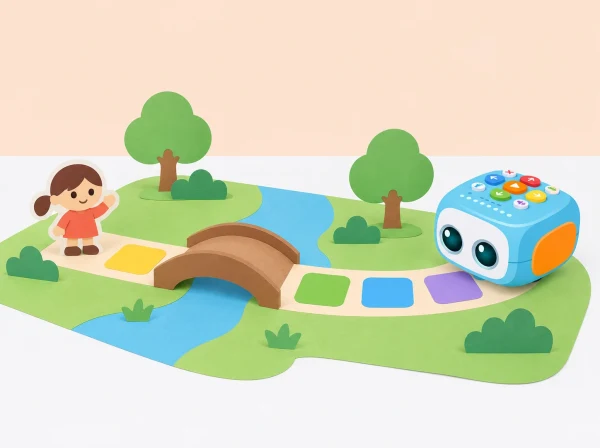

_El grup crea els personatges i la narració; el robot ajuda a ordenar i representar el recorregut._

## 📖 Repte, context i aprenentatges

La classe inventa una història que passa en un paisatge de marjal imaginat: un personatge vol visitar una amistat, travessar un pont de paper i arribar a una festa de poble. Els llocs i personatges són de ficció; no es presenten com una descripció científica de la fauna ni del Parc Natural de l’Albufera. L’alumnat crea un inici, un canvi i un final, representa cada escena en un mapa propi i programa Tale-Bot amb ordres físiques de moviment.

La narració pot fer-se en directe, amb pictogrames o amb una gravació molt breu del Tale-Bot Pro si el centre confirma que la funció de micròfon està disponible i el grup tria usar-la. L’enregistrament és opcional i s’elimina després de la sessió. Ningú no ha de posar la seua veu al robot per participar.

## 🎯 Aprenentatges i vocabulari

ordenar esdeveniments; descriure lloc, personatge i acció; relacionar moviment i relat; anticipar destinacions; comprovar i depurar una instrucció; expressar-se amb llenguatge oral, visual o corporal; escoltar i revisar una història per a una audiència.

## 🧰 Materials i preparació

Prepareu Tale-Bot Pro carregat, mapa de quadrícula en blanc, targetes de personatge i lloc, tires d’ordres, peces planes per al pont de paper i pictogrames per al guió. Si s’usa l’enregistrament, consulteu el manual del model i comproveu abans de classe com s’inicia, es reprodueix i s’esborra una pista amb la targeta de micròfon. La disponibilitat de la targeta i la durada de les gravacions depenen del contingut del kit; no afegiu accessoris desconeguts.

Proveu en la superfície de l’aula que una casella siga adequada per a un avanç del robot. Les ordres bàsiques habituals inclouen avançar o retrocedir aproximadament 10 cm i girar 90°; confirmeu distància, orientació inicial i funcionament amb el Tale-Bot del centre. El pont és una part visual del mapa, no cal que el robot el puge: col·loqueu-lo sobre una casella plana prou ampla perquè el trajecte no es bloquege.

**Vocabulari:** personatge, escenari, inici, canvi, final, casella, avançar, girar, ordre, seqüència i narrador/a. Useu imatges per introduir les paraules i distingiu «què fa el personatge» de «què fa el robot».

## 📅 Seqüència didàctica · quatre sessions de 30 minuts

### **Inventem personatge, lloc i problema (30 min).**

#### Fase 1 · Activem i prediem

Obriu una conversa a partir d’una imatge pròpia o autoritzada d’un paisatge amb aigua, camins i vegetació. Expliqueu que el conte serà imaginari i que no cal conéixer noms d’espècies per crear-lo. Cada grup tria un personatge de paper, un lloc d’eixida i un destí.

#### Fase 2 · Explorem i construïm

Decidiu quin problema menut fa necessari el viatge: s’ha perdut una invitació, falta una peça per a la festa o el personatge vol tornar un llibre. Ordeneu tres pictogrames: «comença», «passa una cosa» i «arriba a una solució».

#### Fase 3 · Expliquem i registrem

Dicteu o dibuixeu una frase per a cada escena. Anoteu què vol el personatge, què canvia al mig del conte i què sabrà qui l’escolte al final.

#### Fase 4 · Apliquem i millorem

Intercanvieu els guions gràfics amb un altre equip. Reviseu una escena si no queda clar el propòsit, el canvi o la solució, sense necessitat d’allargar el relat.

#### Fase 5 · Comprovem i reflexionem

Comproveu que les tres escenes formen una seqüència amb inici, canvi i final. **Evidència:** guió gràfic amb protagonista, propòsit i tres moments.

### **Convertim el conte en un mapa de ruta (30 min).**

#### Fase 1 · Activem i prediem

Poseu el mapa en blanc sobre la taula i marqueu inici, pont i destinació. Col·loqueu les targetes de les tres escenes i predigueu on s’aturarà el robot per poder contar el moment central.

#### Fase 2 · Explorem i construïm

Moveu primer una fitxa de paper una casella cada vegada. Trieu les ordres de Tale-Bot i poseu-les en una tira visual abans de tocar el robot. Identifiqueu cap a on mira al començament i representeu cada gir amb el cos o amb una fletxa gran.

#### Fase 3 · Expliquem i registrem

Dibuixeu la ruta al mapa i anoteu l’ordre de moviments que connecta cada escena. Una altra parella llig la tira i assenyala on espera cada parada.

#### Fase 4 · Apliquem i millorem

Compareu dues rutes possibles fins al mateix destí. Trieu la que siga més fàcil de llegir i mantinga l’ordre narratiu; reviseu una ordre si la fitxa o la tira no coincideix amb el mapa.

#### Fase 5 · Comprovem i reflexionem

Expliqueu quina ordre travessa el pont i com sabeu que el robot ha arribat a la casella correcta. **Evidència:** mapa amb escenes i seqüència d’ordres anticipada.

### **Programem, narrem i depurem (30 min).**

#### Fase 1 · Activem i prediem

Reviseu la tira d’ordres i predigueu la casella final i la posició del robot després de cada gir. Assigneu rols de programació, observació i narració, amb rotació breu.

#### Fase 2 · Explorem i construïm

Introduïu les ordres en Tale-Bot i feu una execució curta fins al pont. Si el model ho permet i el grup ho tria, prepareu una frase fictícia per a cada escena; l’enregistrament és opcional i es pot substituir per narració en directe, pictogrames o gestos.

#### Fase 3 · Expliquem i registrem

Compareu la casella real amb la prevista. Si hi ha una diferència, anoteu posició, orientació, nombre d’avançaments i girs. Registreu quina instrucció s’ha de revisar.

#### Fase 4 · Apliquem i millorem

Canvieu una instrucció cada vegada i torneu a provar. Si s’utilitza el micròfon —després de comprovar que està disponible—, graveu només una frase amb la veu del docent o d’una persona voluntària amb consentiment. No inclogueu noms ni informació personal; escolteu-la una vegada i esborreu-la en acabar.

#### Fase 5 · Comprovem i reflexionem

Expliqueu quina instrucció heu revisat i mostreu com contar la mateixa escena sense enregistrar cap veu. **Evidència:** ruta depurada i narració representada d’una manera triada.

### **Presentem el conte a una audiència (30 min).**

#### Fase 1 · Activem i prediem

Una parella o un altre grup mira el mapa i prediu quina serà la ruta sense rebre abans l’explicació dels autors.

#### Fase 2 · Explorem i construïm

Executeu Tale-Bot en el mapa. En cada parada, presenteu l’escena amb narració, pictograma o una pista sonora opcional. L’audiència segueix el recorregut i ordena després les tres targetes.

#### Fase 3 · Expliquem i registrem

Demaneu quina pista ha ajudat a entendre la història i quina escena ha sigut més fàcil de seguir. Anoteu el retorn sense valorar l’expressivitat vocal individual ni la longitud del conte.

#### Fase 4 · Apliquem i millorem

Si una escena no s’entén, reviseu-ne la posició al mapa, el text oral o el pictograma. Tanqueu amb la frase «Hem canviat… perquè…» i comproveu que qualsevol gravació temporal s’ha esborrat.

#### Fase 5 · Comprovem i reflexionem

Verifiqueu que el públic pot ordenar inici, canvi i final i que les veus no s’han compartit fora del grup. **Evidència:** ruta llegible, guió final i una millora justificada per l’audiència.

## 📋 Avaluació i evidències

Guardeu el guió gràfic, el mapa, les tires d’ordres i una nota d’observació de l’audiència. Observeu si l’alumnat:

- ordena tres esdeveniments amb inici, canvi i final;

- relaciona una acció narrativa amb una parada del mapa;

- prediu el recorregut i identifica una instrucció que cal revisar;

- tria una manera de narrar adequada al grup i respecta l’opció de no enregistrar-se;

- incorpora retorn d’una audiència per millorar la claredat.

No s’avalua l’expressivitat vocal individual, la longitud del conte ni que Tale-Bot arribe a la primera. Es valora la seqüència, la comprensió del mapa i la revisió del relat.

## ♿ Accessibilitat, privacitat i cura

Feu servir pictogrames grans, caselles contrastades i guions tàctils si són útils. Oferiu narració compartida, veu del docent, senyals no sonors o resposta amb targetes. Ningú no ha de parlar en públic, gravar-se ni identificar-se al conte. Si useu enregistrament, expliqueu-ne el propòsit, demaneu consentiment segons les normes del centre, escolteu-lo només dins de la sessió i esborreu-lo després. Repartiu rols de narrador/a, ordenació, comprovació i programació; no cal manipular el robot per participar.

## 🔗 Referent oficial i adaptació pròpia

Tale-Bot Pro ofereix una funció d’enregistrament de veu i narració creativa; el [fabricant la descriu en la fitxa del producte](https://matatalab.com/en/node/774). Les [Activity Cards oficials](https://matatalab.com/en/lesson4.4) s’adrecen a infants de 3–5 anys i suggereixen sessions de 20–30 minuts. Aquesta proposta crea el conte, mapa i seqüència de proves propis i deixa l’enregistrament com a opció amb alternativa completa.
