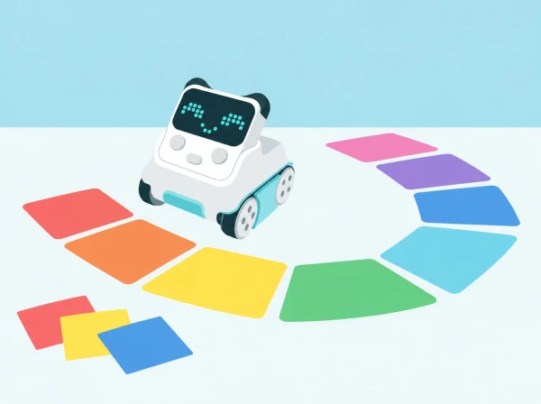

_Les targetes de ritme ajuden a imaginar, programar i revisar una coreografia amb un Codey Rocky._

## 🎭 Repte, context i aprenentatges

La classe prepara una breu actuació per a una festa escolar inspirada en els ritmes de tabal i dolçaina. El grup crea una base rítmica pròpia amb palmades, percussió corporal o instruments d’aula; després acorda com representar-ne alguns temps amb el moviment de Codey Rocky, les expressions de la pantalla i l’indicador RGB. La melodia tradicional no és imprescindible: si s’usa una gravació, el centre n’ha de comprovar el permís d’ús i el volum adequat.

L’objectiu no és fer que molts robots es moguen sincronitzats ni garantir una precisió musical professional. La proposta està pensada per a un Codey Rocky, que cada equip pot provar per torns. S’investiga com ordenar accions i pauses, què es pot repetir al programa i com canvia la dansa quan modifiquem un element.

## 🎯 Aprenentatges i vocabulari

pulsació i patrons rítmics; correspondència entre símbol, temps i acció; seqüenciació; ús de blocs de moviment, emoció, llum i espera; prova i depuració; creació cooperativa i comunicació d’una decisió artística.

## 🧰 Materials i preparació

Prepareu un Codey Rocky carregat, ordinador amb mBlock 5 i el cable USB adequat per a la dotació, una pista baixa i ampla amb vores lliures, targetes de quatre o huit pulsacions, fitxes de colors o pictogrames per a les accions, paper per a dissenyar la seqüència i instruments suaus opcionals. Comproveu la connexió i que els blocs d’acció, emoció i il·luminació siguen disponibles en la versió i el mode de programació del centre. Makeblock descriu el mode Upload com una manera de carregar el programa al robot perquè puga funcionar després desconnectat; feu una prova prèvia amb la configuració real de l’aula.

Deixeu lliure el xassís, les rodes i els sensors: no enganxeu disfresses ni materials sobre el robot. Si l’alumnat vol crear una escenografia o un vestit per a una figura de paper, situeu-lo al costat de la pista. Acordeu una senyal de parada accessible abans de cada prova i manteniu el robot a velocitat baixa. No és necessari enregistrar cap vídeo ni veu; una demostració en directe, un guió visual o una fotografia sense persones compleix la mateixa funció.

**Vocabulari:** pulsació, compàs, patró, seqüència, pausa, repetir, moviment, expressió, indicador RGB i depurar. Introduïu-lo amb gestos i targetes abans de programar.

## 📅 Seqüència didàctica · quatre sessions de 45 minuts

### **Escoltem, marquem i acordem un ritme (45 min).**

#### Fase 1 · Activem i prediem

Escolteu una peça instrumental adequada o creeu un patró curt amb palmades, colps suaus sobre una taula o instruments d’aula. Si evoqueu tabal i dolçaina, descriviu el caràcter del ritme sense afirmar que una seqüència inventada és una peça tradicional concreta.

#### Fase 2 · Explorem i construïm

Marqueu quatre pulsacions regulars amb una targeta per temps. Proveu un patró senzill, com fort-suau-suau-fort, i deixeu que el grup propose una variació. Trieu fins a quatre accions que el robot puga representar: avanç curt, gir amb duració provada, expressió, indicador RGB o espera.

#### Fase 3 · Expliquem i registrem

Associeu cada acció a un pictograma, no sols a un color. Decidiu quina part del ritme representarà el robot i quina quedarà a càrrec de la percussió humana; anoteu la llegenda perquè una altra persona puga interpretar les targetes.

#### Fase 4 · Apliquem i millorem

Proveu una variació i reviseu si les targetes indiquen clarament el patró, la pulsació i les accions. Ajusteu la tira abans de programar si una instrucció resulta ambigua.

#### Fase 5 · Comprovem i reflexionem

Una altra parella reconstrueix el ritme amb les targetes. **Evidència:** tira de quatre o huit pulsacions amb llegenda i patró acordat.

### **Inventem i assagem els moviments (45 min).**

#### Fase 1 · Activem i prediem

Representeu la coreografia amb una figura de paper sobre una pista dibuixada. Ordeneu els moviments i prediu on quedarà la figura al final.

#### Fase 2 · Explorem i construïm

Doneu a cada acció una duració segura i assumible. Si un gir no és previsible, proveu-lo a soles i ajusteu distància o temps abans d’incorporar-lo al patró. Ningú no posa mans o peus davant del robot mentre es mou.

#### Fase 3 · Expliquem i registrem

Assigneu rols: una persona porta el ritme, una altra assenyala la targeta que toca i una tercera observa el moviment. Registreu el guió temporal amb inici, accions i final, més una predicció sobre el punt que podria desajustar-se.

#### Fase 4 · Apliquem i millorem

Assageu a velocitat lenta amb un sol Codey Rocky i canvieu els rols en la prova següent. Si hi ha un desajust, identifiqueu si prové de pulsació, duració, moviment o pausa i canvieu un element cada vegada.

#### Fase 5 · Comprovem i reflexionem

Comproveu si el robot acaba a la posició prevista i expliqueu quina acció ocupa cada temps. **Evidència:** guió temporal, predicció inicial i registre d’una revisió.

### **Programem expressions, moviments i llums (45 min).**

#### Fase 1 · Activem i prediem

Connecteu Codey Rocky a mBlock 5, seleccioneu el dispositiu i llegiu el guió de blocs abans d’executar-lo. Predigueu l’ordre d’accions i assenyaleu quin bloc farà esperar el robot.

#### Fase 2 · Explorem i construïm

Comenceu amb una seqüència curta de dues accions. Useu blocs de moviment per als desplaçaments, Emotion per a l’expressió de pantalla i Lighting per a l’indicador RGB; intercaleu pauses temporitzades. Si el grup està preparat, repetiu la tornada amb una estructura de repetició disponible. No pressuposeu que el robot s’ajusta automàticament a la música.

#### Fase 3 · Expliquem i registrem

Feu una prova sense música i després marqueu el patró amb palmades. Compareu-lo amb el programa i registreu el resultat; comenteu que l’indicador RGB és un efecte visual, no una instrucció que haja de dependre només del color.

#### Fase 4 · Apliquem i millorem

Canvieu només un element —nombre de pulsacions, duració del gir o color de l’indicador— i compareu les dues versions. Confirmeu que el canvi no altera accidentalment la resta de la seqüència.

#### Fase 5 · Comprovem i reflexionem

Expliqueu quina instrucció produeix la pausa i quin canvi ha millorat el resultat. **Evidència:** programa comentat o guió de blocs, execució de prova i nota de revisió.

### **Mostrem la dansa i expliquem com l’hem revisada (45 min).**

#### Fase 1 · Activem i prediem

Prepareu una escena amb targetes o decorats de paper situats fora del trajecte. Trieu si acompanyareu el robot amb percussió corporal, instruments suaus o silenci i targetes visuals.

#### Fase 2 · Explorem i construïm

Executeu la coreografia en una pista ampla, amb el públic a distància segura i una persona responsable del botó d’aturada. No cal gravar-la; una demostració en directe o un guió visual compleix la mateixa funció.

#### Fase 3 · Expliquem i registrem

Presenteu el patró triat i el fragment que es repeteix. L’audiència pot reconstruir la seqüència amb targetes i indicar què ha entés.

#### Fase 4 · Apliquem i millorem

Useu el retorn per revisar una instrucció. Si el centre decideix enregistrar, seguiu les normes de privacitat i autoritzacions; també es pot documentar la revisió sense cap gravació.

#### Fase 5 · Comprovem i reflexionem

Tanqueu amb una decisió que mantindríeu i una que canviaríeu, i expliqueu quina prova ha motivat la revisió. **Evidència:** actuació o presentació alternativa, tira de coreografia revisada i comentari d’un altre equip.

## 📋 Avaluació i evidències

Recolliu la llegenda de símbols, el guió temporal, el programa o mapa de blocs i una nota de revisió. Observeu si l’alumnat:

- manté una pulsació comuna o explica quan ha canviat;

- ordena accions perquè una altra persona puga reconstruir-les;

- relaciona una pausa o repetició amb l’efecte que vol aconseguir;

- canvia una variable i compara el resultat amb la prova anterior;

- comunica una intenció artística amb paraules, símbols o demostració.

No es puntua la qualitat del ball ni l’execució musical individual. Una proposta amb dues accions ben explicades és vàlida si les decisions són visibles i revisables.

## ♿ Participació i seguretat

Oferiu una versió sense música, amb vibració/gestos només si són confortables, o amb comptatge visual. Ningú no ha de ballar, cantar, parlar en públic ni ser enregistrat. Les targetes, el disseny de seqüència, la programació, l’observació i la presentació són rols equivalents. Useu pictogrames a més dels colors i deixeu que una persona dicte instruccions perquè una altra opere l’ordinador. Manteniu el robot dins d’una pista ampla, estable i sense obstacles alts; atureu-lo abans de recuperar-lo o ajustar peces.

## 🔗 Referent oficial i adaptació pròpia

La proposta adapta [Case 20: Codey Rocky dances](https://support.makeblock.com/hc/en-us/articles/7484587495831-Case-20-Codey-Rocky-dances), que combina blocs Emotion, Action i Lighting per crear moviments, expressions, efectes de llum i sons. Ací la classe escriu una coreografia amb un ritme propi, incorpora pauses, prova un fragment repetit i documenta la depuració. La guia de [programació de Codey Rocky amb mBlock 5](https://support.makeblock.com/hc/en-us/articles/1500008637961-Program-Codey-Rocky-with-mBlock-5) diferencia els modes Live i Upload; comproveu la versió instal·lada i les opcions reals abans de la sessió.
