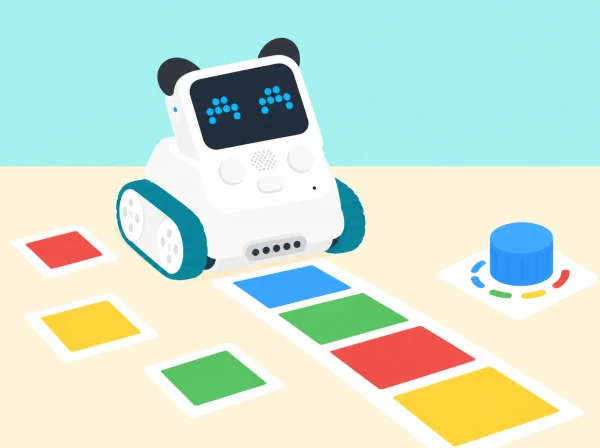

_El laboratori combina els components integrats de Codey amb materials de prova de l'aula._

## 🧩 Repte i context

La classe obri un laboratori d'interacció per a una exposició tecnològica del centre. En cada repte, un equip tria una entrada, anticipa què llegirà Codey Rocky, programa una resposta i comprova-la amb casos diferents. Les dotze sessions adapten lliçons públiques de *Codey Rocky & Neuron Discovery* que utilitzen botons, matriu LED, infraroig, potenciòmetre, sensor de color o giroscopi integrats. El curs original també conté reptes que necessiten mòduls Neuron; s'identifiquen al final i no es pressuposen ací.

## 🧪 Seqüència de reptes

### **Sessió 1 · *Find the Blue Dot*.**

#### Fase 1 · Activem i prediem

Prepareu una quadrícula de paper amb files i columnes. Predigueu com es podria indicar una cel·la sense escriure’n el nom: un punt, una fletxa o una coordenada per torn.

#### Fase 2 · Explorem i construïm

Programeu el botó de Codey perquè inicie el repte i la matriu LED perquè mostre un punt o una fletxa. Associeu cada símbol amb una cel·la del tauler.

#### Fase 3 · Expliquem i registrem

Anoteu la cel·la indicada i l’entrada que ha activat el programa. Distingiu el moment de llegir el botó del moment d’actualitzar la pantalla.

#### Fase 4 · Apliquem i millorem

Proveu una pulsació curta, una de llarga i cap entrada. Si dues pulsacions generen respostes difícils de distingir, ajusteu la regla o el símbol LED.

#### Fase 5 · Comprovem i reflexionem

**Evidència:** taula d’entrades i cel·les amb una regla que una altra parella puga seguir. Expliqueu què fa el programa quan no rep cap senyal.

### **Sessió 2 · *Lucky Wheel*.**

#### Fase 1 · Activem i prediem

Trieu opcions neutres, com ara quin repte cooperatiu provar, i representeu-les en una roda de paper. Predigueu si cada opció eixirà amb la mateixa freqüència.

#### Fase 2 · Explorem i construïm

Useu el botó per iniciar i aturar una seqüència de selecció en la matriu LED. Diferencieu una animació que només sembla una roda d’una selecció que depén d’un valor variable.

#### Fase 3 · Expliquem i registrem

Feu una sèrie de rondes i anoteu cada resultat amb marques de recompte. Manteniu el mateix nombre d’opcions i el mateix nombre d’intents per tanda.

#### Fase 4 · Apliquem i millorem

Compareu dues tandes i reviseu que el programa no afavorisca una posició per l’ordre de la seqüència o pel temps de pulsació. Si no hi ha un bloc aleatori, descriviu el resultat com una animació cíclica, no com una tria aleatòria.

#### Fase 5 · Comprovem i reflexionem

**Evidència:** recompte de resultats i explicació de per què freqüències observades poden variar. La roda és una dinàmica de joc, no un mecanisme per prendre decisions importants.

### **Sessió 3 · *Codey Rocky Can Do Addition*.**

#### Fase 1 · Activem i prediem

Repartiu objectes de prova en dues categories i feu un recompte manual inicial. Predigueu com canviarà la suma quan s’afiga una detecció a cada categoria.

#### Fase 2 · Explorem i construïm

Comproveu quin esdeveniment infraroig pot generar realment el model i l’equipament disponible. Programeu dos comptadors: cada detecció vàlida dins de la finestra acordada aporta una unitat al registre corresponent.

#### Fase 3 · Expliquem i registrem

Mostreu els dos recomptes i la suma. Registreu els valors abans i després de cada entrada per poder reconstruir el càlcul.

#### Fase 4 · Apliquem i millorem

Compareu el resultat programat amb el recompte manual en una tanda nova. Reviseu dobles deteccions o senyals que no s’hagen comptat i ajusteu la finestra de prova.

#### Fase 5 · Comprovem i reflexionem

**Evidència:** taula de recompte manual i del programa amb una suma explicada. No interpreteu lectures IR no documentades com a distàncies calibrades.

### **Sessió 4 · *Jump! Codey!*.**

#### Fase 1 · Activem i prediem

Dibuixeu una pista curta de paper i trieu una icona per a representar l’activació. Predigueu què ha de passar quan arriba l’entrada IR i què ha de passar quan no arriba.

#### Fase 2 · Explorem i construïm

Programeu l’entrada IR acordada perquè Codey canvie la icona de la pantalla i Rocky faça un moviment breu. Manteniu la pista lliure d’obstacles rígids i el robot sobre una superfície estable.

#### Fase 3 · Expliquem i registrem

Registreu les entrades detectades, la icona mostrada i si el moviment s’ha produït. Separeu la lectura real del sensor de la regla de joc que heu triat.

#### Fase 4 · Apliquem i millorem

Compareu una versió amb pausa i una sense. Reviseu si els senyals consecutius es distingeixen i si el moviment es manté dins de la pista.

#### Fase 5 · Comprovem i reflexionem

**Evidència:** programa i taula de proves amb activació present/absent. Expliqueu què detecta l’infraroig i quina part és només una convenció del joc.

### **Sessió 5 · *RC Car*.**

#### Fase 1 · Activem i prediem

Dibuixeu una ruta de repartiment en una quadrícula i acordeu un vocabulari curt d’ordres. Predigueu quines instruccions podrien perdre’s o repetir-se durant una transmissió.

#### Fase 2 · Explorem i construïm

Amb dos Codey Rocky i dos dispositius IR compatibles, configureu un emissor i un receptor. L’emissor envia ordres de ruta i el receptor les converteix en moviments o indicacions del model.

#### Fase 3 · Expliquem i registrem

Registreu l’ordre enviada, la rebuda i la resposta. Intercanvieu els rols perquè cada equip prove tant la transmissió com la recepció.

#### Fase 4 · Apliquem i millorem

Repetiu una ruta i marqueu ordres perdudes o repetides. Si només hi ha un robot, alterneu el control amb un comandament IR compatible disponible; si no n’hi ha, assageu el protocol en targetes i indiqueu que la transmissió física no s’ha provat.

#### Fase 5 · Comprovem i reflexionem

**Evidència:** registre emissor/receptor i una millora proposada per fer les ordres més fiables. Calen dos dispositius IR compatibles per a validar la comunicació entre robots.

### **Sessió 6 · *When Codey Meets Codey*.**

#### Fase 1 · Activem i prediem

Imagineu una conversa entre dos robots amb tres icones i definiu què significa cadascuna. Predigueu com es detectaria un missatge desconegut.

#### Fase 2 · Explorem i construïm

Amb dos dispositius compatibles, programeu l’emissor perquè envie un missatge i el receptor perquè responga amb una expressió LED. Escriviu el codi compartit en una llegenda visible.

#### Fase 3 · Expliquem i registrem

Proveu missatges vàlids i invàlids i anoteu què ha enviat l’emissor, què ha mostrat el receptor i si la interpretació coincideix amb la llegenda.

#### Fase 4 · Apliquem i millorem

Afegiu una regla per a missatges desconeguts i repetiu l’intercanvi canviant els rols. Si la dotació només té un robot, assageu el protocol amb targetes i identifiqueu que la comunicació física resta pendent d’un segon dispositiu.

#### Fase 5 · Comprovem i reflexionem

**Evidència:** llegenda del codi i registres d’un missatge vàlid i un d’invàlid. Expliqueu què necessiten emissor i receptor per interpretar el senyal de la mateixa manera.

### **Sessió 7 · *Volume Control*.**

#### Fase 1 · Activem i prediem

Observeu el potenciòmetre i indiqueu quina resposta espereu en els extrems i al punt intermedi. Acordeu una escala de tres nivells per comparar-la.

#### Fase 2 · Explorem i construïm

Llegiu el potenciòmetre integrat i useu la posició per regular el volum d’un senyal breu. Si el model o la configuració no permet so, feu servir la freqüència d’una animació LED com a alternativa identificada.

#### Fase 3 · Expliquem i registrem

Anoteu valors mínim, intermedi i màxim al costat de la resposta observada. Descriviu com heu convertit la lectura en tres nivells comprensibles.

#### Fase 4 · Apliquem i millorem

Proveu posicions intermèdies i ajuste els límits si dos nivells produeixen respostes massa semblants. Repetiu les lectures sense moure el robot ni canviar de programa.

#### Fase 5 · Comprovem i reflexionem

**Evidència:** taula de posició, lectura i resposta. La lectura és un control del model, no una escala normalitzada de volum.

### **Sessió 8 · *Number Guessing*.**

#### Fase 1 · Activem i prediem

Trieu un rang menut i penseu com convertir el gir del potenciòmetre en una conjectura. Predigueu què mostrarà el programa si la conjectura és inferior, superior o igual al valor secret.

#### Fase 2 · Explorem i construïm

Programeu el potenciòmetre per seleccionar la conjectura, el botó per confirmar-la i la matriu per mostrar «més», «menys» o «encert».

#### Fase 3 · Expliquem i registrem

Anoteu la lectura analògica, l’enter que li correspon, el valor secret i la pista mostrada en cada intent. Feu visible com es calcula la conversió.

#### Fase 4 · Apliquem i millorem

Proveu els valors dels extrems, repeticions i un rang diferent. Reviseu què passa quan dues lectures pròximes es converteixen en el mateix enter.

#### Fase 5 · Comprovem i reflexionem

**Evidència:** una traça del joc amb tres resultats possibles i explicació de la relació entre lectura analògica, conversió a enter i condicions.

### **Sessió 9 · *I'm a Good Guesser*.**

#### Fase 1 · Activem i prediem

Prepareu targetes de colors per a una galeria del pati i predigueu quines podrà distingir el sensor. Acordeu com presentareu cada targeta.

#### Fase 2 · Explorem i construïm

Feu lectures de diverses targetes, manteniu la distància, l’orientació i la llum tan constants com siga possible i creeu una regla inicial de classificació.

#### Fase 3 · Expliquem i registrem

Anoteu les lectures repetides per targeta, la classificació prevista i el resultat. Separeu les targetes utilitzades per ajustar la regla de les que reservareu per a comprovar-la.

#### Fase 4 · Apliquem i millorem

Proveu la regla amb targetes que no s’han emprat per ajustar-la. Si falla, canvieu una condició alhora i repetiu tant la mostra inicial com les targetes de comprovació.

#### Fase 5 · Comprovem i reflexionem

**Evidència:** taula de lectures i errors de classificació amb una regla revisada. El color detectat depén de la superfície i la il·luminació; no és una etiqueta infal·lible.

### **Sessió 10 · *Stoplight*.**

#### Fase 1 · Activem i prediem

Dissenyeu una maqueta de pas escolar amb targetes de color i predigueu quina resposta ha de correspondre a cada senyal. Afegiu una targeta desconeguda com a cas de prova.

#### Fase 2 · Explorem i construïm

Programeu Rocky perquè, en detectar la targeta acordada, canvie l’estat LED i mostre també una forma o patró diferenciat. Manteniu text o símbols equivalents al color.

#### Fase 3 · Expliquem i registrem

Completeu una taula amb senyal present, lectura del sensor i resposta mostrada. Registreu els casos de color reconegut, absent i no previst.

#### Fase 4 · Apliquem i millorem

Reviseu els casos límit i feu que les respostes siguen distingibles també sense dependre només del color. Proveu de nou amb targetes en una condició de llum diferent.

#### Fase 5 · Comprovem i reflexionem

**Evidència:** maqueta i matriu de proves amb una alternativa visual al color. És un prototip didàctic: no controla trànsit real ni substitueix senyalització accessible homologada.

### **Sessió 11 · *Sensing Motions*.**

#### Fase 1 · Activem i prediem

Amb Codey sobre una superfície estable, predigueu quin eix canviarà en una inclinació suau cap endavant, enrere o cap a un costat. No feu girar ni deixeu caure el robot.

#### Fase 2 · Explorem i construïm

Registreu una posició inicial de referència i inclineu Codey suaument en cada direcció. Llegiu els eixos i construïu una visualització senzilla per a una maqueta d’edifici accessible.

#### Fase 3 · Expliquem i registrem

Anoteu posició inicial, eix observat, sentit del canvi i resposta representada. Repetiu cada inclinació i manteniu la mateixa posició de partida.

#### Fase 4 · Apliquem i millorem

Compareu les repeticions i ajuste la visualització perquè diferencie els canvis observats. Si la lectura deriva o varia, registreu-ho en lloc d’amagar-ho.

#### Fase 5 · Comprovem i reflexionem

**Evidència:** taula d’eixos i representació del model. Expliqueu la diferència entre orientació relativa, moviment i posició absoluta.

### **Sessió 12 · *Jumping Game 2.0*.**

#### Fase 1 · Activem i prediem

Dissenyeu un joc curt en què un personatge LED evita obstacles i guanya punts. Predigueu com una inclinació suau pot controlar el personatge i quines alternatives d’entrada podrien funcionar.

#### Fase 2 · Explorem i construïm

Programeu el giroscopi perquè detecte una inclinació i moga el personatge. Manteniu clara la regla de puntuació i oferiu una alternativa amb botons des del primer prototip.

#### Fase 3 · Expliquem i registrem

Anoteu inclinació detectada, resposta del personatge i resultat de cada partida. Compareu el senyal llegit amb l’acció programada.

#### Fase 4 · Apliquem i millorem

Proveu el llindar amb gestos còmodes i ajuste’l perquè el repte no exigisca moviments bruscos. Feu una prova d’usabilitat amb l’entrada alternativa i registreu si permet completar les mateixes accions.

#### Fase 5 · Comprovem i reflexionem

**Evidència:** joc provat per dues persones amb opcions d’entrada i una explicació de com el sensor transforma moviment en dades. La participació no depén de fer gestos físics.

## 🎯 Aprenentatges i vocabulari

- Identificar les entrades disponibles de Codey Rocky i relacionar-les amb una resposta del programa.
- Construir una prova repetible que compare la predicció amb la lectura observada.
- Interpretar dades de botons, infraroig, color, llum o giroscopi sense atribuir-los capacitats que no tenen.
- Documentar errors, límits del sensor i una decisió de disseny basada en evidències.

## 🧰 Materials, accessibilitat i límits

Cal Codey Rocky, mBlock en una versió compatible, paper, targetes de color, quadrícula i material tou per a la maqueta. Les sessions 5 i 6 necessiten dos dispositius amb transmissió/recepció IR compatibles per a completar la comunicació física; sense el segon dispositiu es conserva el disseny de protocol i s'identifica l'assaig com a no executat. El resultat de cada sensor s'ha de verificar al model i al programari disponibles.

El catàleg oficial associa també altres lliçons a interruptors tàctils externs, sensor d'ultrasons i tira LED Neuron. Aquests components no es consideren part del Codey Rocky bàsic d'aquesta proposta. No substituïm eixos reptes per una activitat que fingisca tindre els mòduls: queden marcats per a adaptar-los quan es confirme l'accessori corresponent.

## ♿ Participació, accessibilitat i seguretat

Oferim instruccions orals i visuals, torns de control, opcions amb botons i rols de programació, observació i registre. Evitem gestos bruscos i mantenim el robot sobre una superfície estable; les lectures es comproven al model i al programari disponibles.

## 🎯 Evidències d'aprenentatge

Cada equip lliura sis registres d'entrada i resposta, diagrames o fragments de codi, taules de proves amb casos límit i una explicació d'una limitació del sensor. La mostra final pot ser una demostració presencial, un pòster o una descripció accessible del prototip. Valorem la predicció, la prova repetible, la depuració i la justificació de decisions, no la velocitat ni la competició entre equips.

## 🔗 Font oficial i abast de l'adaptació

La traçabilitat parteix de les lliçons 17, 18 i 21–30 de [Codey Rocky & Neuron Discovery](https://support.makeblock.com/hc/en-us/articles/25494707612823-Codey-Rocky-Neuron-Discovery), segons els títols i objectius publicats per Makeblock. Les lliçons 19–20 (interruptors tàctils), 31–32 (ultrasons) i 33–34 (tira LED) depenen dels mòduls Neuron i queden fora mentre no es confirme que són a la dotació. La pàgina oficial remet a materials docents que requereixen accés de compte; aquesta adaptació crea reptes, seqüència i visuals propis a partir de la informació pública i no afirma reproduir instruccions privades. La llista general de les 24 lliçons CSTA de Codey Rocky es troba en la [pàgina de Codey Rocky de Makeblock](https://www.makeblock.com/pages/codey-rocky-robot-toys-for-kids).
