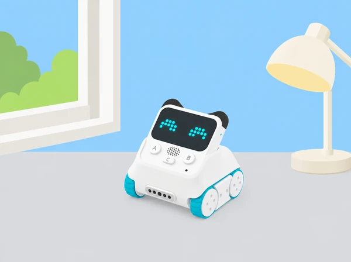

_El valor del sensor serveix per comparar proves semblants; no és una mesura certificada d’il·luminació._

## 💡 Repte, context i aprenentatges

Els equips preparen un mapa d’observació de la llum en espais accessibles de l’escola: prop d’una finestra, al centre de l’aula i en un racó. Codey Rocky mostra en la pantalla el valor que rep del sensor de llum ambiental. L’alumnat compara lectures, apunta les condicions de cada prova i pregunta què pot explicar una diferència: orientació del sensor, cortines, núvols, llums encesos o ombres.

## 🎯 Aprenentatges i vocabulari

formular prediccions, repetir mesures amb un protocol, controlar variables, representar dades, relacionar una diferència amb possibles factors i distingir lectura del sensor de mesura professional. El número del dispositiu no és lux certificat, no diagnostica confort visual ni determina si un espai és saludable o eficient energèticament.

## 🧰 Materials i preparació

Prepareu un Codey Rocky amb bateria, ordinador amb mBlock 5 i cable USB per carregar el programa, mapa senzill de l’aula o del passadís, full de registre, llapis i pictogrames per indicar finestra, cortina, llum artificial i condicions del cel. La situació pot executar-se amb el mòdul Codey quiet; no cal que el xassís Rocky es desplace. El cas oficial mostra el valor de llum ambiental en la pantalla de Codey mitjançant els blocs Sensing i Looks en mode Upload.

El sensor de llum de Codey és al xicotet orifici de la part inferior dreta del mòdul, vist de cara. Comproveu que no quede tapat per una mà, una taula o una carcassa. Trieu dos o tres llocs de lectura que no interrompen el pas i no canvieu la il·luminació habitual només per obtenir una puntuació. Si hi ha un llum de taula, que l’utilitze i col·loque sempre una persona adulta; no mireu directament la font ni acosteu el robot a líquids o calor.

**Vocabulari:** llum ambiental, sensor, lectura, repetició, variable, condició, comparar, interval, ombra, predicció i limitació. Presenteu «el sensor mostra un valor més alt en aquesta prova» en lloc de «ací hi ha més lux».

## 📅 Seqüència didàctica · quatre sessions de 40 minuts

### **Prediem i acordem un protocol (40 min).**

#### Fase 1 · Activem i prediem

Mostreu el plànol i marqueu tres punts d’observació accessibles. Cada parella ordena els llocs segons la llum que espera trobar i explica quin indici usa: proximitat a la finestra, cortines o llums que ja estan encesos. Anoteu l’hora aproximada i l’estat del cel amb símbols, sense registrar dades personals.

#### Fase 2 · Explorem i construïm

Decidiu com sostindre Codey: mateix costat cap amunt, sensor descobert, mateixa alçada respecte a la taula i mateixa orientació. Assageu com col·locar-lo sense bloquejar el pas ni tapar el sensor.

#### Fase 3 · Expliquem i registrem

Feu una lectura en un únic punt i comproveu que totes les persones poden veure la pantalla. Registreu la posició, l’orientació i les condicions que s’han acordat controlar.

#### Fase 4 · Apliquem i millorem

Reviseu el protocol amb una segona parella: pot repetir la lectura sense ajuda? Si no, afegiu al mapa un pictograma o una instrucció d’orientació més clara.

#### Fase 5 · Comprovem i reflexionem

**Evidència:** mapa amb punts, predicció inicial i protocol visual compartit. **Preguntes docents:** «Què mantindrem igual en totes les proves? Quines coses poden canviar sense que les controlem?»

### **Programem i fem la primera ronda (40 min).**

#### Fase 1 · Activem i prediem

Abans de connectar, predigueu quin dels tres punts donarà una lectura més alta i quin canvi de condicions podria alterar la resposta. Recordeu que no classificarem espais com a «bons» o «dolents».

#### Fase 2 · Explorem i construïm

Connecteu Codey a mBlock 5, seleccioneu el dispositiu correcte i useu el bloc de lectura d’intensitat de llum ambiental amb el bloc Looks que mostra el valor en la pantalla. Carregueu el programa en mode Upload i comproveu la lectura abans de començar.

#### Fase 3 · Expliquem i registrem

Feu la ronda pels tres punts. En cada lloc, espereu que el robot quede quiet i anoteu el valor, l’hora aproximada, els llums encesos, les cortines i l’ombra visible. Registreu les condicions al costat de la lectura, sense anomenar-la lux.

#### Fase 4 · Apliquem i millorem

Repetiu cada lectura dues vegades sense canviar la posició. Si varia molt, conserveu tots els valors i investigueu què podia haver canviat; no trieu només el número que confirma la predicció.

#### Fase 5 · Comprovem i reflexionem

**Evidència:** taula dels tres llocs amb lectures repetides i condicions. **Preguntes docents:** «Les lectures d’un mateix punt coincideixen? Què podria haver canviat entre una lectura i la següent?»

### **Repetim en un altre moment i representem (40 min).**

#### Fase 1 · Activem i prediem

Predigueu si el patró de la primera ronda es mantindrà en una altra franja horària o un altre dia i indiqueu quines condicions podrien canviar.

#### Fase 2 · Explorem i construïm

Repetiu la ronda sense alterar l’horari habitual de l’aula. Registreu finestra, cortina, llum elèctrica i cel. No tapeu finestres ni apagueu llums necessàries per estudiar; si no es poden comparar condicions, anoteu-ho com a limitació.

#### Fase 3 · Expliquem i registrem

Ordeneu les dades amb punts i símbols, una línia simple o intervals qualitatius acordats. Si calculeu mitjanes, conserveu també les lectures originals perquè es veja la variació.

#### Fase 4 · Apliquem i millorem

Compareu espais i moments: on es repeteix el patró, què ha canviat i què no es pot separar amb aquestes dades? Trieu una pregunta de seguiment i proposeu una nova ronda que mantinga més condicions constants.

#### Fase 5 · Comprovem i reflexionem

**Evidència:** gràfic o mapa amb llegenda i comparació entre rondes. **Preguntes docents:** «Quina diferència veiem en les dades? Quina explicació és una hipòtesi i què hauríem de mesurar per provar-la?»

### **Comuniquem una conclusió amb límits (40 min).**

#### Fase 1 · Activem i prediem

Trieu quina afirmació sobre el mapa podeu defensar amb les dades i quina conclusió seria massa forta. Prepareu una fitxa o pòster amb la pregunta i el protocol.

#### Fase 2 · Explorem i construïm

Organitzeu el gràfic o mapa amb llocs, moments, descripció del valor mostrat i condicions de cada lectura. Si useu mitjanes, afegiu-hi els valors originals.

#### Fase 3 · Expliquem i registrem

Escriviu una interpretació prudent i una limitació. Per exemple: «en les nostres tres proves el punt de la finestra ha donat lectures superiors a les del racó» o «les mesures han variat quan també ha canviat el cel».

#### Fase 4 · Apliquem i millorem

Una altra parella revisa si la representació permet entendre la comparació. Proposeu una prova de seguiment, com repetir en un dia cobert amb la mateixa orientació del sensor. No deriveu recomanacions per modificar les instal·lacions.

#### Fase 5 · Comprovem i reflexionem

**Evidència:** presentació amb una conclusió sustentada i una pregunta oberta. Eviteu afirmar lux exactes, estalvi d’energia, salut visual o benestar. **Preguntes docents:** «Quina afirmació recolzen les nostres proves? Quina mesura professional necessitaríem per respondre una altra pregunta?»

## 📊 Avaluació i evidències

Recolliu protocol, taula de lectures, mapa/gràfic i conclusió. Observeu si l’alumnat:

- formula una predicció i explica quin indici l’ha motivada;

- manté orientació i posició del sensor semblants entre repeticions;

- registra els valors reals, incloses les diferències inesperades;

- representa i compara lectures sense convertir-les en lux ni en judici de qualitat;

- distingeix resultat, explicació possible i limitació del procediment.

No s’avalua que l’alumnat obtinga el resultat esperat ni que determine quina il·luminació necessita l’aula. Es valora la qualitat del registre i la prudència de les conclusions.

## ♿ Dades accessibles i ús responsable

Utilitzeu una escala visual de tres rangs acordada pel grup al costat dels valors numèrics, descripcions verbals, etiquetes tàctils i gràfics de formes. Una persona pot llegir la pantalla i una altra registrar; també es pot respondre dictant, assenyalant pictogrames o construint un gràfic físic. Manteniu el robot sobre una taula accessible i oferiu una alternativa amb fotografies o lectures prèviament recollides si moure’s per l’aula no és viable. Les conclusions no s’utilitzen per valorar hàbits, capacitat visual ni necessitats individuals de cap alumne.

## 🔗 Referent oficial i adaptació pròpia

Adapta [Case 6: Display the ambient light intensity](https://support.makeblock.com/hc/en-us/articles/7462771369367-Case-6-Display-the-ambient-light-intensity), que mostra la lectura del sensor de llum de Codey en la pantalla mitjançant els blocs de lectura i Looks en mBlock 5 Upload. Aquesta proposta amplia l’exemple tècnic amb preguntes, repeticions, control de variables, representació de dades i contextos de l’aula; no tracta la lectura com un luxímetre calibrat.
