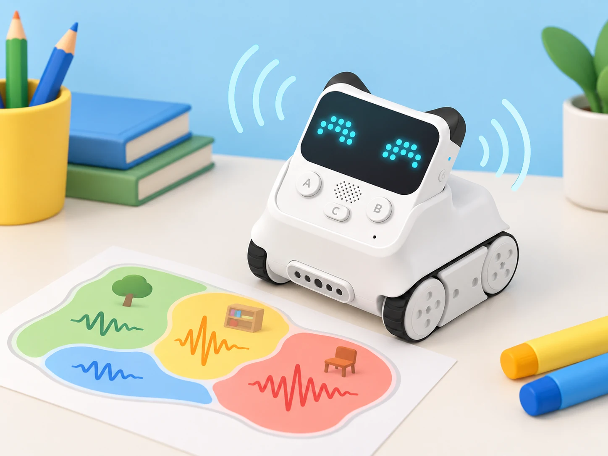
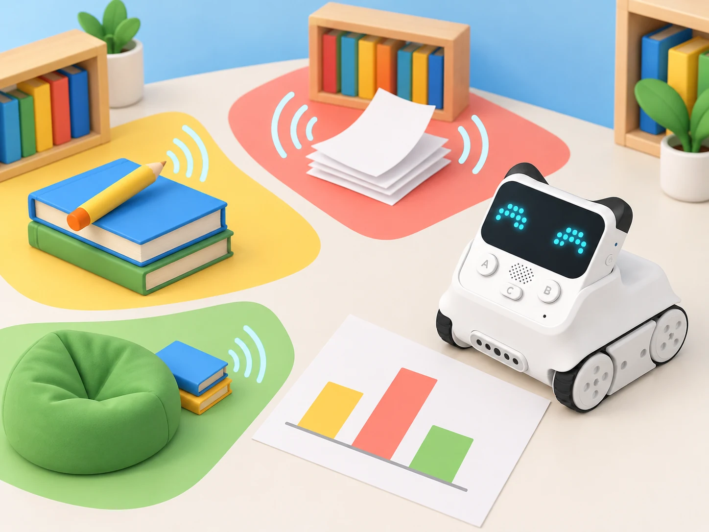

_El sensor de so permet comparar mostres en unes condicions acordades; no grava ni identifica què o qui ha produït el so._

## Situació, repte i intenció

La biblioteca de l’escola vol una guia senzilla perquè cada grup puga triar on llegir, conversar en veu baixa o preparar una activitat. La classe construirà un mapa sonor a partir de proves breus i repetibles amb Codey Rocky. El sensor de so del robot ofereix lectures del nivell de so de l’entorn; cada equip les compararà amb les d’altres proves i les representarà com a **valors relatius**, sense convertir-les en decibels ni afirmar que mesuren el benestar d’una persona.

El repte parteix de tres escenaris ficticis reproduïts amb materials —paper que s’arruga suaument, pàgines que es passen i un llapis que toca una coberta—, no de converses ni d’enregistraments de l’alumnat. Les proves es fan en una taula preparada, mantenint el robot quiet i controlant distància, orientació i durada. El producte final serà una guia visual revisable: mostrarà què s’ha provat, en quines condicions i quines decisions encara hauria de prendre la comunitat escolar.

## Aprenentatges i vocabulari

- Distingir **so**, lectura del sensor i interpretació; justificar per què són tres coses diferents.
- Formular una pregunta investigable i mantindre constants la distància, la posició, la durada i la font sonora.
- Llegir valors relatius del sensor de so, repetir mesures i representar-ne el rang sense atribuir-li unitats que no s’han calibrat.
- Construir una regla condicional amb dos llindars i provar els casos inferior, igual i superior.
- Comparar una predicció amb dades, identificar una lectura atípica sense esborrar-la i proposar una nova prova.
- Comunicar una recomanació d’organització de l’espai amb evidència i límits explícits, sense establir normes de conducta o diagnòstics sobre les persones.

**Vocabulari:** font sonora, sensor, lectura, variable, llindar, repetició, rang, cas límit, representació i límit del model.

## Materials i preparació

- Codey Rocky de la dotació, amb bateria carregada i mBlock 5 instal·lat en un dispositiu compatible.
- Targetes de tres escenaris de prova; paper, un llibre i un llapis per produir sons suaus i breus.
- Regla o cinta mètrica, cronòmetre i full de registre amb camps per a codi de mostra, distància, durada, lectura i incidències.
- Cartolina gran, retoladors i adhesius per al mapa; opcionalment, full de càlcul sense noms ni dades personals.
- Una zona plana, estable i sense obstacles. Col·loqueu-hi el robot quiet i el material sonor en una posició marcada; manteniu el sensor orientat igual durant tota la sessió.

Abans de la classe, comproveu en el model i la versió de mBlock del centre que el bloc de lectura de so està disponible. Feu lectures de prova amb la sala en repòs i amb cadascun dels materials, i determineu un interval que l’equip puga distingir de manera repetible. Els valors de cada model i entorn poden variar: els llindars de l’activitat s’estableixen amb la prova local, no es copien d’una fitxa ni s’interpreten com a dB. Si el bloc no està disponible o varia massa, useu una escala d’observació manual i marqueu les dades com a simulació.

## Seqüència didàctica · cinc sessions

### **Què vol dir llegir un so? (45 min).**

#### Fase 1 · Activem i prediem

Presenteu tres targetes sense fer cap prova encara. En grups, ordeneu-les segons el nivell de so que espereu i expliqueu quina condició podria canviar el resultat. Acordeu que la investigació compara mostres, no classifica persones ni jutja si una aula és bona o roïna.

#### Fase 2 · Explorem i construïm

Poseu Codey Rocky en una marca de la taula, amb el sensor de so lliure i el robot immòbil. Observeu la lectura en repòs durant un interval curt. Repetiu-la amb una sola acció sonora suau —per exemple, passar una pàgina a una distància marcada— i torneu al silenci abans de la següent prova. No parleu cap frase davant del sensor ni feu crits, palmades fortes o sons sobtats.

#### Fase 3 · Expliquem i registrem

Dibuixeu el recorregut de la dada: **font sonora → sensor → valor mostrat → interpretació de l’equip**. Registreu una observació i una interpretació diferents. Per exemple: «el valor ha pujat durant la prova» és una observació; «aquesta zona sempre és sorollosa» encara no està justificat.

#### Fase 4 · Apliquem i millorem

Canvieu només la distància a la font i observeu si la lectura canvia. Després torneu a la marca inicial. Anoteu qualsevol diferència i proposeu com evitar que la posició explique el resultat en lloc del material.

#### Fase 5 · Comprovem i reflexionem

Cada equip lliura el diagrama de la dada i una pregunta que es puga investigar sense enregistrar persones. **Evidència:** predicció inicial, observació, interpretació i una variable que cal controlar.

### **Preparem un protocol de comparació (45 min).**

#### Fase 1 · Activem i prediem

Recupereu les lectures de la sessió anterior. Què hauria de mantindre’s igual perquè dues proves siguen comparables? Anoteu una predicció per a cadascun dels tres materials i una possible font d’error.

#### Fase 2 · Explorem i construïm

Definiu un protocol comú: mateixa taula, mateixa orientació del robot, mateixa distància entre sensor i font, mateixa durada i una pausa entre proves. Una persona prepara el material, una altra inicia el programa, una tercera registra el valor i una quarta comprova el protocol. Canvieu els rols després de cada font.

```blocks
quan comença
  mostra la lectura del sensor de so
  espera l'interval acordat
  registra el valor i el codi de mostra
  torna a l'estat de repòs
```

#### Fase 3 · Expliquem i registrem

Feu tres repeticions de cada mostra. Registreu tots els valors, incloses les lectures inesperades. Calculeu el mínim, el màxim i el rang (màxim − mínim); no useu una mitjana si les lectures són tan disperses que amaga la variació.

#### Fase 4 · Apliquem i millorem

Intercanvieu els fulls entre parelles. Comproveu si una altra parella podria repetir el protocol sense preguntar-vos cap pas. Si falta distància, durada o codi de mostra, afegiu-ho i repetiu una prova.

#### Fase 5 · Comprovem i reflexionem

Compareu les tres repeticions i destaqueu una lectura estable i una de variable. **Evidència:** protocol datat, registre complet i justificació d’una decisió de control.

### **Construïm una escala relativa i una regla (45–50 min).**

#### Fase 1 · Activem i prediem

Ordeneu les mostres a partir dels rangs observats, no d’una impressió inicial. Marqueu amb un interrogant les que se superposen. Predigueu quin llindar separaria dues categories útils per a la guia i per què eixa separació podria fallar.

#### Fase 2 · Explorem i construïm

Trieu dos llindars a partir de les dades locals i programeu tres estats visibles a la matriu LED: lectura baixa, intermèdia o alta segons l’escala de la classe. Els llindars són convencions de l’activitat, no valors universals. Comproveu al programa que les condicions no se solapen i que cada cas té una resposta.

```blocks
quan comença
  llig el nivell de so
  si és inferior al primer llindar
    mostra el símbol de nivell baix
  altrament si és inferior al segon llindar
    mostra el símbol de nivell intermedi
  altrament
    mostra el símbol de nivell alt
```

#### Fase 3 · Expliquem i registrem

Feu una taula de decisió amb valors per davall, iguals i per damunt de cada llindar. Simuleu cada fila abans d’executar-la i confirmeu què mostra el robot. Si la lectura oscil·la al voltant del límit, anoteu la incertesa; no presenteu el LED com una alarma.

#### Fase 4 · Apliquem i millorem

Canvieu un llindar i torneu a provar les mateixes mostres. Compareu quantes canvien de categoria i si la modificació millora la utilitat del mapa. Torneu a la regla inicial si la nova decisió no es pot justificar amb dades.

#### Fase 5 · Comprovem i reflexionem

Expliqueu amb un exemple per què un valor igual al llindar necessita una regla definida. **Evidència:** programa, taula amb sis casos límit i una comparació entre llindars.

### **Representem el mapa de mostres de la biblioteca (45–50 min).**

#### Fase 1 · Activem i prediem

Mostreu un plànol fictici amb tres espais: taula de lectura, prestatgeria i zona de preparació de materials. La classe no mesurarà ni etiquetarà espais reals ocupats. Predigueu com representaríeu una mostra estable, una variable i una prova que encara no s’ha fet.

#### Fase 2 · Explorem i construïm

Assigneu cada material a una zona fictícia i situeu-hi el codi de mostra, no el nom de cap persona. Enregistreu de nou tres repeticions per material amb el protocol. Traslladeu al mapa una escala de colors acordada pel grup i afegiu-hi la distància i el rang observat.



_Les zones de color representen escenaris controlats de prova, no una vigilància de la biblioteca ni una mesura de l’estat de les persones._

#### Fase 3 · Expliquem i registrem

Una parella que no ha fet les mesures interpreta el mapa. Demaneu-li que assenyale quines conclusions estan sostingudes per les repeticions i quines dependrien de mesurar l’espai real. Afegiu una llegenda per a «prova estable», «lectura variable» i «sense dades».

#### Fase 4 · Apliquem i millorem

Canvieu un detall del mapa perquè siga més clar en escala de grisos i per a persones que no distingeixen els colors: incorporeu formes, patrons o etiquetes breus. Comproveu si la informació continua sent entenedora sense dependre només del color.

#### Fase 5 · Comprovem i reflexionem

Valideu la llegenda amb una interpretació en veu alta o amb targetes de resposta. **Evidència:** mapa amb unitat d’escala definida pel grup, valors i rangs, codi de mostra i llegenda accessible.

### **Proposem una guia responsable i la revisem (45–60 min).**

#### Fase 1 · Activem i prediem

Llegiu tres recomanacions fictícies: una basada en una sola lectura, una que afirma usar decibels sense calibratge i una que descriu les condicions de la prova. Trieu quina és més responsable i indiqueu quina dada necessitaríeu per millorar les altres.

#### Fase 2 · Explorem i construïm

Prepareu una guia d’una pàgina amb pregunta, protocol resumit, mapa, una troballa sostinguda per dades i un límit. Redacteu recomanacions com a opcions d’organització de materials o espais, no com a ordres a les persones. Incloeu una alternativa sense robot per a repetir la comparació amb una escala observacional.

#### Fase 3 · Expliquem i registrem

Feu una galeria de guies. Cada equip deixa un comentari basat en evidència: «la repetició mostra…», «ens falta saber…» o «podríeu aclarir…». No es comparen equips per qui obté les lectures més baixes.

#### Fase 4 · Apliquem i millorem

Reviseu una afirmació perquè distingisca dada i proposta. Afegiu una nota que explique que el sensor pot respondre a sons diferents, que el valor depén del model i de les condicions, i que no hi ha enregistrament ni reconeixement de parla.

#### Fase 5 · Comprovem i reflexionem

Presenteu la guia final i responeu: quina decisió pot ajudar a prendre, quina dada la sosté i què queda fora del model? **Evidència:** guia revisada, registre de proves, codi i retorn incorporat.

## Evidències i avaluació

Recolliu el diagrama de la dada, el protocol, el codi, les repeticions, la taula de casos límit, el mapa i la guia final. Useu una escala de tres nivells —**inicial**, **en procés**, **consolidat**— en aquests criteris:

- Manté o identifica les condicions que cal controlar per comparar dues mostres.
- Registra totes les repeticions i descriu el rang sense ocultar lectures variables.
- Programa i explica una regla condicional que inclou els casos iguals al llindar.
- Separa el valor llegit de la interpretació i limita les conclusions al que s’ha provat.
- Revisa una representació perquè puga llegir-se sense dependre només del color.

L’autoavaluació demana quin canvi ha fet l’equip després d’una dada inesperada. La coavaluació revisa si el mapa mostra escala, repeticions, condicions i límits. No s’avalua la capacitat de mantindre el silenci ni el nivell sonor d’una classe.

## Participació, accessibilitat i seguretat

Cap activitat grava, emmagatzema o classifica la veu. No s’usen noms, converses, enregistraments ni mesures de persones; les mostres són materials i accions controlades. Es fan sons suaus, breus i anticipats, i qualsevol alumne pot triar un rol sense produir o escoltar el so. No es fa servir el dispositiu per a controlar el comportament, comparar grups o fer afirmacions clíniques.

Oferiu rols de programació, preparació, registre, comprovació i comunicació, amb rotació o elecció. Les instruccions es donen en text i oralment; el mapa incorpora patrons, icones i paraules a més dels colors. Qui ho preferisca pot registrar valors que dicta una parella, ordenar targetes de casos o seguir la mateixa taula de decisió en paper. Manteniu el robot quiet durant la lectura, eviteu sons forts i desconnecteu-lo abans de moure’l entre proves.

## Referents i adaptació

La fitxa pren com a referent la descripció oficial dels mòduls de Codey Rocky de Makeblock: el [sensor de so](https://support.makeblock.com/hc/en-us/articles/1500004392242-About-Codey-Rocky) detecta el nivell sonor de l’entorn; el robot també té matriu LED i indicador RGB. La [fitxa de producte](https://www.makeblock.com/pages/codey-rocky-robot-toys-for-kids) enumera els mòduls integrats. La situació transforma eixa capacitat en una investigació escolar pròpia amb materials controlats i lectura crítica; no és una adaptació d’una lliçó oficial concreta ni promet mesuraments calibrats en decibels.
