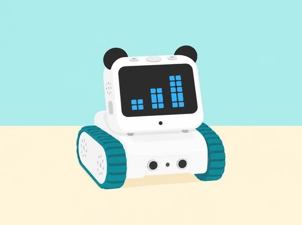
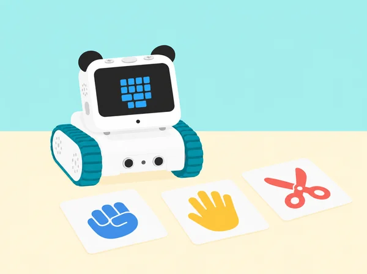
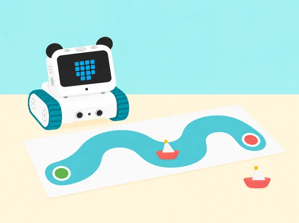
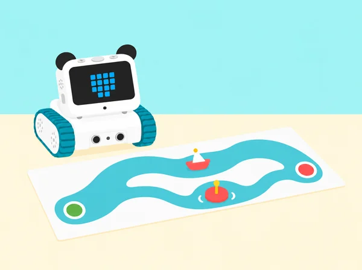
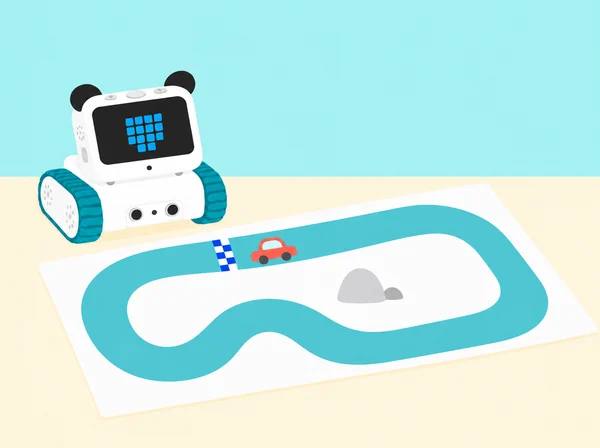
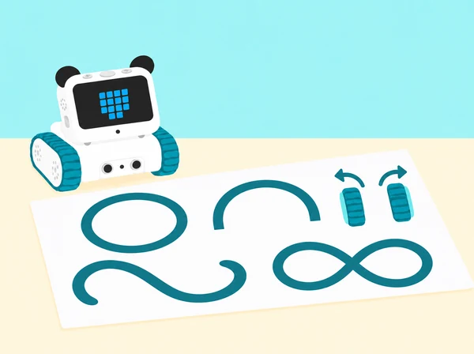
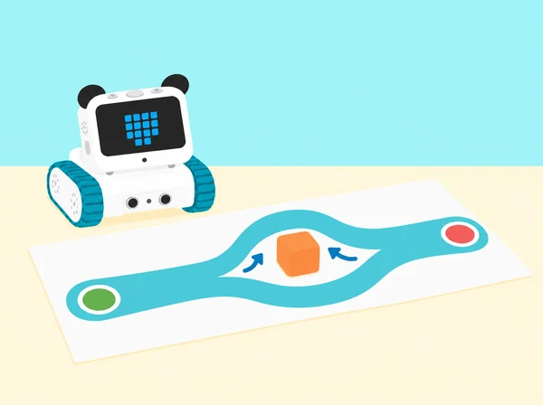
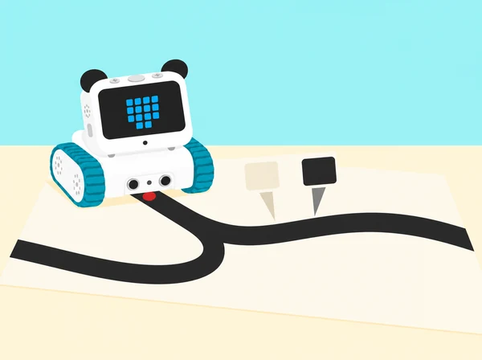

_El museu és una proposta pròpia; cada mòdul construeix un joc petit amb codi visible i proves repetibles._

## 🌱 Situació i producte final

L’alumnat prepara una exposició interactiva per a la comunitat educativa. En parelles, dissenya jocs i reptes que combinen pantalla LED, botons, variables, sensors reals i moviment. Cada sessió deixa un artefacte provable i un registre breu de decisions. La progressió proposa una interpretació local per a cadascun dels 24 títols CSTA publicats per Makeblock. Els plans docents s’han contrastat directament per a les lliçons 1, 3, 4, 13, 14, 15, 17 i 18. Per a les lliçons 1–16, els objectius públics del curs diferent *Codey Rocky & Neuron Discovery* permeten una comprovació addicional, però no substitueixen les fitxes CSTA. La resta de sessions s’identifica com a adaptació pròpia del títol i l’objectiu públic. No incorpora Neuron ni cap accessori extern com a requisit.

Quan un repte oficial es basa en una història o joc concret, ací es transforma en un context de barri o centre. Cap activitat utilitza dades personals, velocitat corporal o sons enregistrats. Les proves de moviment es fan en una zona buida i amb una persona observadora.

## 🎯 Aprenentatges i vocabulari

- Reconéixer els components de Codey Rocky que es proven i relacionar botons, sensors i pantalla amb les respostes programades.
- Construir programes amb seqüències, repeticions, condicions, variables i funcions segons el repte de cada lliçó.
- Crear animacions i mecàniques de joc, i provar-les amb casos previstos i casos que poden fer fallar el programa.
- Depurar una instrucció concreta i explicar els límits de cada joc o moviment abans de compartir-lo amb una altra persona.

## 📅 Seqüència completa · 24 sessions

### **L1 · El secret de Codey Rocky · del problema al primer programa (40 min).**

#### Fase 1 · Activem i prediem (5 min)

Mostreu Codey Rocky apagat i un conjunt de targetes amb robots de contextos diferents. En parelles, relacioneu cada robot amb una tasca possible i expliqueu quina observació us ha fet triar-la. Diferencieu una funció comprovada d’una suposició: aquesta activitat no demana activar reconeixement facial ni cap servei d’intel·ligència artificial.

#### Fase 2 · Explorem i construïm (10 min)

Observeu les dues parts del robot de la dotació. Codey conté el controlador, pantalla LED, botons, llums, altaveu i sensors integrats; Rocky n’és la base mòbil, amb motors i sensor frontal inferior. Feu un inventari dibuixat de les peces que realment veieu i assenyaleu una capacitat que vulgueu comprovar. No afegiu accessoris externs al mapa del kit.

#### Fase 3 · Expliquem i registrem (10 min)

Construïu un esquema propi **idea → programa → càrrega → acció**. Expliqueu que un programa és una seqüència d’instruccions que es tradueix a blocs; el robot només executa allò que s’ha programat i carregat. En mBlock 5, localitzeu escenari, categories de blocs i àrea de codi. Feu una predicció abans de connectar cap dispositiu.

#### Fase 4 · Apliquem i millorem (10 min)

Connecteu Codey amb el cable USB, enceneu-lo i seleccioneu el port sèrie correcte en mBlock 5. Creeu una acció mínima amb l’esdeveniment de prémer A i una icona de pantalla; carregueu el programa, desconnecteu el cable de dades i poseu el robot sobre una superfície estable abans de provar-lo. Si no respon, reviseu alimentació, port, mode de càrrega i esdeveniment, d’un en un.

#### Fase 5 · Comprovem i reflexionem (5 min)

**Evidència:** inventari de Codey/Rocky, diagrama idea-programa-acció, captura o dibuix dels blocs, resultat de la prova i una dificultat resolta. Tanqueu amb les frases «hui he aprés…», «el problema era…» i «l’he resolt…»; es pot respondre amb text, dibuix o explicació oral.


_Les targetes i la interfície són una representació pròpia; el robot parteix del model Codey Rocky treballat a classe._

### **L2 · Botons i expressions programades (40 min).**

#### Fase 1 · Activem i prediem (5 min)

Recordeu una entrada i una eixida de la lliçó anterior. Presenteu una situació neutral: “quan entrem en una aula fosca, premem l’interruptor i s’encén el llum”. Identifiqueu l’acció que inicia la resposta i predigueu què passaria si no es produïra. En aquesta SDA, les icones de pantalla són símbols triats per l’equip: no mesuren ni representen l’estat emocional de cap persona.

#### Fase 2 · Explorem i construïm (10 min)

Feu una versió pròpia del joc desconnectat «Segueix les instruccions»: assigneu tres o quatre senyals geomètrics a accions simples de paper, com alçar una targeta, dibuixar una forma o girar una fitxa. Una persona mostra el senyal i el grup executa l’acció acordada; proveu una ronda lenta i una amb els senyals en un altre ordre. Qui preferisca no fer moviments pot ser qui mostra les targetes, marca la seqüència o comprova si la resposta correspon al senyal.

#### Fase 3 · Expliquem i registrem (10 min)

En mBlock, localitzeu un esdeveniment d’inici i els blocs «quan es prem A», «B» i «C». Seguiu amb el dit el programa model i expliqueu la relació entrada–resposta. Distingiu l’esdeveniment (inici o botó premut) de l’acció programada (mostrar una icona, reproduir un so o combinar les dues). Abans de carregar res, dibuixeu una taula amb les tres entrades, la resposta esperada i una comprovació; si la versió de l’app o el dispositiu no mostra algun bloc, anoteu la diferència i continueu amb les entrades disponibles.

#### Fase 4 · Apliquem i millorem (10 min)

En parelles, programeu una resposta diferent per a cada botó amb símbols i sons propis o d’ús lliure. Feu una primera prova guiada i després canvieu els rols: una persona programa i l’altra comprova, sense tocar el projecte. Proveu cada entrada almenys dues vegades i una vegada l’inici; registreu si la resposta coincideix amb la taula. Ajusteu un bloc cada vegada. El so és opcional: oferiu sempre una versió silenciosa i no useu etiquetes com “content”, “trist” o “enfadat” per inferir com se sent qui participa.

#### Fase 5 · Comprovem i reflexionem (5 min)

Cada parella presenta una resposta del seu programa i explica quin esdeveniment la desencadena. Una altra parella tria una entrada i comprova si el resultat coincideix amb la predicció; si no, l’equip assenyala el primer bloc que cal revisar i proposa una prova nova. **Evidència:** joc desconnectat, taula d’entrades i eixides, programa amb esdeveniments, registre de proves i una explicació breu d’un canvi. La valoració se centra en la relació causa–resposta i en la claredat del codi.

### **L3 · Dissenyem una animació amb seqüències (40 min).**

#### Fase 1 · Activem i prediem (5 min)

Presenteu una escena de biblioteca: una persona arriba, deixa un llibre i tanca el prestatge. Ordeneu tres vinyetes i compareu què deixa de tindre sentit si se n’intercanvien dues. Anomeneu *seqüència* el conjunt d’accions ordenades que completa una tasca.

#### Fase 2 · Explorem i construïm (10 min)

Una persona fa de robot i una altra li dona instruccions per a arribar a una marca i dibuixar una icona. La persona-robot executa literalment les ordres, sense completar passos que no s’han dit. Anoteu una ambigüitat i reescriviu-la abans de repetir.

#### Fase 3 · Expliquem i registrem (10 min)

Obriu un programa amb l’esdeveniment «quan es prem A» i encadeneu quatre fotogrames propis de pantalla amb una duració curta per a cadascun: icona inicial, canvi, gest visual i icona final. Expliqueu com l’ordre dels blocs determina l’animació; no cal representar cares o emocions.

#### Fase 4 · Apliquem i millorem (10 min)

Dibuixeu un fotograma en una graella LED de cinc per cinc. Dupliqueu-ne el bloc, canvieu uns pocs píxels i repetiu la seqüència fins que una altra parella puga reconéixer el moviment o missatge. Carregueu-la i ajusteu l’ordre o la duració a partir d’una observació concreta.

#### Fase 5 · Comprovem i reflexionem (5 min)

**Evidència:** vinyetes ordenades, programa de quatre fotogrames, predicció, comentari de l’audiència i una revisió. Un altre equip explica què ha entés abans de rebre el títol de la peça.

### **L4 · Detectem i corregim un error (40 min).**

#### Fase 1 · Activem i prediem (5 min)

Expliqueu que un *bug* és un defecte del programa que provoca una diferència entre el resultat esperat i l’observat. Poseu un exemple quotidià —una instrucció que omet una parada— i distingiu-lo d’una limitació del sensor o d’un problema de connexió.

#### Fase 2 · Explorem i construïm (15 min)

Prepareu tres programes curts amb un error cadascun: una ruta de maqueta que no arriba a una clau dibuixada; una parada que no s’activa abans d’un obstacle tou; i un compte arrere que no acaba mostrant el missatge final. L’últim cas substitueix la bomba fictícia del material d’origen per una càpsula de missatge segura. Abans d’executar, cada parella escriu el resultat esperat; després registra el punt on la prova es desvia.

#### Fase 3 · Expliquem i registrem (5 min)

Descriviu el símptoma i compareu-lo amb el programa. Reviseu esdeveniment inicial, ordre, valor i condició; separeu els errors de codi dels errors de maquinari. No canvieu simultàniament diversos blocs.

#### Fase 4 · Apliquem i millorem (10 min)

Canvieu una sola instrucció, torneu a executar el mateix cas i comproveu si s’ha resolt la desviació. Si no, desfeu el canvi i proveu una hipòtesi diferent. Una parella revisora intenta reproduir el resultat amb les mateixes condicions.

#### Fase 5 · Comprovem i reflexionem (5 min)

**Evidència:** predicció, símptoma, hipòtesi, canvi únic, resultat i conclusió. Marqueu si la causa era un bloc, una connexió o una expectativa mal definida; no doneu per corregit un error fins que una prova ho confirme.

### **L5 · Bucle comptat (40 min).**

#### Fase 1 · Activem i prediem (5 min)

Recupereu la idea de seqüència de L3: quins passos es repeteixen quan plantem un plançó i quins només fem una vegada? En una tira de quatre vinyetes, mostreu una granota de paper que travessa quatre illots de la marjal. Abans de programar, marqueu quants salts ha de fer i quina imatge obrirà i tancarà l’animació. Distingiu “quatre salts” d’una seqüència amb quatre blocs diferents.

#### Fase 2 · Explorem i construïm (10 min)

Modeleu el bucle comptat amb una ruta de plantació: fer un clot, posar un plançó i cobrir-lo és una volta; avançar fins al següent punt prepara la volta següent. Si el tram té quatre punts, repetiu el fragment el nombre de vegades acordat i compareu-lo amb escriure totes les ordres una per una. Marqueu al diagrama quin fragment queda dins de `repeteix` i què passa abans/després del bucle.

#### Fase 3 · Expliquem i registrem (10 min)

En mBlock, programeu amb el botó A una animació original: mostrar la granota preparada, mostrar el salt, reproduir una pausa breu i tornar a la posició inicial; poseu el fragment dins d’un `repeteix (4)` perquè arribe als quatre illots. Seguiu la primera, segona i última iteració amb una taula de traça: número de volta, fotograma esperat i observat. Expliqueu què inicia el programa i per què el bucle acaba després del recompte fixat.

#### Fase 4 · Apliquem i millorem (10 min)

En parelles, creeu una segona versió: podeu canviar el nombre de salts, les imatges o el so opcional, però canvieu una sola variable de disseny cada vegada. Afegiu una història breu ambientada en un lloc pròxim —per exemple, la granota arriba a una zona de vegetació— sense presentar el dibuix com una observació real. Intercanvieu els programes: l’equip visitant prediu el nombre de voltes i comprova si el resultat coincideix. El so es pot substituir per una pausa visual.

#### Fase 5 · Comprovem i reflexionem (5 min)

Cada parella presenta l’animació i respon: què representa una iteració, quantes n’hi ha i quin canvi ha fet més clara la història? Registreu un problema trobat i com l’heu resolt; tanqueu amb un exemple de bucle comptat de la vida quotidiana, com repetir una ruta de quatre parades. **Evidència:** storyboard, programa activat per un esdeveniment amb bucle comptat, traça, resultat de la prova entre parelles i autoavaluació breu.

**Pregunta docent:** què determina que el bucle acabe després del nombre de voltes acordat?

### **L6 · Bucle continu (40 min).**

#### Fase 1 · Activem i prediem (5 min)

Recupereu el programa de L5 i compareu `repeteix (4)` amb una seqüència que no té un nombre fix de voltes. Useu el cicle de llum i foscor com a exemple natural que es repeteix, i dibuixeu tres fotogrames per representar una alba i una posta de sol sobre la marjal. Predigueu quin programa acabarà després d’un nombre establit i quin continuarà fins que algú el detinga.

#### Fase 2 · Explorem i construïm (10 min)

En mBlock, feu una animació finita amb un esdeveniment de botó i un `repeteix`; després, creeu-ne una segona amb un altre botó i poseu la seqüència dins de `per sempre`. Alterneu tres fotogrames propis amb pauses prou llargues perquè es puguen llegir. Reserveu el botó C per a aturar els scripts actius amb el control de parada disponible a la versió de mBlock del centre; proveu primer la parada amb el robot quiet i sense cap moviment de motors.

#### Fase 3 · Expliquem i registrem (10 min)

Compareu els programes bloc a bloc: quin té un nombre de voltes definit i quin no incorpora cap eixida natural? Executeu-los i registreu inici, dos cicles observats, ordre d’aturada i resposta final. Verifiqueu que el botó C interromp la seqüència; si l’entorn no permet aquesta interrupció des del programa carregat, atureu-la des de mBlock i deixeu anotada la limitació. Expliqueu per què un bucle infinit necessita un control de parada accessible.

#### Fase 4 · Apliquem i millorem (10 min)

En parelles, canvieu les imatges, l’ordre, una pausa o el so opcional i proveu si la història continua sent comprensible en tots dos programes. L’equip revisor comprova que la versió comptada acaba sola i que la versió contínua respon a l’aturada. No feu pampallugues ràpides ni sons sobtats; qui ho preferisca pot analitzar les targetes de fotogrames en paper, amb la mateixa predicció de bucle.

#### Fase 5 · Comprovem i reflexionem (5 min)

Cada equip presenta les dues animacions i respon quina utilitza `repeteix`, quina `per sempre` i com n’ha comprovat la finalització. Completeu una autoavaluació: un bucle comptat de la vida quotidiana, un procés cíclic que no té un final fix i una precaució necessària quan un programa continua actiu. **Evidència:** storyboard de tres fotogrames, dos programes amb esdeveniments diferents, registre de cicles/aturada, retorn d’una altra parella i autoavaluació.

**Pregunta docent:** com sap l’usuari que el bucle està actiu i com pot acabar-lo?

### **L7 · Cursa I: colors i obstacles (40 min).**

#### Fase 1 · Activem i prediem (5 min)

Repasseu que una condició permet executar una instrucció si és certa i saltar-la si és falsa. Feu una «capsa de condicions» amb targetes de prova fàcils d’identificar i no personals (per exemple, «la fitxa és verda»): qui trau una targeta decideix si es compleix i segueix la instrucció associada. Després, predigueu com podria respondre Codey davant d’una bandera verda o d’un obstacle en una pista de maqueta. No és una cursa de velocitat.

#### Fase 2 · Explorem i construïm (10 min)

Identifiqueu el mòdul IR de Rocky i comproveu el seu selector d’orientació: cap avall per llegir color/superfície, cap avant per detectar un obstacle. Són dues configuracions de prova, no dues lectures simultànies. Prepareu una porta amb targeta verda i una altra de color diferent; en una segona taula, poseu un obstacle tou i ample. Manteniu la base parada mentre canvieu l’orientació i comproveu al bloc de sensor què llig cada posició.

#### Fase 3 · Expliquem i registrem (10 min)

En la configuració cap avall, programeu el botó A i una condició `si color = verd`: avanceu només un tram curt a velocitat baixa si la lectura coincideix; altrament, quedeu-vos aturats. En la configuració cap avant, feu una prova independent `si obstacle detectat`: atureu-vos, gireu a l’esquerra una quantitat limitada i avanceu només una casella de maqueta abans d’aturar-vos. El bloc de proximitat es tracta com una detecció, no com una mesura exacta de distància. Registreu per separat orientació, entrada, valor/estat, condició vertadera o falsa i resposta.

```blocks
quan es prem A
  si el color llegit és verd
    avança a velocitat baixa un tram curt
  si no
    atura els motors

quan es prem A  // en la prova amb el sensor orientat cap avant
  si es detecta un obstacle
    atura els motors
    gira a l'esquerra una vegada
    avança una casella i atura
```

#### Fase 4 · Apliquem i millorem (10 min)

Completeu una bateria de casos en dues tandes: amb el sensor cap avall, targeta verda i no verda; cap avant, obstacle present i absent. Feu tres intents per cas sense moure la llum ni el material entre lectures. Si el color no es reconeix de manera estable, augmenteu la superfície de la targeta o useu una targeta d’entrada simulada. Si l’obstacle no es detecta, reviseu l’orientació i el bloc utilitzat. No combineu els resultats com si el robot haguera llegit ambdues entrades en un mateix instant.

#### Fase 5 · Comprovem i reflexionem (5 min)

**Evidència:** dibuix de les dues orientacions del sensor, taules independents de casos vertaders/falsos, programes o simulacions identificades i una revisió justificada. Expliqueu quin bloc representa una decisió booleana i per què la lectura de color i la d’obstacle s’han provat en moments diferents.

**Pregunta docent:** quina observació ha fet certa cada condició i què canvia quan girem el sensor?
### **L8 · L’estació de servei i el túnel de la marjal (40 min).**

#### Fase 1 · Activem i prediem (5 min)

Recupereu les condicions vertadera/falsa de L7 i compareu una seqüència de tres `si` amb un `repeteix` que conté una condició. Presenteu dos reptes de maqueta: eixir d’una estació de servei orientada a l’esquerra, a la dreta o cap avant, i travessar un túnel fosc canviant la velocitat. Predigueu quins sensors i quines dades necessita cada repte; no es llegiran color i obstacle alhora.

#### Fase 2 · Explorem i construïm (10 min)

Construïu una estació amb llibres o caixes de cartó que deixen un únic corredor de sortida i un túnel curt de cartolina. Marqueu els tres possibles sentits inicials de Codey Rocky. Gireu el mòdul IR cap avant per detectar obstacles en l’estació; el sensor de llum integrat en Codey s’usa en una prova separada del túnel. Manteniu velocitat baixa i espai lliure al voltant de les rodes. Abans d’executar, comproveu que el programa correspon a l’orientació de sensor prevista.

#### Fase 3 · Expliquem i registrem (10 min)

Programeu l’eixida amb una condició dins d’un bucle comptat: si hi ha un obstacle davant, gireu a la dreta 90°; repetiu la comprovació fins a tres vegades, de manera que l’orientació inicial no determine l’èxit. Quan el camí quede lliure, gireu cap al corredor de la maqueta i avanceu una casella a velocitat baixa. Anoteu l’orientació inicial, els girs executats i si s’ha trobat l’eixida.

```blocks
quan es prem A
  repeteix 3 vegades
    si hi ha obstacle davant
      gira a la dreta 90 graus
  si el camí està lliure
    gira cap al corredor
    avança una casella a velocitat baixa
```

#### Fase 4 · Apliquem i millorem (10 min)

Proveu les tres orientacions inicials. Després, en una tanda independent, useu el sensor de llum de Codey per comparar el passadís clar amb el túnel ombrejat. Registreu primer lectures de les dues condicions i trieu un llindar entre els valors observats; són valors del sensor, no lux calibrats. Dins d’un segon `repeteix 3`, llegiu la llum, espereu un segon i apliqueu l’operador `<`: si el valor queda per davall del llindar, enceneu l’indicador RGB blanc i reduïu la velocitat; si no, apagueu l’indicador i manteniu la velocitat de prova. Feu tres lectures en cada condició i no presenteu el llindar com una mesura de seguretat real.

```blocks
repeteix 3 vegades
  llig la llum ambiental
  espera 1 segon
  si la llum és menor que el llindar
    encén l’indicador RGB blanc
    mou-te a velocitat reduïda
  si no
    apaga l’indicador RGB
    mantín la velocitat de prova
```

#### Fase 5 · Comprovem i reflexionem (5 min)

Compareu els girs observats en les tres orientacions i la taula de llum clara/ombra. Expliqueu per què el bucle redueix codi repetit, què retorna una comparació `<` i quina diferència hi ha entre el mòdul IR orientat cap avant i el sensor de llum de Codey. **Evidència:** diagrama de l’estació, dos programes amb `repeteix` i `si`, registre d’orientacions, valors de llum i revisió d’una prova.

**Pregunta docent:** quines parts del repte reutilitzen un bucle i quina lectura del sensor justifica cada condició?

### **L9 · Una barra que respon al paisatge sonor (40 min).**

#### Fase 1 · Activem i prediem (5 min)

Al museu escolar de l’Albufera, una pantalla interpreta l’activitat sonora de l’entorn com una barra de tres altures. Sense gravar ni identificar cap font, predigueu què hauria de mostrar davant d’una lectura baixa, mitjana o alta. El sensor retorna un valor de nivell relatiu; no és una mesura calibrada de decibels ni permet saber qui o què ha produït el so.

#### Fase 2 · Explorem i construïm (10 min)

Localitzeu el sensor de so de Codey en la versió de mBlock disponible i observeu com canvia la lectura davant de tres estímuls suaus i acordats. No feu crits ni sorolls sobtats: es pot treballar amb el soroll ambient habitual o amb una seqüència de valors simulats en paper si el sensor o el bloc no està disponible. Anoteu que la lectura depén del dispositiu, la distància i l’entorn; no enregistreu àudio.

#### Fase 3 · Expliquem i registrem (10 min)

Construïu la barra de tres altures amb una condició dins d’un únic bucle `per sempre`. La branca alta correspon a `nivell > 20`; la mitjana, a `10 ≤ nivell ≤ 20`, expressada amb l’operador lògic **i**; la baixa, a `nivell < 10`. Són llindars didàctics del repte oficial, no valors universals del sensor. Traceu els casos 9, 10, 15, 20 i 21 abans de provar-los.

```blocks
per sempre
  llig el nivell de so
  si nivell > 20
    mostra barra alta
  si no
    si nivell >= 10 i nivell <= 20
      mostra barra mitjana
  si no
    si nivell < 10
      mostra barra baixa
```



_Representació visual de tres nivells: la pantalla mostra una resposta programada, no un valor de decibels ni una gravació._

#### Fase 4 · Apliquem i millorem (10 min)

Comproveu cada frontera (9, 10, 20 i 21) amb l’entrada real o amb valors simulats. Després, feu l’extensió oficial: afegiu una resposta de color amb l’indicador RGB o dividiu una de les franges en dos nivells. Manteniu el bucle de lectura i torneu a provar totes les fronteres que puga afectar el canvi.

#### Fase 5 · Comprovem i reflexionem (5 min)

**Evidència:** taula de valors i eixides per als cinc casos, programa amb condició dins del bucle continu i una explicació de com l’operador **i** delimita la franja intermèdia.

**Pregunta docent:** què passa exactament amb els valors 10 i 20, i com podem demostrar que cap lectura queda sense una resposta definida?
### **L10 · Funcions de bon dia (40 min).**

#### Fase 1 · Activem i prediem (5 min)

Presenteu l’obertura del museu de la marjal: abans d’entrar el públic, cal preparar una icona de benvinguda, deixar una pausa i mostrar un missatge breu. Pregunteu com podem donar un nom curt a una seqüència d’accions perquè siga fàcil de tornar a cridar. Una funció agrupa instruccions sota un nom; no és només un esdeveniment ni una animació.

#### Fase 2 · Explorem i construïm (10 min)

En equips, repartiu targetes amb funcions fictícies d’obertura (preparar la pantalla, mostrar la icona, fer una pausa, reproduir un so opcional) i algunes que no corresponen a l’esdeveniment. Doneu un nom clar a cada grup d’accions, trieu quines funcions cal cridar quan Codey s’inicia i ordeneu-les. Compareu si alguna sobra, si una s’ha cridat dues vegades o si el nom no descriu les accions. Es pot llegir la seqüència sense representar-la corporalment.

#### Fase 3 · Expliquem i registrem (10 min)

En mBlock 5, obriu **Els meus blocs / My Blocks**, creeu una funció pròpia `benvinguda_marjal` i definiu-hi les instruccions de la pantalla. Després, crideu-la des de l’esdeveniment d’inici de Codey. Traceu l’ordre: esdeveniment → crida → instruccions de la funció → final de la seqüència. Registreu la diferència entre definir una funció i cridar-la.

```blocks
defineix benvinguda_marjal
  mostra icona de la marjal
  espera 1 segon
  mostra missatge de benvinguda

quan Codey inicia
  crida benvinguda_marjal
```

#### Fase 4 · Apliquem i millorem (10 min)

Personalitzeu la funció amb una segona icona o un missatge propi i compareu-la amb una versió que repetisca els mateixos blocs sense funció. Comproveu que la crida d’inici executa tota la seqüència i que el nom continua sent precís. El so és opcional; manteniu l’alternativa visual silenciosa.

#### Fase 5 · Comprovem i reflexionem (5 min)

**Evidència:** targetes ordenades, funció definida i cridada en iniciar, traça de l’execució i comparació amb la versió sense funció.

**Pregunta docent:** què passa si definim una funció però no la cridem, i com sabem que el nom representa realment les instruccions que conté?

### **L11 · Petit vigilant I: missions i distàncies (40 min).**

#### Fase 1 · Activem i prediem (5 min)

El museu escolar vol una maqueta de patrulla amb dos recintes quadrats connectats per un passadís. Dibuixeu l’inici, els dos quadrats i la connexió; mesureu un costat i el passadís amb la mateixa unitat. Predigueu quina seqüència es pot encapsular en una funció repetible i quines dades falten abans de calcular el temps del trajecte.

#### Fase 2 · Explorem i construïm (10 min)

Marqueu la ruta sobre paper gran o amb cinta de pintor en una zona de terra lliure i plana; manteniu el robot allunyat de taules, escales i passadissos de circulació. Mesureu la distància que recorre Codey Rocky durant un segon a una potència baixa i repetible; repetiu tres vegades i calculeu una velocitat de referència. Anoteu costat, connexió, potència i distància observada. El valor d’exemple del manual (14 cm per costat i 7 cm/s a potència 50%) és només una dada per practicar el càlcul: mesureu el robot real abans d’usar-lo.

#### Fase 3 · Expliquem i registrem (10 min)

Definiu `quadrat` com quatre repeticions de «avança una longitud de costat i gira a la dreta». Calculeu el temps aproximat de cada costat amb `temps = distància ÷ velocitat mesurada`, i calibreu per separat el temps de gir de 90° en una prova curta. Si un costat mesura 14 cm i el robot recorre 7 cm/s en la prova, el càlcul inicial és 2 s; no pressuposeu que eixa relació es manté a qualsevol potència o superfície.

```blocks
defineix quadrat
  repeteix 4
    avança durant temps_costat
    gira a la dreta durant temps_gir

quan es prem A
  crida quadrat
  avança durant temps_connexio
  crida quadrat
```

Traceu al mapa la distància total prevista: `2 × (4 × costat) + connexió`. Expliqueu per què cridar la funció dues vegades repeteix el perímetre i per què el tram de connexió va entre les dues crides.

#### Fase 4 · Apliquem i millorem (10 min)

Executeu una volta a potència baixa amb una persona al costat del robot i compareu la posició final amb la línia. Ajusteu una sola dada cada vegada (temps de costat, potència o gir), torneu a provar i registreu l’error. Després, completeu el trajecte amb les dues crides de `quadrat`. Com a extensió, simuleu amb targetes una condició de so elevat; si s’implementa al robot, substituïu la resposta oficial de moviment a màxima potència per una icona lluminosa estacionària, perquè el so no inicie un desplaçament inesperat.

#### Fase 5 · Comprovem i reflexionem (5 min)

**Evidència:** mapa mesurat, tres lectures de calibratge, càlcul de velocitat i temps, funció `quadrat` cridada dues vegades i comparació entre posició prevista i observada.

**Pregunta docent:** quina dada hem mesurat en el robot i quina part del càlcul continua sent una estimació que depén del terra i de la bateria?
### **L12 · Petit vigilant II: funcions per a rutes complexes (40 min).**

#### Fase 1 · Activem i prediem (5 min)

Recupereu el plànol de la primera planta i compareu-lo amb una nova ruta del museu escolar: hi ha més sales, dos passadissos i diversos girs. Predigueu quines funcions de L11 encara serveixen, quines parts cal afegir i com podeu calcular el temps total sense escriure cada moviment des de zero.

#### Fase 2 · Explorem i construïm (10 min)

Dibuixeu una planta pròpia amb tres sales quadrades connectades per dos passadissos i marqueu inici, sentit de circulació i final. Mesureu costat i connexions; feu servir la velocitat de referència i el temps de gir calibrats en L11, però torneu a comprovar-los si canvien el terra, la càrrega o la potència. Una parella revisa que les línies no se sobreposen i que el recorregut tinga una única interpretació.

#### Fase 3 · Expliquem i registrem (10 min)

Reutilitzeu `quadrat` de L11 i definiu funcions separades per als passadissos. Creeu després `planta_marjal`, que crida les funcions en l’ordre del mapa; executeu-la des del botó A. Calculeu `distància prevista = 3 × (4 × costat) + passadís 1 + passadís 2` i `temps previst = distància prevista ÷ velocitat mesurada`, afegint a banda els temps de gir. Si el vostre dibuix necessita una altra forma, canvieu el nombre de trams i anoteu la fórmula corresponent.

```blocks
defineix passadís_1
  avança durant temps_passadís_1

defineix passadís_2
  avança durant temps_passadís_2

defineix planta_marjal
  crida quadrat
  crida passadís_1
  gira segons el mapa
  crida quadrat
  crida passadís_2
  gira segons el mapa
  crida quadrat

quan es prem A
  crida planta_marjal
```

Compareu el càlcul manual amb la traça del programa i identifiqueu quines instruccions són funcions auxiliars i quina és la funció que organitza la missió sencera.

#### Fase 4 · Apliquem i millorem (10 min)

Proveu primer una sola sala i el passadís següent a potència baixa. Compareu la posició real amb la del plànol i canvieu una sola durada cada vegada. Quan els trams passen les proves, executeu la missió completa amb una persona observadora al costat; atureu el robot si ix de la ruta o s’acosta a una zona ocupada. Si no hi ha una zona de prova lliure, feu la validació amb una fitxa sobre el mapa i passos de codi en paper.

#### Fase 5 · Comprovem i reflexionem (5 min)

**Evidència:** mapa de la planta ampliada, funcions auxiliars, funció de missió, càlcul de distància i temps, traça per trams i comparació prevista/observada.

**Pregunta docent:** què hem pogut reutilitzar de L11 i quina part del temps calculat varia quan canvien superfície, bateria o ajust del gir?
### **L13 · La caixa de llavors de l’hort (40 min).**

#### Fase 1 · Activem i prediem (5 min)

Presenteu una caixa fictícia amb 10 fitxes de llavor. Expliqueu la variable com un contenidor amb nom i valor que pot canviar. En parelles, proposeu un nom clar per al comptador i prediu què passa quan n’afegim o en traiem.

#### Fase 2 · Explorem i construïm (10 min)

Prepareu targetes d’esdeveniment locals: «plantem 2» (−2), «arriba una donació de 5» (+5), «usem 3» (−3) o «recollim 4» (+4). Partiu de `reserva = 10`, llegiu les targetes en ordre i actualitzeu el valor en una taula. Afegiu una segona variable anomenada `equip` per registrar fitxes en una altra safata i compareu els dos valors sense barrejar-los.

#### Fase 3 · Expliquem i registrem (10 min)

Traduïu dos esdeveniments a blocs de variables. Proveu també una regla de comparació pròpia: si la reserva baixa de 5, mostrar «cal revisar la caixa»; si supera 12, mostrar «repartim l’excedent». Anoteu valor anterior, operació, valor nou i resposta de la condició. Els llindars són regles del joc d’aula, no recomanacions agronòmiques.

#### Fase 4 · Apliquem i millorem (10 min)

Comproveu com una variable pot controlar una acció física només en zona lliure: amb el botó A, assigneu `velocitat = 30` i feu avançar Codey Rocky durant un segon; atureu-lo i registreu què ha passat. Com a extensió guiada, assigneu `angle = 70`, feu un gir a l’esquerra i després canvieu el valor a 140 per provar el gir contrari. Si el moviment no és segur o el valor depén d’una configuració diferent, feu aquesta part amb una fitxa en quadrícula i marqueu-la com a simulació.

#### Fase 5 · Comprovem i reflexionem (5 min)

**Evidència:** taula de traça de dues variables, condicions de reserva, programa o simulació de velocitat i una revisió. Expliqueu quina informació guarda cada variable i com es reemplaça el valor.

**Pregunta docent:** quin canvi del valor ha provocat la resposta del programa?
### **L14 · Operacions amb el marcador del mercat (40 min).**

#### Fase 1 · Activem i prediem (5 min)

Obriu un marcador fictici que comença a zero. Predigueu què mostrarà després d’afegir una unitat amb A o llevar-ne una amb B; decidiu com representareu valors negatius sense convertir el joc en una puntuació d’alumnes.

#### Fase 2 · Explorem i construïm (10 min)

Creeu una variable `marcador` i assigneu-li el valor 0 en iniciar el programa. Configureu A perquè l’incremente en 1 i B perquè el decremente en 1. Mostreu el resultat en la matriu LED després de cada canvi. Compareu l’operació manual amb el bloc de canvi de variable i observeu què significa restar quan el valor és zero.

#### Fase 3 · Expliquem i registrem (10 min)

Afegiu dos esdeveniments nous amb els blocs d’operadors: A multiplica el valor per 2; B el divideix per 2. Després de cada operació, assigneu el resultat a la mateixa variable i mostreu-lo. Registreu entrada, operació i eixida per a `0`, `4` i `−4`, i compareu el càlcul manual amb el programa.

#### Fase 4 · Apliquem i millorem (10 min)

Canvieu el valor inicial o el factor de multiplicació/divisió i repetiu els mateixos casos. Verifiqueu quin tipus de forma accepta el bloc de variable com a operand i manteniu la mateixa variable en tots els esdeveniments. Recordeu que la pantalla mostra valors entre −999 i 9999; si el càlcul ix d’aquest interval, anoteu el límit en lloc d’interpretar la pantalla com un resultat complet.

#### Fase 5 · Comprovem i reflexionem (5 min)

**Evidència:** programa amb inicialització, A/B, multiplicació/divisió, taula de casos i una comparació manual-programa.

**Pregunta docent:** per què cal guardar el resultat nou en la mateixa variable perquè el marcador continue acumulant els canvis?
### **L15 · La càpsula d’arribada (40 min).**

El pla oficial treballa variables, compte arrere i aleatorietat dins d’un joc d’explosió. Ací en conservem la lògica de programació i eliminem l’explosiu, la por i el pas ràpid del robot entre persones: usem una càpsula de missatge en una taula estable, amb cancel·lació clara i senyal final neutre.

#### Fase 1 · Activem i prediem (5 min)

Mostreu una variable `temps` que comença en 30 i una càpsula de paper. Predigueu quantes actualitzacions hi haurà si el programa resta una unitat cada segon i què ha de mostrar la pantalla quan arribe a zero.

#### Fase 2 · Explorem i construïm (10 min)

En iniciar, assigneu 30 a `temps`. En prémer A, comenceu el compte arrere: espereu un segon, resteu 1, mostreu el valor i repetiu 30 vegades. Quan `temps` arriba a 0, atureu el bucle i mostreu «missatge llest» amb una llum d’un color acordat; el so és opcional i sempre hi ha versió silenciosa. El robot no es passa de mà en mà: els equips roten una targeta de torn.

#### Fase 3 · Expliquem i registrem (10 min)

Traceu els primers tres segons i el final. Comproveu que el valor inicial, la repetició i la condició d’aturada donen 30 actualitzacions, no 29 ni 31. Registreu què passa si el programa s’inicia dues vegades i si una persona prem el control abans que acabe.

#### Fase 4 · Apliquem i millorem (10 min)

Afegiu una cancel·lació amb B que ature el compte i mostre «pausa»; torneu a iniciar des d’un valor conegut. Després, creeu una segona modalitat: en prémer A, genereu `objectiu` a l’atzar entre 1 i 20; cada B incrementa `comptador` en 1 i una condició d’igualtat mostra «objectiu assolit». Proveu els extrems 1 i 20 amb valors forçats abans de deixar l’aleatorietat activa. El nombre aleatori serveix per al joc, no per a seguretat o xifratge.

#### Fase 5 · Comprovem i reflexionem (5 min)

**Evidència:** diagrama d’estats, traça del compte arrere, cancel·lació i proves del valor aleatori, inclosos els extrems.

**Pregunta docent:** quina part de la lògica continua sent útil quan canviem el context de bomba a càpsula de missatge?
### **L16 · Pedra, paper i tisora (40 min).**

#### Fase 1 · Activem i prediem (5 min)

Representeu les tres opcions amb símbols neutres i acordeu la regla: pedra guanya a tisora, tisora a paper i paper a pedra; dues opcions iguals són empat. Abans de programar, completeu una matriu amb les nou combinacions i decidiu com registrareu el resultat sense guardar noms ni puntuacions individuals.

#### Fase 2 · Explorem i construïm (10 min)

Inicialitzeu `gest`, `guanys`, `derrotes` i `empats` a zero. Quan Codey Rocky es sacseja, assigneu a `gest` un nombre aleatori entre 0 i 2: **0 = pedra, 1 = tisora, 2 = paper**. Mostreu el símbol corresponent en la matriu LED. Si la versió de mBlock no exposa el giroscopi o l’atzar, activeu la mateixa seqüència amb A i useu targetes de nombres per a triar el gest; identifiqueu aquesta alternativa com a simulació.



_Les targetes fan visibles les tres opcions del joc; la matriu del robot mostra el gest generat pel programa._

#### Fase 3 · Expliquem i registrem (10 min)

Després de comparar el gest de Codey amb el de la parella, registreu el resultat amb els botons: A suma 1 a `guanys`, B suma 1 a `derrotes` i C suma 1 a `empats`. Traceu tres rondes i comproveu que només canvia el comptador triat. L’atzar determina el gest del joc; no és una predicció ni una mesura sobre les persones.

```blocks
quan Codey es sacseja
  estableix gest a nombre aleatori entre 0 i 2
  si gest = 0
    mostra símbol pedra
  si no, si gest = 1
    mostra símbol tisora
  si no
    mostra símbol paper

quan es prem A
  canvia guanys per 1
quan es prem B
  canvia derrotes per 1
quan es prem C
  canvia empats per 1
```

#### Fase 4 · Apliquem i millorem (10 min)

Executeu la matriu completa de nou combinacions i reviseu si cada resultat coincideix amb les regles. Com a extensió, mostreu la proporció de victòries `guanys ÷ (guanys + derrotes + empats)` quan hi haja almenys una ronda i la lectura de llum ambiental supere el llindar de 2 de l’exercici oficial. El sensor dona una lectura pròpia del dispositiu, no lux calibrats; si el bloc no està disponible, proveu la condició amb valors de llum simulats. Per expressar el resultat com a percentatge, multipliqueu la proporció per 100.

#### Fase 5 · Comprovem i reflexionem (5 min)

**Evidència:** matriu de les nou combinacions, programa de gest aleatori, traça dels tres comptadors i una prova que evita dividir per zero quan encara no hi ha rondes.

**Pregunta docent:** quines variables canvien en cada resultat i què ens diu —i què no ens diu— la proporció de victòries d’un joc?

### **L17 · Un circuit jugable per al museu (40 min).**

La guia docent oficial de *My Speedway* demana dissenyar una escena i un personatge, animar un cotxe amb les fletxes, tornar a l’inici si ix de la pista, mostrar una victòria en arribar a meta i explorar arbres que es mouen en sentit contrari. Aquesta adaptació crea un joc original de recorregut pel barri: no utilitza cotxes reals, rànquings ni proves de conducció.

#### Fase 1 · Activem i prediem (5 min)

Mostreu una escena en blanc i tres esbossos de circuits possibles. Trieu un espai fictici —pati, plaça o camí de l’horta— i definiu què vol dir «dins de la ruta», on comença el personatge i quin senyal confirma l’arribada.

#### Fase 2 · Explorem i construïm (10 min)

En mBlock, dibuixeu un fons original amb pista ampla, inici, meta i una zona fora de ruta. Creeu o trieu un personatge propi del museu, assigneu-li un nom i programeu les fletxes amunt/avall/esquerra/dreta perquè es moga en la direcció indicada. Una opció de teclat en pantalla o targetes permet participar sense prémer tecles ràpidament.

#### Fase 3 · Expliquem i registrem (10 min)

Escriviu les regles com a casos: si el personatge continua dins la pista, conserva la posició; si ix pels límits, torna a l’inici; si toca la meta, mostra «Arribada!» i bloqueja o pausa el control. Dibuixeu un mapa d’estats i proveu una ruta vàlida, una eixida pels límits i una arribada.

#### Fase 4 · Apliquem i millorem (10 min)

Afegiu un efecte dinàmic senzill: arbres o fites es mouen cap arrere mentre el personatge avança, amb una velocitat baixa i pausa disponible. Una altra parella juga amb les mateixes regles i registra una ambigüitat o error; reviseu una cosa cada vegada. No puntueu la velocitat ni compareu persones.

#### Fase 5 · Comprovem i reflexionem (5 min)

**Evidència:** fons i personatge originals, esquema de controls, regles de límit i meta, tres casos de prova i una millora derivada del retorn.

**Pregunta docent:** quina regla fa que el joc continue sent comprensible quan el personatge arriba al límit o a la meta?
### **L18 · Un joc amb el giroscopi de Codey (40 min).**

#### Fase 1 · Activem i prediem (5 min)

Compareu com es controla un joc en ordinador, mòbil o consola i trieu una idea pròpia de recorregut. Definiu què representa inclinar Codey cap a l’esquerra i cap a la dreta, quin missatge rebrà el personatge del joc i com s’aturarà la partida. Inclinar el robot és una opció voluntària; es pot seguir la mateixa predicció des del diagrama o amb tecles.

#### Fase 2 · Explorem i construïm (10 min)

Dissenyeu una escena i un personatge originals en mBlock. Creeu un programa que llija el giroscopi integrat i envie missatges diferenciats per a inclinació esquerra i dreta; configureu l’sprite perquè els reba i es moga en la direcció acordada. Manteniu Codey sobre la taula i inclineu-lo suaument, sense alçar-lo ni sacsar-lo.

#### Fase 3 · Expliquem i registrem (10 min)

Traçeu la cadena entrada del giroscopi → missatge → resposta de l’sprite. Proveu inclinació esquerra, inclinació dreta i posició neutra. En passar d’un gir a l’altre, atureu primer l’script anterior perquè dos moviments simultanis no continuen controlant el personatge. Registreu quan apareix el conflicte si no s’atura.

#### Fase 4 · Apliquem i millorem (10 min)

Feu un repte curt, proveu-lo i corregiu una incidència cada vegada. Compareu el broadcast amb una alternativa pròpia basada en una variable d’estat; manteniu la solució que siga més fàcil de seguir i depurar. Una parella pot millorar el circuit o dibuixar un personatge alternatiu. Afegiu controls de teclat com a via equivalent per a qui no vulga inclinar Codey.

#### Fase 5 · Comprovem i reflexionem (5 min)

**Evidència:** escena/personatge, diagrama d’entrada–missatge–sprite, prova dels dos sentits i del punt neutre, i nota de depuració sobre l’aturada dels scripts.

**Autoavaluació:** «he creat un control interactiu», «el conflicte que he trobat era…», «l’he resolt aturant…».

**Pregunta docent:** què passa si no parem l’altre script abans d’enviar el missatge de gir contrari?
### **L19 · Mecàniques de joc I (40 min).**

#### Fase 1 · Activem i prediem (5 min)

Recupereu el joc de recorregut de L17 i convertiu-lo en una ruta virtual per a una barqueta missatgera de la marjal. Abans de tocar el codi, definiu tres tipus de regles: què representen els elements de joc, quines accions pot fer el personatge i quin resultat tanca la partida. Acordeu també una regla comuna i transparent perquè totes les persones juguen en les mateixes condicions.

#### Fase 2 · Explorem i construïm (10 min)

Dibuixeu una pista ampla amb inici, meta i una zona exterior ben diferenciada; en aquesta primera versió no afegiu obstacles ni cronòmetre. En mBlock, connecteu Codey i feu que A i B envien missatges de control a la barqueta; si la connexió no és disponible, useu les fletxes del teclat o targetes equivalents. Definiu en una targeta de regles què vol dir «dins de la pista», què passa quan se n’ix i com es reconeix l’arribada.



_El mapa il·lustra la regla de límit del joc; la barqueta és un personatge digital i no un robot físic._

#### Fase 3 · Expliquem i registrem (10 min)

Programeu els casos previstos: si la barqueta continua dins del canal, la partida segueix; si toca la vora exterior, torna a l’inici i comença de nou; si arriba a la meta, mostra un senyal de final i deixa de rebre ordres. El personatge de joc pot ser una il·lustració original: no es presenta com un robot físic ni com una representació exacta de fauna local.

```blocks
quan es prem A en Codey
  envia el missatge «avança»
quan es prem B en Codey
  envia el missatge «gira»

quan el personatge rep «avança» o «gira»
  mou el personatge segons l'ordre
  si toca la zona exterior
    torna a l'inici
    reinicia la ruta
  si toca la meta
    mostra «missió completada»
    atura els controls
```

Traceu una partida que segueix la ruta, una que ix del canal i una que arriba a la meta. En cada cas, comproveu que el resultat correspon a la targeta de regles.

#### Fase 4 · Apliquem i millorem (10 min)

Feu una prova d’ús amb una parella que no haja programat la ruta. Observeu si pot explicar les regles només amb la pantalla i les instruccions disponibles. Recolliu un comentari concret i canvieu una sola condició o element del fons abans de repetir la prova. Per a qui necessite una primera aproximació, amplieu el canal i retireu els girs; com a extensió, es pot proposar una volta en un temps acordat, sempre com a repte personal i sense classificació.

#### Fase 5 · Comprovem i reflexionem (5 min)

**Evidència:** targeta de regles (elements, accions i resultats), escena, controls amb missatges o via alternativa, tres casos de prova i una iteració basada en el retorn.

**Pregunta docent:** quina regla explica millor què ha de fer qui juga quan ix del canal o arriba a la meta?

### **L20 · Mecàniques de joc II (40 min).**

#### Fase 1 · Activem i prediem (5 min)

Recupereu el prototip de L19 i distingiu tres maneres de crear un repte: un obstacle fix o mòbil, un oponent i un dilema amb dues opcions que tenen avantatges diferents. Trieu-ne una per a una nova ruta de la barqueta i predigueu com canviarà la partida sense modificar alhora les altres regles.

#### Fase 2 · Explorem i construïm (10 min)

Afegiu un obstacle gràfic mòbil que entra des de la part superior de l’escena. Quan toca la barqueta, aquesta torna a l’inici i la partida es reinicia; si no hi ha contacte, la ruta continua i l’obstacle torna a aparéixer després d’una pausa. Feu l’objecte gran i lent en la primera prova, i deixeu un control per a pausar o reiniciar el joc.



_L’escena representa un obstacle, un objecte col·leccionable i dues rutes; les regles concretes es proven al prototip de mBlock._

#### Fase 3 · Expliquem i registrem (10 min)

Representeu l’estat del joc amb una taula: «en curs», «contacte amb obstacle» i «arribada». Proveu cada transició, inclòs el cas en què l’obstacle passa sense tocar el personatge. Afegiu una extensió opcional: una fitxa de ruta que cal arreplegar abans que isca de la pantalla mentre s’evita l’obstacle; calculeu si la fitxa és assolible amb les regles actuals.

#### Fase 4 · Apliquem i millorem (10 min)

Una altra parella prova el joc sense instruccions orals. Ajusteu una sola variable —velocitat o mida de l’obstacle, temps d’aparició o amplària de la ruta— i torneu a comprovar els tres estats. Com a dilema de disseny, oferiu una ruta directa més estreta i una alternativa més ampla i llarga; feu visibles les conseqüències de cada tria. La versió guiada pot eliminar l’obstacle mòbil, i el repte avançat pot combinar obstacle i fitxa sense afegir una classificació de jugadors.

#### Fase 5 · Comprovem i reflexionem (5 min)

**Evidència:** prototip de L19 amb una mecànica nova, taula d’estats i transicions, prova de contacte/no contacte, retorn entre parelles i una versió revisada.

**Pregunta docent:** quin canvi ha fet el repte més interessant i quina evidència mostra que les regles encara són comprensibles i justes?

### **L21 · Ràpid i segur (40 min).**

#### Fase 1 · Activem i prediem (5 min)

Recupereu la ruta virtual de L19–L20 i completeu-ne les condicions de victòria i de reinici. En aquesta sessió, Codey és el comandament d’un personatge digital dins d’mBlock: el robot físic es queda quiet sobre la taula, no participa en una cursa ni es mou a gran velocitat. Predigueu què ha de passar quan el cotxe virtual completa una volta, ix de la pista o toca un obstacle.

#### Fase 2 · Explorem i construïm (10 min)

Dibuixeu una pista tancada i prou ampla, una línia blava de meta i un obstacle gràfic. Col·loqueu l’inici just després de la meta perquè el primer contacte amb la línia blava arribe després d’una volta completa. Useu A/B de Codey per enviar missatges al personatge en mBlock; si no hi ha connexió, manteniu el control amb teclat o targetes. Afegiu un senyal visual de victòria i deixeu el so desactivat per defecte.



_El cotxe és un personatge digital controlat per Codey; la unitat física no es mou durant aquesta activitat._

#### Fase 3 · Expliquem i registrem (10 min)

Implementeu els resultats del joc: completar una volta i creuar la meta blava mostra «volta completada»; eixir de la pista o tocar l’obstacle retorna el personatge a l’inici i reinicia la partida. Registreu l’estat abans i després de cada esdeveniment. Comproveu que la posició d’inici no activa la victòria per error i que la línia es detecta només quan el cotxe hi torna després del recorregut.

```blocks
quan comença la partida
  situa el cotxe virtual a l'inici
  estableix estat a «en curs»

mentre estat és «en curs»
  si el cotxe ix de la pista o toca l'obstacle
    torna el cotxe a l'inici
    reinicia la partida
  si el cotxe toca la línia blava després de recórrer la pista
    mostra el senyal de victòria
    estableix estat a «volta completada»
```

#### Fase 4 · Apliquem i millorem (10 min)

Convideu una parella a provar el joc i observar si entén la meta, el reinici i l’obstacle sense explicació oral. Canvieu una regla cada vegada i repetiu els casos. Com a extensions del material oficial, oferiu una volta amb un temps personal orientatiu, diverses voltes o una segona meta roja amb un resultat diferent; cap temps es publica ni es compara entre persones. La pista ampla i el control per teclat són l’opció guiada.

#### Fase 5 · Comprovem i reflexionem (5 min)

**Evidència:** pista digital amb línia blava, obstacles i missatges de control; diagrama de victòria/reinici; proves de volta, eixida i contacte; i una revisió feta després del playtesting.

**Pregunta docent:** com sap el programa que el cotxe ha completat una volta i no acaba de començar-la?

### **L22 · Corbes amb Codey Rocky (40 min).**

#### Fase 1 · Activem i prediem (5 min)

Recordeu que Rocky es mou amb dues rodes motrius. Representeu-les amb dues fitxes —o, si el grup ho prefereix, amb dues persones que mostren fletxes sense haver de desplaçar-se— i proveu tres casos: les dues rodes avancen igual, una roda avança més que l’altra i una roda queda quieta mentre l’altra avança. Predigueu quin cas produeix una recta, un cercle ample o un gir més tancat. Aquest model és una simplificació: no reprodueix la fricció ni les diferències entre motors reals.

#### Fase 2 · Explorem i construïm (10 min)

En mBlock, localitzeu el bloc de moviment que permet ajustar la potència de les rodes de Rocky (0–100) i prepareu una pista ampla de paper, amb inici i parada ben visibles. Proveu primer un tram recte amb potències iguals; després, una volta circular i una semicircular modificant la diferència entre les dues rodes. Manteniu una potència baixa, deixeu espai lliure al voltant i atureu el programa abans de recol·locar el robot. No cal perseguir una forma geomètrica perfecta: el propòsit és relacionar la diferència de velocitat de les rodes amb la curvatura observada.



_Les trajectòries són una representació pròpia del repte de corbes; les potències indicades en mBlock s’han de provar amb el robot disponible._

#### Fase 3 · Expliquem i registrem (10 min)

Dissenyeu al mapa una ruta que combine una circumferència i una semicircumferència i intercanvieu-la amb una altra parella. Abans d’executar-la, anoteu els valors triats per a cada roda i la forma esperada; després, marqueu la traça real amb un llapis o amb una tira de paper. Registreu si el robot completa la corba, on s’obri o es tanca i quina diferència de potència ho pot explicar. Repetiu la prova sense canviar els valors per distingir una desviació puntual d’un resultat consistent.

#### Fase 4 · Apliquem i millorem (10 min)

Dibuixeu una corba en S i acordeu un temps ample per completar-la com a prova de planificació, no com a competició entre persones. Dividiu-la en trams, indiqueu quan canvia el sentit de la corba i proveu el recorregut amb Codey Rocky en una zona delimitada. Canvieu una sola diferència de potència o la durada d’un tram, torneu a provar i compareu les traces. Com a ampliació del repte oficial, dissenyeu corbes consecutives o un huit; intercanvieu el mapa amb una altra parella perquè puga predir-ne l’ordre abans de programar-lo.

#### Fase 5 · Comprovem i reflexionem (5 min)

**Evidència:** mapa propi amb cercle, semicercle i corba en S; valors de les dues rodes; traces previstes i observades; i una modificació justificada. Feu una autoavaluació breu: «En aquesta sessió he aprés que…», «durant la prova m’ha costat…» i «ho he resolt…».

**Pregunta docent:** com canvia la trajectòria quan una roda gira més de pressa que l’altra, i per què el mateix programa pot dibuixar una corba diferent en una altra superfície?

### **L23 · Gir i obstacles (40 min).**

#### Fase 1 · Activem i prediem (5 min)

Recupereu les traces corbes de L22 i presenteu un tram recte del camí escolar amb un obstacle tou al mig. Rocky ha de continuar el recorregut quan el camí és lliure i fer una desviació quan el sensor IR frontal detecta l’obstacle. Predigueu quines ordres ha d’executar en cada cas i dibuixeu una ruta lateral que el deixe avançar paral·lelament a l’obstacle. Aclariu que és una maqueta didàctica: no prova que el robot puga circular amb seguretat per un carrer real.

#### Fase 2 · Explorem i construïm (10 min)

Comproveu que el sensor IR integrat a la part frontal del Rocky està orientat cap avant i que mBlock ofereix el bloc de detecció de proximitat. En una pista plana, ampla i sense vores exposades, programeu l’inici amb A i una condició: si el sensor detecta l’obstacle, gireu a la dreta, avanceu un tram curt a potència reduïda, gireu a l’esquerra i continueu; si no en detecta cap, avanceu a baixa potència. Si «Els meus blocs» està disponible, agrupeu la maniobra en `esquivar_obstacle()`; altrament, conserveu-la com una seqüència de blocs visible. Si el sensor o el firmware no són compatibles, simuleu l’entrada amb targetes i etiqueteu la prova com a simulació.

```blocks
quan es prem A
per sempre
  si obstacle detectat
    gira a la dreta 90°
    avança amb potència baixa durant 1 s
    gira a l’esquerra 90°
  altrament
    avança amb potència baixa durant 1 s
```



_El recorregut és una maqueta pròpia per provar la resposta del sensor IR; no representa una instrucció per circular en un espai públic._

#### Fase 3 · Expliquem i registrem (10 min)

Executeu primer el programa amb el camí lliure i després amb l’obstacle tou al davant, sempre des de la mateixa marca. Registreu l’estat esperat, la lectura o resposta del sensor, les ordres executades i si Rocky recupera el sentit inicial del recorregut. Repetiu cada cas una vegada sense canviar el programa. Si la lectura apareix com una distància, anoteu-la com a valor aproximat del sensor; no la convertiu en una garantia sobre objectes, persones o distàncies reals.

#### Fase 4 · Apliquem i millorem (10 min)

Canvieu el sentit de la desviació per provar l’extensió oficial d’esquivar cap a l’altre costat i compareu quina versió manté millor l’orientació de la ruta. Una persona observadora pot mostrar «lliure» o «obstacle» amb targetes perquè l’equip contraste la condició abans d’activar el robot. Intercanvieu el diagrama amb una altra parella, que ha de predir el resultat dels dos casos. Modifiqueu una sola ordre cada vegada i manteniu sempre una persona responsable de la parada; no poseu els dits davant de les rodes ni del sensor.

#### Fase 5 · Comprovem i reflexionem (5 min)

**Evidència:** mapa de la desviació, programa o funció visible, taula amb els casos lliure/obstacle, dues execucions per cas i un canvi justificat. Com a extensió opcional, Codey mostra una icona quan detecta l’obstacle; el so queda desactivat per defecte.

**Pregunta docent:** quina part del recorregut depén de la lectura IR i quines situacions reals no podem donar per resoltes amb aquesta prova?

### **L24 · Segueix la línia (40 min).**

#### Fase 1 · Activem i prediem (5 min)

Dibuixeu una ruta negra sobre una superfície clara i localitzeu el sensor de color inferior de Rocky i el seu punt de llum RGB. Predigueu si la lectura de llum reflectida serà més alta sobre la línia o sobre el fons i expliqueu per què el valor pot canviar amb la superfície o la llum de l’aula. La lectura és una unitat pròpia del sensor, no una mesura en lux.

#### Fase 2 · Explorem i construïm (10 min)

Comproveu que el sensor inferior i el bloc de lectura de llum reflectida funcionen. Mostreu el valor en la matriu LED de Codey en temps real i prepareu targetes amb superfícies diferents. Mesureu primer la superfície clara i després la cinta negra; repetiu la lectura amb el punt RGB situat a la vora de la línia, tal com proposa el quadern. Registreu cada valor sense anomenar-lo lux ni suposar que serà igual en tots els robots.



_La il·lustració assenyala el punt de lectura que es compara amb les superfícies clares i fosques._

#### Fase 3 · Expliquem i registrem (10 min)

Simuleu la regla amb una fitxa i fletxes: quan el sensor llig la vora de la línia, representeu una correcció de 45° cap a un costat; quan llig el fons, representeu la correcció oposada. És una versió de taula del joc de simulació del quadern, sense exigir moviments corporals. Després, programeu Rocky perquè seguisca un tram recte ample; afegiu una corba només quan la resposta bàsica siga repetible i deixeu una zona d’aturada lliure.

#### Fase 4 · Apliquem i millorem (10 min)

Proveu un circuit amb corba i registreu on Rocky perd o recupera la línia. Canvieu només el llindar entre negre i clar o la potència de moviment, repetiu el recorregut i compareu la traça. Si el sensor o la versió no són compatibles, completeu la mateixa seqüència amb lectures simulades i marqueu clarament què s’ha mesurat i què s’ha representat.

#### Fase 5 · Comprovem i reflexionem (5 min)

**Evidència:** taula de llum reflectida sobre fons, línia i vora; valors mostrats en pantalla; algorisme de correcció; recorregut de prova; i revisió d’un llindar o una potència. Adjunteu també la simulació en paper si el sensor no està disponible.

**Pregunta docent:** com utilitza el programa el contrast entre llum reflectida de la línia i del fons per corregir la direcció?
## 🧰 Maquinari, programari i dependències

Codey Rocky, ordinador amb versió compatible de mBlock, cable USB o connexió provada i materials plans de cartó. Useu exclusivament mòduls integrats comprovats en la unitat: botons, pantalla, indicador RGB, altaveu, sensor de so/llum, potenciòmetre, giroscopi, emissor/receptor IR i sensor de color/distància del xassís, segons el model i firmware. Les activitats L21–L24 necessiten el Rocky i el seu sensor corresponent; si no està disponible, feu el mateix algorisme en simulació. Neuron queda fora d’aquesta adaptació.

## 🛡️ Seguretat, privacitat i inclusió

Limiteu les proves mòbils a una taula estable o pista tancada sense vores, cablatge ni obstacles durs. El sensor de so no registra ni identifica veus. Oferiu botons o teclat com a alternatives al giroscopi, codi en paper quan hi haja dificultats de connexió i funcions equivalents per a qui no manipule el robot.

## 🧪 Evidències i avaluació

Al llarg de les 24 sessions, cada parella conserva un guió de disseny, pseudocodi, programa, taula de proves i canvi justificat. El museu final incorpora instruccions accessibles, una demostració i una nota que explica què mesura cada sensor i què no pot concloure. S’avaluen descomposició, seqüència, bucles, condicions, variables, funcions, depuració, prova i col·laboració.

## 🔗 Repertori oficial adaptat

Aquesta seqüència adapta les 24 lliçons CSTA publicades per Makeblock: [The Secret of Codey Rocky](https://www.makeblock.com/pages/codey-rocky-robot-toys-for-kids), *Press Buttons to Change Emotions*, *To Be an Animation Designer*, *Identify the Bug*, *The Steamed Bread Can’t Jump*, *The Jumping Steamed Bread*, *The Racing Game I/II*, *Volume Bar*, *Good Morning! Functions*, *The Tiny Patroller I/II*, *The Squirrel’s Nuts Box*, *Mathematical Operations*, *The Bomb*, *Rock-Paper-Scissors*, *My Speedway*, *Game Control Schemes*, *Game Mechanics I/II*, *Fast and Furious*, *Make a Turn*, *Make a Turn Avoid Obstacles* i *Line-Following Car*. Cada repte s’ha reinterpretat amb materials i context propis. Les fitxes consultables directament s’enllacen a la [pàgina oficial del curs CSTA](https://www.makeblock.com/pages/codey-rocky-robot-toys-for-kids): [L1](https://res-us.makeblock.com/doc/course/Codey%20Rocky/Lesson%2001%20The%20Secret%20of%20Codey%20Rocky_Sheet.pdf), [L3](https://res-us.makeblock.com/doc/course/Codey%20Rocky/Lesson%2003%20To%20Be%20an%20Animation%20Designer_Sheet.pdf), [L4](https://res-us.makeblock.com/doc/course/Codey%20Rocky/Lesson%2004%20Identify%20the%20Bug_Sheet.pdf), [L13](https://res-us.makeblock.com/doc/course/Codey%20Rocky/Lesson%2013%20The%20Squirrel%E2%80%99s%20Nuts%20Box_Sheet.pdf), [L14](https://res-us.makeblock.com/doc/course/Codey%20Rocky/Lesson%2014%20Mathematical%20Operations_Sheet.pdf), [L15](https://res-us.makeblock.com/doc/course/Codey%20Rocky/Lesson%2015%20The%20Bomb_Sheet.pdf), [L17](https://res-us.makeblock.com/doc/course/Codey%20Rocky/Lesson%2017%20My%20Speedway_Sheet.pdf) i [L18](https://res-us.makeblock.com/doc/course/Codey%20Rocky/Lesson%2018%20Game%20Control%20Schemes_Sheet.pdf). Per a L2, el fabricant publica el [manual docent de *Basic Coding Courses*](https://qiniu.makeblock.com/education-makeblock-com/SampleofTeachersBook.pdf) i el [quadern d’alumnat](https://qiniu.makeblock.com/education-makeblock-com/studentbook.pdf): s’hi contrasten esdeveniments, senyals geomètrics, blocs d’inici i de botó, pràctica per parelles i presentació. La seqüència local adapta aquests elements amb símbols propis, sense atribuir estats emocionals reals. Per a L5–L6, el quadern confirma les animacions amb bucle comptat i infinit, la progressió entre repeticions finites i contínues, l’activació per esdeveniment, la creació d’històries, la presentació i l’autoavaluació; l’aturada de L6 usa la funció oficial [`stop_all_scripts()`](https://github.com/Makeblock-official/micropython-api-doc/blob/master/docs/codey%26rocky/codey/script%20control.rst) com a recurs de control local. El quadern d’alumnat també permet contrastar els objectius de *Make a Turn* (repàs de conceptes bàsics de robòtica i disseny d’una ruta per a Codey Rocky) i *Line-Following Car* (aplicacions, intensitat reflectida i seguiment), però no equival als plans docents complets. La mateixa font conté una lliçó diferent, *Avoid Obstacles*, amb funcions, matemàtiques i obstacles; la usem com a referència complementària i no com a prova del pla CSTA *Make a Turn Avoid Obstacles*. Els objectius del curs separat [Codey Rocky & Neuron Discovery](https://support.makeblock.com/hc/en-us/articles/25494707612823-Codey-Rocky-Neuron-Discovery) només s’usen com a comprovació complementària per a L1–L16; no es barregen els dos repertoris.

Makeblock publica a banda el curs [Codey Rocky & Neuron Discovery](https://support.makeblock.com/hc/en-us/articles/25494707612823-Codey-Rocky-Neuron-Discovery), de 34 lliçons. Només s’hi podran adaptar unitats compatibles amb la dotació quan es confirme quins components Neuron hi ha disponibles; aquesta fitxa no els pressuposa.
