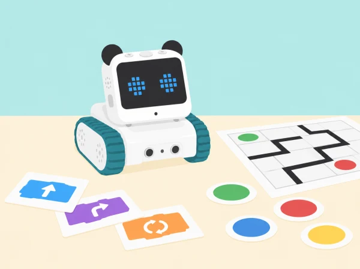

_El museu és una proposta pròpia; cada mòdul construeix un joc petit amb codi visible i proves repetibles._

## 🌱 Situació i producte final

L’alumnat prepara una exposició interactiva per a la comunitat educativa. En parelles, dissenya jocs i reptes que combinen pantalla LED, botons, variables, sensors reals i moviment. Cada sessió deixa un artefacte provable i un registre breu de decisions. La progressió adapta les 24 lliçons CSTA de Makeblock dedicades a Codey Rocky; no incorpora Neuron ni cap accessori extern com a requisit.

Quan un repte oficial es basa en una història o joc concret, ací es transforma en un context de barri o centre. Cap activitat utilitza dades personals, velocitat corporal o sons enregistrats. Les proves de moviment es fan en una zona buida i amb una persona observadora.

## 📅 Seqüència completa · 24 sessions

### **L1 · El secret de Codey Rocky.**

Identifiqueu Codey, Rocky, mBlock i la connexió; carregueu una icona i dibuixeu el diagrama entrada-procés-eixida.

### **L2 · Botons i expressions.**

Assigneu al botó A i B dues respostes gràfiques d’un personatge fictici. Expliqueu l’esdeveniment que inicia cada bloc.

### **L3 · Dissenyem una animació.**

Creeu una seqüència de quatre fotogrames per a anunciar una sala de l’exposició; compareu ordre i durada.

### **L4 · Detectem l’error.**

Rebeu un programa amb un bloc incorrecte, prediu el resultat, trobeu l’error i documenteu com la prova ha confirmat la correcció.

### **L5 · Bucle comptat.**

Programeu una animació de salutació que es repetisca un nombre limitat de vegades i afegiu condició d’eixida.

### **L6 · Bucle continu.**

Feu una animació ambiental que continue fins que l’usuari prema el botó d’aturada. Eviteu efectes parpellejants ràpids.

### **L7 · Cursa I: sensors i condicions.**

En una pista tancada de cartó, useu només el sensor de color o infraroig disponible per a desencadenar una resposta. Mesureu una condició a la vegada.

### **L8 · Cursa II: condicions combinades.**

Afegiu un segon cas de prova, combineu selecció i operadors i documenteu què passa en les interseccions de la pista.

### **L9 · Barra de so de l’exposició.**

Llegiu el sensor de so ambiental i mostreu una escala visual simulada o real. No graveu veu, no identifiqueu qui parla ni presenteu el valor com a mesura certificada de soroll.

### **L10 · Funcions de bon dia.**

Agrupeu una seqüència de benvinguda en una funció pròpia i crideu-la des de més d’un punt del programa.

### **L11 · Petit vigilant I.**

Creeu un joc de missions amb tres parades d’una maqueta: arribar, mostrar un símbol i tornar. Descomponeu el programa en funcions breus.

### **L12 · Petit vigilant II.**

Afegiu una missió alternativa i reutilitzeu funcions amb paràmetres simples; compareu claredat i repetició de codi.

### **L13 · Caixa de nous de l’esquirol.**

Canvieu el relat per un banc de llavors del jardí. Una variable compta objectes ficticis lliurats i es reinicia entre rondes.

### **L14 · Operacions matemàtiques.**

Feu que la variable totalitze punts d’un joc de patrons; compareu, sumeu i resteu valors de prova triats pel docent.

### **L15 · La bomba de temps.**

Substituïu l’explosiu per una càpsula de missatge que s’obri en acabar un compte arrere. Useu nombres aleatoris i codi visual, sense pressió competitiva ni alarmes estridents.

### **L16 · Pedra, paper i tisora.**

Programa una ronda amb nombre aleatori i condicions. Prova empats, cada combinació de guanyador i una ronda reiniciada.

### **L17 · El circuit del pati.**

Dissenyeu en mBlock una escena i personatges d’un joc de conducció fictici; controleu-lo amb Codey i definiu regles inclusives.

### **L18 · Controls del joc.**

Compareu botons, inclinació i controls de pantalla. Deixeu triar una modalitat i afegiu una alternativa que no depenga de girs del canell.

### **L19 · Mecàniques de joc I.**

Creeu objectiu, inici, puntuació i condició de finalització per a un joc de col·lecció de símbols del museu.

### **L20 · Mecàniques de joc II.**

Afegiu nivell o obstacle, proveu casos límit i reviseu la dificultat amb dades fictícies, no amb classificacions personals.

### **L21 · Ràpid i segur.**

En una pista de sobretaula, compareu temps del programa i girs; limiteu la velocitat, marqueu una zona d’aturada i no mesureu el rendiment entre equips.

### **L22 · Fem un gir.**

Calibreu un gir en la superfície disponible, provant dos angles amb una variable aïllada i anotant desviació aproximada.

### **L23 · Gir i obstacles.**

Afegiu un obstacle tou i ample en un recorregut tancat. El robot ha de parar si l’espai de prova es mou o algú entra a la zona.

### **L24 · Segueix la línia.**

Creeu una línia d’alt contrast sobre una superfície plana, ajusteu una condició cada vegada i compareu el resultat amb un algorisme en paper.

## 🧰 Maquinari, programari i dependències

Codey Rocky, ordinador amb versió compatible de mBlock, cable USB o connexió provada i materials plans de cartó. Useu exclusivament mòduls integrats comprovats en la unitat: botons, pantalla, indicador RGB, altaveu, sensor de so/llum, potenciòmetre, giroscopi, emissor/receptor IR i sensor de color/distància del xassís, segons el model i firmware. Les activitats L21–L24 necessiten el Rocky i el seu sensor corresponent; si no està disponible, feu el mateix algorisme en simulació. Neuron queda fora d’aquesta adaptació.

## 🛡️ Seguretat, privacitat i inclusió

Limiteu les proves mòbils a una taula estable o pista tancada sense vores, cablatge ni obstacles durs. El sensor de so no registra ni identifica veus. Oferiu botons o teclat com a alternatives al giroscopi, codi en paper quan hi haja dificultats de connexió i funcions equivalents per a qui no manipule el robot.

## 🧪 Evidències i avaluació

Al llarg de les 24 sessions, cada parella conserva un guió de disseny, pseudocodi, programa, taula de proves i canvi justificat. El museu final incorpora instruccions accessibles, una demostració i una nota que explica què mesura cada sensor i què no pot concloure. S’avaluen descomposició, seqüència, bucles, condicions, variables, funcions, depuració, prova i col·laboració.

## 🔗 Repertori oficial adaptat

Aquesta seqüència adapta les 24 lliçons CSTA publicades per Makeblock: [The Secret of Codey Rocky](https://www.makeblock.com/pages/codey-rocky-robot-toys-for-kids), *Press Buttons to Change Emotions*, *To Be an Animation Designer*, *Identify the Bug*, *The Steamed Bread Can’t Jump*, *The Jumping Steamed Bread*, *The Racing Game I/II*, *Volume Bar*, *Good Morning! Functions*, *The Tiny Patroller I/II*, *The Squirrel’s Nuts Box*, *Mathematical Operations*, *The Bomb*, *Rock-Paper-Scissors*, *My Speedway*, *Game Control Schemes*, *Game Mechanics I/II*, *Fast and Furious*, *Make a Turn*, *Make a Turn Avoid Obstacles* i *Line-Following Car*. Cada repte s’ha reinterpretat amb materials i context propis.

Makeblock publica a banda el curs [Codey Rocky & Neuron Discovery](https://support.makeblock.com/hc/en-us/articles/25494707612823-Codey-Rocky-Neuron-Discovery), de 34 lliçons. Només s’hi podran adaptar unitats compatibles amb la dotació quan es confirme quins components Neuron hi ha disponibles; aquesta fitxa no els pressuposa.
