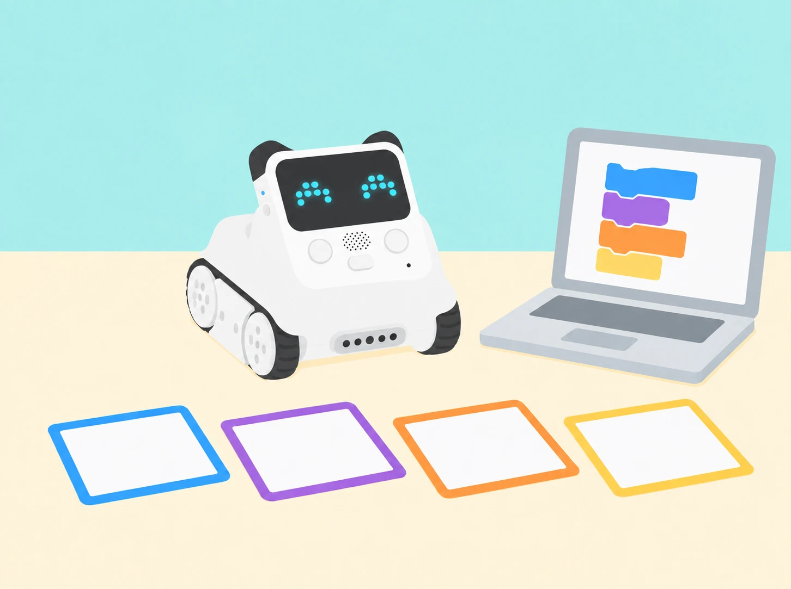

_El museu és una proposta pròpia; cada mòdul construeix un joc petit amb codi visible i proves repetibles._

## 🌱 Situació i producte final

L’alumnat prepara una exposició interactiva per a la comunitat educativa. En parelles, dissenya jocs i reptes que combinen pantalla LED, botons, variables, sensors reals i moviment. Cada sessió deixa un artefacte provable i un registre breu de decisions. La progressió proposa una interpretació local per a cadascun dels 24 títols CSTA publicats per Makeblock. Els plans docents s’han contrastat directament per a les lliçons 1, 3, 4, 13, 14, 15, 17 i 18. Per a les lliçons 1–16, els objectius públics del curs diferent *Codey Rocky & Neuron Discovery* permeten una comprovació addicional, però no substitueixen les fitxes CSTA. La resta de sessions s’identifica com a adaptació pròpia del títol i l’objectiu públic. No incorpora Neuron ni cap accessori extern com a requisit.

Quan un repte oficial es basa en una història o joc concret, ací es transforma en un context de barri o centre. Cap activitat utilitza dades personals, velocitat corporal o sons enregistrats. Les proves de moviment es fan en una zona buida i amb una persona observadora.

## 🎯 Aprenentatges i vocabulari

- Reconéixer els components de Codey Rocky que es proven i relacionar botons, sensors i pantalla amb les respostes programades.
- Construir programes amb seqüències, repeticions, condicions, variables i funcions segons el repte de cada lliçó.
- Crear animacions i mecàniques de joc, i provar-les amb casos previstos i casos que poden fer fallar el programa.
- Depurar una instrucció concreta i explicar els límits de cada joc o moviment abans de compartir-lo amb una altra persona.

## 📅 Seqüència completa · 24 sessions

### **L1 · El secret de Codey Rocky · del problema al primer programa (40 min).**

#### Fase 1 · Activem i prediem (5 min)

Mostreu Codey Rocky apagat i un conjunt de targetes amb robots de contextos diferents. En parelles, relacioneu cada robot amb una tasca possible i expliqueu quina observació us ha fet triar-la. Diferencieu una funció comprovada d’una suposició: aquesta activitat no demana activar reconeixement facial ni cap servei d’intel·ligència artificial.

#### Fase 2 · Explorem i construïm (10 min)

Observeu les dues parts del robot de la dotació. Codey conté el controlador, pantalla LED, botons, llums, altaveu i sensors integrats; Rocky n’és la base mòbil, amb motors i sensor frontal inferior. Feu un inventari dibuixat de les peces que realment veieu i assenyaleu una capacitat que vulgueu comprovar. No afegiu accessoris externs al mapa del kit.

#### Fase 3 · Expliquem i registrem (10 min)

Construïu un esquema propi **idea → programa → càrrega → acció**. Expliqueu que un programa és una seqüència d’instruccions que es tradueix a blocs; el robot només executa allò que s’ha programat i carregat. En mBlock 5, localitzeu escenari, categories de blocs i àrea de codi. Feu una predicció abans de connectar cap dispositiu.

#### Fase 4 · Apliquem i millorem (10 min)

Connecteu Codey amb el cable USB, enceneu-lo i seleccioneu el port sèrie correcte en mBlock 5. Creeu una acció mínima amb l’esdeveniment de prémer A i una icona de pantalla; carregueu el programa, desconnecteu el cable de dades i poseu el robot sobre una superfície estable abans de provar-lo. Si no respon, reviseu alimentació, port, mode de càrrega i esdeveniment, d’un en un.

#### Fase 5 · Comprovem i reflexionem (5 min)

**Evidència:** inventari de Codey/Rocky, diagrama idea-programa-acció, captura o dibuix dels blocs, resultat de la prova i una dificultat resolta. Tanqueu amb les frases «hui he aprés…», «el problema era…» i «l’he resolt…»; es pot respondre amb text, dibuix o explicació oral.



_Les targetes i la interfície són una representació pròpia; el robot parteix del model Codey Rocky treballat a classe._

### **L2 · Botons i expressions programades (40 min).**

#### Fase 1 · Activem i prediem (5 min)

Recordeu una entrada i una eixida de la lliçó anterior. Presenteu una situació neutral: “quan entrem en una aula fosca, premem l’interruptor i s’encén el llum”. Identifiqueu l’acció que inicia la resposta i predigueu què passaria si no es produïra. En aquesta SDA, les icones de pantalla són símbols triats per l’equip: no mesuren ni representen l’estat emocional de cap persona.

#### Fase 2 · Explorem i construïm (10 min)

Feu una versió pròpia del joc desconnectat «Segueix les instruccions»: assigneu tres o quatre senyals geomètrics a accions simples de paper, com alçar una targeta, dibuixar una forma o girar una fitxa. Una persona mostra el senyal i el grup executa l’acció acordada; proveu una ronda lenta i una amb els senyals en un altre ordre. Qui preferisca no fer moviments pot ser qui mostra les targetes, marca la seqüència o comprova si la resposta correspon al senyal.

#### Fase 3 · Expliquem i registrem (10 min)

En mBlock, localitzeu un esdeveniment d’inici i els blocs «quan es prem A», «B» i «C». Seguiu amb el dit el programa model i expliqueu la relació entrada–resposta. Distingiu l’esdeveniment (inici o botó premut) de l’acció programada (mostrar una icona, reproduir un so o combinar les dues). Abans de carregar res, dibuixeu una taula amb les tres entrades, la resposta esperada i una comprovació; si la versió de l’app o el dispositiu no mostra algun bloc, anoteu la diferència i continueu amb les entrades disponibles.

#### Fase 4 · Apliquem i millorem (10 min)

En parelles, programeu una resposta diferent per a cada botó amb símbols i sons propis o d’ús lliure. Feu una primera prova guiada i després canvieu els rols: una persona programa i l’altra comprova, sense tocar el projecte. Proveu cada entrada almenys dues vegades i una vegada l’inici; registreu si la resposta coincideix amb la taula. Ajusteu un bloc cada vegada. El so és opcional: oferiu sempre una versió silenciosa i no useu etiquetes com “content”, “trist” o “enfadat” per inferir com se sent qui participa.

#### Fase 5 · Comprovem i reflexionem (5 min)

Cada parella presenta una resposta del seu programa i explica quin esdeveniment la desencadena. Una altra parella tria una entrada i comprova si el resultat coincideix amb la predicció; si no, l’equip assenyala el primer bloc que cal revisar i proposa una prova nova. **Evidència:** joc desconnectat, taula d’entrades i eixides, programa amb esdeveniments, registre de proves i una explicació breu d’un canvi. La valoració se centra en la relació causa–resposta i en la claredat del codi.

### **L3 · Dissenyem una animació amb seqüències (40 min).**

#### Fase 1 · Activem i prediem (5 min)

Presenteu una escena de biblioteca: una persona arriba, deixa un llibre i tanca el prestatge. Ordeneu tres vinyetes i compareu què deixa de tindre sentit si se n’intercanvien dues. Anomeneu *seqüència* el conjunt d’accions ordenades que completa una tasca.

#### Fase 2 · Explorem i construïm (10 min)

Una persona fa de robot i una altra li dona instruccions per a arribar a una marca i dibuixar una icona. La persona-robot executa literalment les ordres, sense completar passos que no s’han dit. Anoteu una ambigüitat i reescriviu-la abans de repetir.

#### Fase 3 · Expliquem i registrem (10 min)

Obriu un programa amb l’esdeveniment «quan es prem A» i encadeneu quatre fotogrames propis de pantalla amb una duració curta per a cadascun: icona inicial, canvi, gest visual i icona final. Expliqueu com l’ordre dels blocs determina l’animació; no cal representar cares o emocions.

#### Fase 4 · Apliquem i millorem (10 min)

Dibuixeu un fotograma en una graella LED de cinc per cinc. Dupliqueu-ne el bloc, canvieu uns pocs píxels i repetiu la seqüència fins que una altra parella puga reconéixer el moviment o missatge. Carregueu-la i ajusteu l’ordre o la duració a partir d’una observació concreta.

#### Fase 5 · Comprovem i reflexionem (5 min)

**Evidència:** vinyetes ordenades, programa de quatre fotogrames, predicció, comentari de l’audiència i una revisió. Un altre equip explica què ha entés abans de rebre el títol de la peça.

### **L4 · Detectem i corregim un error (40 min).**

#### Fase 1 · Activem i prediem (5 min)

Expliqueu que un *bug* és un defecte del programa que provoca una diferència entre el resultat esperat i l’observat. Poseu un exemple quotidià —una instrucció que omet una parada— i distingiu-lo d’una limitació del sensor o d’un problema de connexió.

#### Fase 2 · Explorem i construïm (15 min)

Prepareu tres programes curts amb un error cadascun: una ruta de maqueta que no arriba a una clau dibuixada; una parada que no s’activa abans d’un obstacle tou; i un compte arrere que no acaba mostrant el missatge final. L’últim cas substitueix la bomba fictícia del material d’origen per una càpsula de missatge segura. Abans d’executar, cada parella escriu el resultat esperat; després registra el punt on la prova es desvia.

#### Fase 3 · Expliquem i registrem (5 min)

Descriviu el símptoma i compareu-lo amb el programa. Reviseu esdeveniment inicial, ordre, valor i condició; separeu els errors de codi dels errors de maquinari. No canvieu simultàniament diversos blocs.

#### Fase 4 · Apliquem i millorem (10 min)

Canvieu una sola instrucció, torneu a executar el mateix cas i comproveu si s’ha resolt la desviació. Si no, desfeu el canvi i proveu una hipòtesi diferent. Una parella revisora intenta reproduir el resultat amb les mateixes condicions.

#### Fase 5 · Comprovem i reflexionem (5 min)

**Evidència:** predicció, símptoma, hipòtesi, canvi únic, resultat i conclusió. Marqueu si la causa era un bloc, una connexió o una expectativa mal definida; no doneu per corregit un error fins que una prova ho confirme.

### **L5 · Bucle comptat (40 min).**

#### Fase 1 · Activem i prediem (5 min)

Recupereu la idea de seqüència de L3: quins passos es repeteixen quan plantem un plançó i quins només fem una vegada? En una tira de quatre vinyetes, mostreu una granota de paper que travessa quatre illots de la marjal. Abans de programar, marqueu quants salts ha de fer i quina imatge obrirà i tancarà l’animació. Distingiu “quatre salts” d’una seqüència amb quatre blocs diferents.

#### Fase 2 · Explorem i construïm (10 min)

Modeleu el bucle comptat amb una ruta de plantació: fer un clot, posar un plançó i cobrir-lo és una volta; avançar fins al següent punt prepara la volta següent. Si el tram té quatre punts, repetiu el fragment el nombre de vegades acordat i compareu-lo amb escriure totes les ordres una per una. Marqueu al diagrama quin fragment queda dins de `repeteix` i què passa abans/després del bucle.

#### Fase 3 · Expliquem i registrem (10 min)

En mBlock, programeu amb el botó A una animació original: mostrar la granota preparada, mostrar el salt, reproduir una pausa breu i tornar a la posició inicial; poseu el fragment dins d’un `repeteix (4)` perquè arribe als quatre illots. Seguiu la primera, segona i última iteració amb una taula de traça: número de volta, fotograma esperat i observat. Expliqueu què inicia el programa i per què el bucle acaba després del recompte fixat.

#### Fase 4 · Apliquem i millorem (10 min)

En parelles, creeu una segona versió: podeu canviar el nombre de salts, les imatges o el so opcional, però canvieu una sola variable de disseny cada vegada. Afegiu una història breu ambientada en un lloc pròxim —per exemple, la granota arriba a una zona de vegetació— sense presentar el dibuix com una observació real. Intercanvieu els programes: l’equip visitant prediu el nombre de voltes i comprova si el resultat coincideix. El so es pot substituir per una pausa visual.

#### Fase 5 · Comprovem i reflexionem (5 min)

Cada parella presenta l’animació i respon: què representa una iteració, quantes n’hi ha i quin canvi ha fet més clara la història? Registreu un problema trobat i com l’heu resolt; tanqueu amb un exemple de bucle comptat de la vida quotidiana, com repetir una ruta de quatre parades. **Evidència:** storyboard, programa activat per un esdeveniment amb bucle comptat, traça, resultat de la prova entre parelles i autoavaluació breu.

**Pregunta docent:** què determina que el bucle acabe després del nombre de voltes acordat?

### **L6 · Bucle continu (40 min).**

#### Fase 1 · Activem i prediem (5 min)

Recupereu el programa de L5 i compareu `repeteix (4)` amb una seqüència que no té un nombre fix de voltes. Useu el cicle de llum i foscor com a exemple natural que es repeteix, i dibuixeu tres fotogrames per representar una alba i una posta de sol sobre la marjal. Predigueu quin programa acabarà després d’un nombre establit i quin continuarà fins que algú el detinga.

#### Fase 2 · Explorem i construïm (10 min)

En mBlock, feu una animació finita amb un esdeveniment de botó i un `repeteix`; després, creeu-ne una segona amb un altre botó i poseu la seqüència dins de `per sempre`. Alterneu tres fotogrames propis amb pauses prou llargues perquè es puguen llegir. Reserveu el botó C per a aturar els scripts actius amb el control de parada disponible a la versió de mBlock del centre; proveu primer la parada amb el robot quiet i sense cap moviment de motors.

#### Fase 3 · Expliquem i registrem (10 min)

Compareu els programes bloc a bloc: quin té un nombre de voltes definit i quin no incorpora cap eixida natural? Executeu-los i registreu inici, dos cicles observats, ordre d’aturada i resposta final. Verifiqueu que el botó C interromp la seqüència; si l’entorn no permet aquesta interrupció des del programa carregat, atureu-la des de mBlock i deixeu anotada la limitació. Expliqueu per què un bucle infinit necessita un control de parada accessible.

#### Fase 4 · Apliquem i millorem (10 min)

En parelles, canvieu les imatges, l’ordre, una pausa o el so opcional i proveu si la història continua sent comprensible en tots dos programes. L’equip revisor comprova que la versió comptada acaba sola i que la versió contínua respon a l’aturada. No feu pampallugues ràpides ni sons sobtats; qui ho preferisca pot analitzar les targetes de fotogrames en paper, amb la mateixa predicció de bucle.

#### Fase 5 · Comprovem i reflexionem (5 min)

Cada equip presenta les dues animacions i respon quina utilitza `repeteix`, quina `per sempre` i com n’ha comprovat la finalització. Completeu una autoavaluació: un bucle comptat de la vida quotidiana, un procés cíclic que no té un final fix i una precaució necessària quan un programa continua actiu. **Evidència:** storyboard de tres fotogrames, dos programes amb esdeveniments diferents, registre de cicles/aturada, retorn d’una altra parella i autoavaluació.

**Pregunta docent:** com sap l’usuari que el bucle està actiu i com pot acabar-lo?

### **L7 · Cursa I: colors i obstacles (40 min).**

#### Fase 1 · Activem i prediem (5 min)

Repasseu que una condició permet executar una instrucció si és certa i saltar-la si és falsa. Feu una «capsa de condicions» amb targetes de prova fàcils d’identificar i no personals (per exemple, «la fitxa és verda»): qui trau una targeta decideix si es compleix i segueix la instrucció associada. Després, predigueu com podria respondre Codey davant d’una bandera verda o d’un obstacle en una pista de maqueta. No és una cursa de velocitat.

#### Fase 2 · Explorem i construïm (10 min)

Identifiqueu el mòdul IR de Rocky i comproveu el seu selector d’orientació: cap avall per llegir color/superfície, cap avant per detectar un obstacle. Són dues configuracions de prova, no dues lectures simultànies. Prepareu una porta amb targeta verda i una altra de color diferent; en una segona taula, poseu un obstacle tou i ample. Manteniu la base parada mentre canvieu l’orientació i comproveu al bloc de sensor què llig cada posició.

#### Fase 3 · Expliquem i registrem (10 min)

En la configuració cap avall, programeu el botó A i una condició `si color = verd`: avanceu només un tram curt a velocitat baixa si la lectura coincideix; altrament, quedeu-vos aturats. En la configuració cap avant, feu una prova independent `si obstacle detectat`: atureu-vos, gireu a l’esquerra una quantitat limitada i avanceu només una casella de maqueta abans d’aturar-vos. El bloc de proximitat es tracta com una detecció, no com una mesura exacta de distància. Registreu per separat orientació, entrada, valor/estat, condició vertadera o falsa i resposta.

```blocks
quan es prem A
  si el color llegit és verd
    avança a velocitat baixa un tram curt
  si no
    atura els motors

quan es prem A  // en la prova amb el sensor orientat cap avant
  si es detecta un obstacle
    atura els motors
    gira a l'esquerra una vegada
    avança una casella i atura
```

#### Fase 4 · Apliquem i millorem (10 min)

Completeu una bateria de casos en dues tandes: amb el sensor cap avall, targeta verda i no verda; cap avant, obstacle present i absent. Feu tres intents per cas sense moure la llum ni el material entre lectures. Si el color no es reconeix de manera estable, augmenteu la superfície de la targeta o useu una targeta d’entrada simulada. Si l’obstacle no es detecta, reviseu l’orientació i el bloc utilitzat. No combineu els resultats com si el robot haguera llegit ambdues entrades en un mateix instant.

#### Fase 5 · Comprovem i reflexionem (5 min)

**Evidència:** dibuix de les dues orientacions del sensor, taules independents de casos vertaders/falsos, programes o simulacions identificades i una revisió justificada. Expliqueu quin bloc representa una decisió booleana i per què la lectura de color i la d’obstacle s’han provat en moments diferents.

**Pregunta docent:** quina observació ha fet certa cada condició i què canvia quan girem el sensor?
### **L8 · L’estació de servei i el túnel de la marjal (40 min).**

#### Fase 1 · Activem i prediem (5 min)

Recupereu les condicions vertadera/falsa de L7 i compareu una seqüència de tres `si` amb un `repeteix` que conté una condició. Presenteu dos reptes de maqueta: eixir d’una estació de servei orientada a l’esquerra, a la dreta o cap avant, i travessar un túnel fosc canviant la velocitat. Predigueu quins sensors i quines dades necessita cada repte; no es llegiran color i obstacle alhora.

#### Fase 2 · Explorem i construïm (10 min)

Construïu una estació amb llibres o caixes de cartó que deixen un únic corredor de sortida i un túnel curt de cartolina. Marqueu els tres possibles sentits inicials de Codey Rocky. Gireu el mòdul IR cap avant per detectar obstacles en l’estació; el sensor de llum integrat en Codey s’usa en una prova separada del túnel. Manteniu velocitat baixa i espai lliure al voltant de les rodes. Abans d’executar, comproveu que el programa correspon a l’orientació de sensor prevista.

#### Fase 3 · Expliquem i registrem (10 min)

Programeu l’eixida amb una condició dins d’un bucle comptat: si hi ha un obstacle davant, gireu a la dreta 90°; repetiu la comprovació fins a tres vegades, de manera que l’orientació inicial no determine l’èxit. Quan el camí quede lliure, gireu cap al corredor de la maqueta i avanceu una casella a velocitat baixa. Anoteu l’orientació inicial, els girs executats i si s’ha trobat l’eixida.

```blocks
quan es prem A
  repeteix 3 vegades
    si hi ha obstacle davant
      gira a la dreta 90 graus
  si el camí està lliure
    gira cap al corredor
    avança una casella a velocitat baixa
```

#### Fase 4 · Apliquem i millorem (10 min)

Proveu les tres orientacions inicials. Després, en una tanda independent, useu el sensor de llum de Codey per comparar el passadís clar amb el túnel ombrejat. Registreu primer lectures de les dues condicions i trieu un llindar entre els valors observats; són valors del sensor, no lux calibrats. Dins d’un segon `repeteix 3`, llegiu la llum, espereu un segon i apliqueu l’operador `<`: si el valor queda per davall del llindar, enceneu l’indicador RGB blanc i reduïu la velocitat; si no, apagueu l’indicador i manteniu la velocitat de prova. Feu tres lectures en cada condició i no presenteu el llindar com una mesura de seguretat real.

```blocks
repeteix 3 vegades
  llig la llum ambiental
  espera 1 segon
  si la llum és menor que el llindar
    encén l’indicador RGB blanc
    mou-te a velocitat reduïda
  si no
    apaga l’indicador RGB
    mantín la velocitat de prova
```

#### Fase 5 · Comprovem i reflexionem (5 min)

Compareu els girs observats en les tres orientacions i la taula de llum clara/ombra. Expliqueu per què el bucle redueix codi repetit, què retorna una comparació `<` i quina diferència hi ha entre el mòdul IR orientat cap avant i el sensor de llum de Codey. **Evidència:** diagrama de l’estació, dos programes amb `repeteix` i `si`, registre d’orientacions, valors de llum i revisió d’una prova.

**Pregunta docent:** quines parts del repte reutilitzen un bucle i quina lectura del sensor justifica cada condició?

### **L9 · Barra de so: bucles i condicions (40 min).**

#### Fase 1 · Activem i prediem (5 min)

Proposeu una barra visual per a una instal·lació sonora del museu. Definiu tres franges de lectura —baixa, intermèdia i alta— i predigueu quin color o nombre de píxels correspondria a cada franja. Useu un so breu produït expressament o dades de prova; no enregistreu veus ni converses.

#### Fase 2 · Explorem i construïm (10 min)

Comproveu que el sensor de so ambiental integrat apareix en el mBlock instal·lat i feu tres lectures del mateix estímul. Si no hi ha bloc accessible, utilitzeu les mateixes lectures fictícies en paper i identifiqueu-les clarament com a simulació. Creeu una barra LED amb condicions que assignen una eixida a cada interval; el valor és una lectura relativa del sensor, no una mesura certificada en decibels.

#### Fase 3 · Expliquem i registrem (10 min)

Implementeu la solució de bucles niats indicada pel repte: un bucle infinit exterior conté un segon bucle infinit que llig el sensor i aplica les condicions de la barra. Col·loqueu qualsevol instrucció posterior a banda i prediu si arribarà a executar-se. Proveu la lectura per davall, en la frontera i per damunt de cada llindar.

```blocks
per sempre
  per sempre
    llig el nivell de so
    si nivell < llindar_1
      mostra barra curta
    si no, si nivell < llindar_2
      mostra barra mitjana
    si no
      mostra barra llarga
```

#### Fase 4 · Apliquem i millorem (10 min)

Observeu que el bucle interior infinit no retorna al cos exterior: les instruccions que queden després no s’executen. Refactoreu-ho en un únic bucle continu amb les tres condicions i torneu a passar els mateixos valors. Compareu les dues estructures, expliqueu el comportament i conserveu la versió funcional, sense afegir un segon bucle infinit redundant.

#### Fase 5 · Comprovem i reflexionem (5 min)

**Evidència:** taula de lectures i llindars, dos programes comparats, resultats en les fronteres i una explicació del bloqueig del bucle niat.

**Pregunta docent:** què aporta cada bucle infinit en aquesta estructura i quin codi queda inaccessible quan el bucle interior no acaba?
### **L10 · Funcions de bon dia (40 min).**

#### Fase 1 · Activem i prediem (5 min)

Llegiu una seqüència de benvinguda amb icona, so opcional i pausa. Busqueu una part que es repetisca en més d’una escena i prediu què canviaria si s’escriguera una sola vegada.

#### Fase 2 · Explorem i construïm (10 min)

Agrupeu la seqüència en una funció pròpia de mBlock i crideu-la des de dos esdeveniments diferents. Useu missatges neutres per als visitants i manteniu una versió sense so.

#### Fase 3 · Expliquem i registrem (10 min)

Seguiu el programa des de cada crida i registreu quina funció s’executa, quin bloc continua després i si el resultat és el mateix en els dos casos.

#### Fase 4 · Apliquem i millorem (10 min)

Afegiu una variació d’icona o duració a una crida sense duplicar tota la funció. Si el curs de mBlock disponible no admet l’opció imaginada, conserveu la funció sense paràmetres i expliqueu la limitació.

#### Fase 5 · Comprovem i reflexionem (5 min)

**Evidència:** funció reutilitzada dues vegades i esquema de crides.

**Pregunta docent:** quina part del programa hem pogut reutilitzar i per què?

### **L11 · Petit vigilant I: missions i distàncies (40 min).**

#### Fase 1 · Activem i prediem (5 min)

En un plànol fictici del museu, marqueu inici, tres parades numerades i arribada. Definiu una missió que demane visitar les parades en ordre i calculeu quantes unitats de graella recorrerà abans de construir el programa. Una unitat és una convenció del mapa, no una mesura real del sensor.

#### Fase 2 · Explorem i construïm (10 min)

Dissenyeu una escena de patrulla amb tres encàrrecs curts: arribar a una parada, mostrar-ne el símbol i tornar a l’inici. Escriviu `distància = passos × unitat`; useu, per exemple, quatre passos per cada unitat de mapa i calculeu la longitud total de dos trams. Descomponeu les accions comunes en funcions o seqüències amb nom; si la versió de mBlock no admet el format previst, anoteu els valors en variables separades.

#### Fase 3 · Expliquem i registrem (10 min)

Proveu cada funció per separat i compareu el nombre de passos previst amb el recompte del mapa. Registreu les operacions, la distància modelada i qualsevol diferència entre la ruta ideal i el moviment del robot; no presenteu l’estimació com una mesura calibrada en centímetres.

#### Fase 4 · Apliquem i millorem (10 min)

Combineu els trams en una missió completa. Afegiu una condició d’èxit que es complisca quan s’han visitat les tres parades i s’ha tornat a l’inici. Una altra parella segueix només el mapa i les instruccions; reviseu una ambigüitat o operació incorrecta que detecte.

#### Fase 5 · Comprovem i reflexionem (5 min)

**Evidència:** mapa numerat, càlcul d’almenys dos trams, programa modular, recompte previst/observat i criteri d’èxit.

**Pregunta docent:** quina part és una dada del mapa i quina és una estimació basada en el nostre model?
### **L12 · Petit vigilant II: funcions per a rutes complexes (40 min).**

#### Fase 1 · Activem i prediem (5 min)

Compareu dues missions: una visita tres parades i una altra en visita quatre, però totes dues comparteixen la salutació, la parada de lectura i el retorn. Predigueu quins blocs es poden reutilitzar i calculeu la distància modelada de cada ruta a partir dels trams del mapa.

#### Fase 2 · Explorem i construïm (10 min)

Creeu una funció `visita(parades, passos_per_tram)` amb els paràmetres que permeta la versió de mBlock. Calculeu `distància = parades × passos_per_tram × unitat` i mostreu el resultat abans d’iniciar la ruta. Si el bloc de funció no accepta paràmetres, utilitzeu variables d’entrada i documenteu-ne el valor en cada crida; no dupliqueu la funció sense comparar-ho.

#### Fase 3 · Expliquem i registrem (10 min)

Executeu les missions amb les mateixes unitats i registreu valors d’entrada, operacions, parades visitades i resultat. Verifiqueu la multiplicació amb un càlcul manual i proveu també una ruta de zero trams i una amb un tram addicional. La longitud és una predicció del mapa, no una promesa de precisió física.

#### Fase 4 · Apliquem i millorem (10 min)

Afegiu una condició que trie una missió curta o llarga segons el nombre de parades sol·licitat. Canvieu un paràmetre d’una missió i comproveu que l’altra conserva el seu valor. Una parella revisora ha de trobar on es defineix cada entrada i explicar com es calcula la distància.

#### Fase 5 · Comprovem i reflexionem (5 min)

**Evidència:** dues missions, funció o alternativa documentada, taula de càlcul, casos límit i comparació amb el programa de L11.

**Pregunta docent:** com ens ajuden les funcions i les operacions a ampliar una missió sense perdre de vista els valors que la controlen?
### **L13 · La caixa de llavors de l’hort (40 min).**

#### Fase 1 · Activem i prediem (5 min)

Presenteu una caixa fictícia amb 10 fitxes de llavor. Expliqueu la variable com un contenidor amb nom i valor que pot canviar. En parelles, proposeu un nom clar per al comptador i prediu què passa quan n’afegim o en traiem.

#### Fase 2 · Explorem i construïm (10 min)

Prepareu targetes d’esdeveniment locals: «plantem 2» (−2), «arriba una donació de 5» (+5), «usem 3» (−3) o «recollim 4» (+4). Partiu de `reserva = 10`, llegiu les targetes en ordre i actualitzeu el valor en una taula. Afegiu una segona variable anomenada `equip` per registrar fitxes en una altra safata i compareu els dos valors sense barrejar-los.

#### Fase 3 · Expliquem i registrem (10 min)

Traduïu dos esdeveniments a blocs de variables. Proveu també una regla de comparació pròpia: si la reserva baixa de 5, mostrar «cal revisar la caixa»; si supera 12, mostrar «repartim l’excedent». Anoteu valor anterior, operació, valor nou i resposta de la condició. Els llindars són regles del joc d’aula, no recomanacions agronòmiques.

#### Fase 4 · Apliquem i millorem (10 min)

Comproveu com una variable pot controlar una acció física només en zona lliure: amb el botó A, assigneu `velocitat = 30` i feu avançar Codey Rocky durant un segon; atureu-lo i registreu què ha passat. Com a extensió guiada, assigneu `angle = 70`, feu un gir a l’esquerra i després canvieu el valor a 140 per provar el gir contrari. Si el moviment no és segur o el valor depén d’una configuració diferent, feu aquesta part amb una fitxa en quadrícula i marqueu-la com a simulació.

#### Fase 5 · Comprovem i reflexionem (5 min)

**Evidència:** taula de traça de dues variables, condicions de reserva, programa o simulació de velocitat i una revisió. Expliqueu quina informació guarda cada variable i com es reemplaça el valor.

**Pregunta docent:** quin canvi del valor ha provocat la resposta del programa?
### **L14 · Operacions amb el marcador del mercat (40 min).**

#### Fase 1 · Activem i prediem (5 min)

Obriu un marcador fictici que comença a zero. Predigueu què mostrarà després d’afegir una unitat amb A o llevar-ne una amb B; decidiu com representareu valors negatius sense convertir el joc en una puntuació d’alumnes.

#### Fase 2 · Explorem i construïm (10 min)

Creeu una variable `marcador` i assigneu-li el valor 0 en iniciar el programa. Configureu A perquè l’incremente en 1 i B perquè el decremente en 1. Mostreu el resultat en la matriu LED després de cada canvi. Compareu l’operació manual amb el bloc de canvi de variable i observeu què significa restar quan el valor és zero.

#### Fase 3 · Expliquem i registrem (10 min)

Afegiu dos esdeveniments nous amb els blocs d’operadors: A multiplica el valor per 2; B el divideix per 2. Després de cada operació, assigneu el resultat a la mateixa variable i mostreu-lo. Registreu entrada, operació i eixida per a `0`, `4` i `−4`, i compareu el càlcul manual amb el programa.

#### Fase 4 · Apliquem i millorem (10 min)

Canvieu el valor inicial o el factor de multiplicació/divisió i repetiu els mateixos casos. Verifiqueu quin tipus de forma accepta el bloc de variable com a operand i manteniu la mateixa variable en tots els esdeveniments. Recordeu que la pantalla mostra valors entre −999 i 9999; si el càlcul ix d’aquest interval, anoteu el límit en lloc d’interpretar la pantalla com un resultat complet.

#### Fase 5 · Comprovem i reflexionem (5 min)

**Evidència:** programa amb inicialització, A/B, multiplicació/divisió, taula de casos i una comparació manual-programa.

**Pregunta docent:** per què cal guardar el resultat nou en la mateixa variable perquè el marcador continue acumulant els canvis?
### **L15 · La càpsula d’arribada (40 min).**

El pla oficial treballa variables, compte arrere i aleatorietat dins d’un joc d’explosió. Ací en conservem la lògica de programació i eliminem l’explosiu, la por i el pas ràpid del robot entre persones: usem una càpsula de missatge en una taula estable, amb cancel·lació clara i senyal final neutre.

#### Fase 1 · Activem i prediem (5 min)

Mostreu una variable `temps` que comença en 30 i una càpsula de paper. Predigueu quantes actualitzacions hi haurà si el programa resta una unitat cada segon i què ha de mostrar la pantalla quan arribe a zero.

#### Fase 2 · Explorem i construïm (10 min)

En iniciar, assigneu 30 a `temps`. En prémer A, comenceu el compte arrere: espereu un segon, resteu 1, mostreu el valor i repetiu 30 vegades. Quan `temps` arriba a 0, atureu el bucle i mostreu «missatge llest» amb una llum d’un color acordat; el so és opcional i sempre hi ha versió silenciosa. El robot no es passa de mà en mà: els equips roten una targeta de torn.

#### Fase 3 · Expliquem i registrem (10 min)

Traceu els primers tres segons i el final. Comproveu que el valor inicial, la repetició i la condició d’aturada donen 30 actualitzacions, no 29 ni 31. Registreu què passa si el programa s’inicia dues vegades i si una persona prem el control abans que acabe.

#### Fase 4 · Apliquem i millorem (10 min)

Afegiu una cancel·lació amb B que ature el compte i mostre «pausa»; torneu a iniciar des d’un valor conegut. Després, creeu una segona modalitat: en prémer A, genereu `objectiu` a l’atzar entre 1 i 20; cada B incrementa `comptador` en 1 i una condició d’igualtat mostra «objectiu assolit». Proveu els extrems 1 i 20 amb valors forçats abans de deixar l’aleatorietat activa. El nombre aleatori serveix per al joc, no per a seguretat o xifratge.

#### Fase 5 · Comprovem i reflexionem (5 min)

**Evidència:** diagrama d’estats, traça del compte arrere, cancel·lació i proves del valor aleatori, inclosos els extrems.

**Pregunta docent:** quina part de la lògica continua sent útil quan canviem el context de bomba a càpsula de missatge?
### **L16 · Pedra, paper i tisora (40 min).**

#### Fase 1 · Activem i prediem (5 min)

Representeu pedra, paper i tisora amb tres símbols i acordeu la regla de victòria i empat. Predigueu els resultats de les nou combinacions abans de programar-les.

#### Fase 2 · Explorem i construïm (10 min)

Creeu una ronda amb una elecció d’usuari i una resposta aleatòria del programa, si la funció està disponible. Manteniu l’atzar dins del joc i no useu el resultat per prendre decisions reals sobre l’alumnat.

#### Fase 3 · Expliquem i registrem (10 min)

Proveu les tres opcions contra cada resultat possible i marqueu victòria, derrota o empat en una matriu. Compareu cada eixida amb la regla acordada.

#### Fase 4 · Apliquem i millorem (10 min)

Afegiu un botó per iniciar una ronda nova i comproveu que es reinicien els símbols i el resultat. Una parella revisora prova un cas triat a l’atzar.

#### Fase 5 · Comprovem i reflexionem (5 min)

**Evidència:** matriu completa, programa i reinici verificat.

**Pregunta docent:** quina combinació faltava o estava classificada de manera incorrecta?

### **L17 · Un circuit jugable per al museu (40 min).**

La guia docent oficial de *My Speedway* demana dissenyar una escena i un personatge, animar un cotxe amb les fletxes, tornar a l’inici si ix de la pista, mostrar una victòria en arribar a meta i explorar arbres que es mouen en sentit contrari. Aquesta adaptació crea un joc original de recorregut pel barri: no utilitza cotxes reals, rànquings ni proves de conducció.

#### Fase 1 · Activem i prediem (5 min)

Mostreu una escena en blanc i tres esbossos de circuits possibles. Trieu un espai fictici —pati, plaça o camí de l’horta— i definiu què vol dir «dins de la ruta», on comença el personatge i quin senyal confirma l’arribada.

#### Fase 2 · Explorem i construïm (10 min)

En mBlock, dibuixeu un fons original amb pista ampla, inici, meta i una zona fora de ruta. Creeu o trieu un personatge propi del museu, assigneu-li un nom i programeu les fletxes amunt/avall/esquerra/dreta perquè es moga en la direcció indicada. Una opció de teclat en pantalla o targetes permet participar sense prémer tecles ràpidament.

#### Fase 3 · Expliquem i registrem (10 min)

Escriviu les regles com a casos: si el personatge continua dins la pista, conserva la posició; si ix pels límits, torna a l’inici; si toca la meta, mostra «Arribada!» i bloqueja o pausa el control. Dibuixeu un mapa d’estats i proveu una ruta vàlida, una eixida pels límits i una arribada.

#### Fase 4 · Apliquem i millorem (10 min)

Afegiu un efecte dinàmic senzill: arbres o fites es mouen cap arrere mentre el personatge avança, amb una velocitat baixa i pausa disponible. Una altra parella juga amb les mateixes regles i registra una ambigüitat o error; reviseu una cosa cada vegada. No puntueu la velocitat ni compareu persones.

#### Fase 5 · Comprovem i reflexionem (5 min)

**Evidència:** fons i personatge originals, esquema de controls, regles de límit i meta, tres casos de prova i una millora derivada del retorn.

**Pregunta docent:** quina regla fa que el joc continue sent comprensible quan el personatge arriba al límit o a la meta?
### **L18 · Un joc amb el giroscopi de Codey (40 min).**

#### Fase 1 · Activem i prediem (5 min)

Compareu com es controla un joc en ordinador, mòbil o consola i trieu una idea pròpia de recorregut. Definiu què representa inclinar Codey cap a l’esquerra i cap a la dreta, quin missatge rebrà el personatge del joc i com s’aturarà la partida. Inclinar el robot és una opció voluntària; es pot seguir la mateixa predicció des del diagrama o amb tecles.

#### Fase 2 · Explorem i construïm (10 min)

Dissenyeu una escena i un personatge originals en mBlock. Creeu un programa que llija el giroscopi integrat i envie missatges diferenciats per a inclinació esquerra i dreta; configureu l’sprite perquè els reba i es moga en la direcció acordada. Manteniu Codey sobre la taula i inclineu-lo suaument, sense alçar-lo ni sacsar-lo.

#### Fase 3 · Expliquem i registrem (10 min)

Traçeu la cadena entrada del giroscopi → missatge → resposta de l’sprite. Proveu inclinació esquerra, inclinació dreta i posició neutra. En passar d’un gir a l’altre, atureu primer l’script anterior perquè dos moviments simultanis no continuen controlant el personatge. Registreu quan apareix el conflicte si no s’atura.

#### Fase 4 · Apliquem i millorem (10 min)

Feu un repte curt, proveu-lo i corregiu una incidència cada vegada. Compareu el broadcast amb una alternativa pròpia basada en una variable d’estat; manteniu la solució que siga més fàcil de seguir i depurar. Una parella pot millorar el circuit o dibuixar un personatge alternatiu. Afegiu controls de teclat com a via equivalent per a qui no vulga inclinar Codey.

#### Fase 5 · Comprovem i reflexionem (5 min)

**Evidència:** escena/personatge, diagrama d’entrada–missatge–sprite, prova dels dos sentits i del punt neutre, i nota de depuració sobre l’aturada dels scripts.

**Autoavaluació:** «he creat un control interactiu», «el conflicte que he trobat era…», «l’he resolt aturant…».

**Pregunta docent:** què passa si no parem l’altre script abans d’enviar el missatge de gir contrari?
### **L19 · Mecàniques de joc I (40 min).**

#### Fase 1 · Activem i prediem (5 min)

Trieu l’objectiu d’un joc de col·lecció de símbols del museu. Escriviu quan comença, què compta com a èxit i quina condició el fa acabar.

#### Fase 2 · Explorem i construïm (10 min)

Programeu l’inici, una variable de puntuació i una condició de finalització. Manteniu l’escena curta i useu símbols, no dades o rànquings de visitants.

#### Fase 3 · Expliquem i registrem (10 min)

Feu la traça d’una partida prevista i una d’interrompuda. Comproveu que el marcador i l’estat final coincideixen amb les regles escrites.

#### Fase 4 · Apliquem i millorem (10 min)

Demaneu a una parella que jugue sense explicació oral. Ajusteu una instrucció o una condició que haja resultat ambigua i repetiu la prova.

#### Fase 5 · Comprovem i reflexionem (5 min)

**Evidència:** regla, codi, dos casos i retorn de la parella.

**Pregunta docent:** com sap el programa que la partida ha acabat?

### **L20 · Mecàniques de joc II (40 min).**

#### Fase 1 · Activem i prediem (5 min)

Recupereu el joc anterior i identifiqueu una manera de fer-lo més variat sense augmentar la pressió sobre qui juga. Predigueu quin canvi tindrà més efecte.

#### Fase 2 · Explorem i construïm (10 min)

Afegiu un nivell, una opció o un obstacle virtual i feu explícita la condició que el activa. Manteniu una eixida clara per a pausar o acabar.

#### Fase 3 · Expliquem i registrem (10 min)

Proveu el cas habitual, els límits de puntuació i el cas d’aturada. Registreu errors i dubtes amb dades fictícies, mai amb classificacions personals.

#### Fase 4 · Apliquem i millorem (10 min)

Compareu la versió nova amb la inicial amb els mateixos casos. Retireu el canvi si fa el joc menys comprensible o no millora el criteri triat.

#### Fase 5 · Comprovem i reflexionem (5 min)

**Evidència:** versions comparades, casos límit i decisió argumentada.

**Pregunta docent:** quin criteri ens ha permés decidir si la mecànica nova millorava el joc?

### **L21 · Ràpid i segur (40 min).**

#### Fase 1 · Activem i prediem (5 min)

Observeu una pista de sobretaula tancada i marqueu una zona d’aturada. Predigueu què pot canviar si augmenta la velocitat del motor i quin risc cal evitar.

#### Fase 2 · Explorem i construïm (10 min)

Programeu una ruta curta amb velocitat baixa i increments petits. Manteniu el Codey Rocky lluny de vores, cables i persones; no es cronometra ni es compara el rendiment entre equips.

#### Fase 3 · Expliquem i registrem (10 min)

Feu tres intents amb la mateixa ruta i registreu temps aproximat i desviació sense convertir-los en una competició. Atureu la prova si el robot s’acosta a la vora o entra algú a la zona.

#### Fase 4 · Apliquem i millorem (10 min)

Canvieu només la velocitat o el temps de motor i repetiu els tres intents. Compareu control i estabilitat, no sols el temps mínim.

#### Fase 5 · Comprovem i reflexionem (5 min)

**Evidència:** registre d’intents, límit de seguretat i canvi justificat.

**Pregunta docent:** quina velocitat permet mantindre el control en aquesta pista concreta?

### **L22 · Fem un gir (40 min).**

#### Fase 1 · Activem i prediem (5 min)

Recupereu les parts de Codey Rocky i les ordres bàsiques de moviment. En una graella que represente un recorregut segur entre l’aula, la biblioteca i el pati, marqueu inici, meta i un gir de 90 graus. Dibuixeu dues rutes possibles i predigueu quina seqüència de moviments pot seguir el robot sense eixir del carril.

#### Fase 2 · Explorem i construïm (10 min)

Traduïu una ruta a ordres de moviment de mBlock i col·loqueu una marca d’inici i una zona de parada prou allunyada de la vora. Comenceu amb un tram recte i un únic gir; useu velocitat baixa i el control de temps o angle que estiga disponible en la versió instal·lada. Abans de cada prova, alineeu el robot amb la mateixa marca.

#### Fase 3 · Expliquem i registrem (10 min)

Executeu la seqüència i registreu l’ordre, la superfície, el punt final i la desviació respecte del camí dibuixat. Feu dos intents amb la mateixa configuració. Expliqueu on comença cada tram i quina instrucció inicia el gir; mesureu la desviació amb una plantilla de paper i indiqueu que és una aproximació de la maqueta, no una especificació exacta del robot.

#### Fase 4 · Apliquem i millorem (10 min)

Intercanvieu les targetes de ruta amb una altra parella, que haurà de predir i provar el trajecte sense indicacions orals. Reviseu el punt de gir o una sola variable del programa, repetiu dos intents i compareu-los amb la línia base. Si el model no fa el gir esperat, representeu la maniobra amb fletxes i compareu-la amb la traça del robot abans de canviar altres ordres.

#### Fase 5 · Comprovem i reflexionem (5 min)

**Evidència:** mapa anotat, seqüència de blocs, registre de dos intents abans i després, desviació aproximada i configuració triada. Expliqueu quina instrucció ha ajudat a seguir la ruta i en quines condicions de superfície és vàlida la conclusió.

**Pregunta docent:** quina diferència hi ha entre dissenyar un recorregut al mapa i comprovar que el robot el pot executar en aquesta superfície?

### **L23 · Gir i obstacles (40 min).**

#### Fase 1 · Activem i prediem (5 min)

Plantegeu una ruta per una maqueta de carrers del barri i afegiu un obstacle tou. Relacioneu el repte amb l’ús de funcions en vehicles que interpreten dades dels sensors, sense presentar Codey Rocky com un cotxe autònom real. Predigueu una maniobra d’avís i desviament, i marqueu un límit que impedisca que el model caiga de la pista.

#### Fase 2 · Explorem i construïm (10 min)

Comproveu al Codey Rocky del centre si està disponible el sensor IR frontal i el bloc que en llig la proximitat. Creeu una funció pròpia `avisar_i_girar()` que mostre un senyal quan detecta l’obstacle i execute una desviació curta; després, crideu la funció des de la seqüència de ruta. Prepareu una pista de cartó plana amb carrils amples i vores protegides. Si el sensor, el firmware o la funció no són compatibles, simuleu l’entrada amb una targeta i marqueu el resultat com a simulació.

#### Fase 3 · Expliquem i registrem (10 min)

Dividiu la ruta en trams rectes mesurats amb una regla i un gir indicat en el mapa. Abans de cada prova, l’equip explica on es crida la funció i què ha de fer si el camí està lliure o ocupat. Executeu una ruta lliure i una amb obstacle, des del mateix inici; registreu lectura del sensor, resposta, distància aproximada i desviació. No proveu l’aturada sobre la vora d’una taula: representeu el límit amb una franja de contrast dins d’una pista plana i manteniu una barrera física de seguretat.

#### Fase 4 · Apliquem i millorem (10 min)

Proveu també una detecció falsa —una targeta fora del carril o una superfície de contrast— i comproveu si l’avís apareix quan toca. Canvieu una sola condició o llindar i repetiu els dos casos. Intercanvieu el mapa amb una altra parella, que ha de poder localitzar i explicar la funció; la persona observadora conserva el control d’aturada i ningú posa els dits davant de les rodes o del sensor.

#### Fase 5 · Comprovem i reflexionem (5 min)

**Evidència:** mapa amb trams i distàncies, funció pròpia i punt on es crida, registre de ruta lliure/obstacle/fals positiu i revisió justificada. Expliqueu què resol la funció i per què la pista de prova no demostra que un vehicle real siga segur.

**Pregunta docent:** quina informació proporciona el sensor IR i quina prova addicional caldria abans d’usar una regla semblant fora de la maqueta?

### **L24 · Segueix la línia (40 min).**

#### Fase 1 · Activem i prediem (5 min)

Dibuixeu una línia d’alt contrast amb inici, corba i final. Predigueu quina lectura del sensor inferior permetrà distingir línia i superfície, i com ho comprovaríeu.

#### Fase 2 · Explorem i construïm (10 min)

Verifiqueu que el Rocky del centre disposa del sensor i del bloc de seguiment compatibles. Calibreu amb la línia i el fons reals; si el sensor o la versió no són disponibles, completeu el mateix algorisme amb entrades simulades i declareu-ho.

#### Fase 3 · Expliquem i registrem (10 min)

Proveu el programa en un tram recte curt i registreu lectures sobre la línia i fora d’ella. Afegiu la corba només després que la regla bàsica funcione; manteniu una zona d’aturada lliure.

#### Fase 4 · Apliquem i millorem (10 min)

Canvieu el llindar o la velocitat, una variable cada vegada, i repetiu el tram. Compareu el recorregut amb un algorisme en paper i expliqueu qualsevol desviació.

#### Fase 5 · Comprovem i reflexionem (5 min)

**Evidència:** calibratge, codi o pseudocodi, resultats i alternativa en paper.

**Pregunta docent:** quin cas de prova ens ha confirmat que el robot distingia la línia del fons?
## 🧰 Maquinari, programari i dependències

Codey Rocky, ordinador amb versió compatible de mBlock, cable USB o connexió provada i materials plans de cartó. Useu exclusivament mòduls integrats comprovats en la unitat: botons, pantalla, indicador RGB, altaveu, sensor de so/llum, potenciòmetre, giroscopi, emissor/receptor IR i sensor de color/distància del xassís, segons el model i firmware. Les activitats L21–L24 necessiten el Rocky i el seu sensor corresponent; si no està disponible, feu el mateix algorisme en simulació. Neuron queda fora d’aquesta adaptació.

## 🛡️ Seguretat, privacitat i inclusió

Limiteu les proves mòbils a una taula estable o pista tancada sense vores, cablatge ni obstacles durs. El sensor de so no registra ni identifica veus. Oferiu botons o teclat com a alternatives al giroscopi, codi en paper quan hi haja dificultats de connexió i funcions equivalents per a qui no manipule el robot.

## 🧪 Evidències i avaluació

Al llarg de les 24 sessions, cada parella conserva un guió de disseny, pseudocodi, programa, taula de proves i canvi justificat. El museu final incorpora instruccions accessibles, una demostració i una nota que explica què mesura cada sensor i què no pot concloure. S’avaluen descomposició, seqüència, bucles, condicions, variables, funcions, depuració, prova i col·laboració.

## 🔗 Repertori oficial adaptat

Aquesta seqüència adapta les 24 lliçons CSTA publicades per Makeblock: [The Secret of Codey Rocky](https://www.makeblock.com/pages/codey-rocky-robot-toys-for-kids), *Press Buttons to Change Emotions*, *To Be an Animation Designer*, *Identify the Bug*, *The Steamed Bread Can’t Jump*, *The Jumping Steamed Bread*, *The Racing Game I/II*, *Volume Bar*, *Good Morning! Functions*, *The Tiny Patroller I/II*, *The Squirrel’s Nuts Box*, *Mathematical Operations*, *The Bomb*, *Rock-Paper-Scissors*, *My Speedway*, *Game Control Schemes*, *Game Mechanics I/II*, *Fast and Furious*, *Make a Turn*, *Make a Turn Avoid Obstacles* i *Line-Following Car*. Cada repte s’ha reinterpretat amb materials i context propis. Les fitxes consultables directament s’enllacen a la [pàgina oficial del curs CSTA](https://www.makeblock.com/pages/codey-rocky-robot-toys-for-kids): [L1](https://res-us.makeblock.com/doc/course/Codey%20Rocky/Lesson%2001%20The%20Secret%20of%20Codey%20Rocky_Sheet.pdf), [L3](https://res-us.makeblock.com/doc/course/Codey%20Rocky/Lesson%2003%20To%20Be%20an%20Animation%20Designer_Sheet.pdf), [L4](https://res-us.makeblock.com/doc/course/Codey%20Rocky/Lesson%2004%20Identify%20the%20Bug_Sheet.pdf), [L13](https://res-us.makeblock.com/doc/course/Codey%20Rocky/Lesson%2013%20The%20Squirrel%E2%80%99s%20Nuts%20Box_Sheet.pdf), [L14](https://res-us.makeblock.com/doc/course/Codey%20Rocky/Lesson%2014%20Mathematical%20Operations_Sheet.pdf), [L15](https://res-us.makeblock.com/doc/course/Codey%20Rocky/Lesson%2015%20The%20Bomb_Sheet.pdf), [L17](https://res-us.makeblock.com/doc/course/Codey%20Rocky/Lesson%2017%20My%20Speedway_Sheet.pdf) i [L18](https://res-us.makeblock.com/doc/course/Codey%20Rocky/Lesson%2018%20Game%20Control%20Schemes_Sheet.pdf). Per a L2, el fabricant publica el [manual docent de *Basic Coding Courses*](https://qiniu.makeblock.com/education-makeblock-com/SampleofTeachersBook.pdf) i el [quadern d’alumnat](https://qiniu.makeblock.com/education-makeblock-com/studentbook.pdf): s’hi contrasten esdeveniments, senyals geomètrics, blocs d’inici i de botó, pràctica per parelles i presentació. La seqüència local adapta aquests elements amb símbols propis, sense atribuir estats emocionals reals. Per a L5–L6, el quadern confirma les animacions amb bucle comptat i infinit, la progressió entre repeticions finites i contínues, l’activació per esdeveniment, la creació d’històries, la presentació i l’autoavaluació; l’aturada de L6 usa la funció oficial [`stop_all_scripts()`](https://github.com/Makeblock-official/micropython-api-doc/blob/master/docs/codey%26rocky/codey/script%20control.rst) com a recurs de control local. El quadern d’alumnat també permet contrastar els objectius de *Make a Turn* (repàs de conceptes bàsics de robòtica i disseny d’una ruta per a Codey Rocky) i *Line-Following Car* (aplicacions, intensitat reflectida i seguiment), però no equival als plans docents complets. La mateixa font conté una lliçó diferent, *Avoid Obstacles*, amb funcions, matemàtiques i obstacles; la usem com a referència complementària i no com a prova del pla CSTA *Make a Turn Avoid Obstacles*. Els objectius del curs separat [Codey Rocky & Neuron Discovery](https://support.makeblock.com/hc/en-us/articles/25494707612823-Codey-Rocky-Neuron-Discovery) només s’usen com a comprovació complementària per a L1–L16; no es barregen els dos repertoris.

Makeblock publica a banda el curs [Codey Rocky & Neuron Discovery](https://support.makeblock.com/hc/en-us/articles/25494707612823-Codey-Rocky-Neuron-Discovery), de 34 lliçons. Només s’hi podran adaptar unitats compatibles amb la dotació quan es confirme quins components Neuron hi ha disponibles; aquesta fitxa no els pressuposa.
