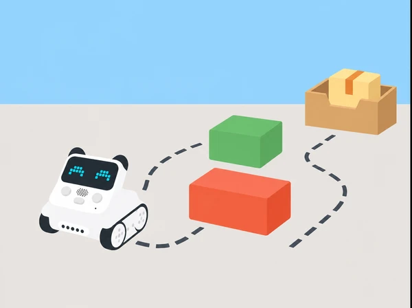

_La pista és tancada, baixa i preparada perquè les proves siguen lentes i supervisades._

## 🧩 Repte i context

El grup dissenya un servei de repartiment de joguina entre un punt de preparació, una parada de barri i una destinació com una biblioteca o un hort escolar. Codey Rocky segueix una ruta de baixa velocitat i prova una resposta programada davant d’obstacles de cartró. La maqueta serveix per estudiar decisions i límits d’un sensor; no representa un vehicle segur per a lliuraments reals ni substitueix la supervisió humana.

**Aprenentatges:** planificar un itinerari, controlar una variable, usar una condició, registrar deteccions i errors, revisar un programa i justificar per què un sistema automàtic necessita una persona responsable.

## 📅 Seqüència didàctica · quatre sessions de 45 minuts

### **Dissenyem el mapa de repartiment (45 min).**

#### Fase 1 · Activem i prediem

Dibuixeu una pista tancada i estable amb un punt de càrrega, una parada i una destinació. Marqueu distàncies amb unitats de paper, trams rectes i punts possibles de gir. Predigueu quines accions necessitaria Codey Rocky per seguir la ruta.

#### Fase 2 · Explorem i construïm

Traceu una ruta en el plànol i col·loqueu una capsa lleugera de paper com a símbol del paquet. No la fixeu damunt del robot si pot tapar el sensor o desestabilitzar-lo. Identifiqueu dos riscos potencials de la maqueta.

#### Fase 3 · Expliquem i registrem

Definiu què vol dir «obstacle» dins del model i anoteu quina informació el robot no pot donar: si una persona vol travessar, si una zona és privada o si el paquet ha arribat a una persona concreta.

#### Fase 4 · Apliquem i millorem

Reviseu el recorregut i amplieu les zones de gir si cal. Afegiu punts d’aturada clars abans de moure el robot.

#### Fase 5 · Comprovem i reflexionem

Expliqueu què pot fer el robot amb una detecció i quina decisió continua sent humana. **Evidència:** mapa amb ruta, punts de parada i riscos potencials.

### **Establim una línia base (45 min).**

#### Fase 1 · Activem i prediem

Comproveu el Codey Rocky i l’entorn mBlock 5. Orienteu cap endavant el sensor IR/color integrat segons les instruccions del fabricant; no afegiu sensors aliens a la dotació. Predigueu on acabarà el robot en una prova sense obstacles.

#### Fase 2 · Explorem i construïm

Creeu un programa curt que inicie el moviment amb el botó A i el pare amb una acció accessible o supervisada. Feu-lo circular sense obstacle, a baixa velocitat, en una pista tancada i lliure.

#### Fase 3 · Expliquem i registrem

Marqueu el punt d’inici, el temps aproximat i el lloc final. Repetiu la mateixa ruta tres vegades i compareu els resultats, mantenint superfície, bateria, velocitat i posició inicial.

#### Fase 4 · Apliquem i millorem

Si la desviació és gran, comproveu superfície, bateria, velocitat i posició abans de canviar el codi. Repetiu el protocol després de corregir una condició.

#### Fase 5 · Comprovem i reflexionem

Descriviu la variabilitat que s’ha observat i indiqueu quines condicions s’han mantingut igual. **Evidència:** tres registres de línia base i configuració provada.

### **Provem una condició davant d’obstacles (45 min).**

#### Fase 1 · Activem i prediem

Trieu un obstacle gran, tou, estable i visible per al sensor, com una paret baixa de cartró. Predigueu què farà el robot quan el detecte i recordeu que la direcció aleatòria no garanteix arribar a una destinació.

#### Fase 2 · Explorem i construïm

Afegiu una condició: quan el sensor detecta l’obstacle, el robot tria un gir a esquerra o dreta i després reprén l’avanç. Feu primer una demostració d’una sola detecció i manteniu les mans fora de la ruta mentre el motor està actiu.

#### Fase 3 · Expliquem i registrem

Canvieu una variable cada vegada —posició de l’obstacle, angle o distància inicial— i anoteu configuració, resposta esperada, resposta real i incidència. Incloeu casos sense detecció o amb una reacció massa prompte; no els oculteu ni els atribuïu a negligència de qui programa.

#### Fase 4 · Apliquem i millorem

Reviseu una condició i torneu a provar la mateixa situació. Si varia l’obstacle, manteniu el registre dels intents perquè es puga comparar cada resultat.

#### Fase 5 · Comprovem i reflexionem

Identifiqueu quina prova mostra que el sensor pot fallar i què caldria fer si hi haguera una persona. **Evidència:** taula de proves amb deteccions, falses alarmes i una revisió justificada.

### **Revisem el servei i comuniquem els límits (45 min).**

#### Fase 1 · Activem i prediem

Ajusteu el recorregut perquè tinga una zona de gir ampla i cap eixida a terra. Predigueu quines fallades requeririen una intervenció humana.

#### Fase 2 · Explorem i construïm

Una altra parella executa el mateix protocol sense rebre l’explicació prèvia i comprova si pot reproduir la prova. Manteniu supervisió directa i obstacle triat pel docent.

#### Fase 3 · Expliquem i registrem

Prepareu una presentació amb mapa, dades i una afirmació prudent, com ara «en dues de tres proves ha detectat aquesta paret de cartró a aquesta distància». Separeu l’observació del que no es pot concloure.

#### Fase 4 · Apliquem i millorem

Reviseu el programa o el protocol si l’altra parella no pot reproduir la prova. Afegiu un cartell d’ús: pista tancada, velocitat baixa i supervisió; no és un vehicle segur per a lliuraments reals.

#### Fase 5 · Comprovem i reflexionem

Presenteu la recomanació per a la persona supervisora i expliqueu què les dades permeten afirmar i què no es pot prometre sobre un robot real. **Evidència:** programa comentat, plànol revisat, taula de proves i recomanació.

## 🧪 Evidències i avaluació

Recolliu el plànol, el programa amb comentaris, tres proves de línia base, les observacions amb obstacle i la recomanació final. Observeu si l’alumnat:

- descriu ruta i instruccions abans de moure el robot;

- identifica la condició que activa la resposta i anticipa què hauria de passar;

- separa una detecció correcta d’una falsa alarma o d’un obstacle no detectat;

- canvia una variable a la vegada i usa resultats per depurar;

- explica per què cal supervisió humana i quins límits té el prototip.

Valoreu la qualitat del protocol i la interpretació honesta, no que el robot complete sempre la ruta.

## 🎯 Aprenentatges i vocabulari

- Descompondre una tasca de repartiment fictícia en entrada, decisió, gir i continuació.
- Programar una resposta amb els components de Codey Rocky que s’han comprovat al centre.
- Comparar els resultats de diversos intents i revisar una regla davant d’una detecció incorrecta.
- Explicar per què un prototip escolar no és un sistema autònom segur per a un espai públic.

## 🧰 Preparació i seguretat

Verifiqueu que el sensor IR/color està muntat i orientat cap endavant, que el programa mBlock 5 el pot llegir i que la bateria permet proves curtes. Manteniu velocitat baixa, pista delimitada sobre una taula gran o al terra llis, obstacles lleugers i supervisió directa. No proveu prop d’escales, persones en moviment, animals, objectes fràgils o accessos de pas. L’infraroig pot no detectar materials o angles diversos; una absència de detecció no significa que el camí estiga lliure.

## ♿ Variants de participació

Permeteu dissenyar el recorregut en paper abans de manipular el robot i assigneu rols rotatius de planificació, programació, observació, registre i seguretat. Una ruta curta, una ordre per targeta o la lectura en veu alta faciliten la participació sense reduir el repte de raonament. Oferiu taules amb pictogrames per registrar resultats i deixeu que una persona dicte instruccions mentre una altra opera el robot. Qualsevol participant pot optar per observar les proves a una distància còmoda.

## 🔗 Referent oficial adaptat

Hem pres com a punt de partida [Case 18: Codey Rocky avoids obstacles](https://support.makeblock.com/hc/en-us/articles/7463724329879-Case-18-Codey-Rocky-avoids-obstacles). Aquesta situació és una proposta pròpia amb context, seqüència i materials verificables per al centre; no reprodueix ni substitueix el material oficial. Comproveu sempre el model de robot i els accessoris disponibles.
