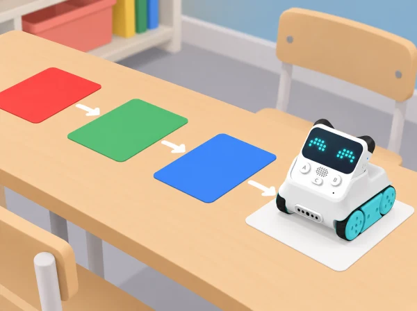

_Les targetes de prova permeten comparar lectures conegudes abans d’observar objectes reals._

## 🧩 Repte i context

L’equip prepara un arxiu de colors per a acompanyar una observació del pati o d’un hort escolar. Codey Rocky es desplaça sobre mostres preparades amb el sensor orientat cap avall; el programa pot mostrar en l’indicador RGB un color que el sensor ha detectat. El repte és comprovar quines mostres distingeix en les condicions de la prova i descriure què sabem i què no podem concloure a partir d’eixa dada.

**Aprenentatges:** observar i classificar mostres, construir una condició amb blocs, fer proves comparables, registrar resultats, distingir dada i interpretació, i comunicar límits del mètode. Una lectura de color no identifica una espècie, un aliment ni l’estat de salut d’una planta.

## 📅 Seqüència didàctica · quatre sessions de 45 minuts

### **Fem un arxiu de mostres i prediccions (45 min).**

Prepareu targetes mates de colors diferents, incloent-hi diverses tonalitats pròximes, més una targeta neutra o una mostra amb textura. Abans de programar, cada equip descriu les mostres i prediu quines podrà distingir el robot. Dibuixeu un pla de prova que indique quina mostra es col·locarà primer i com es garantirà que cada torn la presente en una posició semblant.

Parleu sobre com es veu el mateix color amb llum diferent i com la lluentor o el fons pot influir en l’observació. Assigneu rols: preparar la mostra, col·locar el robot, observar l’indicador i registrar la dada. *Evidència:* taula de prediccions i protocol visual de manipulació. *Pregunta docent:* «Què mantindrem igual per poder comparar les mostres?»

### **Programem i repetim una prova controlada (45 min).**

Comproveu que el sensor IR/color està instal·lat i orientat a la part inferior del robot, tal com mostra el fabricant. Connecteu Codey Rocky a mBlock 5 i useu el programa de tipus condicional i d’il·luminació adequat al sensor: quan es detecta una categoria de color, l’indicador RGB mostra la resposta corresponent. Primer proveu només una o dues categories que l’equip puga observar amb claredat; afegiu-ne més després d’haver verificat el comportament. No suposeu que tots els tons pròxims tindran una lectura diferent.

Passeu cada mostra pel sensor de la mateixa manera i repetiu almenys una observació. Anoteu el color de la mostra, el que indica el robot i si les repeticions coincideixen. Si hi ha diferència, no esborreu el resultat: marqueu «variable» i torneu a comprovar llum, posició i fons. *Evidència:* programa propi, registre de dues proves per mostra i descripció d’un cas estable o ambigu. *Pregunta docent:* «Quin resultat hem vist directament? Quin estem interpretant?»

### **Observem materials del pati amb cautela (45 min).**

Trieu unes quantes mostres no delicades que es puguen portar a l’aula: paper, fulla caiguda, terra dins d’un recipient tancat o una fotografia impresa d’un element de l’hort. Eviteu arrencar plantes, posar terra solta al sensor, escanejar aliments per decidir si són segurs o afirmar que un color prova que una planta està sana. Poseu una mostra damunt d’una targeta de fons neutre, apropeu el sensor amb el robot aturat i registreu què detecta el programa.

Compareu la resposta amb la descripció humana de la mostra. Si la lectura canvia quan canvia el fons o la llum, registreu eixa condició i decidiu quina conclusió es pot sostenir: per exemple, «el programa ha mostrat verd en aquesta prova» i no «el sensor sap quina planta és». *Evidència:* dues fitxes d’observació amb mostra, condicions i lectura. *Pregunta docent:* «Quina informació ens dona el color? Quina pregunta necessita una observació o font diferent?»

### **Publiquem l’arxiu crític (45 min).**

Ordeneu les mostres en una taula o mural amb quatre camps: mostra, predicció, lectura repetida i grau de confiança (coincideix / varia / no ho sabem). Afegiu una categoria explícita «no ho podem concloure amb aquesta prova». Cada equip tria un exemple estable i un d’ambigu i els explica a una altra parella. Les companyes revisen si queda clara la diferència entre el color mostrat i el significat atribuït.

Tanqueu proposant una nova prova que faria falta per respondre una pregunta diferent: comparar llum natural i artificial, repetir en un altre fons o observar la planta al llarg del temps amb una pauta humana. No cal fer aquestes investigacions en aquesta SDA ni atribuir-les al robot. *Evidència:* arxiu final, una afirmació sustentada per lectures i una pregunta que continua oberta. *Pregunta docent:* «Quina frase podem afirmar a partir de les nostres dades? Què encara no sabem?»

## 🧪 Evidències i avaluació

Recolliu el programa, les prediccions, el registre de lectures i l’arxiu crític. Observeu si l’alumnat:

- manté constants bàsiques per comparar dues mostres;

- distingeix una lectura repetida d’una lectura variable;

- explica la diferència entre el valor que mostra el robot i la interpretació humana;

- revisa una afirmació quan apareix una lectura ambigua;

- proposa una pregunta nova sense atribuir al sensor funcions que no té.

No es valora encertar totes les classificacions, sinó descriure honestament què ha passat i quines condicions limiten la prova.

## 🎯 Aprenentatges i vocabulari

- Calibrar el sensor amb mostres conegudes i registrar les condicions de llum i distància.
- Programar una regla de classificació limitada a les mostres de prova acordades.
- Calcular encerts, errors i casos dubtosos en intents repetits.
- Distingir el color llegit de la identitat, la qualitat o la seguretat d’un objecte real.

## 🧰 Preparació i cura del material

Comproveu en el model de Codey Rocky del centre que el sensor IR/color està disponible i funciona, i que l’indicador RGB pot mostrar la resposta programada. El tutorial oficial orienta el sensor situat a la part frontal cap a la cara inferior del robot i usa mBlock 5 per programar el color detectat. Seguiu la versió de l’entorn de programació i el firmware instal·lats; abans de classe, feu una prova amb les mateixes targetes i superfície que usareu amb l’alumnat. La llum, l’angle, la distància, la lluentor i el color del fons poden modificar el resultat. Manteniu líquids, terra i peces menudes allunyats del sensor i no useu el robot per diagnosticar plantes ni classificar aliments.

## ♿ Participació accessible

Oferiu mostres amb forma o textura distintiva a més del color; descriviu en veu alta cada lectura i mostreu pictogrames d’igual/diferent/variable. No feu dependre cap instrucció només de la percepció cromàtica. Distribuïu rols de programació, col·locació, observació i registre, i permeteu donar instruccions perquè una altra persona manipule el robot. La resposta es pot comunicar amb símbols, selecció de targetes, comunicació augmentativa o dibuix.

## 🔗 Referent oficial adaptat

Hem pres com a punt de partida [Case 19: Codey Rocky identifies colors](https://support.makeblock.com/hc/en-us/articles/7484512467223-Case-19-Codey-Rocky-identifies-colors). Aquesta situació és una proposta pròpia amb context, seqüència i materials verificables per al centre; no reprodueix ni substitueix el material oficial. Comproveu sempre el model de robot i els accessoris disponibles.
