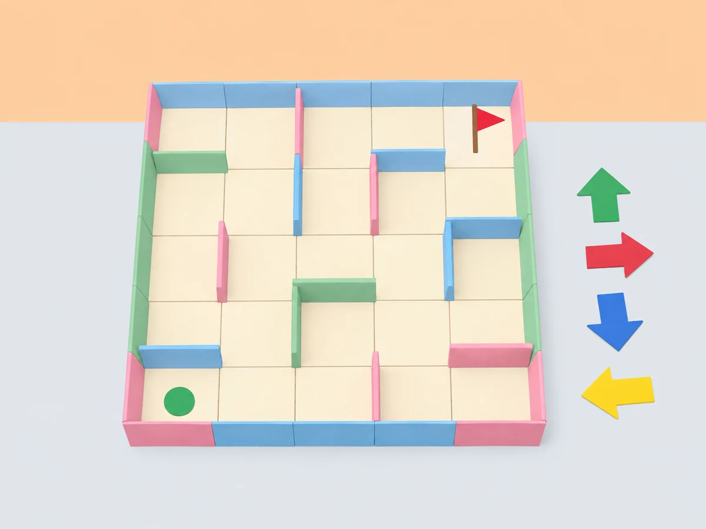
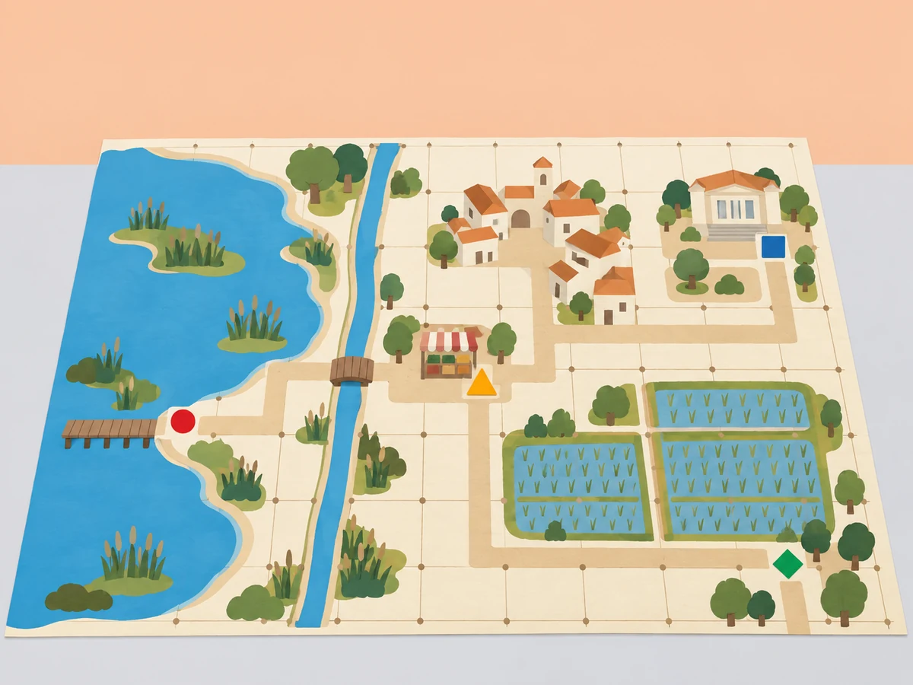

_Una progressió de proves en taula transforma les ordres tangibles en històries, mapes i creacions compartides._

## 🌱 Situació, repte i intenció

La biblioteca del centre vol preparar un recorregut de descobertes per a una altra classe. Primer cal entendre com llegeix MatataBot les ordres; després, dissenyar un laberint, representar un espai conegut amb una graella i construir un itinerari que tinga sentit. En acabar, cada equip crearà una peça artística o sonora amb els materials compatibles que tinga el centre.

La proposta pren com a referència el currículum oficial **Learning Station** de Matatalab: dotze lliçons, amb una progressió pública que va de la familiarització amb el Coding Set i els blocs (1–4), als obstacles, banderes i laberints amb històries o poemes (5–7), als mapes i les graelles (8–10), i a la creació artística o musical amb accessoris (11–12). El document docent complet no s’ha pogut contrastar pas a pas; per això, les sessions següents són una adaptació pròpia de l’abast públic, no una transcripció ni una afirmació de correspondència integral amb cada pla de lliçó.

La guia docent pública concreta els quatre primers objectius i activitats: (1) vocabulari de robot, robòtica i comunicació; (2) enviar i rebre missatges i relacionar-ho amb torre i robot; (3) classificar blocs de moviment, nombres, bucles, funcions, música/dansa, obstacles i banderes; i (4) resoldre reptes il·lustrats del *Challenge Booklet* de nivell 1 amb blocs i bandera, comprovant la posició final. També indica uns 20 minuts per lliçó i grups cooperatius de quatre. Ací ampliem cada lliçó a 45 minuts per afegir context valencià, prediccions, proves repetides, registre i revisió per una altra parella; aquesta duració és una decisió local, no l’oficial. El quadern de reptes no està disponible per comprovar cada exercici, així que la sessió 4 usa targetes pròpies i no s’afirma que adapte els seus reptes exactes.

**Pregunta guia:** quines instruccions i quina informació necessita una altra classe per arribar al lloc que hem triat i entendre què hi passa?

## 🎯 Aprenentatges i vocabulari

anticipar l’efecte d’una seqüència, distingir ordre i orientació, provar i depurar una ruta, representar espais en una graella, comunicar un itinerari amb vocabulari espacial i revisar una creació a partir de les proves.

## 🧰 Materials i preparació

- Coding Set complet: MatataBot, torre de control, tauler de programació i blocs tangibles disponibles al kit. Carregueu els dos dispositius i comproveu l’enllaç entre torre i robot abans de la sessió.
- Cinta de pintor, cartolines, targetes de caselles, obstacles baixos de paper, banderes de destinació, retoladors esborrables i una quadrícula gran creada per l’aula.
- Fotografies o dibuixos autoritzats de llocs pròxims: biblioteca, pati, plaça o camí de l’horta. Eviteu incloure cares, adreces particulars o recorreguts identificables d’infants.
- Full de registre amb quatre columnes: **predicció**, **ordres**, **resultat observat** i **canvi provat**. Prepareu també targetes amb les paraules *davant*, *darrere*, *gir*, *casella*, *inici* i *destí*.
- L’Artist Add-On i el Musician Add-On són opcionals i no es pressuposen en la dotació. Les sessions 11 i 12 ofereixen una via completa amb materials de paper si no hi són.

Abans d’iniciar la seqüència, mesureu el desplaçament real del robot amb una ordre curta i useu eixa mesura per dimensionar les caselles. Si el robot no avança la distància esperada, ajusteu la quadrícula: no demaneu a l’alumnat que compense un desajust del material sense registrar-lo.

## 🎯 Itinerari de dotze sessions

### Sessió 1 · Quines peces fan possible el viatge?

#### Fase 1 · Activem i prediem

presenteu el repte de preparar una ruta perquè una altra classe puga descobrir la biblioteca o un racó del pati. Mostreu el kit tancat i recolliu prediccions sobre què pot fer cada peça.

#### Fase 2 · Explorem i construïm

en equips de quatre, identifiqueu robot, torre i tauler. Repartiu i roteu els rols de programador/a, inspector/a, responsable del mapa i portaveu; observeu quines peces necessiten càrrega i quines ordres tangibles reconeix el kit. Cada membre explica una funció amb les seues paraules abans de provar res.

#### Fase 3 · Expliquem i registrem

executeu una ordre senzilla des d’una casella marcada i observeu què passa quan la torre llig el tauler i envia la instrucció al robot. Repetiu només després de tornar a col·locar el robot en la mateixa posició inicial.

#### Fase 4 · Apliquem i millorem

dibuixeu el recorregut i completeu la frase «La torre… / el robot…». Distingiu la lectura del programa del moviment físic.

#### Fase 5 · Comprovem i reflexionem

dibuix de les tres parts del sistema, una funció observada i una pregunta per a investigar.
### Sessió 2 · Enviar i rebre una instrucció

#### Fase 1 · Activem i prediem

acordeu missatges curts i neutres sobre espais del centre (per exemple, «la biblioteca està oberta»). No useu informació personal.

#### Fase 2 · Explorem i construïm

en equips de quatre, dues persones envien un missatge oral a l’altra banda de l’espai i les altres dues el reben i el repeteixen. Canvieu els rols. Compareu què passa quan el missatge arriba incomplet o en un ordre diferent.

#### Fase 3 · Expliquem i registrem

representeu una ruta amb blocs en el tauler. La torre llig la disposició i envia instruccions al robot; una parella fa de programadora i l’altra d’inspectora: abans d’executar, la receptora descriu què espera que faça el robot. Repetiu amb una sola ordre canviada i identifiqueu el missatge diferent.

#### Fase 4 · Apliquem i millorem

dibuixeu dos símbols propis, un per a «enviar» i un per a «rebre», i expliqueu la relació entre torre, programa i robot.

#### Fase 5 · Comprovem i reflexionem

missatge transmés i rebut, dibuix de la ruta i una explicació de la funció de la torre i del robot.
### Sessió 3 · Classificar blocs, obstacles i destinacions

#### Fase 1 · Activem i prediem

mostreu el Coding Set preparat sobre una taula plana. Abans de tocar les peces, cada equip proposa criteris per a agrupar-les.

#### Fase 2 · Explorem i construïm

repartiu targetes pròpies amb aquestes categories: moviment/direcció, nombres/paràmetres, repetició, funcions, música/dansa i obstacles/banderes. En grups de quatre, classifiqueu les peces que realment hi ha al kit i poseu cada targeta al costat del grup corresponent. Si una categoria depén d’un accessori absent, deixeu la targeta com a «no disponible en aquesta dotació»; no la completeu amb peces imaginàries.

#### Fase 3 · Expliquem i registrem

expliqueu per a què podria servir cada categoria i feu un dibuix original que la represente. Compareu dues classificacions i justifiqueu qualsevol diferència amb una peça concreta, una instrucció del manual o una prova observada.

#### Fase 4 · Apliquem i millorem

reuniu les targetes i prepareu un inventari de classe: nom, funció comprovada i dependència d’accessori si n’hi ha.

#### Fase 5 · Comprovem i reflexionem

taula il·lustrada de categories amb peces observades i una llista separada d’elements absents o pendents de verificar.
### Sessió 4 · Resoldre reptes de codi amb banderes

#### Fase 1 · Activem i prediem

La guia oficial proposa completar els reptes del *Challenge Booklet* de nivell 1 seguint les imatges, col·locant blocs i una bandera de destinació i comprovant si el robot arriba al lloc representat. Com que no tenim el quadern per validar-ne els reptes individuals, aquesta sessió el substitueix per targetes originals; no es presenta com una adaptació dels seus exercicis exactes.

dibuixeu una graella de quatre per quatre amb biblioteca, hort i plaça com a destinacions fictícies. Prepareu tres targetes pròpies amb inici, bandera i seqüència representada amb símbols.

#### Fase 2 · Explorem i construïm

en grups de quatre, resoleu tres reptes: arribar amb una seqüència curta de moviments; arribar amb un gir i l’orientació marcada; i comparar dues seqüències vàlides per a la mateixa destinació. La persona inspectora comprova que la seqüència física coincideix amb la targeta abans de prémer el botó d’execució. Després, compareu la posició final del robot amb el dibuix de destí i corregiu una sola peça si no coincideixen.

#### Fase 3 · Expliquem i registrem

cada equip dibuixa una ruta original amb blocs i bandera per a un altre equip. Qui la rep la programa sense que l’equip autor li done instruccions orals.

#### Fase 4 · Apliquem i millorem

compartiu una ruta provada i dibuixeu-la al quadern o al registre de l’equip.

#### Fase 5 · Comprovem i reflexionem

targeta creada, disposició comprovada de blocs, destí previst/observat i ruta dibuixada després de la prova.
### Sessió 5 · Descobrir què fa que un mapa siga un laberint

#### Fase 1 · Activem i prediem

presenteu un camí obert i un laberint dibuixat amb carrers de paper. Demaneu que localitzen inici, destinació, cruïlles i carrerons sense eixida.

#### Fase 2 · Explorem i construïm

en grups de quatre, una persona fa de robot sobre una quadrícula de cinta i les altres li donen instruccions d’una en una. Marqueu en el mapa on hi ha més d’una opció i on cal tornar arrere; no poseu obstacles físics al recorregut.

#### Fase 3 · Expliquem i registrem

cada equip dibuixa un primer laberint senzill de carrers amples amb més d’un itinerari possible. Una fitxa recorre la ruta i el grup comprova que almenys una opció connecta entrada i eixida.

#### Fase 4 · Apliquem i millorem

intercanvieu mapes i demaneu a una altra parella que trace un camí possible sense que l’equip autor li’l marque.

#### Fase 5 · Comprovem i reflexionem

laberint amb llegenda, dos camins identificats i una explicació de per què un és viable.

_La ruta es planifica i es revisa en paper abans de provar el robot._
### Sessió 6 · Afegir obstacles i banderes

#### Fase 1 · Activem i prediem

recupereu el laberint de la sessió anterior i distingiu un obstacle, una bandera de destí i un carrer transitable. La bandera indica on arribar; no és un bloc de moviment.

#### Fase 2 · Explorem i construïm

cada equip col·loca targetes pròpies d’obstacle i bandera en diverses caselles i explica quina funció té cadascuna. Els obstacles són símbols plans dibuixats al mapa, mai peces altes que puguen encallar el robot.

#### Fase 3 · Expliquem i registrem

situeu inici, una bandera i fins a tres obstacles representats en paper. Dibuixeu un camí que evite els obstacles, convertiu-lo en instruccions i proveu-lo. Registreu el primer punt on el camí previst i l’execució divergeixen; canvieu una ordre cada vegada.

#### Fase 4 · Apliquem i millorem

canvieu la bandera de casella sense moure els obstacles i expliqueu què ha canviat en la ruta necessària.

#### Fase 5 · Comprovem i reflexionem

mapa amb llegenda, distinció obstacle/destí, seqüència provada i anotació d’una depuració.
### Sessió 7 · Crear un laberint amb inici i final

#### Fase 1 · Activem i prediem

cada equip tria un espai valencià imaginari —una marjal, un jardí escolar o un camí entre parades del mercat— i fixa una entrada i una bandera final.

#### Fase 2 · Explorem i construïm

dissenyeu un laberint propi amb carrers de paper amples, dos o tres obstacles dibuixats i almenys una ruta completa. Una altra parella revisa que inici, bandera i llegenda siguen inequívocs abans de programar.

#### Fase 3 · Expliquem i registrem

col·loqueu la seqüència de blocs i executeu-la des del mateix inici. Compareu la posició final amb la bandera, canvieu una sola instrucció i repetiu la prova. Després, creeu una segona solució si el laberint permet més d’un camí.

#### Fase 4 · Apliquem i millorem

intercanvieu laberints. L’equip visitant traça el recorregut i prova el programa; l’equip autor registra una millora del mapa o de les instruccions. Com a extensió pròpia, afegiu un relat o poema curt que done sentit a la destinació.

#### Fase 5 · Comprovem i reflexionem

laberint amb inici/final, ruta dibuixada, programa provat, resultat observat i una revisió posterior al retorn.
### Sessió 8 · Crear un mapa esquemàtic de l’entorn (45 min)

#### Fase 1 · Activem i prediem

Aquesta sessió adapta el tema oficial «Introducing Maps»: representar un espai amb símbols i llegenda abans de convertir-lo en una quadrícula. El mapa és una maqueta didàctica, no un plànol d’orientació real.

compareu un dibuix panoràmic i una llista de llocs del centre o d’un poble imaginari. Quina informació cal perquè una altra classe entenga com es relacionen els llocs? Useu espais públics o inventats, mai adreces particulars.

#### Fase 2 · Explorem i construïm

observeu una imatge o un dibuix de referència de l’Albufera i identifiqueu elements que es poden representar sense afirmar distàncies exactes: aigua, camins, horta, pont, plaça o biblioteca. Separeu allò observat d’allò que el grup proposa com a símbol.

#### Fase 3 · Expliquem i registrem

acordeu una llegenda amb símbols diferenciats per a lloc, camí, inici i destinació. Anoteu què significa cada símbol i quina informació deixa fora el mapa; encara no afegiu coordenades ni una escala geogràfica.

#### Fase 4 · Apliquem i millorem

dibuixeu un mapa esquemàtic amb quatre o cinc llocs i un camí continu. Una altra parella l’interpreta sense ajuda i marca amb una fitxa una ruta possible. Si no pot distingir camins, llocs i destí, reviseu la llegenda o l’organització abans d’afegir instruccions per al robot.

#### Fase 5 · Comprovem i reflexionem

expliqueu una decisió de representació i una limitació del mapa. Deseu la versió inicial i el retorn de la parella perquè es puga transformar en graella en la sessió següent.

**Evidència:** mapa original amb llegenda, ruta verbalitzada per una altra parella i una nota que diferencia representació esquemàtica de distància real.

_El mapa és una maqueta didàctica: no representa rutes reals ni dades de cap infant._
### Sessió 9 · Convertir el mapa en una graella (45 min)

#### Fase 1 · Activem i prediem

La segona lliçó del bloc oficial tracta les graelles. Ací transformem el mapa de la sessió 8 en una representació regular que permet descriure posicions i instruccions sense confondre coordenades amb ordres directes del Coding Set.

recupereu el mapa esquemàtic i trieu un recorregut curt. Predigueu què es perdrà i què es guanyarà si es dibuixa sobre caselles iguals.

#### Fase 2 · Explorem i construïm

poseu una quadrícula transparent o de paper damunt del mapa. Marqueu files i columnes amb símbols grans, una fletxa d’orientació i les posicions d’inici/destí. Manteniu la quadrícula prou ampla perquè el robot puga circular si es farà una prova física.

#### Fase 3 · Expliquem i registrem

descriviu tres llocs amb referències de fila/columna i practiqueu una ruta amb davant, darrere i gir. Acordeu el punt de vista del robot; una coordenada assenyala una casella, però no indica cap a on mira ni substitueix els blocs de moviment.

#### Fase 4 · Apliquem i millorem

una parella dona la ruta amb referències de graella i l’altra la tradueix a blocs físics. Predigueu les caselles de pas, executeu des d’una mateixa orientació inicial i anoteu la primera diferència entre posició prevista i observada. Corregiu una sola instrucció i proveu de nou.

#### Fase 5 · Comprovem i reflexionem

compareu mapa i graella: quins detalls del lloc han quedat simplificats? Quina informació cal afegir perquè un equip visitant puga reconstruir la ruta?

**Evidència:** mapa en quadrícula amb llegenda i orientació, taula de tres posicions i seqüència de blocs provada o marcada explícitament com a simulació.
### Sessió 10 · Reduir una ruta amb bucles i funcions (45 min)

#### Fase 1 · Activem i prediem

Aquesta sessió adapta «Introducing More Advanced Coding Blocks». Els recursos oficials de Matatalab descriuen l’ús de bucles amb moviment i nombre, i de funcions amb altres blocs o bucles; fem servir eixes regles publicades, però no afirmem que siguen els passos exactes del pla docent de la lliçó 10. Abans de començar, comproveu que els blocs de bucle i funció del kit local estiguen complets i siguen reconeguts pel tauler.

mostreu dues seqüències pròpies per arribar a la mateixa destinació: una llarga i una amb un tram repetit. L’alumnat prediu quina és més fàcil de revisar i identifica quina part es repetix.

#### Fase 2 · Explorem i construïm

amb els blocs disponibles, observeu que un bucle es forma amb inici i final en parella; el nombre va davall del bloc d’inici i controla quantes vegades es repetixen les ordres interiors. Per a les funcions, consulteu el manual de la versió local: la guia de Matatalab indica que definició i crida s’usen en parella, que la definició se situa en la fila inferior a la crida i que no s’hi combina un bloc numèric. No improviseu una disposició si les peces del centre difereixen.

#### Fase 3 · Expliquem i registrem

representeu el mateix tram repetit com una seqüència explícita i com un bucle, anotant quines ordres queden dins del parell. Després, identifiqueu un recorregut que puga encapsular-se en una funció i dibuixeu on apareix la definició i on es crida. Si falta algun bloc, feu aquesta comparació amb targetes pròpies i marqueu-la com a simulació.

#### Fase 4 · Apliquem i millorem

programeu la ruta de la graella de la sessió 9 amb el mètode més llegible per al kit real. Proveu primer la versió sense comprimir; després, useu un bucle o una funció, una a la vegada, i compareu si el robot arriba a les mateixes caselles. Registreu ordres, errors i diferències; una ruta més curta no es considera millor si deixa de ser interpretable per l’equip visitant.

#### Fase 5 · Comprovem i reflexionem

cada equip justifica quina representació reutilitzaria i per què. Separeu la funció realment executada pel robot de la que només s’ha representat en paper.

**Evidència:** dues versions d’un programa equivalent, registre de la prova i explicació del paper del nombre del bucle o de la crida a funció.
### Sessió 11 · Angles i estrelles del nostre entorn (45 min)

#### Fase 1 · Activem i prediem

L’índex de Learning Station inclou angles i pentagrames/estrelles en el tram de creació amb Artist i Musician Add-Ons. Com a comprovació tècnica complementària, la guia oficial Artist explica que el MatataBot dibuixa l’angle suplementari indicat pel bloc d’angle i que aquests blocs s’usen amb girs esquerra/dreta; combinats amb moviment i bucle permeten traçar formes. Aquesta sessió ho adapta amb una roseta pròpia inspirada en rajoles i places valencianes, sense copiar plantilles ni pressupostar accessoris.

mostreu una roseta dibuixada per l’equip docent i pregunteu quines repeticions i girs poden explicar-ne la forma. Cada parella marca amb fletxes el recorregut que espera i indica què entén per angle; no confongueu l’angle de gir del robot amb l’angle interior del polígon.

#### Fase 2 · Explorem i construïm

amb paper, regle i transportador opcional, compareu un gir recte amb girs més oberts o més tancats. Dibuixeu un pentagrama (estrela de cinc puntes) amb els vèrtexs marcats i traceu l’ordre que seguix el llapis. Si el centre disposa de l’Artist Add-On compatible, inventarieu-ne els 20 blocs d’angle, els tres llapis de colors i les targetes d’escalfament que realment hi ha, i reviseu les instruccions abans de muntar el llapis. La guia del fabricant enumera deu valors d’angle (30°, 36°, 45°, 60°, 72°, 108°, 120°, 135°, 144° i 150°), cadascun amb dos blocs; useu només els valors presents i feu una plantilla original de prova.

#### Fase 3 · Expliquem i registrem

descomponeu la roseta en trams repetits. En una taula, anoteu nombre de trams, gir observat, predicció i resultat. Feu una primera simulació amb fletxes sobre una quadrícula; una seqüència de girs a la graella no es presenta com una ordre en graus si el kit base no permet introduir-la.

#### Fase 4 · Apliquem i millorem

amb el complement verificat, combineu blocs de moviment, gir, angle i bucle per provar un triangle i una estrella propis. Predigueu la relació entre angle interior i gir suplementari, canvieu un paràmetre cada vegada i comproveu el traç sobre paper. Sense complement, manteniu el mateix objectiu amb una composició de paper: programeu MatataBot perquè visite els vèrtexs numerats d’una estrella gran o representeu el traçat amb una fitxa; registreu aquesta alternativa com a simulació, no com a dibuix del robot. Una parella revisa si el patró es pot repetir i si el dibuix coincideix amb la ruta prevista.

#### Fase 5 · Comprovem i reflexionem

cada equip mostra el patró i completa «Hem pogut comprovar… / Encara no podem afirmar…». Compareu el dibuix, la seqüència i el moviment observat; guardeu la plantilla pròpia i anoteu si s’ha usat el complement o una alternativa.

**Evidència:** disseny original amb vèrtexs i fletxes, registre de predicció/prova i explicació de la diferència entre angle geomètric, gir del robot i funcions del complement disponible.
### Sessió 12 · Joc creatiu lliure: una obra que una altra classe puga explorar (45 min)

#### Fase 1 · Activem i prediem

La guia oficial tanca el currículum amb «Introducing Creative Free Play». Ací l’alumnat tria una idea i combina lliurement les habilitats treballades en una creació per a una altra classe. Com a connexió tècnica complementària, la guia Musician explica com combinar blocs de nota i melodia amb nombres per modificar el compàs; només s’aplica si el complement està present i verificat. Si no, el repte continua amb seqüències de paper, símbols i una alternativa silenciosa.

obriu tres possibilitats sense imposar-ne cap: una història en un mapa, un laberint amb més d’una ruta o una composició de patrons/estrelles. Cada equip tria destinatari, propòsit i una cosa que vol provar; la proposta ha de poder-se explicar amb les peces que realment té.

#### Fase 2 · Explorem i construïm

feu un esbós amb inici, fites i final o amb les parts del patró. Assigneu rols rotatius i prepareu una llegenda. Si s’incorpora un complement, l’equip docent comprova prèviament compatibilitat, peces i instruccions; si no, oferiu l’alternativa en paper sense penalització.

#### Fase 3 · Expliquem i registrem

convertiu el disseny en una seqüència llegible: ordre de blocs, repeticions que el kit base admeta, girs, obstacles representats i missatge final. En una fitxa pròpia, distingiu «funció comprovada», «simulació» i «idea per provar». Abans d’executar, una parella predix què farà el robot o com recorrerà el visitant l’obra.

#### Fase 4 · Apliquem i millorem

feu una prova amb MatataBot si el disseny usa rutes; manteniu el mateix inici i compareu predicció/resultat. Si és una composició sonora i hi ha Musician Add-On, creeu una melodia original curta amb blocs de nota o de melodia i proveu un canvi de duració amb el bloc numèric; no copieu una cançó publicada. Si no hi ha complement, representeu el patró amb paper, ritme silenciós i símbols. Una classe visitant prova o interpreta la proposta sense indicacions de l’equip autor; el grup registra un comentari i aplica una millora concreta.

#### Fase 5 · Comprovem i reflexionem

presenteu el producte i expliqueu una decisió basada en la prova, una limitació del model i quina part depenia d’un accessori. Deseu el mapa o plantilla, la seqüència i el retorn rebut per a la mostra de classe.

**Evidència:** creació original provada o identificada com a model, instruccions que una altra parella pot seguir, retorn aplicat i reflexió sobre materials disponibles.
## 🧪 Avaluació i evidències

Recolliu evidències al llarg de la seqüència, no sols el producte final:

- **Representació:** prediccions, llegendes, orientació i mapes amb inici i destí identificables.
- **Programació:** seqüències tangibles que una altra parella puga llegir i provar.
- **Depuració:** registre de la primera divergència observada i del canvi aïllat que s’ha comprovat.
- **Comunicació:** poema, relat o instruccions espacials amb símbols explicats.
- **Col·laboració:** rotació dels rols de planificació, programació i observació; cada infant ha de tindre una manera accessible de participar.
- **Reflexió:** diferència entre l’espai real i la maqueta, entre ordre prevista i moviment observat, i entre kit base i accessoris opcionals.

Useu una escala de tres nivells —encara necessita suport, ho resol amb una bastida, ho explica i ho transferix— amb descriptors concrets. No avalueu la rapidesa, la qualitat del dibuix ni la capacitat de parlar en públic com a substituts del pensament computacional.

## ♿ Participació, accessibilitat i seguretat

Assigneu rols rotatius sense reservar sempre els blocs a la mateixa persona. Oferiu instruccions amb fletxes grans, contrast suficient, caselles tàctils o una explicació oral alternativa. Un equip pot planificar en paper mentre espera el kit i validar la seua ruta quan li toque el torn.

Manteniu el robot sobre una superfície plana, deixeu lliure el seu recorregut i useu obstacles de paper que no puguen encallar rodes. No alceu ni forceu la torre o el robot mentre estan connectats. Si apareix un error de comunicació o de lectura, l’adult revisa bateria, alineació i peces abans d’atribuir-lo a l’alumnat.

## 🔗 Referent oficial i adaptació

- Matatalab, [Learning Station Curriculum](https://matatalab.com/zh-hans/node/66): font pública que descriu 12 lliçons, el Coding Set com a producte principal i la progressió general entre blocs, obstacles/laberints, mapes/graelles i creacions amb Artist/Musician Add-Ons.
- Matatalab, [Teacher Resource Guide · Learning Station Curriculum](https://matatalab.com/cdn/ff/Vz0MsyTfj9_BIp7xKGB0hyr_QXjABpbIlXHSS3VcPg4/1637831178/public/2021-11/Learning%20Station%20Curriculum.pdf): guia docent oficial. S’han contrastat al detall els objectius i les activitats publicades de les lliçons 1–4 (vocabulari, missatges, classificació de peces i reptes del quadern de nivell 1), així com la duració, el treball cooperatiu i la preparació. La indexació consultable no mostra prou detall per a contrastar els objectius, materials i passos de les lliçons 5–12 ni els exercicis individuals del quadern.
- Matatalab, [Loop](https://matatalab.com/en/node/62), [Function](https://matatalab.com/en/node/63), [Artist](https://matatalab.com/en/node/64) i [Musician](https://matatalab.com/en/node/65): guies oficials complementàries que verifiquen les combinacions de blocs, les restriccions de disposició de bucles/funcions, els valors d’angle i les funcions de notes/melodies. No es presenten com el pla docent complet de les lliçons 10–12 de Learning Station.
- Matatalab, [catàleg d’activitats Coding Set](https://matatalab.com/en/activity): font complementària per comprovar el producte i les activitats públiques; no substituïx el pla docent complet.

La seqüència local conserva la progressió temàtica pública i crea context, materials de paper, consignes, registres i avaluació originals. Per a les sessions 11–12, la pàgina oficial i l’índex del PDF enumeren angles, pentagrames o estrelles i creació lliure; la proposta els converteix en una roseta de l’entorn i una obra oberta, sense afirmar una correspondència exacta de cada subtema amb una lliçó perquè no s’ha pogut inspeccionar el PDF complet. Les dues sessions separen l’ús real d’un accessori de l’alternativa desconnectada. Continua pendent el contrast integral de les lliçons 5–12 i dels exercicis individuals del quadern, ja que la descàrrega oficial excedeix el límit de lectura disponible.
