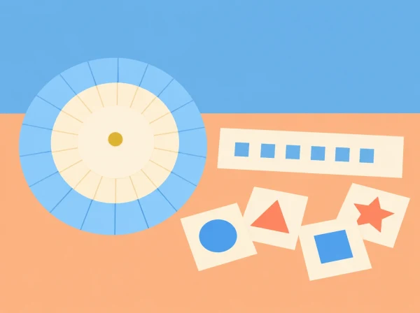

_La roda, les targetes i els missatges són materials de paper. La situació és desendollada i no demana comptes ni dades personals._

## Repte i sentit de la proposta

L'aula es converteix en un equip que ha de fer arribar instruccions fictícies a una altra classe. El grup dissenya un codi senzill, comprova que una altra persona el puga llegir i després n'analitza els límits. El fil conductor permet treballar patrons, representació i comunicació sense confondre un joc de xifrat amb la protecció que necessiten les dades reals.

La pregunta de seguretat no és «com amaguem la contrasenya?», sinó «quina informació convé no compartir, amb qui i per quin canal?». No es demanen contrasenyes, noms d'usuari, missatges privats ni experiències personals. Tots els exemples són inventats i es poden substituir si recorden massa dades reals.

## Aprenentatges que busquem

- Representar lletres i símbols amb una regla acordada, i aplicar la regla de manera consistent.

- Descriure un procediment pas a pas, detectar un error de codificació i corregir-lo amb una prova.

- Comparar codis segons quantes possibilitats tenen, la facilitat d'ús i la facilitat amb què una persona externa els pot deduir.

- Distingir entre un joc de substitució, una contrasenya i els mecanismes de seguretat dels serveis digitals.

- Proposar hàbits de privacitat respectuosos: minimitzar la informació compartida, verificar el destinatari i demanar ajuda davant d'un missatge sospitós.

## Preparació i materials

Prepareu cartolina, tisores, llapis, una plantilla de dues rodes concèntriques o una taula de substitució, sobres i targetes. Feu una demostració prèvia amb una paraula neutra. Acordeu un alfabet comú —per exemple, A–Z sense accents— i expliqueu com es representen l'espai, la ñ, les majúscules i la puntuació. Si s'inclouen accents, afegiu-los explícitament al repertori; no doneu per fet que totes les taules els codifiquen igual.

Prepareu missatges breus inventats com ara «EL MAPA ESTA AL PUNT BLAU» o instruccions de cerca d'un objecte fictici. Eviteu informació personal, dades de dispositius i qualsevol contrasenya real. En grups diversos, oferiu la roda impresa ja retallada o una taula gran per reduir la càrrega de motricitat fina.

## Seqüència didàctica

### Sessió 1 — Missatge, codi i destinatari (50 min)

**Activació (10 min):** presenteu una targeta amb símbols inventats i pregunteu què necessita saber el receptor per interpretar-la. Recolliu idees: una clau compartida, un alfabet, ordre, separació de paraules. **Modelatge (15 min):** codifiqueu conjuntament una paraula amb una taula de substitució simple; una altra parella la descodifica. Introduïu emissor, missatge, codi i receptor com a parts d'un procés comunicatiu, sense equiparar el paper amb Internet. **Repte (20 min):** cada parella crea una clau visual i codifica una instrucció fictícia de fins a sis paraules. **Tancament (5 min):** anoteu quines convencions han hagut d'aclarir.

### Sessió 2 — Roda de Cèsar i depuració (50 min)

**Construcció (15 min):** munteu la roda amb un alfabet exterior i un interior, amb una finestra clara per llegir correspondències. Trieu un desplaçament acordat, per exemple tres lletres, i manteniu la mateixa direcció en xifrar i desxifrar. **Prova creuada (20 min):** intercanvieu missatges i feu que la parella receptora escriga la regla abans de llegir. Si el resultat no té sentit, reviseu primer alfabet, espais i direcció: això és depuració, no un fracàs. **Conversa matemàtica (10 min):** amb 26 lletres, quants desplaçaments diferents no trivials hi ha? Què passa si el grup canvia la clau però algú conserva una còpia? **Eixida (5 min):** cada alumne dibuixa el pas més propens a error.

### Sessió 3 — Atacs de joc i límits del codi (50 min)

Doneu a una tercera parella un missatge xifrat i una pista: provar desplaçaments, buscar una paraula probable o observar repeticions. L'objectiu és veure que una clau amb poques opcions pot explorar-se sistemàticament. No es tracta de competició ni de provar a entrar en cap sistema. Compareu el xifrat de Cèsar amb una substitució inventada: augmentar les combinacions pot dificultar la lectura manual, però no converteix el paper en seguretat moderna. Cada equip afegeix al missatge una nota sobre què ha fet possible recuperar-lo.

### Sessió 4 — Privacitat quotidiana i protocol d'aula (50 min)

Classifiqueu situacions fictícies en tres respostes: compartir amb tothom, compartir només amb persones de confiança o no compartir. Exemples: horari públic d'una activitat, adreça de casa, fotografia d'un company sense permís, codi d'accés del centre. Justifiqueu cada decisió considerant context, consentiment i destinatari; no hi ha una regla que convertisca tota dada en igualment sensible. En grup, redacteu cinc passos per actuar davant d'una petició inesperada: aturar-se, no enviar dades ni obrir enllaços, comprovar qui ho demana per un canal conegut, demanar ajuda a una persona adulta de confiança i comunicar l'incident segons les normes del centre.

## Organització i rols

En equips de tres o quatre, repartiu els rols d'emissor, lector de la clau, receptor i observador del procediment. Canvieu-los en cada prova perquè tothom haja de produir i interpretar el codi. L'observador marca en una llista si s'ha declarat l'alfabet, la direcció, el tractament dels espais i la clau, i comunica un punt fort i una pregunta de millora.

## Evidències i avaluació formativa

- Roda o taula amb la clau indicada i les convencions d'escriptura visibles.

- Un missatge xifrat i la seua descodificació, amb una explicació que una altra parella puga seguir.

- Una revisió d'error on l'alumne assenyala el pas que ha corregit i com ho ha comprovat.

- Una comparació argumentada entre el codi de joc i una pràctica real de privacitat.

- El protocol d'aula, revisat perquè cada pas siga concret, respectuós i aplicable.

**Indicadors d'observació:** aplica la regla sense canviar-la a mitja seqüència; detecta almenys una ambigüitat; explica per què un codi senzill es pot deduir; evita proposar que s'hi amaguen dades personals; i identifica una acció segura quan no reconeix el destinatari. Accepteu explicacions orals, esquemes o demostracions pràctiques.

## Inclusió i ampliacions

Per facilitar l'accés, oferiu alfabet en lletra gran, peces mòbils, contrast alt i missatges més curts; permeteu dictar la resposta o treballar amb una parella. Qui necessite més repte pot comptar totes les claus possibles, comparar una substitució monoalfabètica amb una transposició de targetes, o escriure pseudocodi amb passos com «llegir símbol, trobar equivalència, escriure lletra». No cal introduir aritmètica modular formal si no correspon al nivell.

## Seguretat i abast

El xifratge Cèsar és una simulació històrica i **no protegeix informació real**. No s'utilitza per guardar contrasenyes ni per enviar informació privada. La maqueta ensenya la idea de transformar i recuperar un missatge, però no representa els protocols, les claus ni les defenses actuals dels serveis digitals. Si apareix una experiència de risc real, atureu el joc, escolteu sense exposar la persona davant del grup i seguiu el procediment de protecció del centre.

## Referents curriculars i transferència

La proposta connecta el raonament matemàtic, la seqüenciació pròpia del pensament computacional i l'ús crític i responsable de la informació. El producte final pot quedar com a cartell d'aula amb el protocol, sense noms ni exemples que identifiquen cap alumne. Per continuar, compareu com una mateixa instrucció es representa amb paraules, pictogrames i símbols, i què guanya o perd cada representació.
