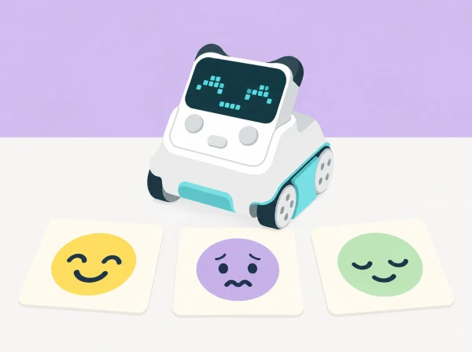

_Una expressió programada representa una idea del relat; no llig l’estat emocional de ningú._

## 🎭 Repte, context i aprenentatges

Una plaça de poble imaginària es prepara per a una festa. Uns personatges ficticis —una granota que ha perdut el mapa, un núvol que busca ombra o una llavor que espera la pluja— travessen situacions que poden donar lloc a interpretacions diferents. La classe dissenya cares digitals per a contar el relat amb Codey: usa les expressions integrades i crea imatges senzilles a la pantalla LED. El robot mostra el que el grup ha programat; no detecta ni interpreta les emocions de les persones.

**Aprenentatges:** expressar idees amb signes gràfics, observar que una mateixa situació pot provocar reaccions diferents, programar una resposta a un esdeveniment, dissenyar una imatge LED amb píxels, ordenar una narració i parlar de quan una persona pot necessitar suport humà.

## 🧰 Materials i preparació

Prepareu un Codey Rocky amb bateria, ordinador amb mBlock 5 i connexió USB, targetes amb situacions fictícies, fulls de quadrícula per a dissenyar imatges LED, pictogrames d’emocions diversos i un espai on provar el robot. Confirmeu que el dispositiu Codey està seleccionat en mBlock i que el mode Upload funciona. Els blocs Emotion permeten usar expressions predissenyades; els blocs Looks poden mostrar imatges creades encenent píxels de la pantalla. La disponibilitat exacta pot variar amb la versió del programari i el firmware.

Prepareu un acord de conversa segur: no es pregunta «com estàs de veritat?» ni es demana relatar una experiència personal. Totes les situacions i personatges són imaginaris. No useu so ni gir del giroscopi com a prova que una emoció concreta està present. Ningú no ha de gravar veu ni representar una expressió facial o corporal per a demostrar aprenentatge.

**Vocabulari:** expressió, píxel, pantalla, símbol, personatge, situació, interpretació, programa i seqüència. Diferencieu «el programa mostra aquesta cara» de «sabem com se sent una persona».

## 📅 Seqüència didàctica · quatre sessions de 45 minuts

### **Una escena, diverses interpretacions (45 min).**

Presenteu una situació fictícia senzilla: la granota arriba a la plaça i troba l’estand tancat. En lloc de fixar una resposta correcta, oferiu diverses possibilitats: pot estar decebuda, curiosa perquè hi ha una sorpresa, tranquil·la perquè sap que tornarà a obrir o simplement pensativa. Els equips trien una interpretació per al personatge i expliquen quina part de la història els hi ha fet pensar.

Trieu pictogrames, paraules o colors lliures per representar cada interpretació. No imposeu una associació fixa entre color i emoció: cada equip pot usar una combinació diferent si n’explica la intenció. Afegiu una targeta «no ho sabem» per recordar que un observador no pot conéixer amb certesa el que sent una altra persona només mirant-ne la cara. *Evidència:* targeta d’escena amb dues interpretacions possibles i una explicació del grup. *Preguntes docents:* «Quines pistes del relat heu usat? Podria el personatge sentir una altra cosa?»

### **Programem una emoció i la revisem (45 min).**

Connecteu Codey a mBlock 5. Seguint l’estructura del tutorial bàsic oficial, associeu el botó A a una expressió predissenyada dels blocs Emotion. Carregueu-la i comproveu que s’activa en prémer el botó. Després, cada equip tria una altra expressió disponible i canvia el programa. L’objectiu és entendre que el codi fa aparéixer una imatge acordada, no que el robot «sent» eixa emoció.

Compareu les dues expressions com a opcions gràfiques: quines formes o elements les diferencien? Algunes cares es poden llegir de maneres distintes; accepteu interpretacions diverses i pregunteu quin context narratiu faria més clara cadascuna. *Evidència:* programa amb entrada de botó, expressió triada i una explicació de com el context canvia la interpretació. *Preguntes docents:* «Què ha provocat que aparega la imatge? Què ens diu el programa i què no pot saber?»

### **Dibuixem una careta amb píxels (45 min).**

Useu una quadrícula que represente la pantalla LED de Codey. Dissenyeu una expressió original amb pocs píxels encesos; marqueu clarament els píxels buits i encesos i penseu com es veurà des de certa distància. Programeu l’esdeveniment del botó A per a mostrar la imatge durant un temps breu, i si el grup està preparat, afegiu una segona imatge o una espera perquè la careta canvie en la narració. No cal utilitzar animació, so ni giroscopi per completar el repte.

Compareu el disseny en paper amb la pantalla. Si costa llegir-lo, canvieu una sola característica: separació dels ulls, forma de la boca o duració. Doneu a una altra parella el context fictici sense explicar la intenció gràfica i demaneu-li que descriga què interpreta; després, qui ha programat pot aclarir què volia comunicar. *Evidència:* esbós de quadrícula, imatge en Codey i una millora basada en la lectura d’una altra persona. *Preguntes docents:* «Quins píxels fan que canvie la lectura? Què ha entés l’altra parella?»

### **Contem una història i pensem en els límits (45 min).**

Ordeneu tres targetes —inici, complicació i desenllaç— per al personatge de la plaça. Programeu una expressió en un moment del relat i una altra només si ajuda a entendre el canvi de situació. Un grup presenta la història amb targetes, narració, gestos o una demostració del Codey; l’audiència pot proposar dues interpretacions en lloc d’endevinar una emoció «correcta».

Finalitzeu amb una conversa curta: un robot pot mostrar un símbol que hem programat; una persona de confiança pot escoltar-nos i preguntar què necessitem. Si algú expressa malestar, no es demana al robot que el diagnostique ni a la classe que el resolga; s’ofereix l’acompanyament adult previst pel centre. *Evidència:* seqüència narrativa, programa revisat i una frase sobre el límit del dispositiu. *Preguntes docents:* «Quines dues lectures podria tindre aquesta cara? Quina diferència hi ha entre representar una emoció i detectar-la?»

## 📋 Avaluació i evidències

Recolliu targetes d’interpretació, esbós LED, codi i seqüència narrativa. Observeu si l’alumnat:

- proposa més d’una interpretació per a una situació fictícia;

- relaciona un esdeveniment programat amb l’aparició d’una expressió;

- dissenya i revisa una imatge amb píxels de la pantalla;

- ordena una història i explica per què hi ha triat aquella expressió;

- diferencia el símbol programat del coneixement de l’estat real d’una persona.

No s’avalua la capacitat d’identificar emocions d’altres persones, compartir vivències personals ni mostrar una expressió facial concreta. S’avaluen les decisions de disseny, la comprensió del programa i el respecte per les interpretacions múltiples.

## ♿ Expressió amb opcions i benestar

Permeteu expressar una idea amb color, gest, paraula, dibuix, símbol o selecció de targetes, i no feu dependre el significat només del color. Oferiu temps per a observar i no forceu la presentació davant del grup. La veu, els efectes sonors i la gravació són opcionals. Useu targetes amb contrast i formes diferenciades; qui ho necessite pot descriure el codi mentre una altra persona el manipula. El racó de lectura o de calma del centre continua sent un espai humà d’acompanyament, no una funció que la mascota robòtica puga substituir.

## 🔗 Referent oficial i adaptació pròpia

La seqüència s’inspira en [Case 1: Codey Rocky expresses emotions](https://support.makeblock.com/hc/en-us/articles/7462606593687-Case-1-Codey-Rocky-expresses-emotions), que programa una expressió Smile amb un esdeveniment de botó, i en [Case 2: DIY facial expressions](https://support.makeblock.com/hc/en-us/articles/7462619391895-Case-2-DIY-facial-expressions), que mostra una imatge personalitzada i una espera. El relat de la plaça, les situacions fictícies, les interpretacions múltiples i les targetes són propis; no s’atribueix al robot cap capacitat de lectura emocional.
