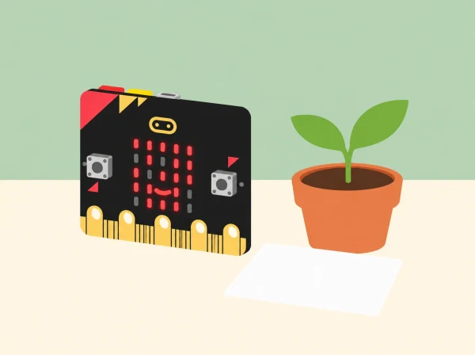

_Els muntatges són prototips de ràdio i sensor; no vigilen boscos ni controlen el reg real._

## 🌱 Situació i intenció

Una classe de tercer cicle investiga dues preguntes sobre un hort i un espai verd escolar: com podria un node avisar que cal revisar una zona de planter, i com podríem representar una lectura d’humitat abans de decidir què fer? Els dos reptes oficials s’adapten en un prototip de comunicació i un de lectura/decisió. Les proves es fan amb maquetes i valors de laboratori: cap placa vigila un bosc, pren imatges, controla una bomba ni decideix el reg d’una planta real.

La fundació presenta les activitats per a 11–14 i 14–16 anys. Aquesta versió les escala a tercer cicle de primària: simplifica la instrumentació, modela els sensors externs i posa l’accent en el disseny, les dades, la ràdio i els límits. No es presenta com una equivalència d’edat ni com un sistema IoT desplegable.

## 🧰 Preparació, materials i coneixements

Necessiteu una o preferiblement dues plaques micro:bit, MakeCode, ordinador o tauleta, cable USB, targetes de condició/missatge, full de dades i materials secs per a construir una maqueta. La ràdio i els botons són funcions integrades. La micro:bit no té sensor d’humitat del sòl, relé ni connexió a internet integrats; per a fer la lectura amb maquinari real cal un sensor analògic i un circuit de baixa tensió compatible que el centre verifique. Si no es disposa d’aquests components, els botons A/B seleccionen valors simulats que s’identifiquen clarament com a dades de prova. No connecteu probes descobertes a terra humida ni cap càrrega a tensió de xarxa.

Abans de la sessió, proveu que les dues plaques comparteixen el mateix grup de ràdio i que poden enviar/rebre missatges; prepareu un receptor de reserva si la connexió falla. Definiu què compta com a “sec” només per a la simulació de classe. No traduïu el valor de maqueta a un llindar de reg real: els sensors, el sòl, l’espècie i l’entorn canvien la lectura.

## 📅 Seqüència didàctica · quatre sessions de 50 minuts

### **Sessió 1 · De la necessitat al criteri del protector d’arbres.**

*Context (8 min):*

llegiu una fitxa fictícia d’un viver o d’un arbre jove del pati i relacioneu-la amb la protecció de la biodiversitat i l’ODS 15.

*Descompondre el sistema (12 min):*

en un diagrama IPO, escriviu l’entrada que inicia la prova (botó que simula una vibració o una incidència), el procés de decidir si cal avisar i les eixides possibles.

*Disseny (15 min):*

dibuixeu el node sensor, el missatge per ràdio, el node receptor i la persona responsable que interpreta l’avís; distingiu aquesta xarxa local de prova d’una instal·lació real amb passarel·la a internet.

*Criteris i casos (10 min):*

acordeu quatre criteris mesurables: només s’envia el codi acordat, el receptor el mostra, un altre codi no es confon amb l’alerta i cap dada identifica persones o llocs sensibles.

*Tancament (5 min):*

anoteu una limitació o una situació en què l’avís podria ser fals. Evidència: diagrama, criteris i taula de casos previstos.

### **Sessió 2 · Construir i provar un avís de ràdio.**

*Planificar missatges (8 min):*

escolliu codis neutres com `REVISA` i `PROVA`, sense noms ni coordenades.

*Programar emissor (12 min):*

en una placa, establiu grup de ràdio i envieu el missatge només quan es prema el botó seleccionat; afegiu una icona que indique que s’ha enviat.

*Programar receptor (10 min):*

en l’altra placa, espereu el missatge i mostreu una icona o paraula curta quan arribe; no feu que el receptor active actuadors.

*Proves (15 min):*

feu cinc intents a distància curta amb el mateix grup; registreu enviaments i recepcions. Repetiu amb un grup diferent per comprovar que no es barregen les proves. No cal allunyar plaques del docent ni provar cobertura fora de l’aula.

*Revisió (5 min):*

marqueu falsos avisos, missatges perduts i una millora. Amb una sola placa, una persona pot fer d’emissor i una altra de receptor amb targetes de paper, però aquesta alternativa no es compta com a transmissió de ràdio provada.

### **Sessió 3 · Dades d’humitat i decisió de l’Auto-farmer.**

*Examinar la mesura (10 min):*

compareu què vol dir “sec”, “intermedi” i “humit” en tres mostres simulades; si hi ha sensor extern, consulteu les seues instruccions, calibreu-lo segons el centre i manteniu-lo separat de la placa.

*Programar una dada (12 min):*

useu A/B per seleccionar valors inventats (per exemple 250, 500 i 750) o llegiu l’entrada analògica disponible; mostreu número o barra LED.

*Crear la condició (13 min):*

formuleu una regla com “si lectura simulada < llindar de prova, mostrar ‘cal revisar’”; representeu eixida com a icona, missatge o LED, no com a reg efectiu.

*Provar els límits (10 min):*

proveu valors just per davall, iguals i per damunt del llindar i anoteu què mostra el programa.

*Tancament (5 min):*

distingiu lectura, interpretació i decisió humana. Evidència: pseudocodi, codi i taula valor/eixida.

### **Sessió 4 · Integrar els nodes i comunicar-ne els límits.**

*Preparar un escenari (8 min):*

representeu un planter de maqueta i decidiu quina placa fa de node de dades i quina rep el missatge.

*Integrar (15 min):*

combineu lectura simulada o externa, comparació amb llindar i missatge de ràdio; feu que l’avís diga “revisió necessària” i no “reg automàtic”.

*Auditar (12 min):*

executeu una matriu de cinc casos, incloent lectura baixa, igual al llindar, alta, cap missatge i grup incorrecte; compareu criteris acordats amb resultats.

*Proposar ampliació (8 min):*

dibuixeu quin sensor compatible o relé de baixa tensió verificat caldria per avançar el prototip, quin risc o error s’hauria de resoldre i qui supervisaria una prova real.

*Galeria (7 min):*

presenteu diagrama, dades, prototip i límit principal a un altre equip, que deixa una pregunta. Evidència: sistema en maqueta, matriu de proves i revisió de disseny.

## 📋 Criteris d’èxit i avaluació

La proposta és satisfactòria quan l’equip (1) diferencia ràdio integrada, sensor extern, relé i passarel·la; (2) programa un missatge enviat per una condició acordada i comprova que arriba al receptor; (3) representa valors d’humitat amb una font identificada —simulada o externa— i prova el llindar per baix, igual i per damunt; (4) manté una persona en la decisió final; i (5) comunica què no permet concloure el seu prototip. Recolliu diagrama IPO/xarxa, fragments de codi o pseudocodi, taula dels cinc intents, matriu d’entrada/eixida, proposta d’ampliació i reflexió. Valoreu exactitud del registre, depuració basada en evidència i justificació; no es puntua que el senyal arribe lluny ni que la maqueta regue.

## ♿ Accessibilitat, privacitat i seguretat

Oferiu missatges amb icones i paraules, opcions de resposta no oral, valors en targetes de mida gran i rols alterns de programació, observació, registre i explicació. Les transmissions són codis de laboratori, sense noms, ubicacions detallades ni dades personals. Manteniu plaques i circuits secs, useu només alimentació USB/baixa tensió dins les especificacions del fabricant i no connecteu bombes, relés de xarxa o vàlvules. Cap prototip s’instal·la en arbres, boscos, hivernacles ni espais públics.

## 🔗 Reptes oficials adaptats

[Tree protector](https://www.microbit.org/teach/lessons/helping-plants-grow-trees/) proposa usar la ràdio de micro:bit per enviar alertes des d’un sensor prototip i introduir com els nodes IoT es connecten mitjançant passarel·les; el repte destaca l’ODS 15, el producte que compleix criteris i una ampliació. [Auto-farmer](https://www.microbit.org/teach/lessons/helping-plants-grow-auto-farmer/) proposa relés i sensors d’humitat casolans per detectar cultius secs, transmetre dades i estalviar aigua. Aquesta adaptació manté el problema de disseny, el flux de dades, les condicions i la revisió del prototip, però modela les entrades/actuacions quan la dotació no inclou sensor o relé. Les pàgines oficials indiquen franges d’11–14 i 14–16 anys i enllacen guies, diapositives i fulls; el pla local per a primària és una adaptació simplificada pròpia, no una reproducció d’aquests materials docents.
