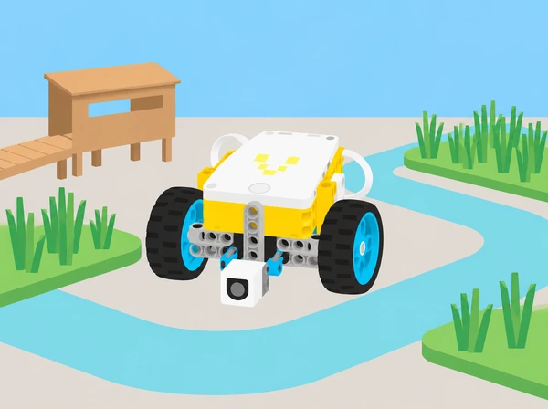

_El camp, les peces de missió i la puntuació són originals. La proposta treballa amb una maqueta escolar inspirada en la cura de l’Albufera._

## 🌱 Situació i intenció

La unitat oficial *Competition Ready* de LEGO Education introdueix la conducció autònoma, l’ús de sensors, la construcció en equip, els blocs reutilitzables i la resolució iterativa de missions. Aquesta adaptació conserva eixa progressió en un projecte de centre: una maqueta de l’Albufera on el robot transporta mostres fictícies, retira residus de maqueta i activa punts d’observació. No s’intervé en l’aiguamoll ni s’hi proven robots.

La seqüència oficial inclou en 2026–27 una missió guiada vinculada a FIRST LEGO League. La sessió 4 conserva l’estructura didàctica de preparar una ruta, alinear el robot, activar un model i valorar fiabilitat i estratègia, però usa un repte, un camp i models propis. No reprodueix ni representa la missió, el tapet o els materials oficials de la temporada.

## 📅 Seqüència didàctica · 12–15 sessions

### **S1 · Base i conducció precisa · [Training Camp 1: Driving Around](https://education.lego.com/en-us/lessons/prime-competition-ready/training-camp-1-driving-around/) (30–45 min).**

**Pregunta:** com fem una base de conducció simple que avance, gire i es detinga de manera controlada? En parelles, munteu una base de pràctica de dos motors sense sensors i proveu les piles de programa de mostra, variant distància, gir i velocitat una cosa cada vegada. Escriviu pseudocodi per a dibuixar un quadrat i afegiu un recorregut d’obstacles amb peces grans; compareu una estratègia per temps, graus, rotacions i, com a ampliació si hi ha giroscopi, lectura de sensor. Mesureu la circumferència d’una roda (π × diàmetre) i relacioneu-la amb la distància avançada. Com a comparació ampliada, recorreu dos metres amb ordre per segons, graus, rotacions i sensor quan estiga disponible; feu una taula de precisió i expliqueu en quin cas triaríeu cada control. Feu tres passades amb els mateixos paràmetres abans de canviar-los. **Evidència:** diagrama de ruta, programa en blocs de moviment, taula d’error i explicació de quan convé cada manera de mesurar. El giroscopi i la base avançada no són requisits d’aquesta sessió inicial.

### **S2 · Acostar-se, agafar i tornar · [Training Camp 2: Playing with Objects](https://education.lego.com/en-us/lessons/prime-competition-ready/training-camp-2-playing-with-objects/) (30–45 min).**

**Pregunta:** com decideix el robot quan està prou prop d’un objecte? Afegiu a la base de pràctica el sensor de distància, un braç lleuger, un marcador i un cub tou. Compareu les dues piles de programa de partida per parar davant del marcador; després afegiu blocs perquè el braç baixe, arreplegue el cub situat almenys a 30 cm i el retorne. Ajusteu l’alçada del braç perquè passe per damunt del cub sense interferir amb el sensor. Expliqueu com varia la lectura en canviar el llindar de distància. Acabeu amb un relleu: el robot porta un testimoni, una persona el retira físicament i la base avança al següent; registreu temps i encerts, però prioritzeu la detecció fiable. Com a ampliació, inventeu regles pròpies per al joc, il·lustreu-les i convideu una altra parella a jugar. Incorporeu comparacions > / < amb valors del sensor de distància, de llum reflectida o, si s’ha afegit, de gir del giroscopi. **Evidència:** esquema sensor–condició–motor, resultats de tres intents i ajust justificat.

### **S3 · Detectar i seguir línies del camp · [Training Camp 3: Reacting to Lines](https://education.lego.com/en-us/lessons/prime-competition-ready/training-camp-3-react-to-lines/) (30–45 min).**

**Pregunta:** com pot el sensor de color fer autònoma una part del recorregut? Munteu-lo a la base i useu una línia negra ampla sobre una superfície clara. Primer proveu que la base avance i pare quan el sensor troba la línia perpendicular; després proveu una segona pila i descriviu la diferència. El sensor pot treballar en mode de color o d’intensitat de llum reflectida; observeu les lectures blanques i negres. Per al seguiment continu, feu que la base alterne entre detectar fosc i clar amb moviments ràpids: el mode de potència pot respondre millor que una velocitat regulada en ajustos menuts. Afegiu rectes primes, angles rectes, cruïlles en T, interrupcions i una línia negra travessada per una de color; canvieu llindar o velocitat d’un en un. **Evidència:** registre de lectures, ruta anotada i explicació de com es millora el seguidor de línia. L’extensió per a S4 és comparar els dos modes de sensor; no es confonen lectura de color i llum reflectida.

### **S4 · Missió guiada: elevar el pont de mostreig · [The Guided Mission 2026–27](https://education.lego.com/en-us/lessons/prime-competition-ready/spike-prime-guided-mission-2627/) (45–90 min).**

**Pregunta:** com alineem la base, seguim una línia, activem un mecanisme i acabem la ruta amb precisió? Cada equip fabrica un camp breu de l’Albufera amb sortida a l’esquerra, línia de guia, un model propi de comporta/connector que cal alçar o obrir i zona final a la dreta. Escriviu el programa perquè la base equipada amb sensor de color arribe al model i l’active; després practiqueu moltes vegades l’alineament manual i el recorregut, sense moure el robot durant la missió. Afegiu una segona tasca pròpia en la mateixa ronda i valoreu si la ruta passa prop d’altres estacions sense interferir. Debateu què fa cada peça del mecanisme, quina combinació de rapidesa i precisió resulta acceptable i què heu aprés del seguiment de línies. Com a variant d’ampliació, feu partir el robot de la dreta i recórrer la ruta inversa. **Evidència:** diagrama de sortida–activació–arribada, programa anotat, resultats de diversos alineaments i presentació de l’estratègia per part de cada membre. El mecanisme, les línies i el camp són propis: no useu ni copieu tapet, regla, model ni missió de FIRST LEGO League.

### **S5 · Una base modular construïda en equip · [Assembling an Advanced Driving Base](https://education.lego.com/en-us/lessons/prime-competition-ready/assembling-an-advanced-driving-base/) (90–120 min).**

**Pregunta:** com unim mòduls individuals en una base robusta i com expliquem la contribució de cadascú? L’activitat oficial distribueix la construcció entre quatre membres, un per instrucció/mòdul; cada persona construeix la seua part i el grup les uneix, comprova cablejat i gestió de cables, prova el programa inicial, explora altres programes de moviment i presenta la base explicant què ha fet cadascú. La base avançada oficial usa dos motors grans de propulsió, dos motors mitjans per a útils i dos sensors de color, per la qual cosa pot requerir l’Expansion Set 45681 a més del set Prime 45678. Si el centre no el té, feu els mateixos rols modulars sobre la base de pràctica de dos motors i marqueu-la com a adaptació reduïda, no com la base avançada. Per adaptar la dificultat, podeu muntar cada mòdul en parella. Per aprofundir, construïu una de les rodes només amb les instruccions de l’altra i proveu un circuit d’obstacles sense tocar-los. **Evidència:** esquema dels quatre mòduls, ports i cables comprovats, prova del programa, breu presentació individual i autoavaluació de participació.

### **S6 · El meu bloc, el nostre programa · [My Code, Our Program](https://education.lego.com/en-us/lessons/prime-competition-ready/my-code-our-program/) (90–120 min en la seqüència oficial; adaptar la durada al kit disponible).**

**Pregunta:** com fem que totes les persones entenguen i puguen reorganitzar el programa? Amb la base avançada —o, si falta l’Expansion Set, amb la base de pràctica i la limitació escrita— construïu dos marcadors i proveu un *My Block* de mostra. Creeu un bloc propi que execute una ruta quadrada; després feu blocs separats per a cercle aproximat i triangle, decidiu la mida amb els dos marcadors i feu que el robot els esquive. Intercanvieu els programes i demaneu a una altra parella que els execute sense explicació oral; després reordeneu els blocs per representar una altra missió i mesureu quina versió és més llegible o ràpida de modificar. Per a l’extensió, useu el giroscopi en el triangle o estimeu la distància a partir de segons/rotacions i circumferència de roda. **Evidència:** dos o més *My Blocks* amb noms clars, programes quadrat/cercle/triangle, registre de prova i presentació on cada membre explica com el bloc ordena i reutilitza el codi.

### **S7 · Dos útils i un programa amb arrays · [Time for an Upgrade](https://education.lego.com/en-us/lessons/prime-competition-ready/time-for-an-upgrade/) (90–120 min).**

**Pregunta:** quin útil serveix per a moure cada càrrega i com organitzem les ordres perquè siguen repetibles? En la versió completa, construïu i connecteu a la base avançada una pala llevaneu i un braç elevador, més quatre caixes lleugeres; observeu que el programa inicial alça el braç i establiu com tornar cada motor a posició coneguda abans d’un intent. Descomponeu la seqüència en acostar, elevar/baixar, empényer o alçar, alliberar i reiniciar els útils. Implementeu un array amb valors d’operació per a cada prova i un segon array de resultats, amb llistes/Python o els blocs disponibles en la versió de l’app del centre; compareu els elements que comparteixen índex, expliqueu què significa cada posició i proveu diversos casos. Si la versió disponible només ofereix arrays en Python, feu i comenteu eixa part en Python en lloc de substituir-la per una llista manual. Presenteu els punts forts de cada útil (precisió, força, encaix), modifiqueu-los per a altres mostres o feu un abordatge en angle amb el giroscopi com a extensió. Aquesta lliçó requereix la base avançada i l’Expansion Set segons la llista oficial; sense el kit, es pot completar la part d’array amb la base de dos motors i útils de cartó, però marqueu la substitució material i no afirmeu que replica el muntatge motoritzat. **Evidència:** diagrama dels dos útils, inicialització/reinici, arrays comentats, taula que compara valors per índex i presentació breu de la solució.

### **S8 · Repte de camp complet i cronometrat · [Mission Ready](https://education.lego.com/en-us/lessons/prime-competition-ready/mission-ready/) (120+ min, més d’una sessió).**

**Pregunta:** podem combinar conducció, sensors, útils i blocs organitzats per resoldre una missió completa? En lloc dels models de la granja LEGO, dissenyeu un camp escolar amb un mòdul d’estació, una ruta marcada i marcadors propis. La seqüència conserva cinc tipus d’objectiu amb elements originals: activar i obrir una comporta mitjançant dos controls diferenciats, passar un marcador sense tocar-lo, seguir la ruta per recollir quatre mostres fictícies —amb objectiu mínim de dues— i lliurar-ne almenys una 50 cm més enllà dels marcadors. Useu la base amb pala i braç només si el kit avançat està disponible; altrament, limiteu el recorregut als útils del set bàsic i identifiqueu quines accions s’han simplificat. Descomposeu la missió en cinc fites amb models i regles creats per la classe: (1) empényer un actuador per alliberar el pas, (2) pressionar una palanca per obrir-lo, (3) passar almenys un marcador sense tocar-lo, (4) seguir la ruta i recollir mostres grosses de llavor —n’hi ha quatre, amb un objectiu mínim de dues i un reconeixement addicional per les quatre— i (5) deixar-ne com a mínim una en una zona de lliurament segura, separada 50 cm del model de niu. Les mostres són peces fictícies i no es manipulen animals. Escriviu primer pseudocodi i reutilitzeu *My Blocks*; feu intents sense cronòmetre i, quan el codi siga estable, una prova cronometrada. La classe pot usar fins a sis fitxes de penalització pròpies per col·lisió amb marcadors mentre es transporta o per alçar/recol·locar el robot durant la ronda; decidiu-ne el pes abans de començar i compareu rapidesa, precisió i penalitzacions. Registreu qualsevol fallada, reviseu una cosa i torneu a provar. **Evidència:** mapa i regles originals, pseudocodi, programa comentat, puntuació/temps de cada prova i presentació d’equip amb les contribucions individuals. Les cinc fites conserven la progressió d’accionar dos mecanismes diferents, navegar sense tocar marcadors, seguir una ruta, recollir quatre càrregues i fer un lliurament segur; camp, objectes, història, puntuació i fitxes de penalització són originals, sense copiar models LEGO ni el camp oficial.

### **S9 · Taller desconnectat de resolució creativa · [Mission Training: Creative Problem-Solving](https://education.lego.com/en-us/lessons/prime-competition-ready/mission-training-creative-problem-solving/) (45 min, híbrida).**

**Pregunta:** com definim criteris, fem un primer prototip i iterem fins que resol un problema? Aquesta lliçó oficial és híbrida: no necessita set, peces ni programari. Comenceu amb una imatge d’un nus que cal desfer i pregunteu quin és el problema, quines solucions s’imaginen i què provarien primer o després si falla; definiu en grup què vol dir iterar. A continuació, cada persona tria un repte propi d’una de quatre famílies semblants a una missió: entregar una mostra a una altra persona, activar un senyal, rescatar una llavor d’una zona delimitada o voltejar una fitxa plana. Genereu idees amb paper i materials reutilitzats, feu un prototip inicial, proveu-lo, milloreu-lo i prepareu un pòster o una explicació oral: problema i criteris, idea creativa, descobriment de la prova i millora introduïda. Un altre equip aporta una observació específica; cada alumne acaba amb una autoavaluació breu sobre si pot explicar estratègia, iteració i solució. **Evidència:** esbossos, criteris, prototip de materials trobats, anotació de dues iteracions i pòster/relat. Es pot fer presencialment, en línia en grup o individualment amb materials casolans; no es pressuposa cap robot ni tasca motoritzada.

## 🧰 Materials i preparació

Per a les sessions amb robot: set SPIKE Prime 45678, base de conducció, sensor de distància i sensor de color, cinta negra, cartó, retoladors, mostres grans i lleugeres i cinta per al camp. La base avançada oficial consta de dos motors grans per a la propulsió, dos motors mitjans per als útils i dos sensors de color; necessita l’Expansion Set 45681 a més del set 45678. Les sessions 5–8 indiquen aquesta dependència i no afirmen que la base de dos motors siga equivalent. Sense l’expansió, es pot seguir l’objectiu didàctic amb un únic motor mitjà del set base i útils alternats/passius; anoteu aquesta reducció. La sessió 9 només necessita paper, llapis i cartó.

Prepareu el camp sobre taules o al terra, amb carrils prou amples, objectes grans i zones de mans fora del moviment. La referència a l’Albufera és una contextualització educativa: useu dades i mostres fictícies i no feu proves ni recollides al medi natural.

## 🎯 Evidències i avaluació

Recolliu pseudocodi, taules de calibratge, lectures del sensor, mapa de missió, esquemes de construcció, blocs propis, comparació d’accessoris, dades de fiabilitat i prototip desconnectat. Valoreu si l’equip pot predir i explicar el comportament, aïllar una variable, justificar una revisió amb dades, documentar el codi i repartir les decisions. Una missió fallida aporta evidència útil quan queda registrada i ajuda a formular la prova següent; els punts i el temps no són l’únic criteri.

## ♿ Participació i inclusió

Abans del robot es pot resoldre cada ruta amb una maqueta i targetes de moviment. Oferiu rols rotatius de construcció, programació, pilotatge de proves i registre; faciliteu instruccions visuals, carrils d’alt contrast, marques tàctils fora de la trajectòria i temps addicional per documentar. Les missions no depenen de velocitat manual: una persona pot dictar o validar el codi mentre una altra manipula el robot. El repte desconnectat és una sessió completa, no un premi de consol ni un requisit per accedir a la resta.

## 🔗 Correspondència amb la unitat oficial

La seqüència adapta les nou lliçons de [Competition Ready · SPIKE Prime](https://education.lego.com/en-us/lessons/prime-competition-ready/): [Driving Around](https://education.lego.com/en-us/lessons/prime-competition-ready/training-camp-1-driving-around/), [Playing with Objects](https://education.lego.com/en-us/lessons/prime-competition-ready/training-camp-2-playing-with-objects/), [Reacting to Lines](https://education.lego.com/en-us/lessons/prime-competition-ready/training-camp-3-react-to-lines/), [The Guided Mission 2026–27](https://education.lego.com/en-us/lessons/prime-competition-ready/spike-prime-guided-mission-2627/), [Assembling an Advanced Driving Base](https://education.lego.com/en-us/lessons/prime-competition-ready/assembling-an-advanced-driving-base/), [My Code, Our Program](https://education.lego.com/en-us/lessons/prime-competition-ready/my-code-our-program/), [Time for an Upgrade](https://education.lego.com/en-us/lessons/prime-competition-ready/time-for-an-upgrade/), [Mission Ready](https://education.lego.com/en-us/lessons/prime-competition-ready/mission-ready/) i la lliçó híbrida [Mission Training](https://education.lego.com/en-us/lessons/prime-competition-ready/mission-training-creative-problem-solving/). El catàleg indica durades d’entre 30 i 120+ minuts; per això les activitats de construcció, projecte i missió s’estenen en més d’una classe. Els textos, el context, les missions, el camp, les regles i els materials visuals són propis. Les especificacions de components es basen en la pàgina oficial de [maquinari SPIKE Prime](https://education.lego.com/en-us/teacher-resources/lego-education-spike-prime/support-technical-info/lego-education-spike-prime-support-technical-info-product-info/); comproveu sempre la dotació física del centre.
