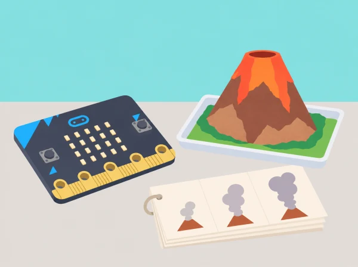

_És una maqueta d’aula per parlar d’animació, no una simulació de risc ni un model predictiu._

## 🌱 Situació i intenció

El museu escolar prepara una peça digital per explicar com una animació simplifica un procés natural. L’alumnat descompon un moviment, escriu un diagrama de flux, planifica una seqüència de fotogrames i la programa amb LEDs de micro:bit. La idea parteix dels volcans però situa la recerca en dues escales: casos volcànics documentats en l’Estat espanyol i referents geològics propers. L’IGN enumera Cofrentes (València) i les illes Columbretes (Castelló) entre les àrees volcàniques documentades; això no implica activitat eruptiva actual ni risc per a la població.

La seqüència conserva les cinc lliçons de *Volcano animations* per a alumnat d’uns 8–9 anys: animació i descomposició amb dansa/flipbook, diagrama i repetició, planificació de l’erupció, programació/prova/depuració i reflexió. L’animació del projecte és un model gràfic de quatre estats triats, no una seqüència universal ni una eina de predicció geològica.

## 🎯 Aprenentatges i vocabulari

- Descompondre un fenomen en fotogrames i ordenar-los perquè una altra persona puga reconstruir-ne el canvi.
- Representar moviment amb una matriu de 5×5 i controlar què canvia entre dos fotogrames.
- Usar una repetició per a mostrar un patró i relacionar-lo amb el diagrama o l’algorisme.
- Provar l’animació en la placa, depurar una transició i explicar que és un model gràfic, no una simulació científica d’una erupció.

## 🧰 Materials i preparació

BBC micro:bit física o simulador MakeCode, projector opcional, paper per a diagrames i flipbooks, quadrícula 5 × 5, llapis de colors, cartolina per a la maqueta seca i targetes amb els termes *magma*, *lava*, *erupció* i *animació*. Reviseu abans una font de l’Institut Geogràfic Nacional sobre el fenomen i la seua cartografia; distingiu magma subterrani de lava que arriba a la superfície. Per al vincle valencià, podeu consultar la documentació de l’IGN que identifica zones volcàniques documentades, inclosos Cofrentes i Columbretes. No suposeu que el volcà de la maqueta representa cap d’aquestes àrees.

Decidiu si tota la classe treballarà amb simulador o si hi haurà transferència a placa; prepareu un projecte base i una alternativa impresa. No useu calor, pólvores, líquids, reaccions químiques ni models que expulsen material. La maqueta és de paper o cartolina i roman estàtica durant la programació.

## 📅 Seqüència didàctica · cinc sessions de 45 minuts

### **Sessió 1 · Animació i descomposició.**

*Mapa d’idees (5 min):*

feu una xarxa de paraules al voltant d’“animació” i separeu moviment real, moviment dibuixat i seqüència de fotogrames.

*Descompondre un moviment (10 min):*

una persona demostra un pas de dansa senzill i el grup l’explica com a inici, moviment, pausa i final; no cal que l’alumnat el faça físicament, també pot usar una fitxa o dirigir-lo.

*Planificar (10 min):*

trieu tres poses que comuniquen el canvi i dibuixeu-les amb el mateix enquadrament.

*Crear flipbook (15 min):*

feu un llibret de tres o quatre imatges amb un canvi menut entre pàgines i proveu-lo sense llançar-lo ni sacsejar-lo prop de la cara.

*Compartir (5 min):*

expliqueu quina part s’ha descompost i què s’ha omés. Evidència: mapa d’idees, poses numerades i flipbook.

### **Sessió 2 · Diagrames de flux i repetició.**

*Recuperar passos (5 min):*

ordeneu les imatges del flipbook i detecteu si alguna queda fora de seqüència.

*Diagrama (12 min):*

convertiu les poses en un diagrama de flux amb inici, mostrar fotograma A, mostrar fotograma B, repetir i final; representeu amb una fletxa de retorn el fragment que es repeteix.

*Execució humana (8 min):*

un equip llig només el diagrama i un altre fa de “pantalla”; anoteu què resulta ambigu.

*MakeCode (15 min):*

traslladeu els dos fotogrames a la matriu LED, afegiu pauses i compareu un programa que duplica les instruccions amb un altre que usa bucle.

*Conclusió (5 min):*

indiqueu què ha fet més curt el bucle i quines ordres continuen sent úniques. Evidència: diagrama inicial/depurat i comparació de programes amb/sense repetició.

### **Sessió 3 · Planificar l’animació del volcà.**

*Lectura de context (8 min):*

consulteu una infografia o text de l’IGN; localitzeu un cas documentat i una àrea volcànica històrica de la Comunitat Valenciana. Anoteu font i data i no deduïu activitat o perill actual a partir d’un mapa geològic.

*Vocabulari científic (7 min):*

associeu magma amb material fos sota la superfície i lava amb el material que hi arriba; distingiu aquests termes de la columna de gasos o cendra que pot aparéixer en alguns tipus d’erupció.

*Storyboard (15 min):*

en equips, definiu quatre estats gràfics —superfície, inici de l’emissió, plomall o flux representat, i escena que es calma— com una convenció visual inventada, sense afirmar que tots els volcans passen per una mateixa seqüència.

*Graelles i diagrama (10 min):*

dibuixeu cada estat en 5 × 5 píxels, identifiqueu quins quadres es repeteixen i en quin ordre, i creeu un diagrama amb pauses/repetició.

*Revisió (5 min):*

una parella comprova que el diagrama coincideix amb l’storyboard. Evidència: font citada, targeta de vocabulari, quatre graelles i algoritme.

### **Sessió 4 · Programar, provar i depurar.**

*Predir (5 min):*

abans de programar, llegiu el diagrama i assenyaleu quin fotograma apareixerà després de la repetició.

*Construir codi (15 min):*

escriviu les icones en MakeCode amb LEDs individuals o graella de disseny; mostreu-les en ordre dins d’un bucle adequat i useu pauses suficients per llegir-les.

*Provar (10 min):*

executeu al simulador o transferiu a micro:bit, marqueu cada eixida respecte del storyboard i comproveu si el bucle repeteix exactament el fragment indicat.

*Depurar (10 min):*

proveu tres casos: fotograma canviat d’ordre, una repetició de més i pausa massa curta; canvieu una cosa cada vegada i registreu el resultat.

*Autoavaluar (5 min):*

justifiqueu una correcció i una simplificació. Evidència: codi, prediccions i registre de tres casos provats.

### **Sessió 5 · Reflexió i revisió.**

*Descompondre el procés (10 min):*

feu un mapa de pensament des de la font fins a l’animació: investigar, seleccionar fases gràfiques, dissenyar píxels, escriure algoritme, programar, provar i revisar.

*Galeria (15 min):*

cada equip mostra el mapa, el codi i el vídeo/demostració de la seqüència; si no es grava, la mostra es fa en directe o amb una sèrie de captures autoritzades, sense fotografiar alumnat.

*Retorn (10 min):*

el públic comenta una cosa clara i formula una pregunta sobre el model científic o el bucle.

*Revisió (5 min):*

l’equip aplica o rebutja una proposta amb una raó.

*Reflexió individual (5 min):*

completa “el meu codi representa…, no pot predir…, la repetició m’ha servit per…”. Evidència: mapa final, retorn i reflexió.

## 📊 Criteris d’èxit i avaluació

Recolliu mapa d’idees, flipbook, diagrama de flux, font geològica citada, storyboard, quatre graelles, MakeCode, registre de proves i mapa de reflexió. Observeu si l’equip (1) divideix una acció en passos representables; (2) mostra en el diagrama què es repeteix; (3) tradueix fidelment l’algoritme a blocs i comprova tres casos; (4) usa el vocabulari magma/lava de manera coherent amb la font; i (5) identifica què ha simplificat la seua animació. No s’avalua si la seqüència és una reconstrucció universal d’una erupció: és una interpretació didàctica.

## ♿ Ritme, accés i seguretat

Oferiu storyboard imprés, animació estàtica, simulador i pauses llargues; no és necessari veure estímuls ràpids. Rols possibles: lector/a de font, dibuixant de graelles, autor/a de flux, programador/a, provador/a o narrador/a. Es pot dictar o ordenar targetes en lloc de fer un flipbook manual. No hi ha cap experiment físic volcànic, foc, calor ni substàncies. Si el tema de riscos naturals resulta sensible per a alguna persona, es pot animar un procés geològic no amenaçador amb els mateixos conceptes d’algoritme.

## 🔗 Unitat oficial i context valencià

[Volcano animations](https://microbit.org/teach/lessons/volcano-animations-unit-of-work/) té cinc lliçons: mapa d’idees i descomposició d’una dansa en flipbook; diagrama de flux i repetició en MakeCode; planificació desconnectada de fases d’una erupció; programació, prova i depuració LED; i revisió descomposta del procés. Aquesta proposta conserva l’ordre i els aprenentatges, crea el storyboard i els criteris i afegeix una comparació contextual basada en fonts geològiques. L’IGN documenta Cofrentes i Columbretes dins de les àrees volcàniques de l’Estat; es presenten com a patrimoni geològic, no com a volcans en erupció o perill immediat. Consulteu la [catàleg històric de l’IGN](https://www.ign.es/web/resources/acercaDe/libDigPub/Catalogo-150-aniversario-IGN.pdf) i la seua [secció educativa de volcans](https://www.ign.es/web/ign/portal/recursos-educativos).
