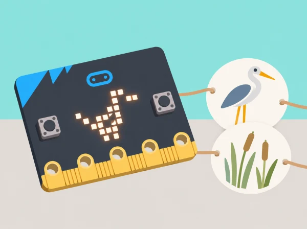
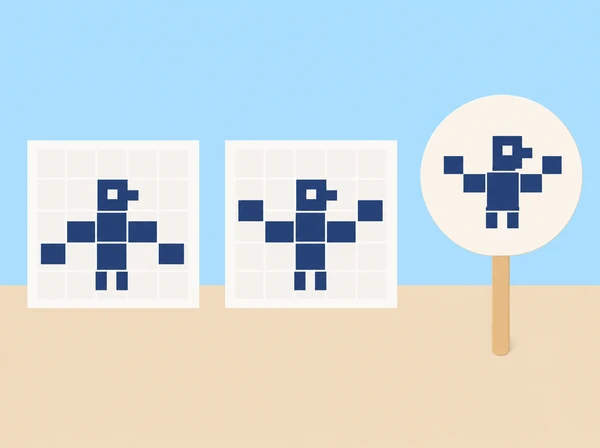

_Les icones són representacions pròpies, no imatges realistes ni reclams per a fauna salvatge._

## 🌱 Situació i intenció

La classe prepara una microexposició digital de l’aiguamoll de l’Albufera. Cada equip parteix d’una imatge o observació autoritzada de fauna o vegetació, n’identifica un tret recognoscible i el transforma primer en una icona 5 × 5 i després en una animació de dos fotogrames. La placa ajuda a estudiar entrada/eixida, seqüència i repetició; no es porta a l’aiguamoll ni s’utilitza per atraure o enregistrar fauna.

La unitat oficial té dues lliçons per a alumnat d’uns 7–9 anys: familiarització amb components i transferència de programa, icones predefinides i disseny LED píxel a píxel; després, taumàtrop, bucle continu, bucle comptat i avaluació. Aquesta seqüència conserva tots aquests objectius i els situa en un context valencià verificable.

## 🎯 Aprenentatges i vocabulari

- Abstraure un tret observable d’una planta o animal i representar-lo amb una icona de 5×5 píxels.
- Ordenar dos fotogrames per suggerir un moviment sense afirmar que la placa reprodueix el comportament real.
- Programar, provar i revisar una animació breu amb els blocs disponibles.
- Comunicar la decisió artística i distingir una observació pròpia d’una inferència sobre l’espècie.

## 🧰 Materials i preparació

BBC micro:bit física i cable USB o simulador MakeCode, ordinador/tauleta, projector opcional, graelles 5 × 5, llapis, paper, cartolina lleugera, llapis de colors, cinta i pal de cartó o dos llaços de paper per al taumàtrop. Prepareu una icona predefinida per analitzar, un projecte MakeCode inicial i targetes de seqüència desconnectada. Trieu imatges pròpies o amb ús autoritzat i fonts datades; la informació local es pot contrastar amb la [guia pública de l’Albufera](https://parquesnaturales.gva.es/documents/80302883/168872077/RUTA%2B1%2B-%2B%2BVOLTA%2BA%2BL%27ALBUFERA%2BEN%2BBICICLETA.pdf/efb00d45-964e-4115-a8fe-6e30bb45508c). Si la identificació d’una espècie no està verificada, descriviu-la com a “au observada” o “planta de l’aiguamoll” i no li assigneu un nom científic.

Abans de començar, comproveu el procés de transferència USB del centre. La versió física i el simulador són alternatives per al mateix programa; anoteu quina s’ha utilitzat, perquè la transferència al dispositiu també és un objectiu de la primera lliçó.

## 📅 Seqüència didàctica · dues sessions de 50 minuts

### **Sessió 1 · De la placa i el programa a una icona pròpia (50 min).**

#### Fase 1 · Activem i prediem

**Explorem components (8 min).** Localitzeu matriu LED, botons A/B, pins, connector USB i control de reinici; associeu cada component a una funció d’entrada, eixida o connexió sense desmuntar la placa. **Predicció (8 min).** Ordeneu targetes «inici, mostra icona, pausa, mostra una altra imatge» i feu que una parella execute les ordres com si fora el dispositiu. Predigueu què passa si es canvia l’ordre.

#### Fase 2 · Explorem i construïm

**Transferim un programa (8 min).** Obriu un exemple a MakeCode, executeu-lo al simulador i, si hi ha placa, descarregueu-lo i transferiu-lo per USB. Compareu el que es veu en ambdós casos i registreu qualsevol diferència. **Analitzem i creem (18 min).** Mireu una icona integrada i determineu quines cel·les encén; en una graella 5 × 5, creeu una representació d’un tret —bec, ala, fulla o tija— amb un màxim de 25 píxels. Passeu la graella a blocs LED individuals i preveieu el resultat abans d’executar.

#### Fase 3 · Expliquem i registrem

Anoteu les funcions dels components, l’ordre triat i la predicció de la icona. Deseu la graella i el programa transferit o simulat perquè es puga comparar el disseny amb l’eixida.

#### Fase 4 · Apliquem i millorem

Una parella intenta identificar el tret representat i proposa un píxel que es podria llevar o moure. L’equip modifica la icona només si pot explicar com el canvi ajuda a conservar el tret.

#### Fase 5 · Comprovem i reflexionem

Compareu la predicció amb la matriu i valoreu si el públic ha reconegut el tret. **Evidència:** esquema dels components, seqüència en targetes, programa transferit o simulat, icona i revisió basada en la interpretació del públic.

### **Sessió 2 · Dos fotogrames, un moviment suggerit (50 min).**

#### Fase 1 · Activem i prediem

**Construïm i prediem (10 min).** Dibuixeu en les dues cares d’un disc de cartolina una figura i un canvi menut —per exemple, una au quieta i l’au amb l’ala en una altra posició—. Alineeu el centre de les imatges abans d’enganxar el pal o les nanses de paper; proveu el gir lentament i anoteu quan costa llegir el canvi.

_Les dues graelles són fotogrames estàtics per planificar el canvi; el disc de paper serveix per explorar com dos dibuixos poden suggerir moviment._

#### Fase 2 · Explorem i construïm

**Storyboard LED (8 min).** Representeu els dos fotogrames en dues graelles 5 × 5, numerant-los i descrivint què canvia; una altra persona comprova que la diferència siga llegible. **Animació contínua (12 min).** Programeu fotograma 1, pausa, fotograma 2 i pausa dins d’un bucle continu. Executeu-lo en simulador o placa, canvieu només el temps de pausa i compareu si encara es perceben els dos dibuixos. L’objectiu és fer comprensible la seqüència, no buscar el parpelleig més ràpid. **Animació comptada (10 min).** Repetiu la parella de fotogrames un nombre fix de voltes amb un bucle de recompte; després, netegeu la matriu o mostreu una icona final i distingiu aquest comportament del bucle infinit.

#### Fase 3 · Expliquem i registrem

Registreu l’ordre dels fotogrames, el valor de pausa i el nombre de repeticions. Demaneu a un altre equip que descriga què ha canviat i anoteu una proposta concreta de millora.

#### Fase 4 · Apliquem i millorem

Reviseu una graella o el temps de pausa a partir del retorn. Torneu a executar tant el bucle continu com el comptat per comprovar que la modificació no ha alterat el nombre d’imatges ni el final previst.

#### Fase 5 · Comprovem i reflexionem

Compareu les representacions en paper i LED i registreu quina versió explica millor el moviment i per què. **Evidència:** taumàtrop, storyboard, dos programes (continu i comptat), comparació de ritmes i una millora provada.

## 📋 Criteris d’èxit i evidències

Arxiveu el diagrama anotat de la placa, l’ordre d’instruccions, el nom del fitxer MakeCode, les dues graelles, la transferència o captura del simulador, el codi amb `forever` i el bucle comptat i les notes de coavaluació. Comproveu si l’alumnat (1) relaciona parts físiques amb les seues funcions; (2) prediu i executa una seqüència d’eixides LED; (3) diferencia repetició contínua i repetició limitada; (4) conserva un tret visual amb pocs píxels; i (5) proposa i prova una millora. La icona no s’avalua com a identificació científica d’una espècie: s’avaluen decisions de disseny i explicació.

## ♿ Accés visual i confort sensorial

Permeteu participar amb versió estàtica, simulador, graella impresa, dictat de píxels o rol de narració/observació. Aviseu abans de cada animació, oferiu no mirar-la i no feu servir ràfegues ràpides ni flaixos; la persona docent pot mostrar fotogrames estàtics en lloc de reproduir el bucle. Useu icones grans, alt contrast i suport oral per descriure quines cel·les canvien. Per a dificultats motores, les targetes 5 × 5 substitueixen la manipulació de blocs menuts sense llevar l’anàlisi de l’algorisme.

## 🔗 Unitat oficial adaptada

[Barefoot · Wildlife animations](https://microbit.org/teach/lessons/barefoot-wildlife-animations/) conté dues lliçons: la primera tracta components, seqüenciació en MakeCode, transferència, icones predefinides i imatges fetes amb LEDs individuals; la segona crea un taumàtrop, programa una animació amb bucle *forever*, en fa una altra amb repetició comptada i demana avaluar i suggerir millores. La fitxa manté aquesta cobertura i crea icones, storyboard i relat propis de l’aiguamoll. La font oficial diu que l’ús de placa física és preferible però admet simulador; ací tots dos itineraris es declaren i es registren.
