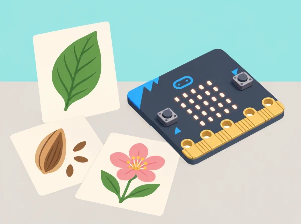

_La representació digital és una interpretació d’una observació, no una reproducció exacta de la natura._

## 🌱 Situació i intenció

Una galeria de l’aiguamoll de l’Albufera mostrarà com una observació natural es pot representar amb mitjans diferents. Cada equip tria una planta, llavor, fulla o au que aparega en una imatge autoritzada o en una observació del pati; identifica un tret rellevant, el representa amb tècniques artístiques i finalment el codifica en la matriu de micro:bit. La seqüència combina abstracció, raonament lògic, algoritmes, depuració i avaluació. Les representacions són interpretacions: una icona de 25 LEDs no és una identificació científica ni substitueix una guia de camp.

La unitat oficial *Nature art* conté quatre lliçons per a 7–8 anys: observació i representació amb materials, algoritmes d’art, representació digital amb LEDs i programació/avaluació d’imatges. Aquesta situació conserva la progressió i situa el treball en un entorn valencià; una visita física és opcional i mai no implica recol·lectar éssers vius.

## 🎯 Aprenentatges i vocabulari

- Observar formes naturals amb respecte i triar-ne trets essencials per a una representació.
- Descompondre una icona en una graella de 5×5 i explicar quina informació conserva o perd.
- Escriure i depurar un algorisme per representar una forma amb materials i píxels.
- Comparar interpretacions, justificar decisions artístiques i evitar presentar una icona com una identificació científica.

## 🧰 Materials i preparació

Prepareu micro:bit física o simulador, MakeCode, cable USB si es transferirà a placa, graelles 5 × 5, quadern d’observació, llapis, paper translúcid o cartolina, ceres/llapis de colors i retalls de materials d’art no tòxics. Trieu una zona segura del pati o imatges i il·lustracions amb ús autoritzat. Es pot consultar la [guia pública del Parc Natural de l’Albufera](https://parquesnaturales.gva.es/documents/80302883/168872077/RUTA%2B1%2B-%2B%2BVOLTA%2BA%2BL%27ALBUFERA%2BEN%2BBICICLETA.pdf/efb00d45-964e-4115-a8fe-6e30bb45508c) per decidir què investigar; anoteu la font i no afirmeu el nom d’una espècie si no l’heu verificat. Reviseu el flux de descàrrega MakeCode abans de la sessió. Manteniu micro:bit seca i no la porteu a l’aiguamoll.

## 📅 Seqüència didàctica · quatre sessions de 45 minuts

### **Sessió 1 · Representem la natura amb materials (45 min).**

#### Fase 1 · Activem i prediem

**Mirada atenta (5 min).** Presenteu una imatge autoritzada o feu una observació curta des d’un lloc segur del pati. Distingiu allò que es veu directament d’allò que només s’infereix. Abans de dibuixar, cada persona prediu quin tret permetrà reconéixer l’element si se’n lleven el color, la textura i el fons.

#### Fase 2 · Explorem i construïm

**Esbossos i materials (25 min).** Dibuixeu contorn, repetició i proporció sense arrancar ni tocar plantes o animals. Feu dues representacions amb tècniques diferents —línia, collage, empremta de paper o textura fregada sobre una superfície artificial— i compareu què conserva cadascuna.

#### Fase 3 · Expliquem i registrem

Anoteu la predicció, el tret triat i les decisions de cada representació. Una parella observa les dues propostes sense que l’autor n’avance la resposta i assenyala quina pista visual l’ha ajudada.

#### Fase 4 · Apliquem i millorem

L’autor decideix si la simplificació funciona i modifica un detall —contorn, proporció o repetició— a partir del retorn. Manteniu les dues versions per poder comparar-les.

#### Fase 5 · Comprovem i reflexionem

Comproveu si la parella reconeix el tret triat i expliqueu què s’ha conservat o perdut en cada tècnica. **Evidència:** registre d’observació i predicció, dues representacions materials i comentari comparatiu.

### **Sessió 2 · Escrivim i depurem algoritmes d’art (45 min).**

#### Fase 1 · Activem i prediem

**Recordem l’ordre (5 min).** Ordeneu targetes amb les instruccions «prepara base», «tria forma», «situa element» i «afegeix detall». Predigueu què passaria si s’intercanviaren dos passos i expliqueu que un algoritme és una seqüència d’instruccions per a aconseguir un resultat.

#### Fase 2 · Explorem i construïm

**Descomponem la representació (10 min).** Trieu una obra de la sessió anterior i dividiu-la en forma exterior, detalls, posició i acabat. **Escrivim instruccions (10 min).** Cada pas ha d’indicar una acció i un lloc; canvieu expressions ambigües com «fes-ho bonic» per instruccions observables, com ara «afegeix tres línies curtes a la dreta».

#### Fase 3 · Expliquem i registrem

**Prova entre parelles (12 min).** Una altra parella segueix les instruccions sense veure el model final. Marca el primer pas que no pot interpretar i descriu què necessita saber per continuar. Registreu tant el resultat com els dubtes, sense corregir-los abans de la prova.

#### Fase 4 · Apliquem i millorem

**Depurem (8 min).** Reescriviu només les instruccions que han causat confusió i demaneu a la parella que repetisca la prova. Compareu el primer i el segon resultat per comprovar si el canvi ha resolt el problema.

#### Fase 5 · Comprovem i reflexionem

Expliqueu quina instrucció s’ha concretat i com ha afectat el resultat. **Evidència:** algoritme inicial anotat, resultat de la prova entre equips i versió depurada.

### **Sessió 3 · Dissenyem una representació digital (45 min).**

#### Fase 1 · Activem i prediem

**Parts i eixida (5 min).** Localitzeu la matriu LED, els botons i la connexió USB de micro:bit. Expliqueu que els LED formen una eixida visual i predigueu quins detalls de la representació es podran distingir en una graella de només 5 × 5.

#### Fase 2 · Explorem i construïm

**Planifiquem (10 min).** Representeu l’element amb un màxim de 25 cel·les; numereu files i columnes o useu transparències perquè quede clar quines s’encenen. **Programem (15 min).** Una altra persona llig la graella i anticipa la imatge abans d’obrir MakeCode. Passeu els píxels al programa amb les ordres LED i executeu-lo al simulador. Si useu una placa, descarregueu el programa i comproveu que es mostra com al simulador.

#### Fase 3 · Expliquem i registrem

Compareu la predicció amb l’eixida i anoteu en quina fila o columna apareix qualsevol diferència. Deseu la graella i el programa perquè una altra persona puga reconstruir la representació.

#### Fase 4 · Apliquem i millorem

Canvieu un o dos píxels i observeu si el tret identificatiu millora o es perd. No afegiu detalls que la resolució no pot representar; justifiqueu cada canvi amb el criteri de llegibilitat triat.

#### Fase 5 · Comprovem i reflexionem

Torneu a executar el programa i comproveu si l’eixida coincideix amb la graella revisada. **Evidència:** algoritme visual, programa, predicció inicial, comparació amb l’eixida i nota sobre el canvi.

### **Sessió 4 · Programem i avaluem representacions (45 min).**

#### Fase 1 · Activem i prediem

**Nova observació (5 min).** Trieu un segon element o un altre punt de vista del primer. Anoteu quin tret voleu conservar i prediu com el representareu amb els 25 píxels disponibles.

#### Fase 2 · Explorem i construïm

**Planifiquem i codifiquem (15 min).** Dissenyeu una segona imatge o una seqüència de dues imatges estàtiques; passeu-la a MakeCode i proveu-la al simulador o en micro:bit. Manteniu cada imatge prou temps perquè es puga observar.

#### Fase 3 · Expliquem i registrem

**Prova d’audiència (10 min).** Mostreu la imatge sense dir què representa i demaneu a dos observadors quines característiques hi reconeixen. Registreu les respostes literalment, sense qualificar-les com a encert o error científic.

#### Fase 4 · Apliquem i millorem

Trieu un criteri explícit —llegibilitat, semblança d’un tret, ús dels píxels o coherència amb la font— i reviseu la imatge a partir del retorn. Anoteu si accepteu cada proposta i per què.

#### Fase 5 · Comprovem i reflexionem

Presenteu la versió inicial i la final. Expliqueu l’abstracció, una errada depurada i una millora possible. **Evidència:** segona icona o seqüència, retorn dels observadors, canvi provat i reflexió de l’equip.

## 📊 Criteris d’èxit i avaluació

Recolliu quadern d’observació, predicció inicial, dues representacions materials, algoritme abans/després de la prova, graelles digitals, projecte MakeCode i retorn de dos observadors. Valoreu si l’alumnat (1) separa observació i inferència, (2) selecciona trets rellevants en lloc de copiar tots els detalls, (3) escriu instruccions ordenades que una altra persona pot seguir, (4) prediu i comprova l’eixida LED, i (5) millora el producte citant un criteri concret. Si la placa no està disponible, el simulador és una alternativa per programar; per avaluar transferència física, registreu-la com a pendent en lloc d’atribuir-la a la simulació.

## ♿ Participació i accessibilitat

Oferiu mostres grans, lupa digital o il·lustració amb contrast, graelles 5 × 5 impreses i plantilles amb punt d’inici. Permeteu respostes per veu, pictograma, esbós o comunicació augmentativa. Es poden repartir rols d’observació, selecció de trets, escriptura d’algoritme, programació i registre, i canviar-los entre sessions. El parpelleig no és necessari: les imatges poden aparéixer de manera estàtica i cada observador pot triar si vol mirar-les. No demaneu dibuixar amb precisió motriu fina per poder explicar un patró.

## 🔗 Unitat oficial adaptada

[Nature art](https://microbit.org/teach/lessons/nature-art-unit-of-work/) és una unitat de quatre lliçons per a 7–8 anys: observació i representació de natura amb materials; redacció, prova i depuració d’algoritmes artístics; planificació visual d’imatges LED i programació MakeCode; i predicció, programació, avaluació i reflexió sobre el pensament computacional. Aquesta proposta conserva cada fase i n’amplia les evidències, crea un context de l’Albufera i no reutilitza les il·lustracions oficials.
