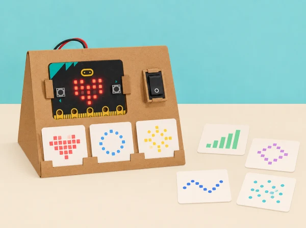

_El patró és una opció configurable, no una resposta universal a les necessitats sensorials._

## 🌱 Situació i intenció

Una classe de tercer cicle treballa el disseny d’un recurs de suport visual que només s’activa quan la persona usuària ho tria. El repte no parteix d’endevinar què necessita algú ni d’imitar una experiència sensorial: l’equip llig un encàrrec fictici validat per la docent (per exemple, “vull veure un senyal lent per saber quan comença una tasca”), compara ajudes existents i dissenya una opció fàcil d’ignorar, canviar o apagar. La matriu 5 × 5 és una eixida visual menuda de prototip; no il·lumina l’aula ni substitueix adaptacions acordades amb la persona i el centre.

La unitat oficial té quatre lliçons per a 11–14 anys i assumeix coneixements previs de pseudocodi i MakeCode. Aquesta versió local conserva l’exploració d’entorns i ajudes, patrons de llum, algoritmes amb entrada/eixida/iteració/selecció i construcció, prova i avaluació; adapta el ritme i l’abast al tercer cicle de primària. No demana a ningú compartir diagnòstic, preferències personals ni experiències de salut.

## 🧰 Materials i acords previs

BBC micro:bit, MakeCode i cable USB, cartó per a un suport que deixe visibles botons i LEDs, targetes de patrons estàtics, pseudocodi, full d’observació de criteris i un temporitzador opcional. Prepareu dos encàrrecs ficticis contrastats amb una persona adulta de suport educatiu o amb material públic d’accessibilitat; no inventeu una “necessitat típica” d’un diagnòstic. Totes les proves es fan primer amb simulador, en una zona de l’aula on la persona que observa pot apartar-se. L’ús en una aula real requereix autorització i acceptació voluntària; el valor pedagògic és el procés de disseny, no l’eficàcia clínica del prototip.

Establiu criteris visibles abans de programar: el recurs roman apagat fins que algú l’activa; ofereix una imatge estàtica o un patró lent sense parpelleig; la persona pot canviar d’opció i deixar-la; el patró acaba o torna a un estat neutre; i hi ha una alternativa en paper. Si un criteri no es pot complir amb la placa, es registra com a límit del prototip.

## 📅 Seqüència didàctica · quatre sessions de 50 minuts

### **Sessió 1 · Explorar entorns i avaluar ajudes (Exploring learning environments).**

*Encàrrec (5 min):*

llegiu una targeta fictícia amb un objectiu concret, sense etiquetar una persona.

*Observar l’entorn (10 min):*

en un mapa inventat d’aula, marqueu fonts de canvi o informació (inici de tasca, cartell, rellotge, soroll representat amb una targeta); no augmenteu llum ni soroll real per fer la prova.

*Comparar opcions (15 min):*

examineu tres exemples: pictograma imprés, temporitzador analògic i micro:bit amb una icona. Useu una matriu criteri/opció —control de la persona, comprensibilitat, facilitat d’aturar-se, accessibilitat, cost i manteniment— i anoteu què no sabeu.

*Proposta inicial (15 min):*

trieu què provaríeu per a l’encàrrec i què deixareu fora.

*Tancament (5 min):*

expliqueu qui decideix utilitzar el recurs i com pot declinar-lo. Evidència: mapa, comparació i criteris acordats.

### **Sessió 2 · Dissenyar patrons de llum amb repetició (Light patterns).**

*Recuperar criteris (5 min):*

comproveu que l’opció impresa i l’estat apagat continuen disponibles.

*Escriure pseudocodi (10 min):*

descriviu una seqüència “inici voluntari → mostrar patró → pausa → acabar en neutre”.

*Crear patrons (15 min):*

dissenyeu dues imatges 5 × 5 de contrast clar; eviteu animacions, alternança ràpida i estímuls inesperats.

*Programar (15 min):*

traslladeu un patró a MakeCode i useu una repetició de durada finita o una pausa perquè el comportament siga previsible.

*Avaluar (5 min):*

compareu el codi amb els criteris; no demaneu a companys que valoren reaccions corporals ni comoditat personal. Evidència: pseudocodi, dues graelles, codi i revisió basada en criteris tècnics.

### **Sessió 3 · Algoritme amb entrada, selecció i eixida (Developing pattern algorithms).**

*Model d’estats (10 min):*

dibuixeu “apagat”, “opció 1”, “opció 2” i “retorn a neutre”.

*Planificar controls (10 min):*

decidiu quin botó tria una opció i quin l’atura o la canvia; el programa no s’activa per llum, soroll, presència o moviment de la persona.

*Escriure i simular (15 min):*

escriviu pseudocodi amb `si/opció`, `si/aturada` i una iteració limitada; una parella l’executa com a ordinador seguint literalment les instruccions.

*Proves de paper (10 min):*

executeu els casos “no s’ha premut res”, “tria opció 1”, “tria opció 2”, “canvia d’opció” i “atura”; afegiu un cas inesperat.

*Revisió (5 min):*

localitzeu instruccions ambigües i corregiu-les. Evidència: diagrama d’estats, pseudocodi depurat i matriu de casos.

### **Sessió 4 · Construir, provar i avaluar l’ajuda (Building sensory aids).**

*Preparar l’artefacte (8 min):*

col·loqueu micro:bit en un suport estable sense tapar botons ni pantalla, o manteniu-la plana si això facilita controlar-la.

*Programar i seguir el pla (15 min):*

implementeu l’algoritme amb entrades, selecció, una repetició limitada i eixida estàtica; no afegiu automatismes que observen la classe.

*Prova tècnica (12 min):*

recorreu els casos de la sessió 3, anoteu eixida esperada/real, reviseu un error i torneu a executar.

*Auditoria de criteris (8 min):*

comproveu que per defecte queda apagat, que l’opció en paper és equivalent per a comprendre l’avís i que sempre és fàcil deixar el recurs.

*Galeria (7 min):*

presenteu codi, criteris i límit conegut; els comentaris són sobre el disseny, no sobre les reaccions d’una persona. Evidència: prototip, programa revisat, matriu de proves i autoavaluació.

## 📊 Avaluació i evidències

Guardeu l’encàrrec fictici, mapa d’entorn, comparació d’ajudes, criteris, pseudocodi, diagrama d’estats, codi i resultats esperat/reals de cinc casos. Valoreu si l’equip (1) justifica per què una opció pot respondre a l’encàrrec sense dir que convé a tothom; (2) representa entrada, selecció, eixida i repetició; (3) programa el comportament triat i previsible; (4) prova i depura casos; i (5) comunica una alternativa i un límit. La rúbrica avalua decisions de disseny i funcionament tècnic, no una resposta sensorial “correcta”.

## 🛡️ Consentiment, accessibilitat i privacitat

L’ajuda és voluntària, no es registra qui l’ha provada i no es demanen testimonis, diagnòstics ni preferències personals. Ningú no ha de mirar el patró: la prova pot fer-se al simulador, amb una captura estàtica o en paper. No useu flaixos, llums intermitents ni so; oferiu sempre control manual, opció neutra i possibilitat de no usar el dispositiu. Si el centre vol provar un suport en ús real, la decisió ha de comptar amb la persona usuària i el personal responsable, i pot abandonar-se sense justificació. Aquest prototip escolar no es presenta com a teràpia, tractament ni ajust raonable formal.

## 🔗 Unitat oficial adaptada

[Sensory classroom](https://microbit.org/teach/lessons/sensory-classroom/) té quatre lliçons per a 11–14 anys i assumeix experiència prèvia amb algoritmes/MakeCode. La primera explora entorns d’aprenentatge i avalua ajudes; la segona escriu pseudocodi amb iteració i patrons de llum; la tercera planifica una ajuda visual amb entrades, eixides, iteració i selecció; la quarta programa, prova, depura i avalua el disseny. Aquesta adaptació manté la progressió i els objectius, incorpora criteris d’ús voluntari, casos de prova i alternativa impresa i redueix l’abast tecnològic al micro:bit. No reutilitza materials visuals oficials.
