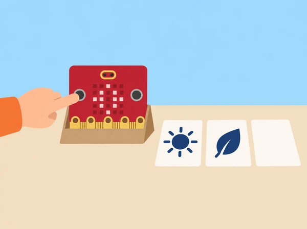

_El patró és una opció configurable, no una resposta universal a les necessitats sensorials._

## 🌱 Situació i intenció

Una classe de tercer cicle treballa el disseny d’un recurs de suport visual que només s’activa quan la persona usuària ho tria. El repte no parteix d’endevinar què necessita algú ni d’imitar una experiència sensorial: l’equip llig un encàrrec fictici validat per la docent (per exemple, “vull veure un senyal lent per saber quan comença una tasca”), compara ajudes existents i dissenya una opció fàcil d’ignorar, canviar o apagar. La matriu 5 × 5 és una eixida visual menuda de prototip; no il·lumina l’aula ni substitueix adaptacions acordades amb la persona i el centre.

La unitat oficial té quatre lliçons per a 11–14 anys i assumeix coneixements previs de pseudocodi i MakeCode. Aquesta versió local conserva l’exploració d’entorns i ajudes, patrons de llum, algoritmes amb entrada/eixida/iteració/selecció i construcció, prova i avaluació; adapta el ritme i l’abast al tercer cicle de primària. No demana a ningú compartir diagnòstic, preferències personals ni experiències de salut.

## 🎯 Aprenentatges i vocabulari

- Analitzar una rutina fictícia i formular requisits de predictibilitat, control voluntari i aturada.
- Dissenyar patrons visuals regulables amb entrades i eixides que l’usuari puga controlar.
- Programar i provar opcions estàtiques o de moviment suau, sense pampallugues ni estímuls obligatoris.
- Recollir retorn voluntari sobre el prototip i explicar que no és una intervenció clínica ni una solució universal.

## 🧰 Materials i acords previs

BBC micro:bit, MakeCode i cable USB, cartó per a un suport que deixe visibles botons i LEDs, targetes de patrons estàtics, pseudocodi, full d’observació de criteris i un temporitzador opcional. Prepareu dos encàrrecs ficticis contrastats amb una persona adulta de suport educatiu o amb material públic d’accessibilitat; no inventeu una “necessitat típica” d’un diagnòstic. Totes les proves es fan primer amb simulador, en una zona de l’aula on la persona que observa pot apartar-se. L’ús en una aula real requereix autorització i acceptació voluntària; el valor pedagògic és el procés de disseny, no l’eficàcia clínica del prototip.

Establiu criteris visibles abans de programar: el recurs roman apagat fins que algú l’activa; ofereix una imatge estàtica o un patró lent sense parpelleig; la persona pot canviar d’opció i deixar-la; el patró acaba o torna a un estat neutre; i hi ha una alternativa en paper. Si un criteri no es pot complir amb la placa, es registra com a límit del prototip.

## 📅 Seqüència didàctica · quatre sessions de 50 minuts

### **Sessió 1 · Explorar entorns i avaluar ajudes (Exploring learning environments).**

#### Fase 1 · Activem i prediem

Llegiu una targeta fictícia amb un objectiu concret, sense etiquetar una persona. Predigueu quina informació de l’entorn pot ajudar a fer més previsible una rutina.

#### Fase 2 · Explorem i construïm

En un mapa inventat d’aula, marqueu fonts de canvi o informació —inici de tasca, cartell, rellotge o soroll representat amb una targeta—. No augmenteu llum ni soroll real per fer la prova.

#### Fase 3 · Expliquem i registrem

Compareu tres opcions: pictograma imprés, temporitzador analògic i micro:bit amb una icona. Useu una matriu de criteris: control de la persona, comprensibilitat, facilitat d’aturada, accessibilitat, cost i manteniment; anoteu també què no sabeu.

#### Fase 4 · Apliquem i millorem

Trieu què provaríeu per a l’encàrrec fictici i què deixareu fora. Reviseu la proposta perquè l’opció impresa, el control de la persona i la possibilitat de declinar-la continuen disponibles.

#### Fase 5 · Comprovem i reflexionem

Expliqueu qui decideix utilitzar el recurs i com pot no usar-lo. **Evidència:** mapa d’entorn, comparació d’ajudes i criteris acordats.

### **Sessió 2 · Dissenyar patrons de llum amb repetició (Light patterns).**

#### Fase 1 · Activem i prediem

Recupereu els criteris de la sessió anterior i comproveu que l’opció impresa i l’estat apagat continuen disponibles. Predigueu com serà el comportament d’un patró estàtic o lent.

#### Fase 2 · Explorem i construïm

Escriviu pseudocodi amb la seqüència «inici voluntari → mostrar patró → pausa → acabar en neutre». Dissenyeu dues imatges 5 × 5 de contrast clar; eviteu animacions, alternança ràpida i estímuls inesperats.

#### Fase 3 · Expliquem i registrem

Traslladeu un patró a MakeCode i useu una repetició de durada finita o una pausa perquè el comportament siga previsible. Registreu com correspon cada bloc amb el pseudocodi.

#### Fase 4 · Apliquem i millorem

Compareu el codi amb els criteris i reviseu-lo si s’activa sol, no acaba en neutre o no és fàcil d’aturar. No demaneu a companys que valoren reaccions corporals ni comoditat personal.

#### Fase 5 · Comprovem i reflexionem

Comproveu que el patró només comença amb una acció voluntària i acaba de manera previsible. **Evidència:** pseudocodi, dues graelles, codi i revisió segons criteris tècnics.

### **Sessió 3 · Algoritme amb entrada, selecció i eixida (Developing pattern algorithms).**

#### Fase 1 · Activem i prediem

Dibuixeu els estats «apagat», «opció 1», «opció 2» i «retorn a neutre». Predigueu què ha de passar quan no es prem cap botó, se’n tria una opció o s’atura.

#### Fase 2 · Explorem i construïm

Decidiu quin botó tria una opció i quin l’atura o la canvia. El programa no s’activa per llum, soroll, presència o moviment de la persona. Escriviu pseudocodi amb condicions «si/opció», «si/aturada» i una iteració limitada.

#### Fase 3 · Expliquem i registrem

Una parella fa d’ordinador i executa literalment les instruccions. Completeu una taula amb **estat inicial, entrada, eixida esperada, eixida observada i resultat**. Incloeu com a mínim: cap entrada (es manté apagat), botó A (mostra l’opció 1), botó B (mostra l’opció 2), una segona pulsació (canvia o manté l’opció segons la regla escrita) i ordre d’aturada (torna a neutre). Afegiu un cas inesperat, com ara deixar passar el temps sense prémer cap botó. No cal registrar noms ni opinions personals.

#### Fase 4 · Apliquem i millorem

Localitzeu instruccions ambigües o una branca sense eixida i corregiu-les. Torneu a executar els casos afectats per comprovar la revisió.

#### Fase 5 · Comprovem i reflexionem

Verifiqueu que el diagrama inclou entrada, selecció, eixida i retorn a estat neutre. **Evidència:** diagrama d’estats, pseudocodi depurat i matriu de casos.

### **Sessió 4 · Construir, provar i avaluar l’ajuda (Building sensory aids).**

#### Fase 1 · Activem i prediem

Predigueu com es podrà activar i aturar el prototip abans de muntar-lo. Comproveu que la prova es pot fer amb simulador, captura estàtica o paper, sense mirar el patró. Assigneu una persona al programa, una altra a llegir els casos de prova i una tercera a registrar eixides; canvieu els rols abans de la revisió final.

#### Fase 2 · Explorem i construïm

Col·loqueu la micro:bit en un suport estable sense tapar botons ni matriu LED, o deixeu-la plana si així és més fàcil controlar-la. Implementeu l’algoritme amb entrades, selecció, una repetició limitada i eixida estàtica; no afegiu automatismes que observen la classe.

_La persona pot triar el senyal, fer servir les targetes de paper o deixar el dispositiu apagat._

#### Fase 3 · Expliquem i registrem

Recorreu els sis casos de la sessió anterior i anoteu eixida esperada i real. Si la taula mostra una diferència, reproduïu només eixe cas, localitzeu si l’error està en l’entrada, la condició o l’eixida i torneu a provar-lo després del canvi. Els comentaris de la galeria seran sobre el disseny, no sobre les reaccions de cap persona.

#### Fase 4 · Apliquem i millorem

Auditeu els criteris: per defecte queda apagat, l’opció en paper és equivalent per comprendre l’avís i sempre és fàcil deixar el recurs. Reviseu el programa si algun d’aquests punts falla.

#### Fase 5 · Comprovem i reflexionem

Presenteu el codi, els criteris i un límit conegut. **Evidència:** prototip, programa revisat, matriu de proves i autoavaluació tècnica.

## 📊 Avaluació i evidències

Guardeu l’encàrrec fictici, mapa d’entorn, comparació d’ajudes, criteris, pseudocodi, diagrama d’estats, codi i resultats esperats/reals dels sis casos. Valoreu si l’equip (1) justifica per què una opció pot respondre a l’encàrrec sense dir que convé a tothom; (2) representa entrada, selecció, eixida i repetició; (3) programa el comportament triat i previsible; (4) prova i depura casos, incloent-hi estat apagat i aturada; i (5) comunica una alternativa i un límit. La rúbrica avalua decisions de disseny i funcionament tècnic, no una resposta sensorial “correcta”.

## 🛡️ Consentiment, accessibilitat i privacitat

L’ajuda és voluntària, no es registra qui l’ha provada i no es demanen testimonis, diagnòstics ni preferències personals. Ningú no ha de mirar el patró: la prova pot fer-se al simulador, amb una captura estàtica o en paper. No useu flaixos, llums intermitents ni so; oferiu sempre control manual, opció neutra i possibilitat de no usar el dispositiu. Si el centre vol provar un suport en ús real, la decisió ha de comptar amb la persona usuària i el personal responsable, i pot abandonar-se sense justificació. Aquest prototip escolar no es presenta com a teràpia, tractament ni ajust raonable formal.

## 🔗 Unitat oficial adaptada

[Sensory classroom](https://microbit.org/teach/lessons/sensory-classroom/) té quatre lliçons per a 11–14 anys i assumeix experiència prèvia amb algoritmes/MakeCode. La primera explora entorns d’aprenentatge i avalua ajudes; la segona escriu pseudocodi amb iteració i patrons de llum; la tercera planifica una ajuda visual amb entrades, eixides, iteració i selecció; la quarta programa, prova, depura i avalua el disseny. Aquesta adaptació manté la progressió i els objectius, incorpora criteris d’ús voluntari, casos de prova i alternativa impresa i redueix l’abast tecnològic al micro:bit. No reutilitza materials visuals oficials.
