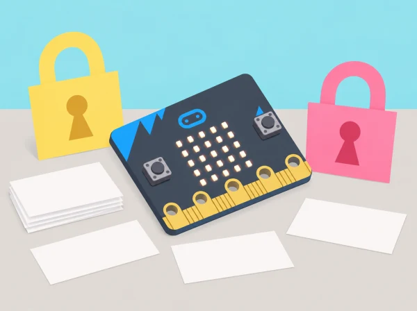

_La placa representa estats i passos d’un algorisme; no guarda ni protegeix contrasenyes reals._

## 🌱 Situació i intenció

La biblioteca escolar prepara una guia perquè la comunitat reconega riscos digitals i entenga com es dissenya un algorisme per generar una combinació fictícia. Els equips treballen amb missatges inventats, decideixen quins indicis cal verificar, descriuen els límits del “hacking ètic” i prototipen una seqüència de tokens amb micro:bit. El dispositiu mostra índexs o icones de demostració: no és un gestor de contrasenyes, no desa credencials i no produeix claus adequades per a comptes reals.

La unitat oficial té tres lliçons per a 11–14 anys i s’imparteix idealment després de *Computing fundamentals*. Aquesta versió local per a tercer cicle incorpora una activació de pseudocodi, targetes de suport i casos preparats; manté la progressió de ciberseguretat, contrasenyes fortes, algorisme amb variables/selecció i programació, prova, depuració i avaluació.

## 🎯 Aprenentatges i vocabulari

- Identificar riscos digitals i distingir una demostració escolar d’una protecció de seguretat real.
- Descompondre un algorisme didàctic que combina caràcters ficticis i regles de selecció.
- Programar una eixida simbòlica i provar casos sense introduir credencials o dades reals.
- Explicar per què una seqüència aleatòria de micro:bit no és una clau criptogràfica segura.

## 🧰 Preparació, dades i materials

Micro:bit, MakeCode, targetes de missatges totalment ficticis, graelles d’algoritme, full de prova i targetes de tokens neutres (paraules sense referència personal, símbols i dígits). No useu serveis en línia, comptes, credencials reals ni dades de l’alumnat. El generador queda desconnectat de xarxes i la placa esborra la pantalla al final de cada prova. Prepareu exemples de missatges sense URL activa, fitxer adjunt, codi QR ni instrucció que l’alumnat puga seguir.

En la part de programació, useu una selecció aleatòria de MakeCode només com a recurs didàctic: no té garantia criptogràfica i pot ser reproduïble o previsible. L’eixida representa categories/índexs per provar el flux; no deseu ni aprofiteu cap combinació generada com a contrasenya. Si la versió d’editor no permet mostrar una seqüència segura i efímera, l’alumnat simula els tokens amb targetes i deixa la placa en una eixida simbòlica.

## 📅 Seqüència didàctica · quatre sessions de 50 minuts

### **Sessió 1 · Ciberseguretat, malware i hacking ètic (What is cyber security?).**

*Activació (5 min):*

distingiu dades públiques, privades i d’accés restringit amb targetes inventades.

*Malware o missatge legítim? (15 min):*

classifiqueu sis exemples impresos (missatge esperat, avís urgent, adjunt no sol·licitat, petició de credencial, premi inesperat i missatge amb remitent desconegut). Per a cadascun, marqueu indicis, què no podeu saber només mirant-lo i el pas segur: no clicar, no descarregar, no respondre, consultar una persona adulta o el canal oficial escrit. No intenteu obrir cap contingut real.

*Hacking ètic (12 min):*

compareu una auditoria autoritzada en un entorn de pràctica amb l’accés a un compte d’una altra persona; classifiqueu qui dona permís, quin sistema s’inclou i on acaba la prova. No feu escanejos, proves de contrasenya ni connexions a xarxes reals.

*Mapa de protecció (13 min):*

dibuixeu dispositiu, compte fictici, dada i persona de suport; identifiqueu una mesura preventiva i una resposta si hi ha dubte.

*Tancament (5 min):*

practiqueu una frase de report segur sense reenviar el missatge. Evidència: classificació raonada, límit d’autorització i diagrama de dades.

### **Sessió 2 · Contrasenyes i planificació de l’algorisme (Strong passwords).**

*Revisar conceptes (8 min):*

contrasteu longitud, imprevisibilitat, unicitat i no reutilització amb exemples abstractes; no proclameu “forta” una cadena només perquè conté símbols.

*Definir el prototip (7 min):*

l’objectiu és generar un patró didàctic de tres posicions amb un token de cada conjunt neutre, no crear una clau d’ús real.

*Construir conjunts (10 min):*

prepareu llistes fictícies curtes de tokens (paraules/índexs, símbols inventats, dígits de prova); cap token prové de noms, dates o preferències d’una persona.

*Escriure pseudocodi (15 min):*

inicialitzeu variables per a posició i token; seleccioneu una opció d’un conjunt; avanceu la posició; repetiu fins a omplir tres llocs; mostreu només l’índex simbòlic i esborreu-lo en acabar.

*Planificar casos (10 min):*

proveu longitud nul·la/no permesa, índex al primer/últim element, selecció fora de rang i omissió d’una categoria. Evidència: pseudocodi, llistes fictícies i prediccions de casos.

### **Sessió 3 · Programar el prototip amb micro:bit (Making a password generator).**

*Transició de targetes a variables (8 min):*

assigneu una variable a cada posició i compareu-les amb el pseudocodi.

*Implementar (18 min):*

programeu inicialització, selecció, condició i repetició limitada. Cada botó inicia una única generació de prova o esborra l’eixida; no mostreu una cadena completa que algú puga confondre amb una credencial real.

*Executar amb valors de demostració (12 min):*

feu tres rondes amb tokens d’aula, anoteu índexs i comproveu que cada posició es completa.

*Comparar codi i pla (7 min):*

assenyaleu una diferència entre el programa i l’algorisme que cal revisar.

*Esborrar (5 min):*

torneu a estat neutre i confirmeu que no hi ha cap credencial real ni historial guardat. Evidència: codi anotat, diagrama i comprovació d’esborrat de la pantalla.

### **Sessió 4 · Provar, depurar i avaluar sense afirmar seguretat real.**

*Matriu de proves (15 min):*

executeu casos de conjunt buit, índex mínim/màxim, categoria omesa, reinici, entrada inesperada i repetició de tokens; compareu eixida prevista i observada.

*Depuració (12 min):*

identifiqueu si l’error és d’inicialització, límit, ordre o estat de reinici; canvieu una part i repetiu el mateix cas.

*Avaluar (10 min):*

reviseu si el prototip segueix l’algoritme i compleix els criteris de demostració, i escriviu tres límits: aleatorietat no criptogràfica, eixida visible i absència d’emmagatzematge/gestió segura.

*Comunicació (8 min):*

presenteu una pràctica de protecció basada en font fiable i expliqueu per què no usaríeu el resultat de la placa en un compte.

*Retorn (5 min):*

un altre equip deixa una pregunta sobre les proves o la seguretat. Evidència: matriu amb sis casos, versions abans/després i avaluació dels límits.

## 📊 Criteris d’èxit i avaluació

Recolliu targetes classificades amb justificació, mapa de dades i permisos, pseudocodi, variables, taula de proves, codi revisat i declaració de límits. Valoreu si l’equip (1) reconeix indicis de risc i sap aturar-se/consultar; (2) diferencia prova autoritzada de l’accés no permés; (3) planifica un algorisme amb selecció, variables i repetició delimitada; (4) prova límits i depura amb evidències; i (5) no confon un prototip amb un generador segur. No s’avalua la “qualitat” d’una contrasenya d’ús real ni es demana mostrar cap secret.

## 🔐 Privacitat, benestar i resposta a incidents

No demaneu a ningú que compartisca o introduïsca contrasenyes reals, que reutilitze dades d’un compte o que revele quin servei utilitza. No fotografeu credencials ni guardeu les combinacions de prova; esborreu eixides i targetes en finalitzar. Cap missatge de classe s’envia, s’obre o es reenvia. Si apareix una situació real, pareu, no investigueu el compte pel vostre compte i seguiu el protocol del centre amb una persona adulta responsable. Eviteu etiquetar o culpabilitzar qui rep un missatge enganyós: l’anàlisi és del disseny del missatge i de la resposta segura.

## 🔗 Unitat oficial adaptada

[Introduction to cyber security](https://www.microbit.org/teach/lessons/cyber-security/) consta de tres lliçons i recomana haver treballat abans *Computing fundamentals*. [What is cyber security?](https://microbit.org/teach/lessons/cyber-security-what-is/) tracta importància, hacking ètic, malware i protecció de dades/dispositius; [Strong passwords](https://microbit.org/teach/lessons/cyber-security-strong-passwords/) demana dissenyar, provar i depurar un generador amb selecció i variables; [Making a password generator](https://microbit.org/teach/lessons/cyber-security-password-generator/) porta el pseudocodi a MakeCode i avalua la depuració. Aquesta adaptació conserva els objectius i crea casos ficticis, bastida de pseudocodi i proves específiques. La font s’adreça a 11–14 anys; la seqüència de tercer cicle redueix l’abast, evita comptes reals i no presenta el producte didàctic com a generador criptogràfic.
