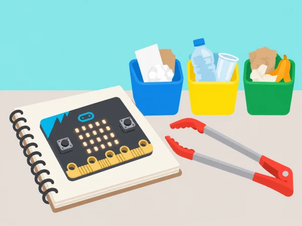

_El registre és anònim i se centra en objectes; la placa no identifica qui els ha deixat._

## 🌱 Situació i intenció

La brigada verda del centre vol saber quins residus visibles apareixen en una zona delimitada del pati i proposar una millora de prevenció o separació. L’alumnat aprén a llegir entrades, guardar comptatges en variables i construir un comptador de categories amb micro:bit. Primer el prova amb materials nets preparats; després l’utilitza en una observació guiada del centre i presenta dades agregades. No es registra qui ha deixat cap objecte ni s’afirma que una mostra xicoteta descriga tot el centre.

La proposta adapta les dues lliçons de *Barefoot · Litter hunt*, adreçades a alumnat d’uns 9–11 anys: usar botons i sensors per mostrar icones, modificar variables i jugar amb una entrada; després dissenyar, programar i usar un comptador de residus reciclables en l’entorn local. La tercera sessió és una ampliació pròpia per separar disseny tècnic, treball de camp i interpretació.

## 🎯 Aprenentatges i vocabulari

- Definir categories observables i registrar recomptes amb un procediment consistent.
- Programar entrades, variables i eixides per a representar un comptador de mostres segures.
- Provar valors inicials, increments i límits per detectar errors de recompte.
- Usar els resultats per plantejar una millora local sense tocar residus perillosos ni atribuir causalitat a dades limitades.

## 🧰 Materials i preparació

Micro:bit física amb portapiles, MakeCode, 3 targetes d’icones de categoria, mostres simulades netes de paper/cartró i envasos buits nets, graella o taula de dades, llapis, guants i pinces només si el centre autoritza la recollida segura. La font oficial demana plaques físiques i alimentació per al projecte de camp: el simulador serveix per a preparar i provar el codi però no equival a usar el comptador en una recollida real. Si no hi ha placa o portapiles, manteniu la mateixa activitat amb targetes i etiqueteu-la com a simulació.

Abans d’eixir, consulteu la guia de separació del municipi o del servei de residus del centre, anoteu font i data i convertiu-la en tres categories amb una opció “no sabem / consultar”. Les normes de separació poden variar; no classifiqueu automàticament un objecte com a reciclable només pel seu aspecte. Delimiteu una zona privada i autoritzada del pati, acordant límits de recorregut, temps, rols i contacte amb residus. La persona adulta revisa el protocol de riscos i decideix quins objectes no es toquen.

## 📅 Seqüència didàctica · tres sessions de 50 minuts

### **Sessió 1 · Entrades, eixides i variables (Litter hunt, lesson 1).**

#### Fase 1 · Activem i prediem

Localitzeu botons A/B, matriu LED, pins i un sensor integrat rellevant, com l’acceleròmetre. Predigueu què és una entrada i què és una eixida i com pot una inclinació o una sacsejada activar una resposta sense identificar cap persona.

#### Fase 2 · Explorem i construïm

Programeu A per mostrar una icona i B una altra. Proveu el moviment d’inclinació o sacsejada per a mostrar una tercera resposta. Després, inicialitzeu un comptador en zero, feu que un esdeveniment el modifique i mostreu-ne el valor; predigueu el resultat abans de cada prova.

#### Fase 3 · Expliquem i registrem

Adapteu el joc d’entrada per torns: una targeta indica l’entrada, cada participant anticipa quina icona o valor apareixerà i executa el torn quan li toca. Registreu les entrades i el valor esperat i observat.

#### Fase 4 · Apliquem i millorem

Compareu si totes les entrades es detecten i si el comptador es modifica una sola vegada. Si hi ha increments no desitjats, canvieu una condició o l’esdeveniment d’entrada i repetiu el mateix torn. No mesureu qui és més ràpid ni feu rànquings.

#### Fase 5 · Comprovem i reflexionem

Expliqueu com es guarda el nombre i quina entrada podria provocar un increment accidental. **Evidència:** mapa entrada-processament-eixida, variable anotada, predicció i taula d’esdeveniments.

### **Sessió 2 · Dissenyem i verifiquem el comptador.**

#### Fase 1 · Activem i prediem

Useu una situació inventada de recollida del pati. Consulteu la guia local de separació, anoteu-ne font i data i trieu tres categories verificables, per exemple paper/cartó, envasos lleugers i dubtós/altre. Predigueu què ha de passar quan es canvia de categoria sense comptar cap objecte.

#### Fase 2 · Explorem i construïm

Dissenyeu la interfície: A canvia la categoria, B suma una unitat i una combinació d’ordres reinicia el recompte; associeu una icona constant a cada categoria. Creeu variables independents per categoria i, si és útil, un total derivat. Eviteu que canviar de categoria incremente el recompte.

#### Fase 3 · Expliquem i registrem

Escriviu una taula de proves amb entrada, categoria seleccionada, valor previst i valor mostrat. Incloeu una entrada de cada tipus, dos elements seguits de la mateixa categoria, canvi de categoria abans d’incrementar, reinici i categoria dubtosa.

#### Fase 4 · Apliquem i millorem

Executeu els casos, compareu resultat previst i real i corregiu un error. Torneu a executar exactament els mateixos casos per comprovar que la correcció resol el problema sense alterar les altres categories.

#### Fase 5 · Comprovem i reflexionem

Una altra parella segueix les instruccions i explica si pot saber què està comptant. **Evidència:** codi, interfície amb icones, taula de proves completa i un canvi justificat.

### **Sessió 3 · Observem amb seguretat i fem una proposta local (adaptació de Litter hunt, lesson 2).**

#### Fase 1 · Activem i prediem

Recordeu els límits, la zona, el recorregut i el senyal d’aturada. Assigneu rols d’operació del comptador, lectura de la guia, registre, observació i supervisió adulta. Predigueu quines categories es podran identificar visualment i quins casos quedaran com a dubtosos.

#### Fase 2 · Explorem i construïm

En una ruta curta i autoritzada, classifiqueu només allò que es pot identificar visualment amb la guia local. Una persona registra cada observació amb el comptador i una altra porta el recompte de comprovació en paper. No fotografieu persones ni toqueu objectes desconeguts. La persona adulta, no l’alumnat, gestiona residus potencialment perillosos; si no hi ha protocol aprovat, feu només observació i useu mostres netes de classe.

#### Fase 3 · Expliquem i registrem

Compareu el total micro:bit amb el registre manual. Identifiqueu discrepàncies, conserveu-les en el registre i descriviu una causa possible, com doble recompte, categoria incerta o botó premut dues vegades.

#### Fase 4 · Apliquem i millorem

Convertiu els resultats en una taula i un gràfic senzill; indiqueu zona, data i durada de la mostra, sense extrapolar al centre sencer. Escriviu una millora que el centre puga provar —com ubicar millor un contenidor o fer un recordatori visual— i concreteu quina dada futura permetria comprovar-la.

#### Fase 5 · Comprovem i reflexionem

Presenteu la proposta amb els límits de la mostra i expliqueu com una nova observació permetria valorar-la. **Evidència:** registres agregats, discrepància documentada, gràfic i proposta local.

## 📊 Criteris d’èxit i avaluació

Recolliu diagrama de components, variables, icones, codi, casos de prova, pauta local de separació, recompte de micro:bit i paper, gràfic i proposta. Valoreu si l’alumnat (1) diferencia sensor/botó i entrada/eixida; (2) inicialitza i modifica variables sense perdre categories; (3) segueix una guia datada i deixa dubtes com a dubtes; (4) detecta discrepàncies entre recompte automàtic i manual; i (5) formula una conclusió proporcional a una zona i un període observats. El dispositiu ajuda a registrar, però no classifica residus per si mateix: la persona decideix la categoria i pot marcar incertesa.

## ♿ Participació, seguretat i privacitat

Oferiu icones tàctils o d’alt contrast, targetes de categoria, dictat de dades, rol de verificació en paper i una ruta accessible o observació des d’un punt fix. No cronometreu velocitat ni publiqueu rànquings d’alumnes o grups. Manteniu-vos en zona autoritzada, useu pinces/guants només amb supervisió i no toqueu vidre, xeringues, piles, femta, objectes tallants, substàncies ni residus d’origen desconegut. Si hi ha qualsevol dubte, l’alumnat no l’arreplega: la persona adulta el deixa, aïlla la zona segons el protocol del centre i ho comunica al servei responsable. No registreu noms, cares ni qui podria haver deixat un residu; les dades es guarden agregades. Renteu-vos les mans després de la pràctica.

## 🔗 Unitat oficial adaptada

[Barefoot · Litter hunt](https://microbit.org/teach/lessons/barefoot-litter-hunt/) consta de dues lliçons. La [primera](https://microbit.org/teach/lessons/barefoot-litter-hunt-lesson-1/) treballa botons i sensors per a mostrar imatges, variables i un joc de resposta; la [segona](https://microbit.org/teach/lessons/barefoot-litter-hunt-lesson-2/) presenta el repte d’una organització ambiental, dissenya el comptador, registra deixalles locals i fa una recollida. Aquesta proposta conserva els objectius de programació i registre, substitueix la cursa ràpida per proves accessibles, incorpora normativa local de separació i separa l’observació de la manipulació segura de residus. La sessió de verificació i proposta és una ampliació pròpia; no reutilitza els materials visuals oficials.
