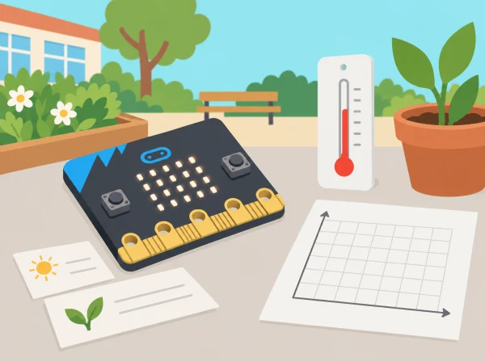

_Les dades descriuen l’entorn i la prova; no es fan perfils de les persones que l’utilitzen._

## 🌱 Situació i intenció

El consell escolar demana una observació senzilla del pati: quins llocs tenen més llum, quines zones són més fresques o com es poden mostrar avisos útils? Els equips aprenen a classificar dades, explorar sensors, dissenyar un gadget i programar una condició. La placa mostra un prototip d’aula, no és un termòmetre calibrat ni un assistent que escolta converses.

## 📅 Seqüència didàctica · 5 sessions

### **Sessió 1 · Què és una dada? (What is data?).**

Classifiqueu exemples ficticis d’observacions ambientals, registres i opinions. Diferencieu dades personals, dades agregades i dades de l’entorn. Analitzeu com un ús inadequat pot perjudicar algú i establiu una norma: l’activitat no recull noms, imatges, veus, rutes individuals ni dades de salut.

### **Sessió 2 · Caça de dades (Data treasure hunt).**

Busqueu informació mesurable en punts autoritzats del pati, com llum aproximada, orientació o temperatura estimada. Amb micro:bit, programeu lectures en punts comparables i registreu hora, ubicació genèrica, unitat i condicions. La temperatura llegida per la placa reflecteix aproximadament la del processador i pot diferir de la de l’aire; no l’useu per prendre decisions de salut o seguretat.

### **Sessió 3 · Dissenyar un gadget (Sensor gadget design).**

A partir de les dades, definiu un públic i una necessitat: un indicador de llum per a una maqueta d’hort o un senyal per saber si una zona de joc està a l’ombra. Dibuixeu entrades, procés i eixides, trieu criteris verificables i indiqueu quin sensor integrat o accessori extern s’utilitzaria. Si el sensor no forma part de la dotació, el prototip queda simulat.

### **Sessió 4 · Dades, condicions i selecció (Data conditions & selection).**

Programeu una resposta a una lectura de sensor amb un llindar triat a partir de proves locals: per exemple, mostrar una icona si la llum és baixa. Compareu valors al voltant del llindar, proveu el comportament en un altre punt i depureu falses alertes. El resultat és un avís informatiu, mai una alarma tèrmica o de seguretat.

### **Sessió 5 · Un assistent digital (Digital assistants).**

Construïu un assistent de menú que respon a A/B amb una proposta preprogramada: observar ombra, revisar una planta o triar una ruta de joc. Representeu en un diagrama quines dades usa i quines no. No hi ha micròfon, conversa ni decisió intel·ligent: és una seqüència local amb condicions escrites per l’equip.

## 🧰 Materials i preparació

BBC micro:bit, MakeCode, ordinador, targetes, llapis i full de registre. Els sensors de llum, brúixola, acceleròmetre i temperatura varien segons la versió i l’entorn; confirmeu els blocs i les limitacions de la placa disponible. No cal connexió a internet ni compte d’usuari.

## 🧪 Evidències i avaluació

Recolliu una classificació de dades, pla de mostreig, taula amb unitats i condicions, diagrama d’entrada-procés-eixida, programa amb condició i proves al voltant del llindar. Valoreu si les conclusions respecten els límits del sensor i si el gadget resol una necessitat concreta sense recollir dades personals.

## Fitxa de recerca i seqüència de treball

Per a cada lectura, l'equip completa: pregunta, lloc genèric, sensor o font, valor i unitat, condició observada, repetició i dubte. En la sessió 1, compareu una observació («la placa mostra 120») amb una interpretació («ací hi ha menys llum») i una opinió («preferisc aquesta zona»). Separeu-les en tres columnes i acordeu quina es pot comprovar amb una prova.

En la caça de dades, feu dos o tres punts de mesura comparables i repetiu cada lectura mantenint orientació i altura semblants. No cal cobrir tot el pati: un mostreig menut i ben explicat és més útil que una col·lecció de valors sense procediment. Anoteu si una ombra, un núvol o l'escalfament de la placa poden haver canviat el resultat. Si el sensor no està disponible o els blocs varien entre versions, feu servir un conjunt fictici marcat com a simulat i no el presenteu com a mesura real.

## Del patró observat al prototip

Després de representar les lectures amb una taula o pictograma, cada equip selecciona una necessitat concreta del projecte escolar. Dibuixa una cadena d'entrada, procés i eixida: el sensor obté una lectura; una condició la compara amb un llindar; la placa mostra una icona o un missatge. El grup justifica el llindar amb les seues pròpies proves i anota què passaria just per damunt o per davall. Proveu tres valors —baix, igual al llindar i alt— i confirmeu l'eixida esperada abans de provar el programa en un altre lloc.

Per al menú de l'assistent digital, feu un mapa d'estats senzill: inici, opció A, opció B i retorn. Un company prova cada botó sense rebre instruccions dels autors i registra si arriba a l'opció prevista. Aquest control d'estats ajuda a detectar una eixida sense camí de retorn o un botó sense resposta; no implique cap processament de veu ni intel·ligència artificial.

## Rúbrica i retorn entre equips

Reviseu cinc criteris amb «amb suport / en procés / de manera clara»: classifica dades i opinions; documenta condicions de mesura; representa el sistema amb entrada, procés i eixida; prova el llindar amb casos propers; i comunica una limitació concreta del sensor. Cada equip mostra el prototip a una altra parella, que intenta seguir les instruccions i proposa una pregunta, no una nota. La versió revisada inclou almenys un canvi justificat a partir d'aquest retorn.

## 🔒 Privacitat i fiabilitat

Mesureu espais amb autorització i no anoteu qui hi era. Repetiu lectures i registreu variacions d’orientació, ombres o escalfament de la placa. Les lectures són aproximades; un canvi o una correlació no demostra per si sol una causa ni permet generalitzar a tot el centre.

## 🔗 Unitat oficial adaptada

Aquesta situació adapta les cinc lliçons de micro:bit [Data handling](https://microbit.org/teach/lessons/data-handling-unit-summary/): *What is data?*, *Data treasure hunt*, *Sensor gadget design*, *Data conditions & selection* i *Digital assistants*. Els punts de recollida, el gadget, les dades d’exemple i les preguntes són propis; es mantenen els objectius de dades, sensors, algoritmes, condicions, disseny i depuració.
