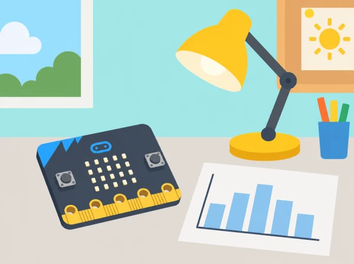

_El sensor de llum registra lectures ambientals; cal separar-les del consum elèctric real._

## 🌱 Situació i intenció

La comissió ambiental del centre vol entendre millor quan s’encén la il·luminació d’una aula. L’alumnat planifica una recollida de lectures amb micro:bit, estableix una línia de base, processa dades i prepara una proposta raonada. La placa estima la llum que arriba al sensor: no és un comptador elèctric ni permet atribuir consum sense dades addicionals de potència i temps d’ús.

## 📅 Seqüència didàctica · 6 sessions

### **Sessió 1 · Energia al nostre voltant (Energy around us).**

Identifiqueu on s’utilitza llum elèctrica al centre i formuleu una pregunta d’investigació. Trieu un espai amb autorització del centre i definiu què significa una lectura elevada o baixa per a aquesta prova. Relacioneu la decisió amb accions climàtiques, sense atribuir el consum a persones o grups.

### **Sessió 2 · Planificar les dades (Energy data planning).**

Determineu ubicació, orientació, interval, durada, moments amb llum natural i una situació de referència. Programeu micro:bit perquè mostre o registre valors del sensor de llum. Repetiu lectures en condicions conegudes i anoteu les limitacions del model de placa.

### **Sessió 3 · Recollir i calibrar (Energy data collecting).**

Recolliu dades durant intervals curts acordats, sense gravar ni registrar presència, horaris personals o noms. Compareu la línia de base amb una prova controlada de llum encesa i apagada; marqueu canvis de llum natural i repeticions. No deixeu el prototip sense supervisió ni obstaculitzeu l’activitat del centre.

### **Sessió 4 · Processar i interpretar (Energy data processing).**

Passeu les lectures a una taula, calculeu valors representatius i dibuixeu un gràfic. Detecteu valors atípics, canvis de posició i moments amb il·luminació externa. Escriviu una inferència prudent i una explicació alternativa abans de recomanar cap canvi.

### **Sessió 5 · Estimar energia i cost (Energy use calculations).**

Amb la potència nominal documentada d’una lluminària fictícia o facilitada pel centre i el temps estimat d’ús, calculeu energia en kWh i un cost d’exemple amb una tarifa explicitada pel docent. No useu factures ni tarifes familiars, i deixeu clar que la lectura de llum no mesura potència ni consum.

### **Sessió 6 · Presentar una proposta (Energy presentations).**

Prepareu un pòster o exposició breu amb mètode, gràfic, estimacions, errors possibles i una acció de baix cost. Expliqueu què caldria mesurar millor per comprovar-ne l’efecte i compartiu la proposta amb l’audiència escolar acordada.

## 🧰 Materials i preparació

BBC micro:bit amb sensor de llum disponible en la versió del centre, cable o alimentació adequada, ordinador amb MakeCode o Python, cronòmetre i full de registre. Si la placa és v1 o no exposa les lectures requerides a l’entorn instal·lat, useu un sensor extern verificat per separat o feu una simulació amb dades de prova identificades com a simulades.

## 🧪 Evidències i avaluació

Recolliu pregunta i pla de mesura, programa del registre, taula datada amb unitats i condicions, gràfic, càlcul d’exemple i proposta amb límits explícits. Valoreu qualitat de les repeticions, tractament de dades incertes, càlcul coherent i adequació de la comunicació al públic.

## Guió de treball de camp i registre

**Sessions 1–2:** feu un mapa senzill dels espais possibles i trieu-ne un que el centre autoritze. Acordeu la pregunta abans d'obrir MakeCode: per exemple, «com canvia la lectura del sensor en un punt fix quan hi ha llum natural o quan encenem la llum de la maqueta?». Definiu què mantindreu constant —posició i orientació de la placa— i quina condició canvia. Creeu un programa que mostre una lectura actual o la guarde a intervals adequats a l'eina. Proveu primer amb la placa en el mateix lloc i compareu lectures repetides; anoteu que la lectura és un valor relatiu del sensor i que no és una mesura professional d'il·luminació.

**Sessions 3–4:** recolliu les dades en períodes curts i supervisats. Cada fila inclou codi de lloc no identificador, hora aproximada, condició de llum, orientació, valor i incidències com ara un núvol o una ombra. No anoteu noms, presència, ús d'espais per grups ni horaris personals. Després, calculeu la mitjana o la mediana segons el nivell, marqueu rang i possibles lectures anòmales i feu un gràfic amb eixos i unitats descrits. Separeu observació («la lectura va pujar») d'interpretació («hi havia més llum natural») i d'hipòtesi («potser no calia encendre el llum»).

## Estimació d'energia: exemple amb dades fictícies

La lectura del sensor no es transforma en kWh. Per practicar el càlcul de la lliçó oficial, useu una lluminària fictícia o una potència nominal autoritzada pel centre. Convertiu watts a quilowatts i multipliqueu per les hores d'ús: energia (kWh) = potència (kW) × temps (h). Per exemple, una lluminària hipotètica de 40 W és 0,04 kW; si s'utilitza 3 hores, el càlcul dona 0,12 kWh. Amb una tarifa d'exemple de 0,30 €/kWh, el cost il·lustratiu és 0,036 €. Indiqueu en el full que potència, temps i tarifa són valors de pràctica i que no representen la factura del centre.

Compareu una estimació per un dia i per una setmana de cinc dies i reviseu les unitats. Pregunteu què falta per fer una estimació millor: nombre de lluminàries, potència real, hores d'ús, tarifa aplicable i altres consums. No multipliqueu directament la lectura ambiental del micro:bit per cap factor de consum.

## Proposta, revisió i avaluació

En la sessió final, prepareu una presentació amb cinc peces: pregunta, mètode, gràfic, estimació fictícia separada de les lectures i proposta de prova. La recomanació pot ser tan modesta com «repetir la lectura en dos dies més» o «comprovar si hi ha llum natural abans d'encendre», i ha d'indicar qui podria autoritzar una prova real. Una altra parella revisa si cada afirmació es recolza en una dada i si les limitacions són visibles.

La graella d'avaluació observa: planifica variables i repeticions; representa la dada amb unitats o escala explicades; diferencia lectura, inferència i càlcul; usa correctament kWh i euros en l'exemple; comunica una proposta prudent. Accepteu pòster, presentació oral, gràfic digital o maqueta anotada. No valoreu l'estalvi real aconseguit perquè aquesta activitat no mesura el comptador elèctric.

## 🔒 Dades, seguretat i límits

Demaneu autorització abans de mesurar dins del centre i no registreu dades personals ni presència. No toqueu interruptors o instal·lacions, no tapeu eixides ni bloquegeu passadissos. La lectura de llum varia amb l’orientació, les ombres i la llum natural; una correlació no demostra per si sola quanta energia s’ha consumit ni qui n’és responsable.

## 🔗 Unitat oficial adaptada

Aquesta situació cobreix les sis lliçons de micro:bit [Energy awareness](https://www.microbit.org/teach/lessons/energy-awareness/): *Energy around us*, *Energy data planning*, *Energy data collecting*, *Energy data processing*, *Energy use calculations* i *Energy presentations*. La recerca al centre, les dades d’exemple, la proposta i la imatge són propis; la seqüència manté els objectius de planificar, calibrar, recollir, analitzar, calcular i comunicar.
