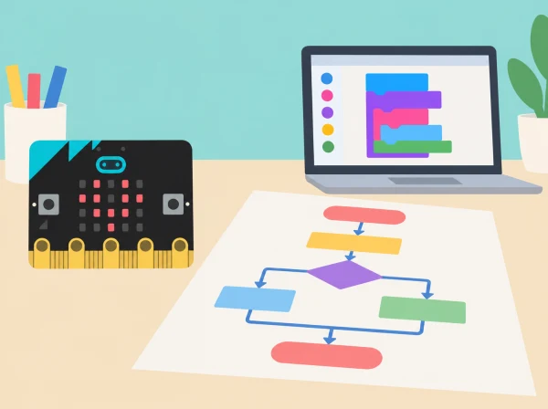

_Algorismes, codi i components són parts diferents d’un mateix sistema._

## 🌱 Situació i intenció

Una mostra escolar demana a cada equip explicar com un dispositiu senzill rep instruccions i produeix una resposta. L’alumnat parteix d’un repte manual, el descompon, escriu i prova algorismes i acaba amb una micro:bit programada i un breu vídeo explicatiu. Les activitats comencen sense ordinador i avancen cap als blocs de MakeCode, sense pressuposar coneixements previs.

## 📅 Seqüència didàctica · 6 sessions

### **Sessió 1 · Pensament computacional I.**

En equips, dissenyeu i proveu un avió de paper gegant amb materials i normes acordades, o una alternativa d’objecte de paper per a qui preferisca no llançar-lo. Descomponeu la tasca i redacteu instruccions que un altre equip puga seguir sense improvisar. Reviseu amb casos de prova i localitzeu ambigüitats.

### **Sessió 2 · Pensament computacional II.**

Transformeu el repte en una maqueta de sistema: entrada, procés i eixida. Representeu el prototip com a diagrama i expliqueu abstracció, descomposició, patrons i algoritme. Compareu solucions abans de construir; documenteu quina informació s’ha deixat fora i per què.

### **Sessió 3 · Programació I.**

Seguiu diagrames de flux i pseudocodi amb targetes d’instruccions. Després creeu en MakeCode un programa que mostre una icona amb el botó A. Feu prediccions abans de cada prova, detecteu errors i corregiu-los amb una llista de comprovació. Distingiu l’algorisme de la seua implementació en blocs.

### **Sessió 4 · Programació II.**

Resoleu una mateixa tasca curta amb una seqüència, una repetició i una selecció. Compareu un programa de blocs amb una versió textual de pseudocodi i identifiqueu què expressen igual. Programeu una animació curta amb una pausa i un botó per a aturar-la; registreu proves normals i límit.

### **Sessió 5 · Sistemes informàtics I.**

Desmunteu conceptualment un sistema quotidià: maquinari, programari, entrada, procés, emmagatzematge i eixida. Relacioneu botons i sensor de llum amb possibles entrades, el programa amb el procés i la matriu LED amb l’eixida. Programeu una resposta a un botó i expliqueu quins components hi intervenen.

### **Sessió 6 · Sistemes informàtics II.**

Prepareu un vídeo breu o una exposició accessible que mostre el micro:bit, el programa i el recorregut entrada-procés-eixida. Useu una rúbrica comuna i feu revisió entre iguals. Si no es poden gravar imatges o veus, entregueu una seqüència de diapositives amb narració escrita o demostració en directe.

## 🧰 Materials i conceptes

Paper, targetes, retoladors, micro:bit, ordinador amb MakeCode i cable USB. La placa inclou botons, matriu LED, sensor de llum, temperatura aproximada, brúixola, acceleròmetre i pins; les activitats només empren els components indicats. Simulador i targetes permeten continuar sense dispositiu físic. Conceptes: algoritme, pseudocodi, diagrama de flux, seqüència, selecció, iteració, depuració, maquinari, programari i entrada/eixida.

## 🛡️ Accessibilitat i cura

Oferiu rols diversos (disseny, lectura, proves, documentació), alternativa a l’activitat de llançament i opcions sense enregistrar persones. Permeteu demostrar l’aprenentatge amb text, diagrama, presentació o vídeo. No useu dades personals: les proves s’apliquen al programa i al dispositiu.

## 🧪 Evidències i avaluació

Instruccions revisades, descomposició del problema, diagrama, pseudocodi, programa de blocs, taula de proves, mapa del sistema i vídeo o exposició. Valoreu precisió, ús justificat de repetició i selecció, depuració, comprensió maquinari-programari i comunicació clara.

## Detall de les sis experiències

**1. Repte de paper:** definiu l'objectiu i les restriccions abans de construir. Un equip escriu passos numerats i un altre els segueix literalment; si una instrucció deixa lloc a improvisar, l'anoteu i la reviseu. Oferiu un objecte plegat o construcció sobre taula en lloc de llançament. **2. Descomposició:** transformeu el repte en parts —preparar material, executar l'acció, observar i decidir el canvi— i dibuixeu entrada, procés i eixida. Marqueu quina informació heu abstracte per poder comparar propostes sense descriure cada detall.

**3. Primer programa:** amb targetes, seguiu un diagrama d'esdeveniment i després creeu una icona amb botó A a MakeCode. Abans de connectar la placa, predigueu què es veurà en prémer i en no prémer el botó. **4. Tres maneres de resoldre:** representeu una seqüència de tres accions, repetiu una acció amb un bucle i trieu entre dues eixides amb una condició. Compareu llegibilitat i resultats, no només longitud del codi. Afegiu una pausa i un esdeveniment de parada perquè la demostració puga interrompre's.

**5. Sistema digital:** useu un exemple concret, com un botó que demana mostrar una icona. L'alumnat col·loca targetes «maquinari», «programari», «entrada», «procés» i «eixida» en l'ordre adequat. Després canvia un component —per exemple, botó per sensor de llum— i explica què cal adaptar. **6. Comunicació:** presenteu la placa, el programa, un cas de prova reeixit, un error corregit i una limitació. Un altre equip usa una rúbrica curta de claredat, precisió tècnica i accessibilitat; l'autor revisa una part abans d'exposar.

## Proves i avaluació formativa

Per cada programa, proveu com a mínim un cas normal, un cas alternatiu i un cas límit, com ara prémer dos botons en una seqüència ràpida o reiniciar el programa. Anoteu predicció, resultat i canvi. La rúbrica mira si l'algorisme es pot seguir sense endevinar, si el bloc triat correspon a l'estructura que s'explica, si l'equip pot localitzar un error amb una prova i si distingeix què fa la placa i què fa el codi. El vídeo és opcional: una demostració en directe, seqüència de vinyetes o text amb captures són evidències equivalents.

## 🔗 Unitat oficial adaptada

Adapta les sis lliçons de [Computing fundamentals](https://microbit.org/teach/lessons/computing-fundamentals-unit-of-work/): *Computational thinking 1*, *Computational thinking 2*, *Programming 1*, *Programming 2*, *Computer systems 1* i *Computer systems 2*. Les proves, el prototip i els criteris de comunicació són contextualitzats per a l’aula.
