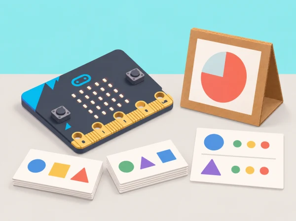

_El sistema és una demostració de classificació i temporització; no és un entrenador ni una eina de salut._

## 🌱 Situació i intenció

La fira de ciència del centre vol mostrar com dades i decisions de disseny afecten un sistema d’IA. Els equips creen un temporitzador que reacciona a moviments assignats a una maqueta, no a perfils d’alumnat. La seqüència adapta les vuit lliçons oficials de *Developing AI literacy with the micro:bit*, incloent-hi activitats desconnectades, CreateAI, codi MakeCode, biaix i una targeta del model.

## 📅 Seqüència didàctica · 8 sessions

### **Sessió 1 · Parlar d’IA (Talking about AI).**

Classifiqueu tecnologies familiars i reviseu missatges publicitaris que diuen que una màquina “entén” o “decideix com una persona”. Definiu IA i ML amb frases pròpies i un exemple de regla fixa.

### **Sessió 2 · Importància de les dades (Exploring AI: the importance of data).**

Ordeneu targetes de dades amb diverses regles, compareu els resultats i parleu de consentiment, context i ús inesperat. Identifiqueu quines dades no caldria recollir per a un temporitzador d’exposició.

### **Sessió 3 · Avaluar les dades (Exploring ML: evaluating data).**

Definiu classes per a orientacions de maqueta, etiqueteu-les i recolliu mostres amb l’acceleròmetre de micro:bit V2 en CreateAI. Detecteu mostres amb orientació errònia o amb dos gestos barrejats; netegeu-les i documenteu per què s’han exclòs.

### **Sessió 4 · Provar l’exactitud (Exploring ML: testing accuracy).**

Entreneu el model, proveu-lo amb mostres que no s’han usat per entrenar i anoteu encerts i errors en una targeta de resultats. Debateu si les dades de moviment del dispositiu són apropiades per a aquest prototip i quin consentiment i control calen.

### **Sessió 5 · Considerar biaixos (Exploring ML: considering bias).**

Amb exemples de prova inventats, investigueu com variacions d’angle, velocitat o suport poden perjudicar algunes categories. Formuleu preguntes per revisar biaix, dades absents i a qui podria perjudicar un fals resultat; no inferiu característiques de cap persona.

### **Sessió 6 · Fer millores (Exploring ML: making improvements).**

Afegiu només les dades que resolen un buit observat. Compareu la targeta d’exactitud abans i després; si la millora no és consistent, preserveu el resultat original i expliqueu la incertesa.

### **Sessió 7 · Programar amb el model (Exploring ML: coding with your model).**

Incorporeu les etiquetes ML a MakeCode i programeu un temporitzador visual curt per a la maqueta. Incloeu estat “sense classificar”, pausa manual i botó d’aturada. Proveu el codi en micro:bit i verifiqueu que es pot usar sense seguir cap activitat corporal real.

### **Sessió 8 · Avaluar disseny i impactes (Evaluating AI project design and impacts).**

Completeu una fitxa del model: propòsit, origen i tractament de dades, categories, resultats, límits i impactes possibles. Presenteu-lo, rebeu preguntes i decidiu en quines circumstàncies no s’hauria d’utilitzar.

## 🧰 Requisits i alternativa didàctica

CreateAI, MakeCode, navegador o app compatible, micro:bit V2, alimentació i cable de dades; una segona placa pot ser necessària segons el Bluetooth de l’ordinador. El servei guarda projectes al navegador o dispositiu i el fitxer HEX pot incloure dades, model i codi. Si no es pot usar l’eina, les lliçons 1, 2, 5 i 8 continuen amb targetes; les sessions de ML es poden fer amb un classificador en paper identificat com a simulació, sense afirmar que s’ha entrenat un model.

## 🔒 Consentiment, seguretat i benestar

Useu dades anònimes de moviments d’un objecte o maqueta sempre que siga possible. No enregistreu noms, imatges, veu ni dades de salut; cap moviment ni prova és obligatori. No compartiu fitxers amb dades brutes fora del dispositiu del centre i esborreu-los segons la pauta docent. El temporitzador no és un assessor d’exercici, no mesura rendiment i no ha de classificar persones.

## 🧪 Evidències i avaluació

Carpeta amb classificació desconnectada, categories i etiquetes, mostres netejades, targetes de prova, codi amb estat neutral, model card i reflexió sobre impacte. Valoreu la comprensió del paper de les dades, la diversitat de proves, la depuració i la comunicació dels límits, no l’exactitud absoluta del model.

## Registre de dades i seqüència de proves

En les sessions 1 i 2, distingiu una regla fixa («si la targeta mostra una inclinació, classifica-la com a A») d'un model que ajusta patrons a exemples. Classifiqueu targetes fictícies de moviments i discutiu dues ordenacions possibles. Acordeu abans de recollir res què significa cada classe, qui controla les dades i com s'elimina el fitxer de prova. Si CreateAI no està disponible, conserveu les discussions i useu fitxes com a simulació; no anomeneu «entrenat» el classificador de paper.

En la sessió 3, poseu la micro:bit damunt d'una base de cartó marcada amb dos angles i recolliu diverses mostres de cada orientació, sempre amb la mateixa posició inicial. Identifiqueu una mostra mal etiquetada o un moviment que barreja les dues categories. Abans d'eliminar-la, escriviu una raó verificable: etiqueta equivocada, placa que s'ha mogut durant la captura o mostra incompleta. Eviteu noms de fitxer amb identitats i no demaneu que cap alumne faça un gest físic concret.

En la sessió 4, separeu les mostres de prova de les dades d'entrenament. Registreu nombre de proves, encerts, errors i casos dubtosos; expliqueu què no es pot inferir d'una mostra petita. En la sessió 5, reviseu un cas de biaix de dades fictici: un model ha vist només una orientació i classifica malament una altra. Pregunteu qui podria quedar fora si el prototip s'utilitzara amb persones i decidiu no fer eixe ús. En la sessió 6, afegiu exemples que cobreixen la variació de la maqueta, torneu a provar amb un conjunt nou i compareu els resultats sense ocultar cap regressió.

## Codi del temporitzador i model card

En la sessió 7, definiu tres estats: «preparat», «activitat de maqueta» i «pausa/aturat». El programa només mostra una icona i una durada breu després d'una classificació prevista; quan el model no reconeix el patró, roman en estat neutral i espera una acció manual. Proveu cada transició i assegureu-vos que el botó d'aturada funciona des de qualsevol estat. No s'envia cap alerta ni es calcula cap puntuació.

La targeta del model final conté: propòsit restringit, dades usades i dades excloses, etiquetes i qui les va definir, com s'han netejat mostres, conjunt de prova separat, encerts/errors/dubtes, limitacions i possibles efectes si algú intentara usar-lo amb persones. Una parella revisora ha de poder identificar en menys d'un minut per a què serveix el model i per a què no serveix. L'exposició mostra només resultats anònims del prototip, sense dades brutes identificables.

## 🔗 Unitat oficial adaptada

Aquesta situació adapta les vuit lliçons de micro:bit [Developing AI literacy with the micro:bit](https://microbit.org/teach/lessons/developing-ai-literacy-with-the-microbit/): parlar d’IA, dades, recollir/netejar, provar, biaix, millorar, programar amb el model i avaluar disseny/impacte. El context de maqueta, l’ús de dades d’objecte i els criteris del temporitzador són propis.
