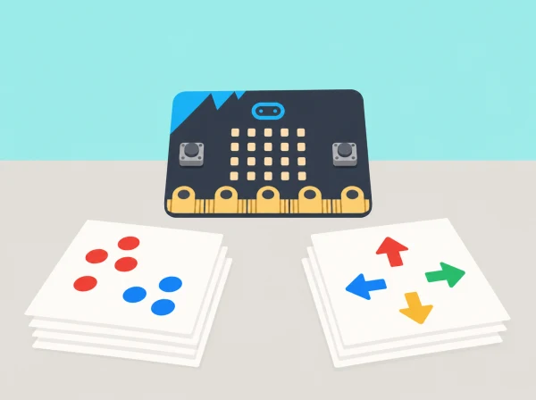

_El model classifica patrons de moviment del dispositiu; no pensa, entén ni coneix les persones._

## 🌱 Situació i intenció

Una exposició local de ciència prepara una demostració sobre com les màquines classifiquen exemples. L’alumnat diferencia automatització i IA, ordena dades i usa micro:bit CreateAI per entrenar i provar un model senzill amb moviments del dispositiu. L’objectiu és entendre dades, etiquetes i límits; no es tracta de construir una aplicació per avaluar persones.

## 🎯 Aprenentatges i vocabulari

- Distingir una instrucció programada d’un model que aprén patrons a partir d’exemples.
- Preparar exemples etiquetats de dos moviments ficticis i comprovar quines diferències pot usar el model.
- Provar el model amb exemples que no han format part de l’entrenament i registrar encerts i confusions.
- Explicar que el resultat depén de les dades i no permet identificar ni valorar persones.

## 📅 Seqüència didàctica · 2 sessions

### **Sessió 1 · Introducció a la IA (Introduction to AI).**

#### Fase 1 · Activem i prediem

Mostreu una regla senzilla —«si la targeta té ales, posa-la al grup A»— i una altra que necessita interpretació —«si el moviment sembla ràpid»—. Predigueu quina serà més fàcil de seguir i qui decideix què vol dir «ràpid».

#### Fase 2 · Explorem i construïm

Classifiqueu exemples inventats de tecnologia que usa o no usa IA i justifiqueu cada decisió. Separeu els casos clars dels dubtosos; no forceu una resposta única quan la informació no basta.

#### Fase 3 · Expliquem i registrem

Descriviu la regla aplicada i les dades que heu observat. Expliqueu que una regla programada respon a condicions escrites per una persona, mentre que un sistema d’aprenentatge automàtic ajusta un model a partir d’exemples etiquetats.

#### Fase 4 · Apliquem i millorem

Reviseu frases que atribueixen intencions humanes a una màquina i reescriviu-les amb precisió: el sistema processa dades i produeix una eixida segons el seu disseny. Compareu si la nova formulació diferencia millor automatització, regla i model.

#### Fase 5 · Comprovem i reflexionem

Compartiu una definició pròpia d’IA i un cas en què no es pot decidir només amb la informació disponible. **Evidència:** classificació inicial, justificacions i definició revisada amb una limitació identificada.

### **Sessió 2 · Introducció a l’aprenentatge automàtic (Introduction to machine learning).**

#### Fase 1 · Activem i prediem

Presenteu targetes amb dibuixos esquemàtics de dos gestos geomètrics: «moure la placa en línia» i «fer un moviment circular». Abans de classificar els casos nous, cada equip prediu quins exemples seran fàcils de separar i en quins dubtarà.

#### Fase 2 · Explorem i construïm

Separeu les targetes en conjunt d’exemples i conjunt de prova. Descriviu les característiques observades —direcció, ritme dibuixat o nombre de canvis— i acordeu etiquetes clares. No useu fotografies, noms ni perfils d’alumnes.

#### Fase 3 · Expliquem i registrem

Compareu com dues regles diferents poden classificar una mateixa targeta. Registreu la classe esperada, la regla aplicada, el resultat i si hi ha acord entre observadors. Marqueu les targetes amb més d’una interpretació.

#### Fase 4 · Apliquem i millorem

Si l’etiqueta és ambigua o els exemples no representen bé els casos, reviseu la definició de les categories o afegiu una targeta fictícia. Torneu a provar la classificació i expliqueu si el canvi ha reduït la confusió. Aquesta lliçó continua desconnectada, com en la seqüència oficial; l’entrenament amb CreateAI queda per a les lliçons següents del curs ampliat.

#### Fase 5 · Comprovem i reflexionem

Expliqueu com una màquina podria ajustar un model a partir d’exemples i per què les etiquetes depenen de decisions humanes. Concloeu: «Amb aquests exemples, el classificador separa…, però no podem assegurar…». **Evidència:** dues classificacions, les seues regles, taula de proves amb casos nous i una limitació identificada.

## 🧰 Materials i accés a CreateAI

Les dues sessions es poden fer amb targetes i exemples de tecnologia, sense dispositius ni connexió. Per a continuar amb les sessions pràctiques del curs complet, useu CreateAI en navegador Chrome o Edge amb Bluetooth habilitat, o l’app oficial compatible en tauleta, i una placa micro:bit per a recollir dades. La V2 és necessària per executar després el model amb MakeCode sobre la placa. Comproveu l’accés del centre abans de planificar aquesta extensió.

## 🔒 Dades, consentiment i prova

Useu el moviment d’un objecte o de la placa i no captureu imatges, veu, noms ni perfils. Els projectes CreateAI es guarden al dispositiu o navegador; descarregar un fitxer HEX pot incloure les dades, el model i el codi, de manera que el docent decideix com es conserva i s’esborra. La participació corporal és voluntària i es pot substituir per un dispositiu sobre una maqueta. No useu el resultat per classificar habilitats o salut.

## 🧪 Evidències i avaluació

Recolliu una definició d’IA en paraules pròpies, classificació de targetes, diagrama d’etiquetes i taula de proves amb casos nous, resultat correcte o erroni i possible explicació. Valoreu si l’equip reconeix el paper de les persones que trien categories i dades i descriu incertesa sense antropomorfitzar el model.

## Guió d’aula i preguntes per investigar

**Inici de la primera sessió:** mostreu una regla senzilla, com ara «si la targeta té ales, posa-la al grup A», i una altra que necessita interpretació, com ara «si el moviment sembla ràpid». Pregunteu quina és més fàcil de seguir i qui decideix què vol dir «ràpid». Expliqueu que una regla programada respon a condicions escrites per una persona, mentre que un sistema d'aprenentatge automàtic ajusta un model a partir d'exemples etiquetats. Eviteu dir que el model aprén com un infant: la comparació pot ajudar, però amaga diferències importants.

Per al joc de targetes, prepareu exemples ficticis de dos gestos geomètrics: «moure la placa en línia» i «fer un moviment circular». Comenceu amb dibuixos esquemàtics, no amb fotografies d'alumnes. Dividiu les targetes en conjunt d'exemples i conjunt de prova. Poseu en comú quins trets s'han fet servir —direcció, ritme dibuixat, nombre de canvis— i marqueu les targetes amb més d'una interpretació. Si el grup no pot acordar una etiqueta consistent, reviseu la tasca en lloc de forçar una resposta única.

**Segona sessió:** expliqueu amb targetes la idea de dades d'entrenament, etiqueta i predicció. Cada equip redacta una predicció abans de classificar els casos nous: quins reconeixerà el model?, en quins dubtem? Si el centre disposa de CreateAI i micro:bit, la classe pot continuar amb el curs ampliat en una activitat posterior; aquesta situació de dues sessions no pressuposa la disponibilitat d'eixa eina. La pàgina oficial i els dispositius compatibles poden canviar, així que el docent ha de comprovar l'accés tècnic abans de programar una extensió.

## Taula de proves i lectura crítica

Per cada cas nou, anoteu la classe que el grup esperava, la predicció obtinguda en la demostració i si hi ha acord entre observadors. Classifiqueu les discrepàncies: etiqueta ambigua, pocs exemples, un cas diferent dels d'entrenament o limitació del sistema. No cal calcular una «precisió» amb un conjunt xicotet; n'hi ha prou amb comptar encerts i errors i explicar què no es pot concloure. Una prova curta no demostra que el sistema funcione igual amb qualsevol persona, context o dispositiu.

Preguntes de conversa: qui ha triat les categories?, qui no queda representat en els exemples?, una etiqueta descriu l'acció o jutja la persona?, què passa quan un cas queda entre les dues classes?, i com hauria de poder respondre un sistema quan no n'està segur? Concloeu amb una frase precisa: «Amb aquests exemples, el classificador separa…, però no podem assegurar…».

## Organització, inclusió i producte final

En equips de tres, repartiu els rols de curador/a de dades, classificador/a i verificador/a; canvieu-los entre rondes. Les accions corporals són voluntàries: es poden representar amb una targeta, un objecte sobre una maqueta o una descripció del docent. Oferiu exemples amb pictogrames, lectura en veu alta i temps suficient per negociar les categories. El producte final és un cartell per a l'exposició amb quatre parts: què classifica el model, quins exemples usem, què ha passat en les proves i quines conclusions no podem traure.

## 🔗 Unitat oficial adaptada

Aquesta situació adapta les dues lliçons de micro:bit [CreateAI taster lessons](https://microbit.org/teach/lessons/createai-taster-lessons/): *Introduction to AI* i *Introduction to machine learning*. Les categories, els exemples i la prova de moviments són propis; el contingut cobreix definicions, entrenament, prova i límits d’un model.
