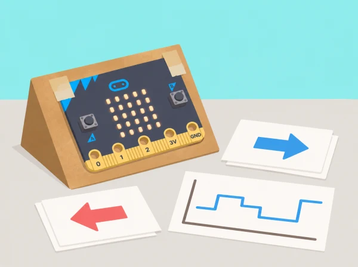

_El classificador respon a exemples de moviment i no interpreta el significat d’una gesticulació._

## 🌱 Situació i intenció

Un centre d’interpretació vol una maqueta interactiva que canvie de panell quan la placa s’inclina cap a una de dues direccions. Els equips aprenen què és IA, com les persones agrupen dades, com es recullen i netegen mostres de moviment, com s’entrena un model i com es connecta a un programa MakeCode. Les proves són anònimes i les etiquetes descriuen orientacions de l’objecte, no identitats ni capacitats de les persones.

## 🎯 Aprenentatges i vocabulari

- Explicar el cicle d’un model: exemples etiquetats, entrenament, prova i revisió.
- Preparar dades de moviment consistents per controlar quines variacions veu el model.
- Avaluar casos nous, errors i diferències entre grups de prova abans d’activar una resposta en la maqueta.
- Iterar una solució amb l’usuari al control i documentar-ne els límits, els riscos i les condicions d’ús.

## 📅 Seqüència didàctica · 7 sessions

### **Sessió 1 · Presentar la IA (Introducing AI).**

Analitzeu exemples propers de tecnologia i decidiu quins usen una regla programada i quins aprenen patrons de dades. Construïu una explicació senzilla que deixe clar que la IA és creada i orientada per persones, no és un ésser amb intencions.

### **Sessió 2 · Trobar patrons en dades (Exploring patterns in data).**

Ordeneu targetes de moviments o orientacions segons regles explícites. Compareu com canvien els grups quan canvia la regla i expliqueu per què una màquina només veu les característiques que el sistema calcula.

### **Sessió 3 · Afegir etiquetes i recollir dades (Adding labels and collecting data).**

Definiu categories operatives, per exemple “orientat cap a l’esquerra” i “orientat cap a la dreta”. Registreu mostres amb una micro:bit compatible i CreateAI movent la placa sobre una maqueta. Useu codis anònims, variegeu l’angle de manera controlada i descarteu mostres que no representen cap etiqueta definida. La V2 és necessària per executar després el projecte MakeCode amb el model a la placa, no per a la recollida de dades.

### **Sessió 4 · Entrenar i provar (Training and testing an ML model).**

Separeu mostres d’entrenament i de prova, entreneu el model i completeu una targeta de resultats. Examineu falsos encerts i errors; afegiu dades només després d’identificar quin buit de representació voleu cobrir.

### **Sessió 5 · Millorar el codi amb el model (Enhancing code with ML).**

Llegiu el projecte MakeCode que usa l’eixida del model com a entrada. Connecteu les dues etiquetes amb instruccions que mostren icones diferents a la placa i afegiu una eixida neutral quan la confiança és baixa o no hi ha moviment reconegut.

### **Sessió 6 · Avaluar el sistema (Evaluating an AI system).**

Proveu la maqueta amb moviments nous fets per persones voluntàries o amb un dispositiu, i registreu errors sense noms. Expliqueu que el sistema integra dades, model, codi i placa; reviseu quines variacions d’orientació fan que perda fiabilitat.

### **Sessió 7 · Diversificar les dades (Strengthening models through adding diverse data).**

Identifiqueu quins angles, ritmes o maneres de subjectar la maqueta falten. Afegiu mostres pertinents amb consentiment, torneu a provar amb un conjunt separat i compareu els resultats. Prepareu una fitxa del model amb propòsit, dades, límits i recomanacions d’ús.

## 🧰 Muntatge i alternativa

Per a entrenar i provar, connecteu una micro:bit a CreateAI seguint la [guia oficial de connexió i ús](https://microbit.org/get-started/user-guide/microbit-createai/), recopileu dades de moviment de la maqueta, etiqueteu-les, entreneu el model i proveu-lo amb mostres diferents. En navegador d’ordinador, la connexió sense fil requereix Chrome o Edge i Bluetooth habilitat; també es pot usar l’app oficial compatible en tauleta. Des de CreateAI, obriu el projecte en MakeCode, reviseu els blocs de cada acció —inclosa l’eixida «unknown»—, descarregueu el programa i el model en una micro:bit V2 i proveu-los sense l’ordinador. Qualsevol versió de micro:bit pot recollir dades, entrenar i provar el model; per executar-lo amb MakeCode en la placa cal V2. Es pot reutilitzar la mateixa placa de recollida per descarregar el projecte, reconnectant-la després si cal continuar capturant. Fixeu-la a una maqueta lleugera, no al cos. Si la connexió sense fil o CreateAI no està disponible, feu les sessions amb targetes i dades simulades i indiqueu clarament que no s’ha executat el model físic.

## 🔒 Privacitat, equitat i seguretat

No recopileu noms, veu, imatges ni dades de salut. Els moviments són voluntaris i no han de correspondre a gestos d’una persona concreta. CreateAI guarda els projectes localment al dispositiu/navegador i el fitxer HEX inclou mostres i model; establiu qui hi té accés i elimineu les dades després de la mostra si no cal conservar-les. No useu el model per avaluar persones, autenticar-les o decidir qui pot participar.

## 🧪 Evidències i avaluació

Recolliu etiquetes, diagrama del procés, taula de dades representatives i absents, targeta de proves, comparació abans/després de la millora, programa MakeCode i fitxa final del model. Valoreu la qualitat de les proves, l’explicació del biaix i la capacitat de limitar el propòsit del prototip.

## Protocol per comprovar el model

Abans de recollir dades, assageu cada categoria amb una mostra de paper i una orientació fixa. Les etiquetes han de descriure la posició de la maqueta, no un gest humà. Recolliu diverses repeticions controlades per categoria, després variegeu un factor cada vegada —angle inicial, velocitat de moviment o estabilitat de la base— i guardeu una part de les mostres per a la prova final. Si una mostra és ambigua, marqueu-la com a tal i decidiu si cal redefinir la categoria, no l'assigneu forçadament a cap costat.

La fitxa de resultats pot comptar: nombre de mostres de prova per classe, encerts, confusions i resultats «unknown». Mostreu els recomptes en una matriu de dues files per dues columnes i anoteu el total, perquè un percentatge sense nombre de mostres pot donar una falsa impressió de certesa. Després d'afegir dades, proveu un conjunt nou i compareu si millora una categoria sense empitjorar-ne una altra. L'objectiu és explicar què ha canviat, no maximitzar una xifra.

En la maqueta MakeCode, definiu què ocorre per a cada classe i què veu l'usuari quan no hi ha classificació. Proveu el programa en cinc escenaris: cap inclinació, inclinació clara a cada banda, transició entre bandes i moviment que no pertany a cap classe. Comproveu que l'eixida neutral no imita una tercera predicció i que l'usuari pot reiniciar manualment. La mostra d'altres persones només és voluntària, sense enregistrar qui ha provat el dispositiu.

## 🔗 Unitat oficial adaptada

Aquesta situació adapta les set lliçons de micro:bit [First lessons with micro:bit CreateAI](https://microbit.org/teach/lessons/first-lessons-with-microbit-createai/): introducció a IA, patrons de dades, etiquetatge i recollida, entrenament/prova, codi amb ML, avaluació del sistema i diversitat de dades. La maqueta, les etiquetes i els criteris són propis.
