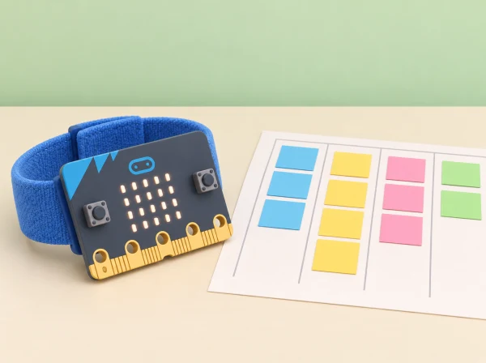

_Els programes són prototips didàctics: no mesuren salut, rendiment ni calories._

## 🌱 Situació i intenció

El grup vol preparar un menú de jocs breus per al pati, amb opcions per moure’s, observar, marcar ritme o dirigir. A través de variables, comptadors i nombres aleatoris, l’alumnat aprén a dissenyar programes que informen i proposen opcions sense classificar persones. La situació adapta les cinc lliçons oficials de *Getting active*; els exemples, les proves i les regles de participació són propis.

## 🎯 Aprenentatges i vocabulari

- Descriure una activitat amb variables observables sense convertir-les en puntuacions sobre persones.
- Programar un comptador o selector amb entrades, variables, condicions i valors de prova.
- Comprovar que l’atzar i les regles ofereixen opcions diverses i no exclouen una forma de participar.
- Proposar alternatives de moviment voluntari, pausa o participació sense moviment.

## 📅 Seqüència didàctica · 5 sessions

### **Sessió 1 · Descriure amb variables (Describing with variables).**

Amb targetes d’un personatge fictici del pati, canvieu valors com joc triat, torn o nombre de passos d’una fitxa. Representeu una variable amb una capsa que guarda un valor i escriviu instruccions per actualitzar-la. No useu noms ni dades de companys.

### **Sessió 2 · Comptar una activitat (Using variables in programs).**

Dissenyeu un comptador de salts de fitxa o, si la classe ho tria, de moviments voluntaris de baixa intensitat. Useu l’acceleròmetre o el botó com a entrada i compareu lectures amb comptatge manual. Depureu un error intencionat de reinici o increment. No s’exigeix cap moviment concret ni s’avalua el nombre obtingut.

### **Sessió 3 · Un comptador de passos com a model (Programming step-counters).**

Programeu un comptador activat pel moviment de la placa i proveu-lo caminant amb la placa a la mà o simulant sacsejades controlades. Compareu tres recorreguts amb observació manual, registre anònim i condicions consistents. Analitzeu moviments que crea erròniament que són passos i expliqueu que no és un podòmetre validat.

### **Sessió 4 · Propostes aleatòries (Random activities).**

Examineu un programa de preguntes matemàtiques amb nombres aleatoris i variables. Després redacteu l’algorisme d’un selector que trie una targeta de joc entre opcions equivalentes: caminar una ruta curta, marcar un ritme, observar una forma o dirigir una seqüència. L’atzar proposa; qualsevol participant pot triar una altra opció o no fer activitat física.

### **Sessió 5 · Programar i avaluar el selector (Programming an activity picker).**

Implementeu el selector amb MakeCode, variables i nombres aleatoris. Proveu que totes les opcions poden eixir, reviseu una condició incorrecta i incorporeu una alternativa sense moviment. Presenteu el programa i valoreu si és clar, inclusiu i fàcil de modificar; esborreu les dades de prova en acabar.

## 🧰 Materials i preparació

BBC micro:bit, MakeCode, targetes d’activitat i registre de proves sense noms. Verifiqueu que l’acceleròmetre i els blocs que utilitzeu són compatibles amb la versió disponible. El comptatge pot fer-se amb el botó si sacsejar la placa no és accessible o adequat.

## 🧪 Evidències i avaluació

Guardeu exemples de variables, algorismes, dues versions del comptador, taula de proves, programa aleatori i revisió d’accessibilitat. Valoreu l’explicació del model, la depuració sistemàtica i la qualitat de les opcions; no puntueu velocitat, nombre de passos ni activitat física de cap persona.

## Guia de prova per als comptadors

Per a les sessions 2 i 3, useu una taula amb quatre columnes: entrada prevista, resultat del programa, diferència observada i explicació possible. Proveu primer el programa amb el simulador o amb sacsejades suaus de la placa sobre una taula. Després, si l'alumnat ho tria, feu un recorregut curt en espai lliure, sense córrer ni competir. Compareu el comptador automàtic amb una seqüència controlada de moviments de la placa i el recompte manual d'una fitxa. L'objectiu és trobar falsos positius i moviments que no compta, no ajustar el programa perquè coincidisca amb una mesura corporal exacta.

En el programa, identifiqueu explícitament quan la variable s'inicialitza, quin esdeveniment la modifica i com es mostra el valor. Prepareu una versió amb un error intencionat: el comptador suma dos, no es posa a zero a l'inici o mostra el valor abans d'actualitzar-se. L'equip prediu quin resultat produirà, localitza el bloc responsable i canvia una sola cosa. El registre és de proves del programa, sense nom ni identificador d'alumne, i s'esborra en acabar.

## Dissenyar el selector amb equitat

Abans de programar l'atzar, assegureu-vos que totes les opcions són igualment visibles i que cap resposta obliga a fer exercici. Una col·lecció equilibrada pot incloure una ruta de passos caminant, seguir un ritme amb les mans, observar i dibuixar una forma o dirigir la fitxa d'una parella. L'opció «tria una altra» o «passe» ha de tindre el mateix valor que qualsevol altra. Si les activitats tenen durades o demandes diferents, no presenteu l'atzar com a garantia d'equitat: parleu de com es pot controlar la selecció i oferiu una elecció manual equivalent.

Representeu l'algorisme amb targetes: iniciar, triar un nombre, mostrar l'activitat associada, preguntar si la persona vol acceptar-la i oferir alternativa. Feu proves en què el nombre mínim i màxim apareguen, i reviseu si alguna opció queda exclosa per un límit mal escrit. Cada equip pot fer una inspecció sistemàtica de la llista en lloc d'esperar que l'atzar mostre totes les opcions.

## Rúbrica breu i adaptacions

Valoreu quatre aspectes amb «encara no / amb suport / de manera autònoma»: identifica què guarda la variable; explica l'entrada que la canvia; localitza i corregeix un error amb proves; i justifica com el selector permet triar o passar. L'alumnat pot demostrar-ho amb targetes, pseudocodi, blocs o una explicació oral. Useu el botó A en lloc del moviment quan siga preferible, feu servir fitxes com a entrada simulada i permeteu participar com a dissenyador/a o observador/a. No registreu informació sobre salut, capacitat o hàbits individuals.

## ♿ Benestar i privacitat

La participació física és voluntària i té alternatives equivalents. No es registren perfils, noms, condicions de salut ni historial; el dispositiu no mesura intensitat, capacitat física o calories. Delimiteu un espai segur i oferiu rols de disseny, programació, ritme, observació i direcció.

## 🔗 Unitat oficial adaptada

Aquesta situació adapta les cinc lliçons de micro:bit [Getting active](https://microbit.org/teach/lessons/getting-active-unit-overview/): *Describing with variables*, *Using variables in programs*, *Programming step-counters*, *Random activities* i *Programming an activity picker*. La proposta concreta els mateixos objectius de variables, algoritmes, comptadors, aleatorietat, selecció i depuració en un menú de jocs cooperatius propi.
