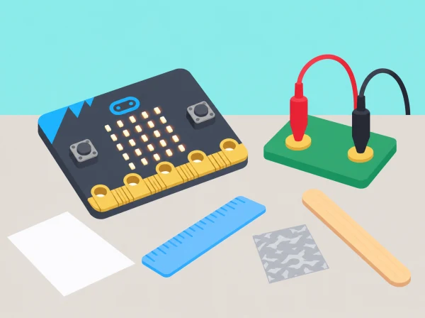

_La prova és de baixa tensió i només usa mostres aïllades i circuits revisats pel docent._

## 🌱 Situació i intenció

El taller de ciències vol saber quins materials podrien formar part d’un interruptor senzill per a una maqueta. L’alumnat compara circuits de baixa tensió, representa decisions amb diagrames de flux i programa una entrada perquè micro:bit mostre una icona. La situació adapta les cinc lliçons oficials de *Electrical conductors*; els materials es proven com a mostres, no com a objectes connectats a instal·lacions elèctriques.

## 🎯 Aprenentatges i vocabulari

- Formular una predicció sobre la conductivitat d’una mostra segura i registrar les condicions de prova.
- Construir un circuit de baixa tensió i descriure l’entrada i l’eixida de micro:bit.
- Programar una selecció condicional i provar materials coneguts, secs i no perillosos.
- Distingir el resultat del prototip de l’evidència científica i rebutjar proves amb endolls, líquids o materials desconeguts.

## 📅 Seqüència didàctica · 5 sessions

### **Sessió 1 · Selecció i conductivitat (Selection & conductivity investigation).**

#### Fase 1 · Activem i prediem

Presenteu mostres segures i predigueu quines podrien conduir electricitat en un circuit escolar de baixa tensió. Identifiqueu què es mantindrà igual entre proves: mida aproximada de la mostra, punts de contacte i circuit.

#### Fase 2 · Explorem i construïm

Amb un circuit de baixa tensió revisat prèviament pel docent, observeu què passa quan s’inclou una mostra conductora o aïllant. No canvieu connexions mentre el circuit està alimentat.

#### Fase 3 · Expliquem i registrem

Identifiqueu entrada, procés i eixida i escriviu una regla «si… aleshores…» que descriga la resposta. Registreu nom genèric de la mostra, predicció, resultat observat, repetició i possible causa d’error.

#### Fase 4 · Apliquem i millorem

Si una prova és inconsistent, marqueu-la com a «no concloent». Reviseu per separat els punts de contacte o les condicions del muntatge i repetiu-la; no esborreu un resultat perquè no encaixe amb la predicció.

#### Fase 5 · Comprovem i reflexionem

Expliqueu què permet afirmar la prova i què no es pot generalitzar a altres objectes. **Evidència:** dibuix inicial del circuit, taula de prediccions i regla condicional.

### **Sessió 2 · Caixes de decisió (Decision boxes).**

#### Fase 1 · Activem i prediem

Recupereu la regla de la primera sessió i predigueu quines dues respostes ha de mostrar el diagrama segons que el circuit es tanque o continue obert.

#### Fase 2 · Explorem i construïm

Convertiu la regla en un diagrama de flux amb una caixa de decisió i dues eixides etiquetades «sí» i «no». Associeu cada branca a una icona LED diferent.

#### Fase 3 · Expliquem i registrem

Una parella executa l’algorisme amb targetes de valors simulats abans de connectar cap circuit. Marqueu qualsevol branca que no tinga resposta o instrucció següent.

#### Fase 4 · Apliquem i millorem

Reviseu el diagrama quan una instrucció siga ambigua o una branca quede sense eixida. Torneu a intercanviar-lo amb un altre equip perquè el seguisca pas a pas.

#### Fase 5 · Comprovem i reflexionem

Comproveu que els dos valors simulats activen respostes diferents i que el diagrama es pot seguir sense ajuda oral. **Evidència:** diagrama inicial i versió revisada amb les dues branques provades.

### **Sessió 3 · Entrades i eixides de micro:bit (Inputs).**

#### Fase 1 · Activem i prediem

Exploreu amb MakeCode els botons i, si la placa i els accessoris ho permeten, les entrades dels pins. Predigueu quina eixida LED hauria d’aparéixer quan canvia l’entrada.

#### Fase 2 · Explorem i construïm

Relacioneu el canvi de pin amb una eixida LED. Dibuixeu el circuit abans de tocar connexions i identifiqueu quines parts són internes i quines externes. Si falta un accessori segur, simuleu els valors d’entrada amb els botons.

#### Fase 3 · Expliquem i registrem

Anoteu entrada, condició i resposta observada. Una parella llig el programa i una altra segueix el diagrama per comprovar que la seqüència concorda.

#### Fase 4 · Apliquem i millorem

Comenceu amb una condició i una eixida LED. Després afegiu una segona mostra i una rutina de reinici perquè les proves no arrosseguen el valor anterior.

#### Fase 5 · Comprovem i reflexionem

Executeu tant valors reals del muntatge aprovat com valors simulats si s’ha triat l’alternativa. **Evidència:** esquema del circuit, programa amb una condició i registre d’entrades i eixides.

### **Sessió 4 · Construïm i depurem el provador (Making a conductivity tester).**

#### Fase 1 · Activem i prediem

Trieu mostres menudes, seques i separades —paper, plàstic, fusta o una làmina menuda d’alumini— i predigueu el resultat. Confirmeu que el muntatge ha sigut revisat pel docent i que els accessoris són compatibles.

#### Fase 2 · Explorem i construïm

Només amb un muntatge aprovat, proveu les mostres i programeu la lectura d’entrada amb selecció. Comenceu amb una condició i una eixida; si no hi ha accessori protector, simuleu els valors amb els botons en lloc de fer la prova física.

#### Fase 3 · Expliquem i registrem

Useu una mostra coneguda conductora i una d’aïllant. Anoteu lectura d’entrada, resultat mostrat i si coincideix amb la predicció; reinicieu entre casos.

#### Fase 4 · Apliquem i millorem

Si dues mostres donen la mateixa resposta, reviseu per separat: canvi de lectura en tancar circuit, contacte de la pinça amb superfície neta, moment de mostrar l’eixida i reinici entre casos. Canvieu una variable per prova i torneu a executar.

#### Fase 5 · Comprovem i reflexionem

Compareu el codi inicial i el depurat i limiteu la conclusió als objectes provats i a les condicions del circuit escolar. **Evidència:** codi amb selecció, resultats de dues mostres de referència i registre de depuració.

### **Sessió 5 · Revisió i reflexió (Review & reflection).**

#### Fase 1 · Activem i prediem

Amb l’alimentació desconnectada, predigueu quines parts de l’algorisme descriuen entrada, condició i eixida. Prepareu targetes «circuit obert/tancat» per poder fer la revisió sense manipular components.

#### Fase 2 · Explorem i construïm

Desmunteu el prototip amb l’alimentació desconnectada. Reescriviu l’algorisme en passos menuts i marqueu entrades, condicions i eixides.

#### Fase 3 · Expliquem i registrem

Compareu el diagrama inicial amb el programa final i indiqueu quines condicions s’han provat. Anoteu quins factors caldria controlar per repetir la prova de manera justa.

#### Fase 4 · Apliquem i millorem

Una parella segueix l’algorisme amb les targetes de circuit obert/tancat i detecta qualsevol pas que falte. Reviseu-lo perquè cada valor tinga una eixida definida.

#### Fase 5 · Comprovem i reflexionem

Expliqueu què es pot concloure sobre les mostres i què requeriria una investigació més controlada. **Evidència:** algorisme revisat, diagrama i reflexió sobre els límits de la prova.

## 🧰 Materials i condicions

BBC micro:bit, MakeCode, mostres menudes, seques i aïllades, pinces/ponts adequats i el circuit protector especificat pel fabricant o pel centre. Les pinces de cocodril i components externs només s’usen si formen part de la dotació i el docent ha verificat el muntatge. Sense aquests materials, feu la prova amb simulació de botons i diagrames.

## 🧪 Evidències i avaluació

Recolliu circuit esquemàtic, diagrama de flux, taula de prediccions, codi amb condició, resultats de dues mostres conegudes i revisió de depuració. Valoreu si l’algorisme es pot seguir, si les entrades i eixides estan identificades i si les conclusions es limiten a les mostres i condicions provades.

## Quadern d'investigació

Abans de tocar el muntatge, cada equip dibuixa el circuit previst i identifica font d'energia, camí conductor, punt on s'interromp el circuit, entrada de micro:bit i eixida LED. En una taula, registreu nom genèric de la mostra, predicció, resultat observat, repetició i possible causa d'error. Useu peces de mida semblant i subjecteu-les sempre pels mateixos punts quan siga possible. Una prova inconsistent es marca com a «no concloent»; no s'esborra perquè no encaixe amb la predicció.

En el diagrama de flux, la pregunta de decisió ha de tindre dues eixides etiquetades, «sí» i «no». Una parella executa l'algorisme amb targetes de valors simulats abans de connectar cap circuit. Això permet trobar una branca sense resposta i comprovar que cada resultat activa una icona diferent. En la sessió de MakeCode, comenceu amb una condició i una eixida LED, després afegiu-hi una segona mostra i una rutina de reinici perquè les proves no arrosseguen el valor anterior.

## Depuració i lectura de resultats

Si dues mostres semblen donar la mateixa resposta, reviseu per separat el programa i el muntatge: la lectura d'entrada canvia quan es tanca el circuit?, la pinça toca una superfície neta?, el programa mostra l'eixida després de llegir el pin?, s'ha reiniciat entre casos? Canvieu una variable per prova i anoteu el resultat. La conclusió es limita als objectes provats i a les condicions del circuit escolar; no es generalitza automàticament a totes les peces del mateix material ni a productes reals.

Com a ampliació desconnectada, doneu a l'equip targetes «circuit obert/tancat» i feu que seguisca el diagrama de decisió. També es pot comparar el resultat amb una predicció inicial i explicar quin tipus de dada addicional ajudaria a confiar més en la prova. No cal manipular cap component per demostrar la comprensió dels algorismes.

## Rols i protocol de seguretat

Assigneu rols de lector/a del diagrama, encarregat/da de les mostres, observador/a del LED i registrador/a. Només l'adult connecta o revisa el prototip si les peces no són específicament compatibles o el grup no pot verificar el muntatge. Manteniu mans i taula seques, treballeu amb baixa tensió, desconnecteu l'alimentació abans de canviar mostres i no connecteu mai la micro:bit a la xarxa elèctrica. Si no hi ha accessori de protecció adequat, substituïu tota la prova física per dades simulades; el repte d'entrades, condicions i fluxos continua complet.

## ⚡ Seguretat elèctrica

Només s’utilitzen circuits educatius de baixa tensió i accessoris compatibles, amb revisió del docent. Mai connecteu la placa a la xarxa elèctrica ni uniu directament els pins d’alimentació 3V i GND. No proveu líquids, cossos, piles, endolls, aparells, objectes connectats ni materials calents o tallants. Desconnecteu abans de canviar mostres i manteniu-ho tot sec.

## 🔗 Unitat oficial adaptada

Aquesta situació adapta les cinc lliçons de micro:bit [Electrical conductors](https://microbit.org/teach/lessons/electrical-conductors-unit-of-work/): investigació de circuits i selecció, caixes de decisió, exploració d’entrades, provador programat amb MakeCode i reflexió desconnectada. El context del taller, la selecció de mostres i els criteris són propis.
